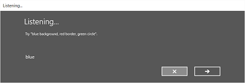

# Speech recognition


Use speech recognition to provide input, specify an action or command, and accomplish tasks.

> **Important APIs**: [**Windows.Media.SpeechRecognition**](https://msdn.microsoft.com/library/windows/apps/dn653262)

Speech recognition is made up of a speech runtime, recognition APIs for programming the runtime, ready-to-use grammars for dictation and web search, and a default system UI that helps users discover and use speech recognition features.


## Set up the audio feed


Ensure that your device has a microphone or the equivalent.

Set the **Microphone** device capability ([**DeviceCapability**](https://msdn.microsoft.com/library/windows/apps/br211430)) in the [App package manifest](https://msdn.microsoft.com/library/windows/apps/br211474) (**package.appxmanifest** file) to get access to the microphone’s audio feed. This allows the app to record audio from connected microphones.

See [App capability declarations](https://msdn.microsoft.com/library/windows/apps/mt270968).

## Recognize speech input


A *constraint* defines the words and phrases (vocabulary) that an app recognizes in speech input. Constraints are at the core of speech recognition and give your app greater over the accuracy of speech recognition.

You can use various types of constraints when performing speech recognition:

1.  **Predefined grammars** ([**SpeechRecognitionTopicConstraint**](https://msdn.microsoft.com/library/windows/apps/dn631446)).

    Predefined dictation and web-search grammars provide speech recognition for your app without requiring you to author a grammar. When using these grammars, speech recognition is performed by a remote web service and the results are returned to the device.

    The default free-text dictation grammar can recognize most words and phrases that a user can say in a particular language, and is optimized to recognize short phrases. The predefined dictation grammar is used if you don't specify any constraints for your [**SpeechRecognizer**](https://msdn.microsoft.com/library/windows/apps/dn653226) object. Free-text dictation is useful when you don't want to limit the kinds of things a user can say. Typical uses include creating notes or dictating the content for a message.

    The web-search grammar, like a dictation grammar, contains a large number of words and phrases that a user might say. However, it is optimized to recognize terms that people typically use when searching the web.

    **Note**  Because predefined dictation and web-search grammars can be large, and because they are online (not on the device), performance might not be as fast as with a custom grammar installed on the device.     

    These predefined grammars can be used to recognize up to 10 seconds of speech input and require no authoring effort on your part. However, they do require a connection to a network.

    To use web-service constraints, speech input and dictation support must be enabled in **Settings** by turning on the "Get to know me" option in  **Settings -> Privacy -> Speech, inking, and typing**.

    Here, we show how to test whether speech input is enabled and open the Settings -> Privacy -> Speech, inking, and typing page, if not.

    First, we initialize a global variable (HResultPrivacyStatementDeclined) to the HResult value of 0x80045509. See [Exception handling for in C\# or Visual Basic](https://msdn.microsoft.com/library/windows/apps/dn532194).

    ```csharp
    private static uint HResultPrivacyStatementDeclined = 0x80045509;
    ```

    We then catch any standard exceptions during recogntion and test if the [**HResult**](https://msdn.microsoft.com/library/windows/apps/br206579) value is equal to the value of the HResultPrivacyStatementDeclined variable. If so, we display a warning and call `await Windows.System.Launcher.LaunchUriAsync(new Uri("ms-settings:privacy-accounts"));` to open the Settings page.
    
    ```csharp
    catch (Exception exception)
    {
      // Handle the speech privacy policy error.
      if ((uint)exception.HResult == HResultPrivacyStatementDeclined)
      {
        resultTextBlock.Visibility = Visibility.Visible;
        resultTextBlock.Text = "The privacy statement was declined." + 
          "Go to Settings -> Privacy -> Speech, inking and typing, and ensure you" +
          "have viewed the privacy policy, and 'Get To Know You' is enabled.";
        // Open the privacy/speech, inking, and typing settings page.
        await Windows.System.Launcher.LaunchUriAsync(new Uri("ms-settings:privacy-accounts")); 
      }
      else
      {
        var messageDialog = new Windows.UI.Popups.MessageDialog(exception.Message, "Exception");
        await messageDialog.ShowAsync();
      }
    }
    ```

2.  **Programmatic list constraints** ([**SpeechRecognitionListConstraint**](https://msdn.microsoft.com/library/windows/apps/dn631421)).

    Programmatic list constraints provide a lightweight approach to creating simple grammars using a list of words or phrases. A list constraint works well for recognizing short, distinct phrases. Explicitly specifying all words in a grammar also improves recognition accuracy, as the speech recognition engine must only process speech to confirm a match. The list can also be programmatically updated.

    A list constraint consists of an array of strings that represents speech input that your app will accept for a recognition operation. You can create a list constraint in your app by creating a speech-recognition list-constraint object and passing an array of strings. Then, add that object to the constraints collection of the recognizer. Recognition is successful when the speech recognizer recognizes any one of the strings in the array.

3.  **SRGS grammars** ([**SpeechRecognitionGrammarFileConstraint**](https://msdn.microsoft.com/library/windows/apps/dn631412)).

    An Speech Recognition Grammar Specification (SRGS) grammar is a static document that, unlike a programmatic list constraint, uses the XML format defined by the [SRGS Version 1.0](http://go.microsoft.com/fwlink/p/?LinkID=262302). An SRGS grammar provides the greatest control over the speech recognition experience by letting you capture multiple semantic meanings in a single recognition.

4.  **Voice command constraints** ([**SpeechRecognitionVoiceCommandDefinitionConstraint**](https://msdn.microsoft.com/library/windows/apps/dn653220))

    Use a Voice Command Definition (VCD) XML file to define the commands that the user can say to initiate actions when activating your app. For more detail, see [Launch a foreground app with voice commands in Cortana](https://msdn.microsoft.com/cortana/voicecommands/launch-a-foreground-app-with-voice-commands-in-cortana).

**Note**  Which type of constraint type you use depends on the complexity of the recognition experience you want to create. Any could be the best choice for a specific recognition task, and you might find uses for all types of constraints in your app.
To get started with constraints, see [Define custom recognition constraints](define-custom-recognition-constraints.md).

 

The predefined Universal Windows app dictation grammar recognizes most words and short phrases in a language. It is activated by default when a speech recognizer object is instantiated without custom constraints.

In this example, we show how to:

-   Create a speech recognizer.
-   Compile the default Universal Windows app constraints (no grammars have been added to the speech recognizer's grammar set).
-   Start listening for speech by using the basic recognition UI and TTS feedback provided by the [**RecognizeWithUIAsync**](https://msdn.microsoft.com/library/windows/apps/dn653245) method. Use the [**RecognizeAsync**](https://msdn.microsoft.com/library/windows/apps/dn653244) method if the default UI is not required.

```CSharp
private async void StartRecognizing_Click(object sender, RoutedEventArgs e)
{
    // Create an instance of SpeechRecognizer.
    var speechRecognizer = new Windows.Media.SpeechRecognition.SpeechRecognizer();

    // Compile the dictation grammar by default.
    await speechRecognizer.CompileConstraintsAsync();

    // Start recognition.
    Windows.Media.SpeechRecognition.SpeechRecognitionResult speechRecognitionResult = await speechRecognizer.RecognizeWithUIAsync();

    // Do something with the recognition result.
    var messageDialog = new Windows.UI.Popups.MessageDialog(speechRecognitionResult.Text, "Text spoken");
    await messageDialog.ShowAsync();
}
```

## Customize the recognition UI


When your app attempts speech recognition by calling [**SpeechRecognizer.RecognizeWithUIAsync**](https://msdn.microsoft.com/library/windows/apps/dn653245), several screens are shown in the following order.

If you're using a constraint based on a predefined grammar (dictation or web search):

-   The **Listening** screen.
-   The **Thinking** screen.
-   The **Heard you say** screen or the error screen.

If you're using a constraint based on a list of words or phrases, or a constraint based on a SRGS grammar file:

-   The **Listening** screen.
-   The **Did you say** screen, if what the user said could be interpreted as more than one potential result.
-   The **Heard you say** screen or the error screen.

The following image shows an example of the flow between screens for a speech recognizer that uses a constraint based on a SRGS grammar file. In this example, speech recognition was successful.





The **Listening** screen can provide examples of words or phrases that the app can recognize. Here, we show how to use the properties of the [**SpeechRecognizerUIOptions**](https://msdn.microsoft.com/library/windows/apps/dn653234) class (obtained by calling the [**SpeechRecognizer.UIOptions**](https://msdn.microsoft.com/library/windows/apps/dn653254) property) to customize content on the **Listening** screen.

```CSharp
private async void WeatherSearch_Click(object sender, RoutedEventArgs e)
{
    // Create an instance of SpeechRecognizer.
    var speechRecognizer = new Windows.Media.SpeechRecognition.SpeechRecognizer();

    // Listen for audio input issues.
    speechRecognizer.RecognitionQualityDegrading += speechRecognizer_RecognitionQualityDegrading;

    // Add a web search grammar to the recognizer.
    var webSearchGrammar = new Windows.Media.SpeechRecognition.SpeechRecognitionTopicConstraint(Windows.Media.SpeechRecognition.SpeechRecognitionScenario.WebSearch, "webSearch");


    speechRecognizer.UIOptions.AudiblePrompt = "Say what you want to search for...";
    speechRecognizer.UIOptions.ExampleText = @"Ex. 'weather for London'";
    speechRecognizer.Constraints.Add(webSearchGrammar);

    // Compile the constraint.
    await speechRecognizer.CompileConstraintsAsync();

    // Start recognition.
    Windows.Media.SpeechRecognition.SpeechRecognitionResult speechRecognitionResult = await speechRecognizer.RecognizeWithUIAsync();
    //await speechRecognizer.RecognizeWithUIAsync();

    // Do something with the recognition result.
    var messageDialog = new Windows.UI.Popups.MessageDialog(speechRecognitionResult.Text, "Text spoken");
    await messageDialog.ShowAsync();
}
```

## Related articles


**Developers**
* [Speech interactions](speech-interactions.md)
**Designers**
* [Speech design guidelines](https://msdn.microsoft.com/library/windows/apps/dn596121)
**Samples**
* [Speech recognition and speech synthesis sample](http://go.microsoft.com/fwlink/p/?LinkID=619897)
 

 


