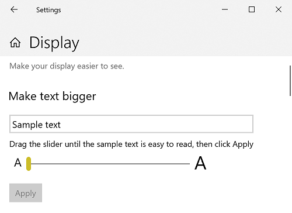
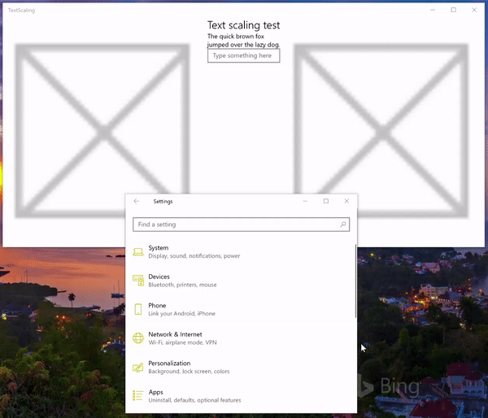

# Text scaling

  
*Example of text scaling in Windows 10 (100% to 225%)*

## Overview

Reading text on a computer screen (from mobile device to laptop to desktop monitor to the giant screen of a Surface Hub) can be challenging for many people. Conversely, some users find the font sizes used in apps and web sites to be larger than necessary.

To ensure text is as legible as possible for the broadest range of users, Windows provides the ability for users to change relative font size across both the OS and individual applications. Instead of using a magnifier app (which typically just enlarges everything within an area of the screen and introduces its own usability issues), changing display resolution, or relying on DPI scaling (which resizes everything based on display and typical viewing distance), a user can quickly access a setting to resize just text, ranging from 100% (the default size) up to 225%.

## Support

Universal Windows applications (both standard and PWA), support text scaling by default.

If your Windows application includes custom controls, custom text surfaces, hard-coded control heights, older frameworks, or 3rd party frameworks, you likely have to make some updates to ensure a consistent and useful experience for your users.  

DirectWrite, GDI, and XAML SwapChainPanels do not natively support text scaling, while Win32 support is limited to menus, icons, and toolbars.  

<!-- If you want to support text scaling in your application with these frameworks, you’ll need to support the text scaling change event outlined below and provide alternative sizes for your UI and content.   -->

## User experience

Users can adjust text scale with the Make text bigger slider on the Settings -> Ease of Access -> Vision/Display screen.

  
*Text scale setting from Settings -> Ease of Access -> Vision/Display screen*

## UX guidance

As text is resized, controls and containers must also resize and reflow to accommodate the text and its new layout. As mentioned previously, depending on the app, framework, and platform, much of this work is done for you. The following UX guidance covers those cases where it's not.

### Use the platform controls

Did we say this already? It's worth repeating: When possible, always use the built-in controls provided with the various Windows app frameworks to get the most comprehensive user experience possible for the least amount of effort.

For example, all UWP text controls support the full text scaling experience without any customization or templating.

Here's a snippet from a basic UWP app that includes a couple of standard text controls:

``` xaml
<Grid>
    <Grid.RowDefinitions>
        <RowDefinition Height="Auto"/>
        <RowDefinition Height="Auto" />
        <RowDefinition Height="Auto"/>
    </Grid.RowDefinitions>
    <TextBlock Grid.Row="0" 
                Style="{ThemeResource TitleTextBlockStyle}"
                Text="Text scaling test" 
                HorizontalTextAlignment="Center" />
    <Grid Grid.Row="1">
        <Grid.ColumnDefinitions>
            <ColumnDefinition Width="Auto"/>
            <ColumnDefinition Width="*"/>
            <ColumnDefinition Width="Auto"/>
        </Grid.ColumnDefinitions>
        <Image Grid.Column="0" 
                Source="Assets/StoreLogo.png" 
                Width="450" Height="450"/>
        <StackPanel Grid.Column="1" 
                    HorizontalAlignment="Center">
            <TextBlock TextWrapping="WrapWholeWords">
                The quick brown fox jumped over the lazy dog.
            </TextBlock>
            <TextBox PlaceholderText="Type something here" />
        </StackPanel>
        <Image Grid.Column="2" 
                Source="Assets/StoreLogo.png" 
                Width="450" Height="450"/>
    </Grid>
    <TextBlock Grid.Row="2" 
                Style="{ThemeResource TitleTextBlockStyle}"
                Text="Text scaling test footer" 
                HorizontalTextAlignment="Center" />
</Grid>
```

  
*Animated text scaling*

### Use auto-sizing

Don't specify absolute sizes for your controls. Whenever possible, let the platform resize your controls automatically based on user and device settings.  

In this snippet from the previous example, we use the `Auto` and `*` width values for a set of grid columns and let the platform adjust the app layout based on the size of the elements contained within the grid.

``` xaml
<Grid.ColumnDefinitions>
    <ColumnDefinition Width="Auto"/>
    <ColumnDefinition Width="*"/>
    <ColumnDefinition Width="Auto"/>
</Grid.ColumnDefinitions>
```

### Use text wrapping

To ensure the layout of your app is as flexible and adaptable as possible, enable text wrapping in any control that contains text (many controls do not support text wrapping by default).

If you don't specify text wrapping, the platform uses other methods to adjust the layout, including clipping (see previous example).

Here, we use the `AcceptsReturn` and `TextWrapping` TextBox properties to ensure our layout is as flexible as possible.

``` xaml
<TextBox PlaceholderText="Type something here" 
          AcceptsReturn="True" TextWrapping="Wrap" />
```

  
*Animated text scaling with text wrapping*

### Specify text trimming behavior

If text wrapping is not the preferred behavior, most text controls let you either clip your text or specify ellipses for the text trimming behavior. Clipping is preferred to ellipses as ellipses take up space themselves.

> [!NOTE]
> If you need to clip your text, clip the end of the string, not the beginning.

In this example, we show how to clip text in a TextBlock using the [TextTrimming](/uwp/api/windows.ui.xaml.controls.textblock.texttrimming) property.

``` xaml
<TextBlock TextTrimming="Clip">
    The quick brown fox jumped over the lazy dog.
</TextBlock>
```

  
*Text scaling with text clipping*

### Use a tooltip

If you clip text, use a tooltip to provide the full text to your users.

Here, we add a tooltip to a TextBlock that doesn't support text wrapping:

``` xaml
<TextBlock TextTrimming="Clip">
    <ToolTipService.ToolTip>
        <ToolTip Content="The quick brown fox jumped over the lazy dog."/>
    </ToolTipService.ToolTip>
    The quick brown fox jumped over the lazy dog.
</TextBlock>
```

### Don’t scale font-based icons or symbols

When using font-based icons for emphasis or decoration, disable scaling on these characters.

Set the [IsTextScaleFactorEnabled](/uwp/api/windows.ui.xaml.controls.control.istextscalefactorenabled) property to `false` for most XAML controls.

### Support text scaling natively

Handle the [TextScaleFactorChanged](/uwp/api/windows.ui.viewmanagement.uisettings.textscalefactorchanged) UISettings system event in your custom framework and controls. This event is raised each time the user sets the text scaling factor on their system.

## Summary

This topic provides an overview of text scaling support in Windows and includes UX and developer guidance on how to customize the user experience.

## Related articles

### API reference

- [IsTextScaleFactorEnabled](/uwp/api/windows.ui.xaml.controls.control.istextscalefactorenabled)
- [TextScaleFactorChanged](/uwp/api/windows.ui.viewmanagement.uisettings.textscalefactorchanged)