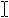

# Touchpad design guidelines

Design your app so that users can interact with it through a touchpad. A touchpad combines both indirect multi-touch input with the precision input of a pointing device, such as a mouse. This combination makes the touchpad suited to both a touch-optimized UI and the smaller targets of productivity apps.

 

Touchpad interactions require three things:

-   A standard touchpad or a Windows Precision Touchpad.

    Precision touchpads are optimized for Windows app devices. They enable the system to handle certain aspects of the touchpad experience natively, such as finger tracking and palm detection, for a more consistent experience across devices.

-   The direct contact of one or more fingers on the touchpad.
-   Movement of the touch contacts (or lack thereof, based on a time threshold).

The input data provided by the touchpad sensor can be:

-   Interpreted as a physical gesture for direct manipulation of one or more UI elements (such as panning, rotating, resizing, or moving). In contrast, interacting with an element through its properties window or other dialog box is considered indirect manipulation.
-   Recognized as an alternative input method, such as mouse or pen.
-   Used to complement or modify aspects of other input methods, such as smudging an ink stroke drawn with a pen.

A touchpad combines indirect multi-touch input with the precision input of a pointing device, such as a mouse. This combination makes the touchpad suited to both touch-optimized UI and the typically smaller targets of productivity apps and the desktop environment. Optimize your Windows app design for touch input and get touchpad support by default.

Because of the convergence of interaction experiences supported by touchpads, we recommend using the [**PointerEntered**](/uwp/api/windows.ui.xaml.uielement.pointerentered) event to provide mouse-style UI commands in addition to the built-in support for touch input. For example, use previous and next buttons to let users flip through pages of content as well as pan through the content.

The gestures and guidelines discussed in this topic can help to ensure that your app supports touchpad input seamlessly and with minimal code.

## The touchpad language

A concise set of touchpad interactions are used consistently throughout the system. Optimize your app for touch and mouse input and this language makes your app feel instantly familiar for your users, increasing their confidence and making your app easier to learn and use.

Users can set far more Precision Touchpad gestures and interaction behaviors than they can for a standard touchpad. These two images show the different touchpad settings pages from Settings &gt; Devices &gt; Mouse & touchpad for a standard touchpad and a Precision Touchpad, respectively.

Standard\\ touchpad\\ settings

Windows\\ Precision\\ Touchpad\\ settings

Here are some examples of touchpad-optimized gestures for performing common tasks.

<table>
<colgroup>
<col width="50%" />
<col width="50%" />
</colgroup>
<thead>
<tr class="header">
<th align="left">Term</th>
<th align="left">Description</th>
</tr>
</thead>
<tbody>
<tr class="odd">
<td align="left">
Three-finger tap
</td>
<td align="left">
User preference to search with <strong>Cortana</strong> or show <strong>Action Center</strong>.
</td>
</tr>
<tr class="even">
<td align="left">
Three finger slide
</td>
<td align="left">
User preference to open the virtual desktop Task View, show Desktop, or switch between open apps.
</td>
</tr>
<tr class="odd">
<td align="left">
Single finger tap for primary action
</td>
<td align="left">
Use a single finger to tap an element and invoke its primary action (such as launching an app or executing a command).
</td>
</tr>
<tr class="even">
<td align="left">
Two finger tap to right-click
</td>
<td align="left">
Tap with two fingers simultaneously on an element to select it and display contextual commands.
</td>
</tr>
<tr class="odd">
<td align="left">
Two finger slide to pan
</td>
<td align="left">
Slide is used primarily for panning interactions but can also be used for moving, drawing, or writing.
</td>
</tr>
<tr class="even">
<td align="left">
Pinch and stretch to zoom
</td>
<td align="left">
The pinch and stretch gestures are commonly used for resizing and Semantic Zoom.
</td>
</tr>
<tr class="odd">
<td align="left">
Single finger press and slide to rearrange
</td>
<td align="left">
Drag an element.
</td>
</tr>
<tr class="even">
<td align="left">
Single finger press and slide to select text
</td>
<td align="left">
Press within selectable text and slide to select it. Double-tap to select a word.
</td>
</tr>
<tr class="odd">
<td align="left">
Left and right click zone
</td>
<td align="left">
Emulate the left and right button functionality of a mouse device.
</td>
</tr>
</tbody>
</table>

 

## Hardware

Query the mouse device capabilities ([**MouseCapabilities**](/uwp/api/Windows.Devices.Input.MouseCapabilities)) to identify what aspects of your app UI the touchpad hardware can access directly. We recommend providing UI for both touch and mouse input.

For more info about querying device capabilities, see [Identify input devices](identify-input-devices.md).

## Visual feedback

-   When a touchpad cursor is detected (through move or hover events), show mouse-specific UI to indicate functionality exposed by the element. If the touchpad cursor doesn't move for a certain amount of time, or if the user initiates a touch interaction, make the touchpad UI gradually fade away. This keeps the UI clean and uncluttered.
-   Don't use the cursor for hover feedback, the feedback provided by the element is sufficient (see the Cursors section below).
-   Don't display visual feedback if an element doesn't support interaction (such as static text).
-   Don't use focus rectangles with touchpad interactions. Reserve these for keyboard interactions.
-   Display visual feedback concurrently for all elements that represent the same input target.

For more general guidance about visual feedback, see [Guidelines for visual feedback](./guidelines-for-visualfeedback.md).

## Cursors

A set of standard cursors is available for a touchpad pointer. These are used to indicate the primary action of an element.

Each standard cursor has a corresponding default image associated with it. The user or an app can replace the default image associated with any standard cursor at any time. UWP apps specify a cursor image through the [**PointerCursor**](/uwp/api/windows.ui.core.corewindow.pointercursor) function.

If you need to customize the mouse cursor:

-   Always use the arrow cursor () for clickable elements. don't use the pointing hand cursor () for links or other interactive elements. Instead, use hover effects (described earlier).
-   Use the text cursor () for selectable text.
-   Use the move cursor () when moving is the primary action (such as dragging or cropping). Don't use the move cursor for elements where the primary action is navigation (such as Start tiles).
-   Use the horizontal, vertical and diagonal resize cursors (, , , ), when an object is resizable.
-   Use the grasping hand cursors (, ) when panning content within a fixed canvas (such as a map).

## Related articles

- [Handle pointer input](handle-pointer-input.md)
- [Identify input devices](identify-input-devices.md)

### Samples

- [Basic input sample](https://github.com/Microsoft/Windows-universal-samples/tree/master/Samples/BasicInput)
- [Low latency input sample](https://github.com/Microsoft/Windows-universal-samples/tree/master/Samples/LowLatencyInput)
- [User interaction mode sample](https://github.com/Microsoft/Windows-universal-samples/tree/master/Samples/UserInteractionMode)
- [Focus visuals sample](https://github.com/Microsoft/Windows-universal-samples/tree/master/Samples/XamlFocusVisuals)

### Archive Samples

- [Input: Device capabilities sample](https://github.com/microsoftarchive/msdn-code-gallery-microsoft/tree/411c271e537727d737a53fa2cbe99eaecac00cc0/Official%20Windows%20Platform%20Sample/Windows%208%20app%20samples/%5BC%23%5D-Windows%208%20app%20samples/C%23/Windows%208%20app%20samples/Input%20Device%20capabilities%20sample%20(Windows%208))
- [Input: XAML user input events sample](https://github.com/microsoftarchive/msdn-code-gallery-microsoft/tree/411c271e537727d737a53fa2cbe99eaecac00cc0/Official%20Windows%20Platform%20Sample/Input%20XAML%20user%20input%20events%20sample)
- [XAML scrolling, panning, and zooming sample](https://github.com/microsoftarchive/msdn-code-gallery-microsoft/tree/411c271e537727d737a53fa2cbe99eaecac00cc0/Official%20Windows%20Platform%20Sample/Universal%20Windows%20app%20samples/111487-Universal%20Windows%20app%20samples/XAML%20scrolling%2C%20panning%2C%20and%20zooming%20sample)
- [Input: Gestures and manipulations with GestureRecognizer](https://github.com/microsoftarchive/msdn-code-gallery-microsoft/tree/411c271e537727d737a53fa2cbe99eaecac00cc0/Official%20Windows%20Platform%20Sample/Input%20Gestures%20and%20manipulations%20with%20GestureRecognizer)