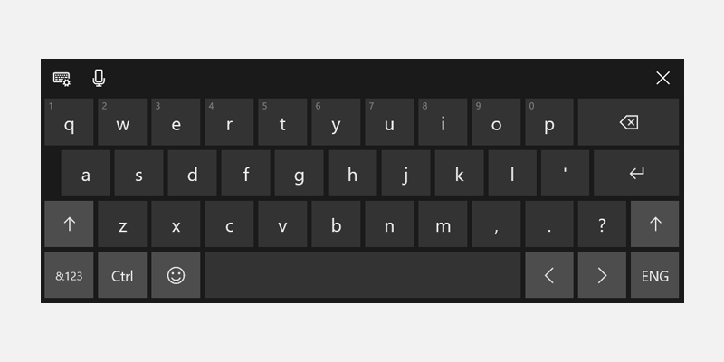
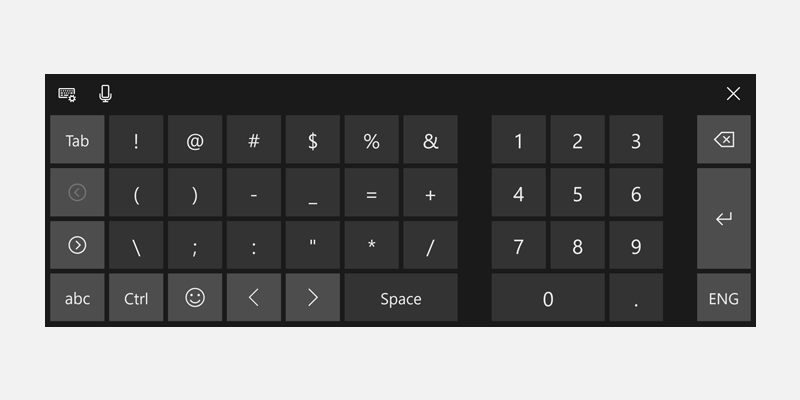
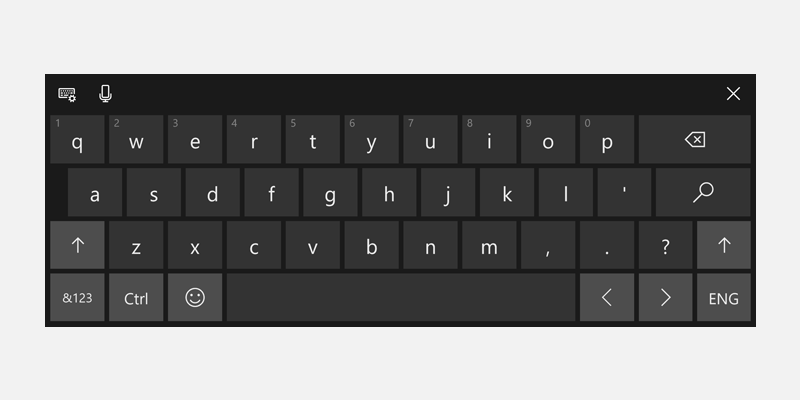
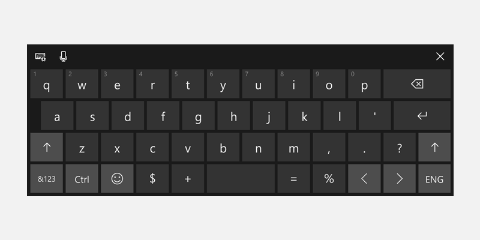

# Use input scope to change the touch keyboard

To help users to enter data using the touch keyboard, or Soft Input Panel (SIP), you can set the input scope of the text control to match the kind of data the user is expected to enter.

### Important APIs
- [InputScope](https://msdn.microsoft.com/library/windows/apps/hh702632)
- [InputScopeNameValue](https://msdn.microsoft.com/library/windows/apps/hh702028)


The touch keyboard can be used for text entry when your app runs on a device with a touch screen. The touch keyboard is invoked when the user taps on an editable input field, such as a **[TextBox](https://msdn.microsoft.com/library/windows/apps/br209683)** or **[RichEditBox](https://msdn.microsoft.com/library/windows/apps/br227548)**. You can make it much faster and easier for users to enter data in your app by setting the *input scope* of the text control to match the kind of data you expect the user to enter. The input scope provides a hint to the system about the type of text input expected by the control so the system can provide a specialized touch keyboard layout for the input type.

For example, if a text box is used only to enter a 4-digit PIN, set the [**InputScope**](https://msdn.microsoft.com/library/windows/apps/hh702632) property to **Number**. This tells the system to show the number keypad layout, which makes it easier for the user to enter the PIN.

> [!IMPORTANT]
> - This info applies only to the SIP. It does not apply to hardware keyboards or the On-Screen Keyboard available in the Windows Ease of Access options.
> - The input scope does not cause any input validation to be performed, and does not prevent the user from providing any input through a hardware keyboard or other input device. You are still responsible for validating the input in your code as needed.

## Changing the input scope of a text control

The input scopes that are available to your app are members of the **[InputScopeNameValue](https://msdn.microsoft.com/library/windows/apps/hh702028)** enumeration. You can set the **InputScope** property of a **[TextBox](https://msdn.microsoft.com/library/windows/apps/br209683)** or **[RichEditBox](https://msdn.microsoft.com/library/windows/apps/br227548)** to one of these values.

> [!IMPORTANT]
> The **[InputScope](https://msdn.microsoft.com/library/windows/apps/dn996570)** property on **[PasswordBox](https://msdn.microsoft.com/library/windows/apps/br227519)** supports only the **Password** and **NumericPin** values. Any other value is ignored.

Here, you change the input scope of several text boxes to match the expected data for each text box.

**To change the input scope in XAML**

1.  In the XAML file for your page, locate the tag for the text control that you want to change.
2.  Add the [**InputScope**](https://msdn.microsoft.com/library/windows/apps/hh702632) attribute to the tag and specify the [**InputScopeNameValue**](https://msdn.microsoft.com/library/windows/apps/hh702028) value that matches the expected input.

    Here are some text boxes that might appear on a common customer-contact form. With the [**InputScope**](https://msdn.microsoft.com/library/windows/apps/hh702632) set, a touch keyboard with a suitable layout for the data shows for each text box.

    ```xaml
    <StackPanel Width="300">
        <TextBox Header="Name" InputScope="Default"/>
        <TextBox Header="Email Address" InputScope="EmailSmtpAddress"/>
        <TextBox Header="Telephone Number" InputScope="TelephoneNumber"/>
        <TextBox Header="Web site" InputScope="Url"/>
    </StackPanel>
    ```

**To change the input scope in code**

1.  In the XAML file for your page, locate the tag for the text control that you want to change. If it's not set, set the [x:Name attribute](https://msdn.microsoft.com/library/windows/apps/mt204788) so you can reference the control in your code.

    ```csharp
    <TextBox Header="Telephone Number" x:Name="phoneNumberTextBox"/>
    ```

2.  Instantiate a new [**InputScope**](https://msdn.microsoft.com/library/windows/apps/hh702025) object.

    ```csharp
    InputScope scope = new InputScope();
    ```

3.  Instantiate a new [**InputScopeName**](https://msdn.microsoft.com/library/windows/apps/hh702027) object.
    
    ```csharp
    InputScopeName scopeName = new InputScopeName();
    ```

4.  Set the [**NameValue**](https://msdn.microsoft.com/library/windows/apps/hh702032) property of the [**InputScopeName**](https://msdn.microsoft.com/library/windows/apps/hh702027) object to a value of the [**InputScopeNameValue**](https://msdn.microsoft.com/library/windows/apps/hh702028) enumeration.

    ```csharp
    scopeName.NameValue = InputScopeNameValue.TelephoneNumber;
    ```

5.  Add the [**InputScopeName**](https://msdn.microsoft.com/library/windows/apps/hh702027) object to the [**Names**](https://msdn.microsoft.com/library/windows/apps/hh702034) collection of the [**InputScope**](https://msdn.microsoft.com/library/windows/apps/hh702025) object.

    ```csharp
    scope.Names.Add(scopeName);
    ```

6.  Set the [**InputScope**](https://msdn.microsoft.com/library/windows/apps/hh702025) object as the value of the text control's [**InputScope**](https://msdn.microsoft.com/library/windows/apps/hh702632) property.

    ```csharp
    phoneNumberTextBox.InputScope = scope;
    ```

Here's the code all together.

```CSharp
InputScope scope = new InputScope();
InputScopeName scopeName = new InputScopeName();
scopeName.NameValue = InputScopeNameValue.TelephoneNumber;
scope.Names.Add(scopeName);
phoneNumberTextBox.InputScope = scope;
```

The same steps can be condensed into this shorthand code.

```CSharp
phoneNumberTextBox.InputScope = new InputScope() 
{
    Names = {new InputScopeName(InputScopeNameValue.TelephoneNumber)}
};
```

## Text prediction, spell checking, and auto-correction

The [**TextBox**](https://msdn.microsoft.com/library/windows/apps/br209683) and [**RichEditBox**](https://msdn.microsoft.com/library/windows/apps/br227548) controls have several properties that influence the behavior of the SIP. To provide the best experience for your users, it's important to understand how these properties affect text input using touch.

-   [**IsSpellCheckEnabled**](https://msdn.microsoft.com/library/windows/apps/br209688)—When spell check is enabled for a text control, the control interacts with the system's spell-check engine to mark words that are not recognized. You can tap a word to see a list of suggested corrections. Spell checking is enabled by default.

    For the **Default** input scope, this property also enables automatic capitalization of the first word in a sentence and auto-correction of words as you type. These auto-correction features might be disabled in other input scopes. For more info, see the tables later in this topic.

-   [**IsTextPredictionEnabled**](https://msdn.microsoft.com/library/windows/apps/br209690)—When text prediction is enabled for a text control, the system shows a list of words that you might be beginning to type. You can select from the list so you don't have to type the whole word. Text prediction is enabled by default.

    Text prediction might be disabled if the input scope is other than **Default**, even if the [**IsTextPredictionEnabled**](https://msdn.microsoft.com/library/windows/apps/br209690) property is **true**. For more info, see the tables later in this topic.

-   [**PreventKeyboardDisplayOnProgrammaticFocus**](https://msdn.microsoft.com/library/windows/apps/dn299273)—When this property is **true**, it prevents the system from showing the SIP when focus is programmatically set on a text control. Instead, the keyboard is shown only when the user interacts with the control.

## Touch keyboard index for Windows

These tables show the Windows Soft Input Panel (SIP) layouts for common input scope values. The effect of the input scope on the features enabled by the **IsSpellCheckEnabled** and **IsTextPredictionEnabled** properties is listed for each input scope. This is not a comprehensive list of available input scopes.

> [!Tip] 
> You can toggle most touch keyboards between an alphabetic layout and a numbers-and-symbols layout by pressing the **&123** key to change to the numbers-and-symbols layout, and press the **abcd** key to change to the alphabetic layout.

### Default

`<TextBox InputScope="Default"/>`

The default Windows touch keyboard.


- Spell check: enabled if **IsSpellCheckEnabled** = **true**, disabled if **IsSpellCheckEnabled** = **false**
- Auto-correction: enabled if **IsSpellCheckEnabled** = **true**, disabled if **IsSpellCheckEnabled** = **false**
- Automatic capitalization: enabled if **IsSpellCheckEnabled** = **true**, disabled if **IsSpellCheckEnabled** = **false**
- Text prediction: enabled if **IsTextPredictionEnabled** = **true**, disabled if **IsTextPredictionEnabled** = **false**

### CurrencyAmountAndSymbol

`<TextBox InputScope="CurrencyAmountAndSymbol"/>`

The default numbers and symbols keyboard layout.


- Includes page left/right keys to show more symbols
- Spell check: on by default, can be disabled
- Auto-correction: on by default, can be disabled
- Automatic capitalization: always disabled
- Text prediction: on by default, can be disabled
 
### Url

`<TextBox InputScope="Url"/>`


- Includes the **.com** and  (Go) keys. Press and hold the **.com** key to display additional options (**.org**, **.net**, and region-specific suffixes)
- Includes the **:**, **-**, and **/** keys
- Spell check: off by default, can be enabled
- Auto-correction: off by default, can be enabled
- Automatic capitalization: off by default, can be enabled
- Text prediction: off by default, can be enabled


### EmailSmtpAddress

`<TextBox InputScope="EmailSmtpAddress"/>`


- Includes the **@** and **.com** keys. Press and hold the **.com** key to display additional options (**.org**, **.net**, and region-specific suffixes)
- Includes the **_** and **-** keys
- Spell check: off by default, can be enabled
- Auto-correction: off by default, can be enabled
- Automatic capitalization: off by default, can be enabled
- Text prediction: off by default, can be enabled


### Number

`<TextBox InputScope="Number"/>`


- Spell check: on by default, can be disabled
- Auto-correction: on by default, can be disabled
- Automatic capitalization: always disabled
- Text prediction: on by default, can be disabled

### TelephoneNumber

`<TextBox InputScope="TelephoneNumber"/>`


- Spell check: on by default, can be disabled
- Auto-correction: on by default, can be disabled
- Automatic capitalization: always disabled
- Text prediction: on by default, can be disabled

### Search

`<TextBox InputScope="Search"/>`


- Includes the **Search** key instead of the **Enter** key
- Spell check: on by default, can be disabled
- Auto-correction: on by default, can be disabled
- Auto-capitalization: always disabled
- Text prediction: on by default, can be disabled

### SearchIncremental

`<TextBox InputScope="SearchIncremental"/>`


- Same layout as **Default**
- Spell check: off by default, can be enabled
- Auto-correction: always disabled
- Automatic capitalization: always disabled
- Text prediction: always disabled

### Formula

`<TextBox InputScope="Formula"/>`


- Includes the **=** key
- Also includes the **%**, **$**, and **+** keys
- Spell check: on by default, can be disabled
- Auto-correction: on by default, can be disabled
- Automatic capitalization: always disabled
- Text prediction: on by default, can be disabled

### Chat

`<TextBox InputScope="Chat"/>`


- Same layout as **Default**
- Spell check: on by default, can be disabled
- Auto-correction: on by default, can be disabled
- Automatic capitalization: on by default, can be disabled
- Text prediction: on by default, can be disabled

### NameOrPhoneNumber

`<TextBox InputScope="NameOrPhoneNumber"/>`


- Same layout as **Default**
- Spell check: off by default, can be enabled
- Auto-correction: off by default, can be enabled
- Automatic capitalization: off by default, can be enabled (first letter of each word is capitalized)
- Text prediction: off by default, can be enabled
