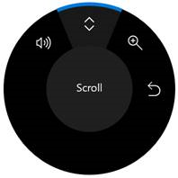
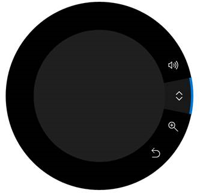
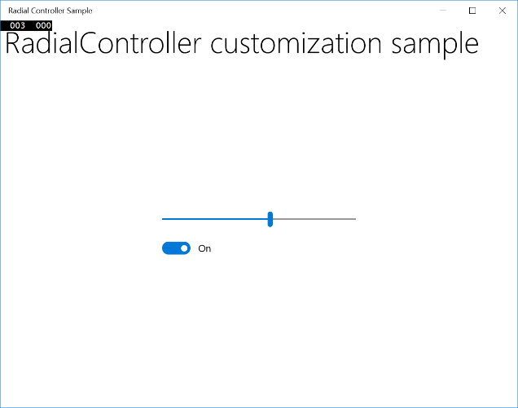

# Surface Dial interactions

  
*Surface Dial with Surface Studio and Pen* (available for purchase at the [Microsoft Store](https://www.microsoft.com/store/d/Surface-Dial/925R551SKTGN?icid=Surface_Accessories_ModB_Surface_Dial_103116)).

## Overview

Windows wheel devices, such as the Surface Dial, are a new category of input device that enable a host of compelling and unique user interaction experiences for Windows and Windows apps. 

> [!IMPORTANT]
> In this topic, we refer specifically to Surface Dial interactions, but the info is applicable to all Windows wheel devices. 

| Videos |   |
| --- | --- |
| <iframe src="https://www.youtube-nocookie.com/embed/WMklcdzcNcU" width="300" height="200" allowFullScreen="true" frameBorder="0"></iframe> | <iframe src="https://channel9.msdn.com/Blogs/One-Dev-Minute/Programming-the-Microsoft-Surface-Dial/player" width="300" height="200" allowFullScreen="true" frameBorder="0"></iframe> |
| *Surface Dial app partners* | *Surface Dial for devs* |

With a form factor based on a *rotate* action (or gesture), the Surface Dial is intended as a secondary, multi-modal input device that complements input from a primary device. In most cases, the device is manipulated by a user's non-dominant hand while performing a task with their dominant hand (such as inking with a pen). It is not designed for precision pointer input (like touch, pen, or mouse). 

The Surface Dial also supports both a *press and hold* action and a *click* action. Press and hold has a single function: display a menu of commands. If the menu is active, the rotate and click input is processed by the menu. Otherwise, the input is passed to your app for processing. 

**As with all Windows input devices, you can customize and tailor the Surface Dial interaction experience to suit the functionality in your apps.**

> [!TIP]
> Used together, the Surface Dial and the new Surface Studio can provide an even more distinctive user experience.  
>
>In addition to the default press and hold menu experience described, the Surface Dial can also be placed directly on the screen of the Surface Studio. This enables a special "on-screen" menu. 
>
>By detecting both the contact location and bounds of the Surface Dial, the system uses this info to handle occlusion by the device and display a larger version of the menu that wraps around the outside of the Dial. This same info can also be used by your app to adapt the UI for both the presence of the device and its anticipated usage, such as the placement of the user's hand and arm.

| Surface Dial off-screen menu | | Surface Dial on-screen menu |
| --- | --- | --- |
|  | |  |

## System integration

The Surface Dial is tightly integrated with Windows and supports a set of built-in tools on the menu: system volume, scroll, zoom in/out, and undo/redo.

This collection of built-in tools adapts to the current system context to include:
- A system brightness tool when the user is on the Windows Desktop
- A previous/next track tool when media is playing

In addition to this general platform support, the Surface Dial is also tightly integrated with the Windows Ink platform controls ([**InkCanvas**](/uwp/api/Windows.UI.Xaml.Controls.InkCanvas) and [**InkToolbar**](/uwp/api/Windows.UI.Xaml.Controls.InkToolbar)).

  
*Surface Dial with Surface Pen*

When used with the Surface Dial, these controls enable additional functionality for modifying ink attributes and controlling the ink toolbar’s ruler stencil.

When you open the Surface Dial Menu in an inking application that uses the ink toolbar, the menu now includes tools for controlling pen type and brush thickness. When the ruler is enabled, a corresponding tool is added to the menu that lets the device control the position and angle of the ruler.

  
*Surface Dial menu with pen selection tool for the Windows Ink toolbar*

  
*Surface Dial menu with stroke size tool for the Windows Ink toolbar*

  
*Surface Dial menu with ruler tool for the Windows Ink toolbar*

## User customization

Users can customize some aspects of their Dial experience through the **Windows Settings -> Devices -> Wheel** page, including default tools, vibration (or haptic feedback), and writing (or dominant) hand. 

When customizing the Surface Dial user experience, you should always ensure that a particular function or behavior is available and enabled by the user.

## Custom tools

Here we discuss both UX and developer guidance for customizing the tools exposed on the Surface Dial menu.

### UX guidance for custom tools

**Ensure your tools correspond to the current context** 
When you make it clear and intuitive what a tool does and how the Surface Dial interaction works, you help users learn quickly and stay focused on their task.

**Minimize the number of app tools as much as possible**  
The Surface Dial menu has room for seven items. If there are eight or more items, the user needs to turn the Dial to see which tools are available in an overflow flyout, making the menu difficult to navigate and tools difficult to discover and select.

We recommend providing a single custom tool for your app or app context. Doing so enables you to set that tool based on what the user is doing without requiring them to activate the Surface Dial menu and select a tool. 

**Dynamically update the collection of tools**  
Because Surface Dial menu items do not support a disabled state, you should dynamically add and remove tools (including built-in, default tools) based on user context (current view or focused window). If a tool is not relevant to the current activity or it’s redundant, remove it.

> [!IMPORTANT]
> When you add an item to the menu, ensure the item does not already exist.

**Don’t remove the built-in system volume setting tool**  
Volume control is typically always required by user. They might be listening to music while using your app, so volume and next track tools should always be accessible from the Surface Dial menu. (The next track tool is automatically added to the menu when media is playing.)

**Be consistent with menu organization**  
This helps users with discovering and learning what tools are available when using your app, and helps improve their efficiency when switching tools.

**Provide high-quality icons consistent with the built-in icons**  
Icons can convey professionalism and excellence, and inspire trust in users.
- Provide a high-quality 64 x 64 pixel PNG image (44 x 44 is the smallest supported)
- Ensure the background is transparent
- The icon should fill most of the image
- A white icon should have a black outline to be visible in high contrast mode

|   |   |   |
| --- | --- | --- |
|  |  |  |
| *Icon with alpha background* | *Icon displayed on wheel menu with default theme* | *Icon displayed on wheel menu with High Contrast White theme* |

**Use concise and descriptive names**  
The tool name is displayed in the tool menu along with the tool icon and is also used by screen readers. 
- Names should be short to fit inside the central circle of the wheel menu
- Names should clearly identify the primary action (a complementary action can be implied):
  - Scroll indicates the effect of both rotation directions
  - Undo specifies a primary action, but redo (the complementary action) can be inferred and easily discovered by the user

### Developer guidance

You can customize the Surface Dial experience to complement the functionality in your apps through a comprehensive set of [Windows Runtime APIs](/uwp/api/Windows.UI.Input.RadialController). 

As previously mentioned, the default Surface Dial menu is pre-populated with a set of built-in tools covering a broad range of basic system features (system volume, system brightness, scroll, zoom, undo, and media control when the system detects ongoing audio or video playback). However, these default tools might not provide the functionality required by your app. 

In the following sections, we describe how to add a custom tool to the Surface Dial menu and specify which built-in tools are exposed.

Download a more robust version of this sample from [RadialController customization](https://github.com/MicrosoftDocs/windows-topic-specific-samples/archive/uwp-radialcontroller-customization.zip).

**Add a custom tool**

In this example, we add a basic custom tool that passes the input data from both the rotation and click events to some XAML UI controls.

1. First, we declare our UI (just a slider and toggle button) in XAML.

     
   *The sample app UI*

    ```Xaml
    <Grid Background="{ThemeResource ApplicationPageBackgroundThemeBrush}">
      <Grid.RowDefinitions>
        <RowDefinition Height="Auto"/>
        <RowDefinition Height="*"/>
      </Grid.RowDefinitions>
      <StackPanel x:Name="HeaderPanel" 
        Orientation="Horizontal" 
        Grid.Row="0">
          <TextBlock x:Name="Header"
            Text="RadialController customization sample"
            VerticalAlignment="Center"
            Style="{ThemeResource HeaderTextBlockStyle}"
            Margin="10,0,0,0" />
      </StackPanel>
      <StackPanel Orientation="Vertical" 
        VerticalAlignment="Center" 
        HorizontalAlignment="Center"
        Grid.Row="1">
          <!-- Slider for rotation input -->
          <Slider x:Name="RotationSlider"
            Width="300"
            HorizontalAlignment="Left"/>
          <!-- Switch for click input -->
          <ToggleSwitch x:Name="ButtonToggle"
            HorizontalAlignment="Left"/>
      </StackPanel>
    </Grid>
    ```

2. Then, in code-behind, we add a custom tool to the Surface Dial menu and declare the [**RadialController**](/uwp/api/Windows.UI.Input.RadialController) input handlers. 

   We get a reference to the [**RadialController**](/uwp/api/Windows.UI.Input.RadialController) object for the Surface Dial (myController) by calling [**CreateForCurrentView**](/uwp/api/windows.ui.input.radialcontroller.createforcurrentview).

   We then create an instance of a [**RadialControllerMenuItem**](/uwp/api/Windows.UI.Input.RadialControllerMenuItem) (myItem) by calling [**RadialControllerMenuItem.CreateFromIcon**](/uwp/api/windows.ui.input.radialcontrollermenuitem.createfromicon). 

   Next, we append that item to the collection of menu items.

   We declare the input event handlers ([**ButtonClicked**](/uwp/api/windows.ui.input.radialcontroller.buttonclicked) and [**RotationChanged**](/uwp/api/windows.ui.input.radialcontroller.rotationchanged)) for the [**RadialController**](/uwp/api/Windows.UI.Input.RadialController) object.

   Finally, we define the event handlers.

    ```csharp
    public sealed partial class MainPage : Page
    {
        RadialController myController;

        public MainPage()
        {
            this.InitializeComponent();
            // Create a reference to the RadialController.
            myController = RadialController.CreateForCurrentView();

            // Create an icon for the custom tool.
            RandomAccessStreamReference icon =
              RandomAccessStreamReference.CreateFromUri(
                new Uri("ms-appx:///Assets/StoreLogo.png"));

            // Create a menu item for the custom tool.
            RadialControllerMenuItem myItem =
              RadialControllerMenuItem.CreateFromIcon("Sample", icon);

            // Add the custom tool to the RadialController menu.
            myController.Menu.Items.Add(myItem);

            // Declare input handlers for the RadialController.
            myController.ButtonClicked += MyController_ButtonClicked;
            myController.RotationChanged += MyController_RotationChanged;
        }

        // Handler for rotation input from the RadialController.
        private void MyController_RotationChanged(RadialController sender,
          RadialControllerRotationChangedEventArgs args)
        {
            if (RotationSlider.Value + args.RotationDeltaInDegrees > 100)
            {
                RotationSlider.Value = 100;
                return;
            }
            else if (RotationSlider.Value + args.RotationDeltaInDegrees < 0)
            {
                RotationSlider.Value = 0;
                return;
            }
            RotationSlider.Value += args.RotationDeltaInDegrees;
        }

        // Handler for click input from the RadialController.
        private void MyController_ButtonClicked(RadialController sender,
          RadialControllerButtonClickedEventArgs args)
        {
            ButtonToggle.IsOn = !ButtonToggle.IsOn;
        }
    }
    ```

When we run the app, we use the Surface Dial to interact with it. First, we press and hold to open the menu and select our custom tool. Once the custom tool is activated, the slider control can be adjusted by rotating the Dial and the switch can be toggled by clicking the Dial.

  
*The sample app UI activated using the Surface Dial custom tool*

**Specify the built-in tools**

You can use the [**RadialControllerConfiguration**](/uwp/api/Windows.UI.Input.RadialControllerConfiguration) class to customize the collection of built-in menu items for your app.

For example, if your app doesn’t have any scrolling or zooming regions and doesn’t require undo/redo functionality, these tools can be removed from the menu. This opens space on the menu to add custom tools for your app. 

> [!IMPORTANT] 
> The Surface Dial menu must have at least one menu item. If all default tools are removed before you add one of your custom tools, the default tools are restored and your tool is appended to the default collection.

Per the design guidelines, we do not recommend removing the media control tools (volume and previous/next track) as users often have background music playing while they perform other tasks.

Here, we show how to configure the Surface Dial menu to include only media controls for volume and next/previous track.

```csharp
public MainPage()
{
  ...
  //Remove a subset of the default system tools
  RadialControllerConfiguration myConfiguration = 
  RadialControllerConfiguration.GetForCurrentView();
  myConfiguration.SetDefaultMenuItems(new[] 
  {
    RadialControllerSystemMenuItemKind.Volume,
      RadialControllerSystemMenuItemKind.NextPreviousTrack
  });
}
```

## Custom interactions

As mentioned, the Surface Dial supports three gestures (press and hold, rotate, click) with corresponding default interactions. 

Ensure any custom interactions based on these gestures make sense for the selected action or tool. 

> [!NOTE]
> The interaction experience is dependent on the state of the Surface Dial menu. If the menu is active, it processes the input; otherwise, your app does.

### Press and hold

This gesture activates and shows the Surface Dial menu, there is no app functionality associated with this gesture. 

By default, the menu is displayed at the center of the user’s screen. However, the user can grab it and move it anywhere they choose.

> [!NOTE]
> When the Surface Dial is placed on the screen of the Surface Studio, the menu is centered at the on-screen location of the Surface Dial.

### Rotate

The Surface Dial is primarily designed to support rotation for interactions that involve smooth, incremental adjustments to analog values or controls.

The device can be rotated both clockwise and counter-clockwise, and can also provide haptic feedback to indicate discrete distances.

> [!NOTE]
> Haptic feedback can be disabled by the user in the **Windows Settings -> Devices -> Wheel** page.

#### UX guidance for custom interactions

**Tools with continuous or high rotational sensitivity should disable haptic feedback**

Haptic feedback matches the rotational sensitivity of the active tool. We recommend disabling haptic feedback for tools with continuous or high rotational sensitivity as the user experience can get uncomfortable. 

**Dominant hand should not affect rotation-based interactions**

The Surface Dial cannot detect which hand is being used, but the user can set the writing (or dominant hand) in **Windows Settings -> Device -> Pen & Windows Ink**.

**Locale should be considered for all rotation interactions**

Maximize customer satisfaction by accomodating and adapting your interactions to locale and right-to-left layouts.

The built-in tools and commands on the Dial menu follow these guidelines for rotation-based interactions:

|   |   |   |
| --- | --- | --- |
| Left<br/>Up<br/>Out |  | Right<br/>Down<br/>In |
|   |   |   |

| Conceptual direction | Mapping to Surface Dial | Clockwise rotation | Counter-clockwise rotation |
| --- | --- | --- | --- |
| Horizontal | Left and right mapping based on the top of the Surface Dial | Right | Left |
| Vertical | Up and down mapping based on the left side of the Surface Dial | Down | Up |
| Z-axis | In (or nearer) mapped to up/right<br/>Out (or further) mapped to down/left | In | Out |

#### Developer guidance

As the user rotates the device, [**RadialController.RotationChanged**](/uwp/api/windows.ui.input.radialcontroller.rotationchanged) events are fired based on a delta ([**RadialControllerRotationChangedEventArgs.RotationDeltaInDegrees**](/uwp/api/windows.ui.input.radialcontrollerrotationchangedeventargs.rotationdeltaindegrees)) relative to the direction of rotation. The sensitivity (or resolution) of the data can be set with the [**RadialController.RotationResolutionInDegrees**](/uwp/api/windows.ui.input.radialcontroller.rotationresolutionindegrees) property.

> [!NOTE]
> By default, a rotational input event is delivered to a [**RadialController**](/uwp/api/Windows.UI.Input.RadialController) object only when the device is rotated a minimum of 10 degrees. Each input event causes the device to vibrate.

In general, we recommend disabling haptic feedback when the rotation resolution is set to less than 5 degrees. This provides a smoother experience for continuous interactions. 

You can enable and disable haptic feedback for custom tools by setting the [**RadialController.UseAutomaticHapticFeedback**](/uwp/api/windows.ui.input.radialcontroller.useautomatichapticfeedback) property.

> [!NOTE]
> You cannot override the haptic behavior for system tools such as the volume control. For these tools, haptic feedback can be disabled only by the user from the wheel settings page.

Here’s an example of how to customize the resolution of the rotation data and enable or disable haptic feedback.

```csharp
private void MyController_ButtonClicked(RadialController sender, 
  RadialControllerButtonClickedEventArgs args)
{
  ButtonToggle.IsOn = !ButtonToggle.IsOn;

  if(ButtonToggle.IsOn)
  {
    //high resolution mode
    RotationSlider.LargeChange = 1;
    myController.UseAutomaticHapticFeedback = false;
    myController.RotationResolutionInDegrees = 1;
  }
  else
  {
    //low resolution mode
    RotationSlider.LargeChange = 10;
    myController.UseAutomaticHapticFeedback = true;
    myController.RotationResolutionInDegrees = 10;
  }
}
```

### Click

Clicking the Surface Dial is similar to clicking the left mouse button (the rotation state of the device has no effect on this action).

#### UX guidance

**Do not map an action or command to this gesture if the user cannot easily recover from the result**

Any action taken by your app based on the user clicking the Surface Dial must be reversible. Always enable the user to easily traverse the app back stack and restore a previous app state.

Binary operations such as mute/unmute or show/hide provide good user experiences with the click gesture.

**Modal tools should not be enabled or disabled by clicking the Surface Dial**

Some app/tool modes can conflict with, or disable, interactions that rely on rotation. Tools such as the ruler in the Windows Ink toolbar, should be toggled on or off through other UI affordances (the Ink Toolbar provides a built-in [**ToggleButton**](/uwp/api/Windows.UI.Xaml.Controls.Primitives.ToggleButton) control).

For modal tools, map the active Surface Dial menu item to the target tool or to the previously selected menu item.

#### Developer guidance

When the Surface Dial is clicked, a [**RadialController.ButtonClicked**](/uwp/api/windows.ui.input.radialcontroller.buttonclicked) event is fired. The [**RadialControllerButtonClickedEventArgs**](/uwp/api/Windows.UI.Input.RadialControllerButtonClickedEventArgs) include a [**Contact**](/uwp/api/windows.ui.input.radialcontrollerbuttonclickedeventargs.contact) property that contains the location and bounding area of the Surface Dial contact on the Surface Studio screen. If the Surface Dial is not in contact with the screen, this property is null. 

### On-screen

As described earlier, the Surface Dial can be used in conjunction with the Surface Studio to display the Surface Dial menu in a special on-screen mode. 

When in this mode, you can integrate and customize your Dial interaction experiences with your apps even further. Examples of unique experiences only possible with the Surface Dial and Surface Studio include:

- Displaying contextual tools (such as a color palette) based on the position of the Surface Dial, which makes them easier to find and use
- Setting the active tool based on the UI the Surface Dial is placed on
- Magnifying a screen area based on location of the Surface Dial
- Unique game interactions based on screen location

#### UX guidance for on-screen interactions

**Apps should respond when the Surface Dial is detected on-screen**

Visual feedback helps indicate to users that your app has detected the device on the screen of the Surface Studio.

**Adjust Surface Dial-related UI based on device location**

The device (and the user's body) can occlude critical UI depending on where the user places it.

**Adjust Surface Dial-related UI based on user interaction**

In addition to hardware occlusion, a user’s hand and arm can occlude part of the screen when using the device.

The occluded area depends on which hand is being used with the device. As the device is designed to be used primarily with the non-dominant hand, Surface Dial-related UI should adjust for the opposite hand specified by the user (**Windows Settings > Devices > Pen & Windows Ink > Choose which hand you write with** setting).

**Interactions should respond to Surface Dial position rather than movement**

The foot of the device is designed to stick to the screen rather than slide, as it is not a precision pointing device. Therefore, we expect it to be more common for users to lift and place the Surface Dial rather than drag it across the screen.

**Use screen position to determine user intent**

Setting the active tool based on UI context, such as proximity to a control, canvas, or window, can improve the user experience by reducing the steps required to perform a task.

#### Developer guidance

When the Surface Dial is placed onto the digitizer surface of the Surface Studio, a [**RadialController.ScreenContactStarted**](/uwp/api/windows.ui.input.radialcontroller.screencontactstarted) event is fired and the contact info ([**RadialControllerScreenContactStartedEventArgs.Contact**](/uwp/api/windows.ui.input.radialcontrollerscreencontactstartedeventargs.contact)) is provided to your app.

Similarly, if the Surface Dial is clicked when in contact with the digitizer surface of the Surface Studio, a [**RadialController.ButtonClicked**](/uwp/api/windows.ui.input.radialcontroller.buttonclicked) event is fired and the contact info ([**RadialControllerButtonClickedEventArgs.Contact**](/uwp/api/windows.ui.input.radialcontrollerbuttonclickedeventargs.contact)) is provided to your app. 

The contact info ([**RadialControllerScreenContact**](/uwp/api/Windows.UI.Input.RadialControllerScreenContact)) includes the X/Y coordinate of the center of the Surface Dial in the coordinate space of the app ([**RadialControllerScreenContact.Position**](/uwp/api/windows.ui.input.radialcontrollerscreencontact.position)), as well as the bounding rectangle ([**RadialControllerScreenContact.Bounds**](/uwp/api/windows.ui.input.radialcontrollerscreencontact.bounds)) in Device Independent Pixels (DIPs). This info is very useful for providing context to the active tool and providing device-related visual feedback to the user.

In the following example, we’ve created a basic app with four different sections, each of which includes one slider and one toggle. We then use the onscreen position of the Surface Dial to dictate which set of sliders and toggles are controlled by the Surface Dial.

1. First, we declare our UI (four sections, each with a slider and toggle button) in XAML.

     
   *The sample app UI*

   ```xaml 
<Grid Background="{ThemeResource ApplicationPageBackgroundThemeBrush}">
  <Grid.RowDefinitions>
    <RowDefinition Height="Auto"/>
    <RowDefinition Height="*"/>
  </Grid.RowDefinitions>
  <StackPanel x:Name="HeaderPanel" 
        Orientation="Horizontal" 
        Grid.Row="0">
    <TextBlock x:Name="Header"
      Text="RadialController customization sample"
      VerticalAlignment="Center"
      Style="{ThemeResource HeaderTextBlockStyle}"
      Margin="10,0,0,0" />
  </StackPanel>
  <Grid Grid.Row="1" x:Name="RootGrid">
    <Grid.RowDefinitions>
      <RowDefinition Height="*"/>
      <RowDefinition Height="*"/>
    </Grid.RowDefinitions>
    <Grid.ColumnDefinitions>
      <ColumnDefinition Width="*"/>
      <ColumnDefinition Width="*"/>
    </Grid.ColumnDefinitions>
    <Grid x:Name="Grid0"
      Grid.Row="0"
      Grid.Column="0">
      <StackPanel Orientation="Vertical" 
        VerticalAlignment="Center" 
        HorizontalAlignment="Center">
        <!-- Slider for rotational input -->
        <Slider x:Name="RotationSlider0"
          Width="300"
          HorizontalAlignment="Left"/>
        <!-- Switch for button input -->
        <ToggleSwitch x:Name="ButtonToggle0"
            HorizontalAlignment="Left"/>
      </StackPanel>
    </Grid>
    <Grid x:Name="Grid1"
      Grid.Row="0"
      Grid.Column="1">
      <StackPanel Orientation="Vertical" 
        VerticalAlignment="Center" 
        HorizontalAlignment="Center">
        <!-- Slider for rotational input -->
        <Slider x:Name="RotationSlider1"
          Width="300"
          HorizontalAlignment="Left"/>
        <!-- Switch for button input -->
        <ToggleSwitch x:Name="ButtonToggle1"
            HorizontalAlignment="Left"/>
      </StackPanel>
    </Grid>
    <Grid x:Name="Grid2"
      Grid.Row="1"
      Grid.Column="0">
      <StackPanel Orientation="Vertical" 
        VerticalAlignment="Center" 
        HorizontalAlignment="Center">
        <!-- Slider for rotational input -->
        <Slider x:Name="RotationSlider2"
          Width="300"
          HorizontalAlignment="Left"/>
        <!-- Switch for button input -->
        <ToggleSwitch x:Name="ButtonToggle2"
            HorizontalAlignment="Left"/>
      </StackPanel>
    </Grid>
    <Grid x:Name="Grid3"
      Grid.Row="1"
      Grid.Column="1">
      <StackPanel Orientation="Vertical" 
        VerticalAlignment="Center" 
        HorizontalAlignment="Center">
        <!-- Slider for rotational input -->
        <Slider x:Name="RotationSlider3"
          Width="300"
          HorizontalAlignment="Left"/>
        <!-- Switch for button input -->
        <ToggleSwitch x:Name="ButtonToggle3"
            HorizontalAlignment="Left"/>
      </StackPanel>
    </Grid>
  </Grid>
</Grid>
   ```

2. Here's the code-behind with handlers defined for Surface Dial screen position.

```csharp
Slider ActiveSlider;
ToggleSwitch ActiveSwitch;
Grid ActiveGrid;

public MainPage()
{
  ...

  myController.ScreenContactStarted += 
    MyController_ScreenContactStarted;
  myController.ScreenContactContinued += 
    MyController_ScreenContactContinued;
  myController.ScreenContactEnded += 
    MyController_ScreenContactEnded;
  myController.ControlLost += MyController_ControlLost;

  //Set initial grid for Surface Dial input.
  ActiveGrid = Grid0;
  ActiveSlider = RotationSlider0;
  ActiveSwitch = ButtonToggle0;
}

private void MyController_ScreenContactStarted(RadialController sender, 
  RadialControllerScreenContactStartedEventArgs args)
{
  //find grid at contact location, update visuals, selection
  ActivateGridAtLocation(args.Contact.Position);
}

private void MyController_ScreenContactContinued(RadialController sender, 
  RadialControllerScreenContactContinuedEventArgs args)
{
  //if a new grid is under contact location, update visuals, selection
  if (!VisualTreeHelper.FindElementsInHostCoordinates(
    args.Contact.Position, RootGrid).Contains(ActiveGrid))
  {
    ActiveGrid.Background = new 
      SolidColorBrush(Windows.UI.Colors.White);
    ActivateGridAtLocation(args.Contact.Position);
  }
}

private void MyController_ScreenContactEnded(RadialController sender, object args)
{
  //return grid color to normal when contact leaves screen
  ActiveGrid.Background = new 
  SolidColorBrush(Windows.UI.Colors.White);
}

private void MyController_ControlLost(RadialController sender, object args)
{
  //return grid color to normal when focus lost
  ActiveGrid.Background = new 
    SolidColorBrush(Windows.UI.Colors.White);
}

private void ActivateGridAtLocation(Point Location)
{
  var elementsAtContactLocation = 
    VisualTreeHelper.FindElementsInHostCoordinates(Location, 
      RootGrid);

  foreach (UIElement element in elementsAtContactLocation)
  {
    if (element as Grid == Grid0)
    {
      ActiveSlider = RotationSlider0;
      ActiveSwitch = ButtonToggle0;
      ActiveGrid = Grid0;
      ActiveGrid.Background = new SolidColorBrush( 
        Windows.UI.Colors.LightGoldenrodYellow);
      return;
    }
    else if (element as Grid == Grid1)
    {
      ActiveSlider = RotationSlider1;
      ActiveSwitch = ButtonToggle1;
      ActiveGrid = Grid1;
      ActiveGrid.Background = new SolidColorBrush( 
        Windows.UI.Colors.LightGoldenrodYellow);
      return;
    }
    else if (element as Grid == Grid2)
    {
      ActiveSlider = RotationSlider2;
      ActiveSwitch = ButtonToggle2;
      ActiveGrid = Grid2;
      ActiveGrid.Background = new SolidColorBrush( 
        Windows.UI.Colors.LightGoldenrodYellow);
      return;
    }
    else if (element as Grid == Grid3)
    {
      ActiveSlider = RotationSlider3;
      ActiveSwitch = ButtonToggle3;
      ActiveGrid = Grid3;
      ActiveGrid.Background = new SolidColorBrush( 
        Windows.UI.Colors.LightGoldenrodYellow);
      return;
    }
  }
}
```

When we run the app, we use the Surface Dial to interact with it. First, we place the device on the Surface Studio screen, which the app detects and associates with the lower right section (see image). We then press and hold the Surface Dial to open the menu and select our custom tool. Once the custom tool is activated, the slider control can be adjusted by rotating the Surface Dial and the switch can be toggled by clicking the Surface Dial.

  
*The sample app UI activated using the Surface Dial custom tool*

## Summary

This topic provides an overview of the Surface Dial input device with UX and developer guidance on how to customize the user experience for off-screen scenarios as well as on-screen scenarios when used with Surface Studio.

## Feedback

Please send your questions, suggestions, and feedback to [radialcontroller@microsoft.com](mailto:radialcontroller@microsoft.com).

## Related articles

[Tutorial: Support the Surface Dial (and other wheel devices) in your Windows app](radialcontroller-walkthrough.md)

### API reference

- [**RadialController** class](/uwp/api/Windows.UI.Input.RadialController)
- [**RadialControllerButtonClickedEventArgs** class](/uwp/api/Windows.UI.Input.RadialControllerButtonClickedEventArgs)
- [**RadialControllerConfiguration** class](/uwp/api/Windows.UI.Input.RadialControllerConfiguration) 
- [**RadialControllerControlAcquiredEventArgs** class](/uwp/api/Windows.UI.Input.RadialControllerControlAcquiredEventArgs) 
- [**RadialControllerMenu** class](/uwp/api/Windows.UI.Input.RadialControllerMenu) 
- [**RadialControllerMenuItem** class](/uwp/api/Windows.UI.Input.RadialControllerMenuItem) 
- [**RadialControllerRotationChangedEventArgs** class](/uwp/api/Windows.UI.Input.RadialControllerRotationChangedEventArgs) 
- [**RadialControllerScreenContact** class](/uwp/api/Windows.UI.Input.RadialControllerScreenContact) 
- [**RadialControllerScreenContactContinuedEventArgs** class](/uwp/api/Windows.UI.Input.RadialControllerScreenContactContinuedEventArgs) 
- [**RadialControllerScreenContactStartedEventArgs** class](/uwp/api/Windows.UI.Input.RadialControllerScreenContactStartedEventArgs)
- [**RadialControllerMenuKnownIcon** enum](/uwp/api/Windows.UI.Input.RadialControllerMenuKnownIcon) 
- [**RadialControllerSystemMenuItemKind** enum](/uwp/api/Windows.UI.Input.RadialControllerSystemMenuItemKind) 

### Samples

#### Topic samples

[RadialController customization](https://github.com/MicrosoftDocs/windows-topic-specific-samples/archive/uwp-radialcontroller-customization.zip)

#### Other samples

[Coloring Book sample](https://github.com/Microsoft/Windows-appsample-coloringbook)

[Get Started Tutorial: Support the Surface Dial (and other wheel devices) in your Windows app](https://github.com/Microsoft/Windows-tutorials-inputs-and-devices/tree/master/GettingStarted-RadialController)

[Universal Windows Platform samples (C# and C++)](https://github.com/Microsoft/Windows-universal-samples/tree/b78d95134ce2d57c848e0a8dc339fc362748fb9c/Samples/RadialController)

[Windows classic desktop sample](https://github.com/Microsoft/Windows-classic-samples/tree/master/Samples/RadialController)