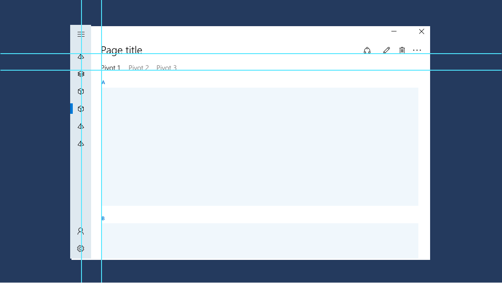
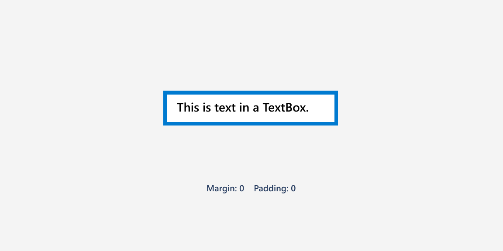
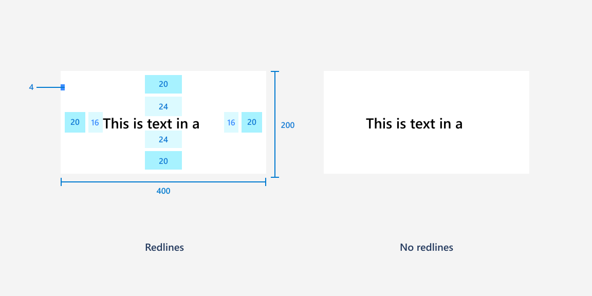

# Alignment, margin, padding

In UWP apps, most user interface (UI) elements inherit from the [**FrameworkElement**](/uwp/api/Windows.UI.Xaml.FrameworkElement) class. Every FrameworkElement has dimensions, alignment, margin, and padding properties, which influence layout behavior. The following guidance provides an overview of how to use these layout properties to make sure your app's UI is legible and easy to use in any context.

## Dimensions (Height, Width)
Proper sizing ensures all content is clear and legible. Users shouldn’t have to scroll or zoom to decipher primary content.


- [**Height**](/uwp/api/windows.ui.xaml.frameworkelement.height) and [**Width**](/uwp/api/windows.ui.xaml.frameworkelement.width) specify the size of an element. The default values are mathematically NaN (Not A Number). You can set fixed values measured in [effective pixels](../basics/design-and-ui-intro.md#effective-pixels-and-scaling), or you can use **Auto** or [proportional sizing](layout-panels.md#grid) for fluid behavior.

- [**ActualHeight**](/uwp/api/windows.ui.xaml.frameworkelement.actualheight) and [**ActualWidth**](/uwp/api/windows.ui.xaml.frameworkelement.actualwidth) are read-only properties that provide the size of an element at runtime. If fluid layouts grow or shrink, then the values change in a [**SizeChanged**](/uwp/api/windows.ui.xaml.frameworkelement.sizechanged) event. Note that a [**RenderTransform**](/uwp/api/windows.ui.xaml.uielement.rendertransform) will not change the ActualHeight and ActualWidth values.

- [**MinWidth**](/uwp/api/windows.ui.xaml.frameworkelement.minwidth)/[**MaxWidth**](/uwp/api/windows.ui.xaml.frameworkelement.maxwidth) and [**MinHeight**](/uwp/api/windows.ui.xaml.frameworkelement.minheight)/[**MaxHeight**](/uwp/api/windows.ui.xaml.frameworkelement.maxheight) specify values that constrain the size of an element while allowing fluid resizing.

- [**FontSize**](/uwp/api/windows.ui.xaml.controls.textblock.fontsize) and other text properties control layout size for text elements. While text elements don't have explicitly declared dimensions, they do have calculated ActualWidth and ActualHeight. 

## Alignment
Alignment makes your UI look neat, organized, and balanced and can also be used to establish visual hierarchy and relationships.



- [**HorizontalAlignment**](/uwp/api/windows.ui.xaml.frameworkelement.horizontalalignment) and [**VerticalAlignment**](/uwp/api/windows.ui.xaml.frameworkelement.verticalalignment) specify how an element should be positioned within its parent container.
    - The values for **HorizontalAlignment** are **Left**, **Center**, **Right**, and **Stretch**.
    - The values for **VerticalAlignment** are **Top**, **Center**, **Bottom**, and **Stretch**.

- **Stretch** is the default for both properties, and elements fill all of the space they're provided in the parent container. Real-number Height and Width cancel a Stretch value, which will instead act as a Center value. Some controls, like Button, override the default Stretch value in their default style.

- [**HorizontalContentAlignment**](/uwp/api/windows.ui.xaml.controls.control.horizontalcontentalignment) and [**VerticalContentAlignment**](/uwp/api/windows.ui.xaml.controls.control.verticalcontentalignment) specify how child elements are positioned within a container.

- Alignment can affect clipping within a layout panel. For example, with `HorizontalAlignment="Left"`, the right side of the element gets clipped if the content is larger than the ActualWidth.

- Text elements use the [**TextAlignment**](/uwp/api/windows.ui.xaml.textalignment) property. Generally, we recommend using left-alignment, the default value. For more information about styling text, see [Typography](../style/typography.md).

## Margin and padding
Margin and padding properties keep UI from looking too cluttered or too sparse, and they can also make it easier to use certain inputs like pen and touch. Here's an illustration displaying margins and padding for a container and its content.


### Margin
[**Margin**](/uwp/api/windows.ui.xaml.frameworkelement.margin) controls the amount of empty space around an element. Margin does not add pixels to ActualHeight and ActualWidth and is not considered part of the element for hit testing and sourcing input events.

- Margin values can be uniform or distinct. With `Margin="20"`, a uniform margin of 20 pixels would be applied to the element on the left, top, right, and bottom sides. With `Margin="0,10,5,25"`, the values are applied to the left, top, right, and bottom (in that order). 

- Margins are additive. If two elements both specify a uniform margin of 10 pixels and are adjacent peers in any orientation, the distance between them is 20 pixels.

- Negative margins are permitted. However, using a negative margin can often cause clipping, or overdraws of peers, so it's not a common technique to use negative margins.

- Margin values are constrained last, so be careful with margins because containers can clip or constrain elements. A Margin value could be the cause of an element not appearing to render; with a Margin applied, an element's dimension can be constrained to 0.

### Padding
[**Padding**](/uwp/api/windows.ui.xaml.frameworkelement.padding) controls the amount of space between the inner border of an element and its child content or elements. A positive Padding value decreases the content area of the element. 

Unlike Margin, Padding is not a property of FrameworkElement. There are several classes which each define their own Padding property:

-   [**Control.Padding**](/uwp/api/windows.ui.xaml.controls.control.padding): inherits to all [**Control**](/uwp/api/windows.ui.xaml.controls) derived classes. Not all controls have content, so for those controls, setting the property does nothing. If the control has a border, the padding applies inside that border.
-   [**Border.Padding**](/uwp/api/windows.ui.xaml.controls.border.padding): defines space between the rectangle line created by [**BorderThickness**](/uwp/api/windows.ui.xaml.controls.border.borderthickness)/[**BorderBrush**](/uwp/api/windows.ui.xaml.controls.border.borderbrush) and the [**Child**](/uwp/api/windows.ui.xaml.controls.border.child) element.
-   [**ItemsPresenter.Padding**](/uwp/api/windows.ui.xaml.controls.itemspresenter.padding): contributes to appearance of the items in item controls, placing the specified padding around each item.
-   [**TextBlock.Padding**](/uwp/api/windows.ui.xaml.controls.textblock.padding) and [**RichTextBlock.Padding**](/uwp/api/windows.ui.xaml.controls.richtextblock.padding): expand the bounding box around the text of the text element. These text elements don't have a **Background**, so it can be visually difficult to see. For that reason, use [**Margin**](/uwp/api/windows.ui.xaml.documents.block.margin) settings on [**Block**](/uwp/api/windows.ui.xaml.documents.block) containers instead.

In each of these cases, elements also have a Margin property. If both Margin and Padding are applied, they are additive: the apparent distance between an outer container and any inner content will be margin plus padding.

### Example
Let's look at the effects of Margin and Padding on real controls. Here’s a TextBox inside of a Grid with the default Margin and Padding values of 0.



Here’s the same TextBox and Grid with Margin and Padding values on the TextBox as shown in this XAML.

```xaml
<Grid BorderBrush="Blue" BorderThickness="4" Width="200">
    <TextBox Text="This is text in a TextBox." Margin="20" Padding="16,24"/>
</Grid>
```




## Style resources
You don't have to set each property value individually on a control. It's typically more efficient to group property values into a [**Style**](/uwp/api/Windows.UI.Xaml.Style) resource and apply the Style to a control. This is especially true when you need to apply the same property values to many controls. For more info about using styles, see [XAML styles](../controls-and-patterns/xaml-styles.md).

## General recommendations
- Only apply measurement values to certain key elements and use fluid layout behavior for the other elements. This provides for [responsive UI](responsive-design.md) when the window width changes.

- If you do use measurement values, **all dimensions, margins, and padding should be in increments of 4 epx**. When UWP uses [effective pixels and scaling](../basics/design-and-ui-intro.md#effective-pixels-and-scaling) to make your app legible on all devices and screen sizes, it scales UI elements by multiples of 4. Using values in increments of 4 results in the best rendering by aligning with whole pixels.

- For small window widths (less than 640 pixels), we recommend 12 epx gutters, and for larger window widths, we recommend 24 epx gutters.


## Related topics
* [**FrameworkElement.Height**](/uwp/api/windows.ui.xaml.frameworkelement.height)
* [**FrameworkElement.Width**](/uwp/api/windows.ui.xaml.frameworkelement.width)
* [**FrameworkElement.HorizontalAlignment**](/uwp/api/windows.ui.xaml.frameworkelement.horizontalalignment)
* [**FrameworkElement.VerticalAlignment**](/uwp/api/windows.ui.xaml.frameworkelement.verticalalignment)
* [**FrameworkElement.Margin**](/uwp/api/windows.ui.xaml.frameworkelement.margin)
* [**Control.Padding**](/uwp/api/windows.ui.xaml.controls.control.padding)