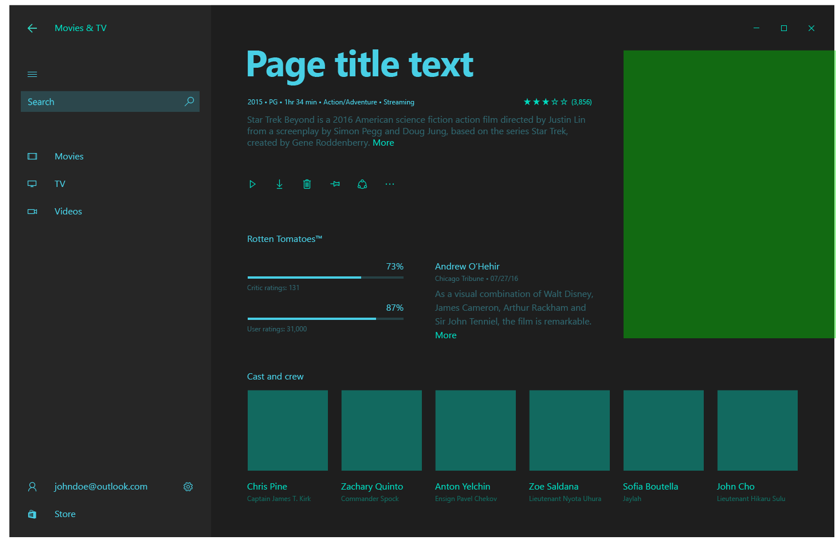
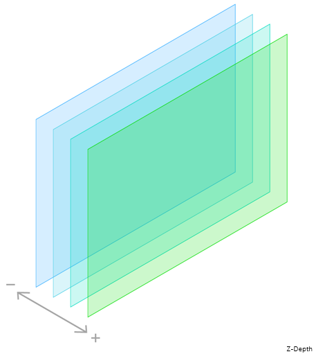

# Content as objects

 

You can manipulating the depth, or z-order, of elements to create a visual hierarchy that helps makes your app easier to use.  

> Note: This article is an early draft for a new feature of Windows 10 RS2. Feature names, terminology, and functionality are not final. 

## Why visual hierarchy is important

Users are constantly being bombarded with requests for their attention. Every element on the screen begs to be looked at, every string of text wants to be read, every button clicked. As the visual environment grows more jumbled and chaotic, it takes more effort to parse the scene and figure out what's going on.  

That's why it's so important to carefully select the elements of your user interface, and why it's important to create a layout that establishes a clear visual hierarchy among your UI elements. <!-- Every element is competing for the user's attention, and every time you add an element, you add a mental tax to the user. -->

A clear visual hierarchy tells users which elements are the most important and creates relationships between the elements. With a good visual hierarchy, users understand the layout of the page at a glance and can focus on the task they're trying to accomplish. 

  

  
So, how do you create a clear visual hierarchy? With earlier versions of Windows 10, you could use white space, position, and typography to define a visual hierarchy. 

  

  

    
    
  

With Windows 10 RS2, we literally added another dimension: depth. 

## Use depth to establish a hierarchy 

  

     
You can use depth (z-order), along with your other design tools (whitespace, position, typography) to establish a hierarchy. Elevate your most important elements to the forward-most layer; use lower layers to display less critical UI. 

    The relative importance of an element can change throughout an experience, so you can bring elements forward as they become more important and backward as they become less important. 
    

  

  

     
    
  

## How does it work?
> TODO: Brief description of how you can control the z-order of elements. To you explicitly hard-code the z-order, or is there a semantic ranking system? How do items move from one layer to another? What does the system do automatically, and what do designers/developers need to worry about? 

## The four layers of a typical app layers

A typical app has 4 layers.

  

  **Beyond background**  
  This layer lives behind the app.  When elements move to this layer, we recommend making them non-interactive. Elements at this layer has the slowest parallax and are clipped to the app window. TODO: Does this layer scale? 

Example background elements include image behind content, TODO: Example, TODO: Example.

  

  

    
    
  

  

  **Passive layer**  
  This is the base layer of the app, where UI elements live by default.  Elements move in real-time on this layer (no parallax), are clipped to the app window, and are rendered at 100% scale. 

Example elements: The app background, text, secondary UI, such as app navigation UI.

  

  

    
    
  

  

  **Calls to action**  
  This layer is for interactive items that you prioritize above passive layer elements. Elements on this layer have medium parallax and are clipped to the app window. TODO: Do elements at this layer scale or have a drop shadow?

Example elements: lists, grids, primary commands (TODO: Such as...).
 
  

  

    
    
  

  

  **Hero layer**  
  This layer is for the highest priority element on the screen at the time.  Elements on this layer can break the bounds of the app window, they can scale, and they automatically get a drop shadow.

Example elements: photographic elements, the currently selected item.
  
  

  

    
    
  

<!--
Depth is meaningful; it establishes visual and interactive hierarchy for users to efficiently complete tasks. Depth orients users in our system. 
-->

## Example: TBD
> TODO: Show how to adapt a common UI pattern to use z-ordering. We should show illustrations and code. 

## Download the code samples
>TODO: Link to samples that demonstrate this feature. 

## Related articles
* [Content basics](../basics/content-basics.md)
