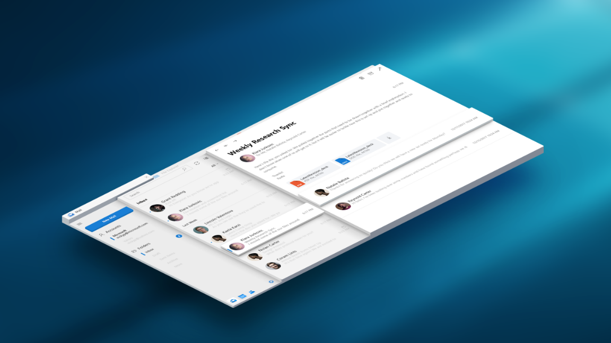
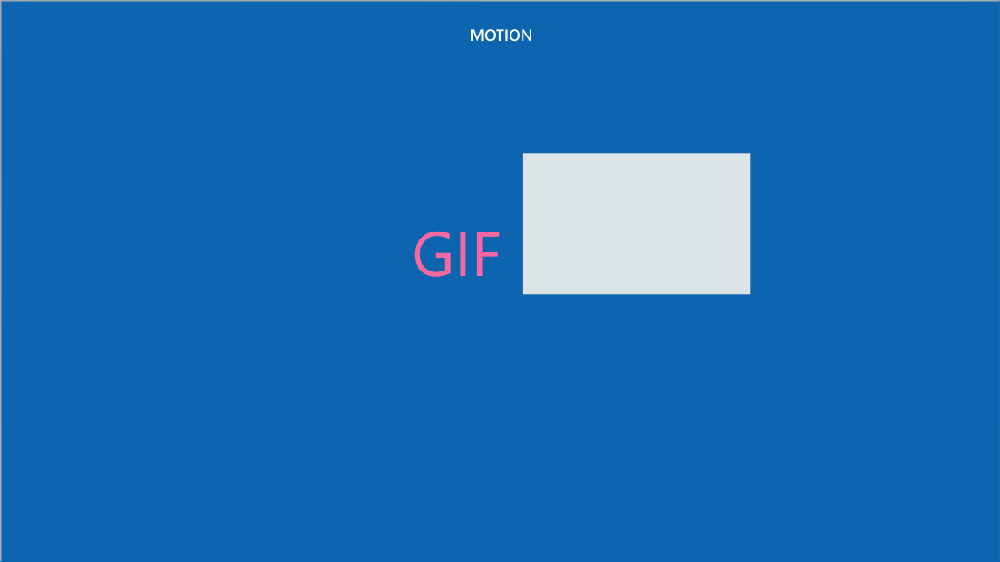
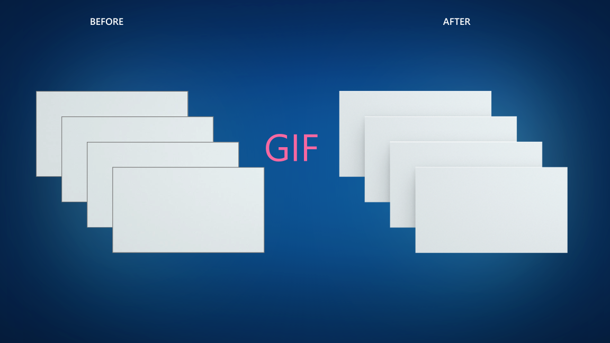
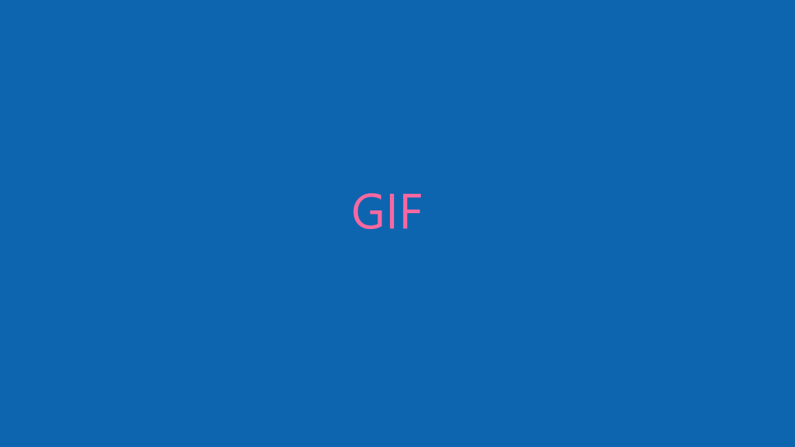
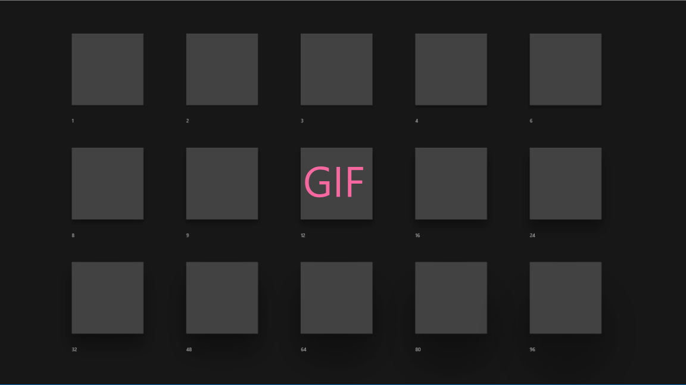

# Z-depth and shadow


The Fluent Depth System uses physical concepts like 3D positioning, light, and shadow to reinvent how digital UI can be perceived in a more layered, physical environment. Z-depth, or relative depth, and shadow are two ways to incorporate depth into your UWP app.

## What is z-depth?

Z-depth is the distance between two surfaces along the z-axis, and it illustrates how close an object is to the viewer.



### Why use z-depth?

In the physical world, we tend to focus on objects that are closer to us. We can apply this spatial instinct to digital UI, as well. For example, if you bring an element closer to the user, then the user will instinctively focus on the element. By moving UI elements closer in z-axis, you can establish visual hierarchy between objects, helping users complete tasks naturally and efficiently in your app. 


In addition to providing meaningful visual hierarchy, z-depth also allows you to create experiences that flow seamlessly from 2D to 3D environments, scaling your app across all devices and form factors. 


### How is z-depth perceived?

Based on how we perceive depth in the physical world, here are several techniques that can be used to show proximity in digital UI.

- **Scale** Farther objects appear smaller than closer objects of the same size. This is method is difficult to demonstrate effectively in 2D space, so it is not generally recommended. However, you can use scale and [shadow](#what-is-shadow) to create an effective simulation of objects moving closer to the user in 2D.

    

- **Atmosphere** Objects can appear farther away and out of focus with a “smoky” overlay or other atmospheric effect.

    

- **Motion** Relative speed can be used to demonstrate proximity: closer objects move more quickly than distant background objects. To learn how to implement this effect, see [Parallax](../motion/parallax.md).

    

### Recommendations for z-depth

Reduce the number of elevated planes to provide clear visual focus. For most scenarios, two planes is enough: one for foreground items (high proximity) and another for background items (low proximity). If you have multiple elevated items that don’t overlap, group them the same plane (i.e., foreground) to reduce the number of planes.


## What is shadow?



Shadow is a way to perceive elevation. When there is light above an elevated object, there is a shadow on the surface below. The higher the object, the larger and softer the shadow becomes. Note that elevated objects don’t need to have shadows, but shadows do indicate elevation.

In UWP apps, shadows should be purposeful, not aesthetic. If shadows detract from focus and productivity, then limit the use of shadow.

You can use shadows with either the ThemeShadow or DropShadow APIs.

## Theme shadow

The ThemeShadow property draws shadows appropriately based on x, y, z coordinates and automatically adjusts for other environmental specifications:

- Adapts to changes in lighting, user theme, app environment, and shell.
- Shadows elements automatically based on their z-depth.
- Keeps elements in sync as they move and change z-depth.
- Keeps shadows consistent throughout and across applications.

To use ThemeShadow with pop-up UI elements, give your XAML element positive z-depth with the `Translation` property. Then use the `Shadow` property to add ThemeShadow.

Here, this example uses 32px which is the typical z-depth value we recommend using to add hierarchy to popup type UI. Start with this value and if there is any collisions with another UI element that would occupy the same elevation, inclease by increments of 8px. We recommend not to exceed 96px since value greater than that would add shadow that looks greater than the shadow from UI elements occupied by application in another window and may not look very natural. 

```xaml
<Rectangle Translation="0,0,32" Shadow="ThemeShadow" />
```


Here are examples of ThemeShadow at different elevations with the light and dark themes.





### ThemeShadow in common controls

The following common controls will automatically use ThemeShadow:

- [Dialogs and flyouts](../controls-and-patterns/dialogs.md)
- [NavigationView](../controls-and-patterns/navigationview.md)
- [Context menu](../controls-and-patterns/menus.md)
- [Command bar](../controls-and-patterns/app-bars.md)
- [AutoSuggest](../controls-and-patterns/auto-suggest-box.md), [ComboBox](https://docs.microsoft.com/uwp/api/Windows.UI.Xaml.Controls.ComboBox), [Calendar/Date/Time pickers](../controls-and-patterns/date-and-time.md), [Tooltip](../controls-and-patterns/tooltips.md)

## Drop shadow

DropShadow is not automatically responsive to its environment and does not use light sources. For example implementations, see the [DropShadow Class](https://docs.microsoft.com/uwp/api/windows.ui.composition.dropshadow).

## Which shadow should I use?

| Property | ThemeShadow | DropShadow |
| - | - | - | - |
| **Min SDK** | RS5 | 14393 |
| **Adaptability** | Yes | No |
| **Customization** | No | Yes |
| **Light source** | Automatic (global by default, but can override per app) | None |
| **Supported in 3D environments** | Yes | No |

- Generally, we recommend using ThemeShadow, which adapts automatically to its environment.
- If you have more advanced scenarios for custom shadows, then use DropShadow, which allows for greater customization.
- For backwards compatibility, use DropShadow.
- For concerns about performance, limit the number of shadows, or use DropShadow.
- On HMDs in true 3D, use ThemeShadow. Since DropShadow draws at a specified offset from the visual it is parented to, from the side, it will look like it's floating in space. On the other hand, ThemeShadow is rendered on top of the visuals defined as receivers.
