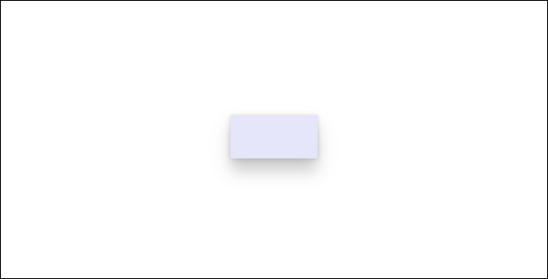

# Z-depth and shadow


Creating a visual hierarchy of elements in your UI makes the UI easy to scan and conveys what is important to focus on. Elevation, the act of bringing select elements of your UI forward, is often used to achieve such a hierarchy in software. This article discusses how to create elevation in a Windows app by using z-depth and shadow.

Z-depth is a term used amongst 3D app creators to denote the distance between two surfaces along the z-axis. It illustrates how close an object is to the viewer. Think of it as a similar concept to x/y coordinates, but in the z direction.

Windows apps use the shadow to express the depth and add visual hierarchy. To achieve this, the z-axis provides easy coding path. However please note the shadows are not displayed in true 3D sense and are emulated. This is so that we can achieve the feeling of depth without sacrificing the performance for your app's UI.

## Why use z-depth?

In the physical world, we tend to focus on objects that are closer to us. We can apply this spatial instinct to digital UI as well. For example, if you bring an element closer to the user, then the user will instinctively focus on the element. By moving UI elements closer in z-axis, you can establish visual hierarchy between objects, helping users complete tasks naturally and efficiently in your app.

## What is shadow?

Shadow is one way a user perceives elevation. Light above an elevated object creates a shadow on the surface below. The higher the object, the larger and softer the shadow becomes. Elevated objects in your UI don’t need to have shadows, but they help create the appearance of elevation.

In Windows apps, shadows should be used in a purposeful rather than aesthetic manner. Using too many shadows will decrease or eliminate the ability of the shadow to focus the user.

If you use standard controls, shadows are already incorporated into your UI. However, you can manually include shadows in your UI by using either the ThemeShadow or the DropShadow APIs. 

## ThemeShadow

The [ThemeShadow](/uwp/api/windows.ui.xaml.media.themeshadow) type can be applied to any XAML element to draw shadows appropriately based on x, y, z coordinates. As mentioned above, these are emulated shadows:

- Applies shadows to elements based on z-depth value, emulating the depth.
- Keeps shadows consistent throughout and across applications thanks for built in shadow aesthetics above.

Here is how ThemeShadow has been implemented on a MenuFlyout. MenuFlyout has a built in shadow at 32px shadow visual at all nested menus.


### ThemeShadow in common controls

The following common controls will automatically use ThemeShadow to cast shadows from 32px depth unless otherwise specified:

- [Context menu](../controls-and-patterns/menus.md), [Command bar](../controls-and-patterns/app-bars.md), [Command bar flyout](../controls-and-patterns/command-bar-flyout.md), [MenuBar](../controls-and-patterns/menus.md#create-a-menu-bar)
- [Dialogs and flyouts](../controls-and-patterns/dialogs-and-flyouts/index.md) (Dialog at 64px)
- [NavigationView](../controls-and-patterns/navigationview.md)
- [ComboBox](../controls-and-patterns/combo-box.md), [DropDownButton, SplitButton, ToggleSplitButton](../controls-and-patterns/buttons.md)
- [TeachingTip](../controls-and-patterns/dialogs-and-flyouts/teaching-tip.md)
- [AutoSuggestBox](../controls-and-patterns/auto-suggest-box.md) 
- [Calendar/Date/Time pickers](../controls-and-patterns/date-and-time.md)
- [Tooltip](../controls-and-patterns/tooltips.md) (16px)
- [Number Box](../controls-and-patterns/number-box.md)
- [TabView](../controls-and-patterns/tab-view.md)
- [Media transport control](../controls-and-patterns/media-playback.md#media-transport-controls), [InkToolbar](../controls-and-patterns/inking-controls.md)
- [BreadcrumbBar](../controls-and-patterns/breadcrumbbar.md)
- [Connected animation](../motion/connected-animation.md)

Note: ThemeShadow was updated in Windows 10 version [TODO] ??? to utilize more performant ninegrid shadow from previously used ProjectedShadow. ThemeShadow was introduced in Windows 10 version 1903 or a more recent SDK.

### ThemeShadow in Popups

It is often the case that your app's UI uses a popup for scenarios where you need user's attention and quick action. These are great examples when shadow should be used to help create hierarchy in your app's UI.

ThemeShadow automatically casts shadows when applied to any XAML element in a [Popup](/uwp/api/windows.ui.xaml.controls.primitives.popup). It will cast shadows on the app background content behind it and any other open Popups below it.

To use ThemeShadow with Popups, use the `Shadow` property to apply a ThemeShadow to a XAML element. Then, elevate the element from other elements behind it, for example by using the z component of the `Translation` property.
For most Popup UI, the recommended default elevation relative to the app background content is 32 effective pixels.

This example shows a Rectangle in a Popup casting a shadow onto the app background content and any other Popups behind it:

```xaml
<Popup>
    <Rectangle x:Name="PopupRectangle" Fill="Lavender" Height="48" Width="96">
        <Rectangle.Shadow>
            <ThemeShadow />
        </Rectangle.Shadow>
    </Rectangle>
</Popup>
```

```csharp
// Elevate the rectangle by 32px
PopupRectangle.Translation += new Vector3(0, 0, 32);
```



### Disabling default ThemeShadow on custom Flyout controls

Controls based on [Flyout](/uwp/api/Windows.UI.Xaml.Controls.flyout), [DatePickerFlyout](/uwp/api/windows.ui.xaml.controls.datepickerflyout), [MenuFlyout](/uwp/api/Windows.UI.Xaml.Controls.menuflyout) or [TimePickerFlyout](/uwp/api/windows.ui.xaml.controls.timepickerflyout) automatically use ThemeShadow to cast a shadow.

If the default shadow doesn't look correct on your control's content then you can disable it by setting the [IsDefaultShadowEnabled](/uwp/api/windows.ui.xaml.controls.flyoutpresenter.isdefaultshadowenabled) property to `false` on the associated FlyoutPresenter:

```xaml
<Flyout>
    <Flyout.FlyoutPresenterStyle>
        <Style TargetType="FlyoutPresenter">
            <Setter Property="IsDefaultShadowEnabled" Value="False" />
        </Style>
    </Flyout.FlyoutPresenterStyle>
</Flyout>
```

### ThemeShadow in other elements

[!NOTE]
Starting Cobalt, if the app targets the Cobalt SDK or greater, the Receivers collection is ignored. However there will be no errors and continues to function.

In general we encourage you to think carefully about your use of shadow and limit its use to cases where it introduces meaningful visual hierarchy. However, we do provide a way to cast a shadow from any UI element in case you have advanced scenarios that necessitate it.

To cast a shadow from a XAML element that isn't in a Popup, you must explicitly specify the other elements that can receive the shadow in the `ThemeShadow.Receivers` collection. Receivers cannot be an ancestor of the caster in the visual tree.

This example shows two Rectangles that cast shadows onto a Grid behind them:

```xaml
<Grid>
    <Grid.Resources>
        <ThemeShadow x:Name="SharedShadow" />
    </Grid.Resources>

    <Grid x:Name="BackgroundGrid" Background="{ThemeResource ApplicationPageBackgroundThemeBrush}" />

    <Rectangle x:Name="Rectangle1" Height="100" Width="100" Fill="Turquoise" Shadow="{StaticResource SharedShadow}" />

    <Rectangle x:Name="Rectangle2" Height="100" Width="100" Fill="Turquoise" Shadow="{StaticResource SharedShadow}" />
</Grid>
```

```csharp
/// Add BackgroundGrid as a shadow receiver and elevate the casting buttons above it
SharedShadow.Receivers.Add(BackgroundGrid);

Rectangle1.Translation += new Vector3(0, 0, 16);
Rectangle2.Translation += new Vector3(120, 0, 32);
```


## Drop shadow

DropShadow does not provide built in shadow values and you need to specify them yourself. For example implementations, see the [DropShadow Class](/uwp/api/windows.ui.composition.dropshadow).

[!NOTE] Starting with Cobalt, if the app targets the Cobalt SDK or greater, ThemeShadow will behave like a drop shadow. Thus if you were using DropShadow, you might consider utilizing ThemeShadow instead.

## Which shadow should I use?

| Property | ThemeShadow | DropShadow |
| - | - | - |
| **Min SDK** | Windows 10 version 1903 | 14393 |
| **Adaptability** | Yes | No |
| **Customization** | No | Yes |
| **Light source** | None | None |
| **Supported in 3D environments** | Yes* | No |
*While it works in 3D environment, the shadow are emulated.

- Keep in mind that the purpose of shadow is to provide meaningful hierarchy, not as a simple visual treatment.
- Generally, we recommend using ThemeShadow, which provides consistent shadow values.
- For concerns about performance, limit the number of shadows, use other visual treatment, or use DropShadow.
- If you have more advanced scenarios to achieve visual hierarchy, consider using other visual treatment (for example, color). If shadow is needed, then use DropShadow.
