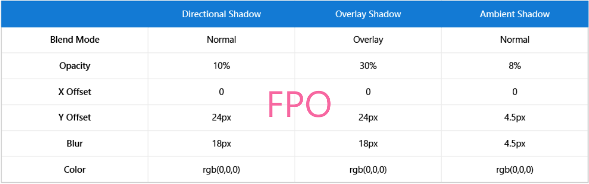
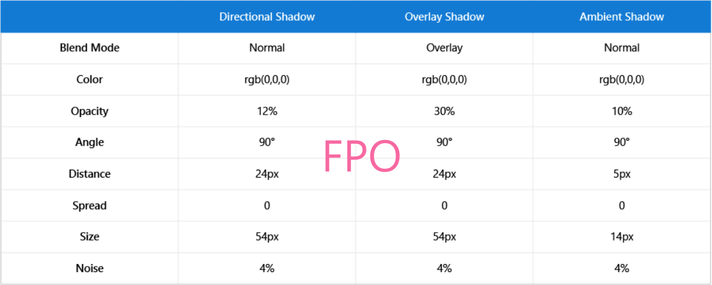

# Elevation and shadow


The Fluent Depth System uses physical concepts like 3D positioning, light, and shadow to reinvent how digital UI can be perceived in a more layered, physical environment. Elevation, or relative depth, and shadow are two ways to incorporate depth into your UWP app.

## What is elevation?

Elevation is the distance between two surfaces along the z-axis, and it illustrates how close an object is to the viewer.


### Why use elevation?

In the physical world, we tend to focus on objects that are closer to us. We can apply this spatial instinct to digital UI, as well. For example, if you bring an element into elevation, or closer to the user, then the user will instinctively focus on the element. By changing the elevation of UI elements, you can establish visual hierarchy between objects, helping users complete tasks naturally and efficiently in your app. 


In addition to providing meaningful visual hierarchy, elevation also allows you to create experiences that flow seamlessly from 2D to 3D environments, scaling your app across all devices and form factors. 


### How is elevation perceived?

Based on how we perceive depth in the physical world, here are several techniques that can be used to show elevation in digital UI.

- **Scale** Farther objects appear smaller than closer objects of the same size. This is method is difficult to demonstrate effectively in 2D space, so it is not generally recommended. However, you can use scale and [shadow](#what-is-shadow) to create an effective simulation of objects moving closer to the user in 2D.

    

- **Atmosphere** Objects can appear farther away and out of focus with a “smoky” overlay or other atmospheric effect.

    

- **Motion** Relative speed can be used to demonstrate elevation: closer objects move more quickly than distant background objects. To learn how to implement this effect, see [Parallax](../motion/parallax.md).

    

### Recommendations for elevation

Reduce the number of elevated planes to provide clear visual focus. For most scenarios, two planes is enough: one for foreground items (high elevation) and another for background items (low elevation). If you have multiple elevated items that don’t overlap, group them the same plane (i.e., foreground) to reduce the number of planes.


## What is shadow?


Shadow is another way to perceive elevation. When there is light above an elevated object, there is a shadow on the surface below. The higher the object, the larger and softer the shadow becomes. Note that elevated objects don’t need to have shadows, but shadows do indicate elevation.

In UWP apps, shadows should be purposeful, not aesthetic. If shadows detract from focus and productivity, then limit the use of shadow.

You can use shadows with either the SmartShadow or DropShadow APIs.

## Smart shadow

The SmartShadow property draws shadows appropriately based on x, y, z coordinates and automatically adjusts for other environmental specifications:

- Adapts to changes in lighting, user theme, app environment, and shell.
- Shadows elements automatically based on their elevation.
- Keeps elements in sync as they move and change elevation.
- Keeps shadows consistent throughout and across applications.

To use SmartShadow with pop-up UI elements, give your XAML element positive elevation with the `Translation` property. Then use the `Shadow` property to add SmartShadow.

```xaml
<Rectangle Translation="0,0,8" Shadow="SmartShadow" />
```


Here are examples of SmartShadow at different elevations with the light and dark themes.


### SmartShadow in common controls

The following common controls will automatically use SmartShadow:

- [Dialogs and flyouts](../controls-and-patterns/dialogs.md)
- [NavigationView](../controls-and-patterns/navigationview.md)
- [Media transport control](../controls-and-patterns/media-playback.md)
- [Context menu](../controls-and-patterns/menus.md)
- [Command bar](../controls-and-patterns/app-bars.md)
- [AutoSuggest](../controls-and-patterns/auto-suggest-box.md), [ComboBox](https://docs.microsoft.com/uwp/api/Windows.UI.Xaml.Controls.ComboBox), [Calendar/Date/Time pickers](../controls-and-patterns/date-and-time.md), [Tooltip](../controls-and-patterns/tooltips.md)
- [Access keys](../input/access-keys.md)

## Drop shadow

DropShadow is not automatically responsive to its environment and does not use light sources. For example implementations, see the [DropShadow Class](https://docs.microsoft.com/uwp/api/windows.ui.composition.dropshadow).

## Which shadow should I use?

| Property | SmartShadow | DropShadow |
| - | - | - | - |
| **Min SDK** | RS5 | 14393 |
| **Adaptability** | Yes | No |
| **Customization** | No | Yes |
| **Light source** | Automatic (global by default, but can override per app) | None |
| **Supported in 3D environments** | Yes | No |

- Generally, we recommend using SmartShadow, which adapts automatically to its environment.
- If you have more advanced scenarios for custom shadows, then use DropShadow, which allows for greater customization.
- For backwards compatibility, use DropShadow.
- For concerns about performance, limit the number of shadows, or use DropShadow.
- On HMDs in true 3D, use SmartShadow. Since DropShadow draws at a specified offset from the visual it is parented to, from the side, it will look like it's floating in space. On the other hand, SmartShadow is rendered on top of the visuals defined as receivers.

## SmartShadow values

We recommend using SmartShadow, but in some cases, you might need to use DropShadow. If you'd like to replicate how SmartShadow is created for the Nth elevation, use the following tables of values. For example, for the 8th elevation, N = 8.

> [!Warning]
> SmartShadow values are still changing.

**Adobe Illustrator**

Property | Directional  Shadow | Overlay Shadow | Ambient Shadow
- | - | - | - 
**Blend Mode** | Normal | Overlay | Normal
**Opacity** | 10% | 30% | 8%
**X Offset** | 0 | 0 | 0
**Y Offset** | N | N | N * 0.1875
**Blur** | N * 0.75 | N * 0.75 | N * 0.1875
**Color** | rgb(0,0,0) | rgb(0,0,0) | rgb(0,0,0)

**Adobe Photoshop**

Property | Directional  Shadow | Overlay Shadow | Ambient Shadow
- | - | - | - 
**Blend Mode** | Normal | Overlay | Normal
**Color** | rgb(0,0,0) | rgb(0,0,0) | rgb(0,0,0)
**Opacity** | 12% | 30% | 10%
**Angle** | 90 | 90 | 90
**Distance** | N | N | N * 0.1875
**Spread** | 0 | 0 | 0
**Size** | N * 2.25 | N * 2.25 | N * 0.5625
**Noise** | 4% | 4% | 4%

**CSS**
 
<table>
    <tr>
        <th></th>
        <th colspan="2"> Light Backgrounds </th>
        <th colspan="2"> Dark Backgrounds </th>
    </tr>
    <tr>
        <th></th>
        <th> Directional Shadow </th>
        <th> Ambient Shadow </th>
        <th> Directional Shadow </th>
        <th> Ambient Shadow </th>
    </tr>
    <tr>
        <td><b>Color</b></td>
        <td>rgb(0,0,0)</td>
        <td>rgb(0,0,0)</td>
        <td>rgb(0,0,0)</td>
        <td>rgb(0,0,0)</td>
    </tr>
    <tr>
        <td><b>Alpha</b></td>
        <td>0.15</td>
        <td>0.08</td>
        <td>0.30</td>
        <td>0.16</td>
    </tr>
    <tr>
        <td><b>X Shadow</b></td>
        <td>0</td>
        <td>0</td>
        <td>0</td>
        <td>0</td>
    </tr>
    <tr>
        <td><b>Y Shadow</b></td>
        <td>N</td>
        <td>N * 0.1875</td>
        <td>N</td>
        <td>N * 0.1875</td>
    </tr>
    <tr>
        <td><b>Blur</b></td>
        <td>N * 2.25</td>
        <td>N * 0.5625</td>
        <td>N * 2.25</td>
        <td>N * 0.5625</td>
    </tr>
    <tr>
        <td><b>CSS</b></td>
        <td colspan="2"> box-shadow: 0 [N]px [N * 2.25]px
        <br> rgba(0,0,0,0.15), 0 [N * 0.1875]px
        <br> [N * 0.5625]px rgba(0,0,0,0.08);</td>
        <td colspan="2"> box-shadow: 0 [N]px [N * 2.25]px
        <br> rgba(0,0,0,0.30), 0 [N * 0.1875]px
        <br> [N * 0.5625]px rgba(0,0,0,0.16);</td>
    </tr>
</table>