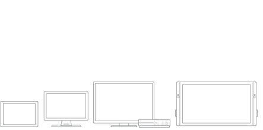
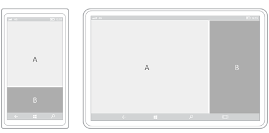

# Layout for UWP apps

These articles help you create a flexible UI that looks great on different screen sizes, window sizes, resolutions, and orientations. 

## Responsive layouts

<ul class="panelContent cardsH">
    <li>
        

            

                

                    

                        

                        
                        

                    
 
                    

                        <h3>[Screen sizes and breakpoints](screen-sizes-and-breakpoints-for-responsive-design.md)</h3>

                        The number of device targets and screen sizes across the Windows 10 ecosystem is too great to worry about optimizing your UI for each one. Instead, we recommended designing for a few key widths (also called "breakpoints"): 360, 640, 1024 and 1366 epx.

                    

                

            

        

    </li>
    <li>
        

            

                

                    

                        

                        
                        

                    

                    

                        <h3>[Responsive design techniques](responsive-design.md)</h3>

                        When you optimize your app's UI for specific screen widths, we say that you're creating a responsive design. Here are six responsive design techniques you can use to customize your app's UI.
                    

                

            

        

    </li>
</ul>

## Pages and panels

<ul class="panelContent cardsH">

    <li>
        

            

                

                    <!-- 

                        

                        
                        

                    
 -->
                    

                        <h3>[Create layouts with XAML](layouts-with-xaml.md)</h3>

                        Learn how to use XAML layout panels to make your app responsive and adaptive.
                    

                

            

        

    </li>

    <li>
        

            

                

                    <!-- 

                        

                        
                        

                    
 -->
                    

                        <h3>[Layout panels](layout-panels.md)</h3>

                        Learn about each type of layout each panel and show how to use them to layout XAML UI elements.
                    

                

            

        

    </li>    
    <li>
        

            

                

                    <!-- 

                        

                        
                        

                    
 -->
                    

                        <h3>[Create layouts with Grid and StackPanel](grid-tutorial.md)</h3>

                        Use XAML to create the layout for a simple weather app using the Grid and StackPanel elements. 
                    

                

            

        

    </li>  

    <li>
        

            

                

                    <!-- 

                        

                        
                        

                    
  -->
                    

                        <h3>[Alignment, margins, and padding](alignment-margin-padding.md)</h3>

                        In addition to dimension properties (width, height, and constraints) elements can also have alignment, margin, and padding properties that influence the layout behavior when an element goes through a layout pass and is rendered in a UI.

                    

                

            

        

    </li>

</ul>

## Windows and views

<ul class="panelContent cardsH">
    <li>
        

            

                

                    <!-- 

                        

                        
                        

                    
  -->
                    

                        <h3>[Show multiple views](show-multiple-views.md)</h3>

                        Enable users to view independent parts of your app in separate windows.

                    

                

            

        

    </li>

</ul>

## Transformations

<ul class="panelContent cardsH">
    <li>
        

            

                

                    <!-- 

                        

                        
                        

                    
  -->
                    

                        <h3>[Rotate, skew, scale, and other transforms](transforms.md)</h3>

                        Use transforms to rotate, skew, and scale elements. You can even use transforms to make 2-D content look like it's 3-D. 

                    

                

            

        

    </li>

</ul>

