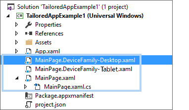
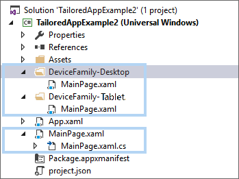

# Define page layouts with XAML


XAML gives you a flexible layout system that lets you use automatic sizing, layout panels, visual states, and even separate UI definitions to create a responsive UI. With a flexible design, you can make your app look great on screens with different app window sizes, resolutions, pixel densities, and orientations.

Here, we discuss how to use XAML properties and layout panels to make your app responsive and adaptive. We build on important info about responsive UI design and techniques found in [Introduction to UWP app design](../basics/design-and-ui-intro.md). You should understand what effective pixels are and understand each of the responsive design techniques: Reposition, Resize, Reflow, Reveal, Replace, and Re-architect.

> [!NOTE]
> Your app layout begins with the navigation model you choose, like whether to use a [**Pivot**](https://msdn.microsoft.com/library/windows/apps/xaml/windows.ui.xaml.controls.pivot.aspx) with the [‘tabs and pivot’](../controls-and-patterns/tabs-pivot.md) model or [**SplitView**](https://msdn.microsoft.com/library/windows/apps/xaml/windows.ui.xaml.controls.splitview.aspx) with the [‘nav pane’](../controls-and-patterns/navigationview.md) model. For more info about that, see [Navigation design basics for UWP apps](../basics/navigation-basics.md). Here, we talk about techniques to make the layout of a single page or group of elements responsive. This info is applicable regardless of which navigation model you choose for your app.

The XAML framework provides several levels of optimization you can use to create a responsive UI.
- **Fluid layout**
    Use layout properties and panels to make your default UI fluid.

    The foundation of a responsive layout is the appropriate use of layout properties and panels to reposition, resize, and reflow content. You can set a fixed size on an element, or use automatic sizing to let the parent layout panel size it. The various [**Panel**](https://msdn.microsoft.com/library/windows/apps/xaml/windows.ui.xaml.controls.panel.aspx) classes, such as [**Canvas**](https://msdn.microsoft.com/library/windows/apps/xaml/windows.ui.xaml.controls.canvas.aspx), [**Grid**](https://msdn.microsoft.com/library/windows/apps/xaml/windows.ui.xaml.controls.grid.aspx), [**RelativePanel**](https://msdn.microsoft.com/library/windows/apps/xaml/windows.ui.xaml.controls.relativepanel.aspx) and [**StackPanel**](https://msdn.microsoft.com/library/windows/apps/xaml/windows.ui.xaml.controls.stackpanel.aspx), provide different ways to size and position their children.

- **Adaptive layout**
    Use visual states to make significant alterations to your UI based on window size or other changes.

    When your app window grows or shrinks beyond a certain amount, you might want to alter layout properties to reposition, resize, reflow, reveal, or replace sections of your UI. You can define different visual states for your UI, and apply them when the window width or window height crosses a specified threshold. An [**AdaptiveTrigger**](https://msdn.microsoft.com/library/windows/apps/xaml/windows.ui.xaml.adaptivetrigger.aspx) provides an easy way to set the threshold (also called 'breakpoint') where a state is applied.

- **Tailored layout**
    A tailored layout is optimized for a specific device family or range of screen sizes. Within the device family, the layout should still respond and adapt to changes within the range of supported window sizes.
    > **Note**&nbsp;&nbsp; With [Continuum for Phones](http://go.microsoft.com/fwlink/p/?LinkID=699431), users can connect their phones to a monitor, mouse, and keyboard. This capability blurs the lines between phone and desktop device families.

    Approaches to tailoring include
    - Create custom trigger

    You can create a device family trigger and modify its setters, as for adaptive triggers.

    - Use separate XAML files to define distinct views for each device family.

    You can use separate XAML files with the same code file to define per-device family views of the UI.

    - Use separate XAML and code to provide different implementations for each device family.

    You can provide different implementations of a page (XAML and code), then navigate to a particular implementation based on the device family, screen size, or other factors.

## Layout properties and panels

Layout is the process of sizing and positioning objects in your UI. To position visual objects, you must put them in a panel or other container object. The XAML framework provides various panel classes, such as [**Canvas**](https://msdn.microsoft.com/library/windows/apps/xaml/windows.ui.xaml.controls.canvas.aspx), [**Grid**](https://msdn.microsoft.com/library/windows/apps/xaml/windows.ui.xaml.controls.grid.aspx), [**RelativePanel**](https://msdn.microsoft.com/library/windows/apps/xaml/windows.ui.xaml.controls.relativepanel.aspx) and [**StackPanel**](https://msdn.microsoft.com/library/windows/apps/xaml/windows.ui.xaml.controls.stackpanel.aspx), which serve as containers and enable you to position and arrange the UI elements within them.

The XAML layout system supports both static and fluid layouts. In a static layout, you give controls explicit pixel sizes and positions. When the user changes the resolution or orientation of their device, the UI doesn't change. Static layouts can become clipped across different form factors and display sizes.

Fluid layouts shrink, grow, and reflow to respond to the visual space available on a device. To create a fluid layout, use automatic or proportional sizing for elements, alignment, margins, and padding, and let layout panels position their children as needed. You arrange child elements by specifying how they should be arranged in relationship to each other, and how they should be sized relative to their content and/or their parent.

In practice, you use a combination of static and fluid elements to create your UI. You still use static elements and values in some places, but make sure that the overall UI is responsive and adapts to different resolutions, layouts, and views.

### Layout properties

To control the size and position of an element, you set its layout properties. Here are some common layout properties and their effect.

**Height and Width**

Set the [**Height**](https://msdn.microsoft.com/library/windows/apps/xaml/windows.ui.xaml.frameworkelement.height.aspx) and [**Width**](https://msdn.microsoft.com/library/windows/apps/xaml/windows.ui.xaml.frameworkelement.width.aspx) properties to specify the size of an element. You can use fixed values measured in effective pixels, or you can use auto or proportional sizing. To get the size of an element at runtime, use the [**ActualHeight**](https://msdn.microsoft.com/library/windows/apps/xaml/windows.ui.xaml.frameworkelement.actualheight.aspx) and [**ActualWidth**](https://msdn.microsoft.com/library/windows/apps/xaml/windows.ui.xaml.frameworkelement.actualwidth.aspx) properties instead of Height and Width.

You use auto sizing to let UI elements resize to fit their content or parent container. You can also use auto sizing with the rows and columns of a grid. To use auto sizing, set the Height and/or Width of UI elements to **Auto**.

> [!NOTE]
> Whether an element resizes to its content or its container depends on the value of its [**HorizontalAlignment**](https://msdn.microsoft.com/library/windows/apps/xaml/windows.ui.xaml.frameworkelement.horizontalalignment.aspx) and [**VerticalAlignment**](https://msdn.microsoft.com/library/windows/apps/xaml/windows.ui.xaml.frameworkelement.verticalalignment.aspx) properties, and how the parent container handles sizing of its children. For more info, see [Alignment]() and [Layout panels]() later in this article.

You use proportional sizing, also called *star sizing*, to distribute available space among the rows and columns of a grid by weighted proportions. In XAML, star values are expressed as \* (or *n*\* for weighted star sizing). For example, to specify that one column is 5 times wider than the second column in a 2-column layout, use "5\*" and "\*" for the [**Width**](https://msdn.microsoft.com/library/windows/apps/xaml/windows.ui.xaml.controls.columndefinition.width.aspx) properties in the [**ColumnDefinition**](https://msdn.microsoft.com/library/windows/apps/xaml/windows.ui.xaml.controls.columndefinition.aspx) elements.

This example combines fixed, auto, and proportional sizing in a [**Grid**](https://msdn.microsoft.com/library/windows/apps/xaml/windows.ui.xaml.controls.grid.aspx) with 4 columns.

&nbsp;|&nbsp;|&nbsp;
------|------|------
Column_1 | **Auto** | The column will size to fit its content.
Column_2 | * | After the Auto columns are calculated, the column gets part of the remaining width. Column_2 will be one-half as wide as Column_4.
Column_3 | **44** | The column will be 44 pixels wide.
Column_4 | **2**\* | After the Auto columns are calculated, the column gets part of the remaining width. Column_4 will be twice as wide as Column_2.

The default column width is "*", so you don't need to explicitly set this value for the second column.

```xaml
<Grid>
    <Grid.ColumnDefinitions>
        <ColumnDefinition Width="Auto"/>
        <ColumnDefinition/>
        <ColumnDefinition Width="44"/>
        <ColumnDefinition Width="2*"/>
    </Grid.ColumnDefinitions>
    <TextBlock Text="Column 1 sizes to its conent." FontSize="24"/>
</Grid>
```

In the Visual Studio XAML designer, the result looks like this.


**Size constraints**

When you use auto sizing in your UI, you might still need to place constraints on the size of an element. You can set the [**MinWidth**](https://msdn.microsoft.com/library/windows/apps/xaml/windows.ui.xaml.frameworkelement.minwidth.aspx)/[**MaxWidth**](https://msdn.microsoft.com/library/windows/apps/xaml/windows.ui.xaml.frameworkelement.maxwidth.aspx) and [**MinHeight**](https://msdn.microsoft.com/library/windows/apps/xaml/windows.ui.xaml.frameworkelement.minheight.aspx)/[**MaxHeight**](https://msdn.microsoft.com/library/windows/apps/xaml/windows.ui.xaml.frameworkelement.maxheight.aspx) properties to specify values that constrain the size of an element while allowing fluid resizing.

In a Grid, MinWidth/MaxWidth can also be used with column definitions, and MinHeight/MaxHeight can be used with row definitions.

**Alignment**

Use the [**HorizontalAlignment**](https://msdn.microsoft.com/library/windows/apps/xaml/windows.ui.xaml.frameworkelement.horizontalalignment.aspx) and [**VerticalAlignment**](https://msdn.microsoft.com/library/windows/apps/xaml/windows.ui.xaml.frameworkelement.verticalalignment.aspx) properties to specify how an element should be positioned within its parent container.
- The values for **HorizontalAlignment** are **Left**, **Center**, **Right**, and **Stretch**.
- The values for **VerticalAlignment** are **Top**, **Center**, **Bottom**, and **Stretch**.

With the **Stretch** alignment, elements fill all the space they're provided in the parent container. Stretch is the default for both alignment properties. However, some controls, like [**Button**](https://msdn.microsoft.com/library/windows/apps/xaml/windows.ui.xaml.controls.button.aspx), override this value in their default style.
Any element that can have child elements can treat the Stretch value for HorizontalAlignment and VerticalAlignment properties uniquely. For example, an element using the default Stretch values placed in a Grid stretches to fill the cell that contains it. The same element placed in a Canvas sizes to its content. For more info about how each panel handles the Stretch value, see the [Layout panels](layout-panels.md) article.

For more info, see the [Alignment, margin, and padding](alignment-margin-padding.md) article, and the [**HorizontalAlignment**](https://msdn.microsoft.com/library/windows/apps/xaml/windows.ui.xaml.frameworkelement.horizontalalignment.aspx) and [**VerticalAlignment**](https://msdn.microsoft.com/library/windows/apps/xaml/windows.ui.xaml.frameworkelement.verticalalignment.aspx) reference pages.

Controls also have [**HorizontalContentAlignment**](https://msdn.microsoft.com/library/windows/apps/xaml/windows.ui.xaml.controls.control.horizontalcontentalignment.aspx) and [**VerticalContentAlignment**](https://msdn.microsoft.com/library/windows/apps/xaml/windows.ui.xaml.controls.control.verticalcontentalignment.aspx) properties that you use to specify how they position their content. Not all controls make use of these properties. They only affect layout behavior for a control when its template uses the properties as the source of a HorizontalAlignment/VerticalAlignment value for presenters or content areas within it.

For [TextBlock](https://msdn.microsoft.com/library/windows/apps/xaml/windows.ui.xaml.controls.textblock.aspx), [TextBox](https://msdn.microsoft.com/library/windows/apps/xaml/windows.ui.xaml.controls.textbox.aspx), and [RichTextBlock](https://msdn.microsoft.com/library/windows/apps/xaml/windows.ui.xaml.controls.richtextblock.aspx), use the **TextAlignment** property to control the alignment of text in the control.

**Margins and padding**

Set the [**Margin**](https://msdn.microsoft.com/library/windows/apps/xaml/windows.ui.xaml.frameworkelement.margin.aspx) property to control the amount of empty space around an element. Margin does not add pixels to the ActualHeight and ActualWidth, and is also not considered part of the element for purposes of hit testing and sourcing input events.

Set the [**Padding**](https://msdn.microsoft.com/library/windows/apps/xaml/windows.ui.xaml.controls.control.padding.aspx) property to control the amount of space between the inner border of an element and its content. A positive Padding value decreases the content area of the element.

This diagram shows how Margin and Padding are applied to an element.


The left, right, top, and bottom values for Margin and Padding do not need to be symmetrical, and they can be set to negative values. For more info, see [Alignment, margin, and padding](alignment-margin-padding.md), and the [**Margin**](https://msdn.microsoft.com/library/windows/apps/xaml/windows.ui.xaml.frameworkelement.margin.aspx) or [**Padding**](https://msdn.microsoft.com/library/windows/apps/xaml/windows.ui.xaml.controls.control.padding.aspx) reference pages.

Let's look at the effects of Margin and Padding on real controls. Here’s a TextBox inside of a Grid with the default Margin and Padding values of 0.


Here’s the same TextBox and Grid with Margin and Padding values on the TextBox as shown in this XAML.

```xaml
<Grid BorderBrush="Blue" BorderThickness="4" Width="200">
    <TextBox Text="This is text in a TextBox." Margin="20" Padding="24,16"/>
</Grid>
```


**Visibility**

You can reveal or hide an element by setting its [**Visibility**](https://msdn.microsoft.com/library/windows/apps/xaml/windows.ui.xaml.uielement.visibility.aspx) property to one of the [**Visibility** enumeration](https://msdn.microsoft.com/library/windows/apps/xaml/windows.ui.xaml.visibility.aspx) values: **Visible** or **Collapsed**. When an element is Collapsed, it doesn't take up any space in the UI layout.

You can change an element's Visibility property in code or in a visual state. When the Visibility of an element is changed, all of its child elements are also changed. You can replace sections of your UI by revealing one panel while collapsing another.

> **Tip**&nbsp;&nbsp;When you have elements in your UI that are **Collapsed** by default, the objects are still created at startup, even though they aren't visible. You can defer loading these elements until they are shown by setting the **x:DeferLoadStrategy attribute** to "Lazy". This can improve startup performance. For more info, see [x:DeferLoadStrategy attribute](../../xaml-platform/x-deferloadstrategy-attribute.md).

### Style resources

You don't have to set each property value individually on a control. It's typically more efficient to group property values into a [**Style**](https://msdn.microsoft.com/library/windows/apps/xaml/windows.ui.xaml.style.aspx) resource and apply the Style to a control. This is especially true when you need to apply the same property values to many controls. For more info about using styles, see [Styling controls](../controls-and-patterns/xaml-styles.md).

### Layout panels

Most app content can be organized into some form of groupings or hierarchies. You use layout panels to group and arrange UI elements in your app. The main thing to consider when choosing a layout panel is how the panel positions and sizes its child elements. You might also need to consider how overlapping child elements are layered on top of each other.

Here's a comparison of the main features of the panel controls provided in the XAML framework.

Panel Control | Description
--------------|------------
[**Canvas**](https://msdn.microsoft.com/library/windows/apps/xaml/windows.ui.xaml.controls.canvas.aspx) | **Canvas** doesn’t support fluid UI; you control all aspects of positioning and sizing child elements. You typically use it for special cases like creating graphics or to define small static areas of a larger adaptive UI. You can use code or visual states to reposition elements at runtime.<li>Elements are positioned absolutely using Canvas.Top and Canvas.Left attached properties.</li><li>Layering can be explicitly specified using the Canvas.ZIndex attached property.</li><li>Stretch values for HorizontalAlignment/VerticalAlignment are ignored. If an element's size is not set explicitly, it sizes to its content.</li><li>Child content is not visually clipped if larger than the panel. </li><li>Child content is not constrained by the bounds of the panel.</li>
[**Grid**](https://msdn.microsoft.com/library/windows/apps/xaml/windows.ui.xaml.controls.grid.aspx) | **Grid** supports fluid resizing of child elements. You can use code or visual states to reposition and reflow elements.<li>Elements are arranged in rows and columns using Grid.Row and Grid.Column attached properties.</li><li>Elements can span multiple rows and columns using Grid.RowSpan and Grid.ColumnSpan attached properties.</li><li>Stretch values for HorizontalAlignment/VerticalAlignment are respected. If an element's size is not set explicitly, it stretches to fill the available space in the grid cell.</li><li>Child content is visually clipped if larger than the panel.</li><li>Content size is constrained by the bounds of the panel, so scrollable content shows scroll bars if needed.</li>
[**RelativePanel**](https://msdn.microsoft.com/library/windows/apps/xaml/windows.ui.xaml.controls.relativepanel.aspx) | <li>Elements are arranged in relation to the edge or center of the panel, and in relation to each other.</li><li>Elements are positioned using a variety of attached properties that control panel alignment, sibling alignment, and sibling position. </li><li>Stretch values for HorizontalAlignment/VerticalAlignment are ignored unless RelativePanel attached properties for alignment cause stretching (for example, an element is aligned to both the right and left edges of the panel). If an element's size is not set explicitly and it's not stretched, it sizes to its content.</li><li>Child content is visually clipped if larger than the panel.</li><li>Content size is constrained by the bounds of the panel, so scrollable content shows scroll bars if needed.</li>
[**StackPanel**](https://msdn.microsoft.com/library/windows/apps/xaml/windows.ui.xaml.controls.stackpanel.aspx) |<li>Elements are stacked in a single line either vertically or horizontally.</li><li>Stretch values for HorizontalAlignment/VerticalAlignment are respected in the direction opposite the Orientation property. If an element's size is not set explicitly, it stretches to fill the available width (or height if the Orientation is Horizontal). In the direction specified by the Orientation property, an element sizes to its content.</li><li>Child content is visually clipped if larger than the panel.</li><li>Content size is not constrained by the bounds of the panel in the direction specified by the Orientation property, so scrollable content stretches beyond the panel bounds and doesn't show scrollbars. You must explicitly constrain the height (or width) of the child content to make its scrollbars show.</li>
[**VariableSizedWrapGrid**](https://msdn.microsoft.com/library/windows/apps/xaml/windows.ui.xaml.controls.variablesizedwrapgrid.aspx) |<li>Elements are arranged in rows or columns that automatically wrap to a new row or column when the MaximumRowsOrColumns value is reached.</li><li>Whether elements are arranged in rows or columns is specified by the Orientation property.</li><li>Elements can span multiple rows and columns using VariableSizedWrapGrid.RowSpan and VariableSizedWrapGrid.ColumnSpan attached properties.</li><li>Stretch values for HorizontalAlignment/VerticalAlignment are ignored. Elements are sized as specified by the ItemHeight and ItemWidth properties. If these properties are not set, the item in the first cell sizes to its content, and all other cells inherit this size.</li><li>Child content is visually clipped if larger than the panel.</li><li>Content size is constrained by the bounds of the panel, so scrollable content shows scroll bars if needed.</li>

For detailed information and examples of these panels, see [Layout panels](layout-panels.md). Also, see the [Responsive techniques sample](http://go.microsoft.com/fwlink/p/?LinkId=620024).

Layout panels let you organize your UI into logical groups of controls. When you use them with appropriate property settings, you get some support for automatic resizing, repositioning, and reflowing of UI elements. However, most UI layouts need further modification when there are significant changes to the window size. For this, you can use visual states.

## Visual states and state triggers

Use visual states to reposition, resize, reflow, reveal, or replace sections of your UI based on screen size or other factors. A [**VisualState**](https://msdn.microsoft.com/library/windows/apps/xaml/windows.ui.xaml.visualstate.aspx) defines property values that are applied to an element when it’s in a particular state. You group visual states in a [**VisualStateManager**](https://msdn.microsoft.com/library/windows/apps/xaml/windows.ui.xaml.visualstatemanager.aspx) that applies the appropriate VisualState when the specified conditions are met.

### Set visual states in code

To apply a visual state from code, you call the [**VisualStateManager.GoToState**](https://msdn.microsoft.com/library/windows/apps/xaml/windows.ui.xaml.visualstatemanager.gotostate.aspx) method. For example, to apply a state when the app window is a particular size, handle the [**SizeChanged**](https://msdn.microsoft.com/library/windows/apps/xaml/windows.ui.xaml.window.sizechanged.aspx) event and call **GoToState** to apply the appropriate state.

Here, a [**VisualStateGroup**](https://msdn.microsoft.com/library/windows/apps/xaml/windows.ui.xaml.visualstategroup.aspx) contains 2 VisualState definitions. The first, `DefaultState`, is empty. When it's applied, the values defined in the XAML page are applied. The second, `WideState`, changes the [**DisplayMode**](https://msdn.microsoft.com/library/windows/apps/xaml/windows.ui.xaml.controls.splitview.displaymode.aspx) property of the [**SplitView**](https://msdn.microsoft.com/library/windows/apps/xaml/windows.ui.xaml.controls.splitview.aspx) to **Inline** and opens the pane. This state is applied in the SizeChanged event handler if the window width is 720 effective pixels or greater.

```xaml
<Page ...>
    <Grid>
        <VisualStateManager.VisualStateGroups>
            <VisualStateGroup>
                <VisualState x:Name="DefaultState">
                        <Storyboard>
                        </Storyboard>
                    </VisualState>

                <VisualState x:Name="WideState">
                    <Storyboard>
                        <ObjectAnimationUsingKeyFrames
                            Storyboard.TargetProperty="SplitView.DisplayMode"
                            Storyboard.TargetName="mySplitView">
                            <DiscreteObjectKeyFrame KeyTime="0">
                                <DiscreteObjectKeyFrame.Value>
                                    <SplitViewDisplayMode>Inline</SplitViewDisplayMode>
                                </DiscreteObjectKeyFrame.Value>
                            </DiscreteObjectKeyFrame>
                        </ObjectAnimationUsingKeyFrames>
                        <ObjectAnimationUsingKeyFrames
                            Storyboard.TargetProperty="SplitView.IsPaneOpen"
                            Storyboard.TargetName="mySplitView">
                            <DiscreteObjectKeyFrame KeyTime="0" Value="True"/>
                        </ObjectAnimationUsingKeyFrames>
                    </Storyboard>
                </VisualState>
            </VisualStateGroup>
        </VisualStateManager.VisualStateGroups>

        <SplitView x:Name="mySplitView" DisplayMode="CompactInline"
                   IsPaneOpen="False" CompactPaneLength="20">
            <!-- SplitView content -->

            <SplitView.Pane>
                <!-- Pane content -->
            </SplitView.Pane>
        </SplitView>
    </Grid>
</Page>
```

```csharp
private void CurrentWindow_SizeChanged(object sender, Windows.UI.Core.WindowSizeChangedEventArgs e)
{
    if (e.Size.Width >= 720)
        VisualStateManager.GoToState(this, "WideState", false);
    else
        VisualStateManager.GoToState(this, "DefaultState", false);
}
```

### Set visual states in XAML markup

Prior to Windows 10, VisualState definitions required [**Storyboard**](https://msdn.microsoft.com/library/windows/apps/xaml/windows.ui.xaml.media.animation.storyboard.aspx) objects for property changes, and you had to call **GoToState** in code to apply the state. This is shown in the previous example. You will still see many examples that use this syntax, or you might have existing code that uses it.

Starting in Windows 10, you can use the simplified [**Setter**](https://msdn.microsoft.com/library/windows/apps/xaml/windows.ui.xaml.setter.aspx) syntax shown here, and you can use a [**StateTrigger**](https://msdn.microsoft.com/library/windows/apps/xaml/windows.ui.xaml.statetrigger.aspx) in your XAML markup to apply the state. You use state triggers to create simple rules that automatically trigger visual state changes in response to an app event.

This example does the same thing as the previous example, but uses the simplified **Setter** syntax instead of a Storyboard to define property changes. And instead of calling GoToState, it uses the built in [**AdaptiveTrigger**](https://msdn.microsoft.com/library/windows/apps/xaml/windows.ui.xaml.adaptivetrigger.aspx) state trigger to apply the state. When you use state triggers, you don't need to define an empty `DefaultState`. The default settings are reapplied automatically when the conditions of the state trigger are no longer met.

```xaml
<Page ...>
    <Grid>
        <VisualStateManager.VisualStateGroups>
            <VisualStateGroup>
                <VisualState>
                    <VisualState.StateTriggers>
                        <!-- VisualState to be triggered when the
                             window width is >=720 effective pixels. -->
                        <AdaptiveTrigger MinWindowWidth="720" />
                    </VisualState.StateTriggers>

                    <VisualState.Setters>
                        <Setter Target="mySplitView.DisplayMode" Value="Inline"/>
                        <Setter Target="mySplitView.IsPaneOpen" Value="True"/>
                    </VisualState.Setters>
                </VisualState>
            </VisualStateGroup>
        </VisualStateManager.VisualStateGroups>

        <SplitView x:Name="mySplitView" DisplayMode="CompactInline"
                   IsPaneOpen="False" CompactPaneLength="20">
            <!-- SplitView content -->

            <SplitView.Pane>
                <!-- Pane content -->
            </SplitView.Pane>
        </SplitView>
    </Grid>
</Page>
```

> **Important**&nbsp;&nbsp;In the previous example, the VisualStateManager.VisualStateGroups attached property is set on the **Grid** element. When you use StateTriggers, always ensure that VisualStateGroups is attached to the first child of the root in order for the triggers to take effect automatically. (Here, **Grid** is the first child of the root **Page** element.)

### Attached property syntax

In a VisualState, you typically set a value for a control property, or for one of the attached properties of the panel that contains the control. When you set an attached property, use parentheses around the attached property name.

This example shows how to set the [**RelativePanel.AlignHorizontalCenterWithPanel**](https://msdn.microsoft.com/library/windows/apps/xaml/windows.ui.xaml.controls.relativepanel.alignhorizontalcenterwithpanel.aspx) attached property on a TextBox named `myTextBox`. The first XAML uses [**ObjectAnimationUsingKeyFrames**](https://msdn.microsoft.com/library/windows/apps/xaml/windows.ui.xaml.media.animation.objectanimationusingkeyframes.aspx) syntax and the second uses **Setter** syntax.

```xaml
<!-- Set an attached property using ObjectAnimationUsingKeyFrames. -->
<ObjectAnimationUsingKeyFrames
    Storyboard.TargetProperty="(RelativePanel.AlignHorizontalCenterWithPanel)"
    Storyboard.TargetName="myTextBox">
    <DiscreteObjectKeyFrame KeyTime="0" Value="True"/>
</ObjectAnimationUsingKeyFrames>

<!-- Set an attached property using Setter. -->
<Setter Target="myTextBox.(RelativePanel.AlignHorizontalCenterWithPanel)" Value="True"/>
```

### Custom state triggers

You can extend the [**StateTrigger**](https://msdn.microsoft.com/library/windows/apps/xaml/windows.ui.xaml.statetrigger.aspx) class to create custom triggers for a wide range of scenarios. For example, you can create a StateTrigger to trigger different states based on input type, then increase the margins around a control when the input type is touch. Or create a StateTrigger to apply different states based on the device family the app is run on. For examples of how to build custom triggers and use them to create optimized UI experiences from within a single XAML view, see the [State triggers sample](http://go.microsoft.com/fwlink/p/?LinkId=620025).

### Visual states and styles

You can use Style resources in visual states to apply a set of property changes to multiple controls. For more info about using styles, see [Styling controls](../controls-and-patterns/xaml-styles.md).

In this simplified XAML from the State triggers sample, a Style resource is applied to a Button to adjust the size and margins for mouse or touch input. For the complete code and the definition of the custom state trigger, see the [State triggers sample](http://go.microsoft.com/fwlink/p/?LinkId=620025).

```xaml
<Page ... >
    <Page.Resources>
        <!-- Styles to be used for mouse vs. touch/pen hit targets -->
        <Style x:Key="MouseStyle" TargetType="Rectangle">
            <Setter Property="Margin" Value="5" />
            <Setter Property="Height" Value="20" />
            <Setter Property="Width" Value="20" />
        </Style>
        <Style x:Key="TouchPenStyle" TargetType="Rectangle">
            <Setter Property="Margin" Value="15" />
            <Setter Property="Height" Value="40" />
            <Setter Property="Width" Value="40" />
        </Style>
    </Page.Resources>

    <RelativePanel>
        <!-- ... -->
        <Button Content="Color Palette Button" x:Name="MenuButton">
            <Button.Flyout>
                <Flyout Placement="Bottom">
                    <RelativePanel>
                        <Rectangle Name="BlueRect" Fill="Blue"/>
                        <Rectangle Name="GreenRect" Fill="Green" RelativePanel.RightOf="BlueRect" />
                        <!-- ... -->
                    </RelativePanel>
                </Flyout>
            </Button.Flyout>
        </Button>
        <!-- ... -->
    </RelativePanel>
    <VisualStateManager.VisualStateGroups>
        <VisualStateGroup x:Name="InputTypeStates">
            <!-- Second set of VisualStates for building responsive UI optimized for input type.
                 Take a look at InputTypeTrigger.cs class in CustomTriggers folder to see how this is implemented. -->
            <VisualState>
                <VisualState.StateTriggers>
                    <!-- This trigger indicates that this VisualState is to be applied when MenuButton is invoked using a mouse. -->
                    <triggers:InputTypeTrigger TargetElement="{x:Bind MenuButton}" PointerType="Mouse" />
                </VisualState.StateTriggers>
                <VisualState.Setters>
                    <Setter Target="BlueRect.Style" Value="{StaticResource MouseStyle}" />
                    <Setter Target="GreenRect.Style" Value="{StaticResource MouseStyle}" />
                    <!-- ... -->
                </VisualState.Setters>
            </VisualState>
            <VisualState>
                <VisualState.StateTriggers>
                    <!-- Multiple trigger statements can be declared in the following way to imply OR usage.
                         For example, the following statements indicate that this VisualState is to be applied when MenuButton is invoked using Touch OR Pen.-->
                    <triggers:InputTypeTrigger TargetElement="{x:Bind MenuButton}" PointerType="Touch" />
                    <triggers:InputTypeTrigger TargetElement="{x:Bind MenuButton}" PointerType="Pen" />
                </VisualState.StateTriggers>
                <VisualState.Setters>
                    <Setter Target="BlueRect.Style" Value="{StaticResource TouchPenStyle}" />
                    <Setter Target="GreenRect.Style" Value="{StaticResource TouchPenStyle}" />
                    <!-- ... -->
                </VisualState.Setters>
            </VisualState>
        </VisualStateGroup>
    </VisualStateManager.VisualStateGroups>
</Page>
```

## Tailored layouts

When you make significant changes to your UI layout on different devices, you might find it more convenient to define a separate UI file with a layout tailored to the device, rather than adapting a single UI. If the functionality is the same across devices, you can define separate XAML views that share the same code file. If both the view and the functionality differ significantly across devices, you can define separate Pages, and choose which Page to navigate to when the app is loaded.

### Separate XAML views per device family

Use XAML views to create different UI definitions that share the same code-behind. You can provide a unique UI definition for each device family. Follow these steps to add a XAML view to your app.

**To add a XAML view to an app**
1. Select Project > Add New Item. The Add New Item dialog box opens.
    > **Tip**&nbsp;&nbsp;Make sure a folder or the project, and not the solution, is selected in Solution Explorer.
2. Under Visual C# or Visual Basic in the left pane, pick the XAML template type.
3. In the center pane, pick XAML View.
4. Enter the name for the view. The view must be named correctly. For more info on naming, see the remainder of this section.
5. Click Add. The file is added to the project.

The previous steps create only a XAML file, but not an associated code-behind file. Instead, the XAML view is associated with an existing code-behind file using a "DeviceName" qualifier that's part of the file or folder name. This qualifier name can be mapped to a string value that represents the device family of the device that your app is currently running on, such as, "Desktop", "Mobile", and the names of the other device families (see [**ResourceContext.QualifierValues**](https://msdn.microsoft.com/library/windows/apps/xaml/windows.applicationmodel.resources.core.resourcecontext.qualifiervalues.aspx)).

You can add the qualifier to the file name, or add the file to a folder that has the qualifier name.

**Use file name**

To use the qualifier name with the file, use this format: *[pageName]*.DeviceFamily-*[qualifierString]*.xaml.

Let's look at an example for a file named MainPage.xaml. To create a view for mobile devices, name the XAML view MainPage.DeviceFamily-Mobile.xaml. To create a view for PC devices, name the view MainPage.DeviceFamily-Desktop.xaml. Here's what the solution looks like in Microsoft Visual Studio.



**Use folder name**

To organize the views in your Visual Studio project using folders, you can use the qualifier name with the folder. To do so, name your folder like this: DeviceFamily-*[qualifierString]*. In this case, each XAML view file has the same name. Don't include the qualifier in the file name.

Here's an example, again for a file named MainPage.xaml. To create a view for mobile devices, create a folder named "DeviceFamily-Mobile", and place a XAML view named MainPage.xaml into it. To create a view for PC devices, create a folder named "DeviceFamily-Desktop", and place another XAML view named MainPage.xaml into it. Here's what the solution looks like in Visual Studio.



In both cases, a unique view is used for mobile and PC devices. The default MainPage.xaml file is used if the device it's running on doesn't match any of the device family specific views.

### Separate XAML pages per device family

To provide unique views and functionality, you can create separate Page files (XAML and code), and then navigate to the appropriate page when the page is needed.

**To add a XAML page to an app**
1. Select Project > Add New Item. The Add New Item dialog box opens.
    > **Tip**&nbsp;&nbsp;Make sure the project, and not the solution, is selected in Solution Explorer.
2. Under Visual C# or Visual Basic in the left pane, pick the XAML template type.
3. In the center pane, pick Blank page.
4. Enter the name for the page. For example, "MainPage_Mobile". Both a MainPage_Mobile.xaml and MainPage_Mobile.xaml.cs/vb/cpp code file are created.
5. Click Add. The file is added to the project.

At runtime, check the device family that the app is running on, and navigate to the correct page like this.

```csharp
if (Windows.System.Profile.AnalyticsInfo.VersionInfo.DeviceFamily == "Windows.Mobile")
{
    rootFrame.Navigate(typeof(MainPage_Mobile), e.Arguments);
}
else
{
    rootFrame.Navigate(typeof(MainPage), e.Arguments);
}
```

You can also use different criteria to determine which page to navigate to. For more examples, see the [Tailored multiple views sample](http://go.microsoft.com/fwlink/p/?LinkId=620636), which uses the [**GetIntegratedDisplaySize**](https://msdn.microsoft.com/library/windows/apps/xaml/dn904185.aspx) function to check the physical size of an integrated display.

## Sample code
*   [XAML UI basics sample](https://github.com/Microsoft/Windows-universal-samples/blob/master/Samples/XamlUIBasics)<br/>
    See all of the XAML controls in an interactive format.