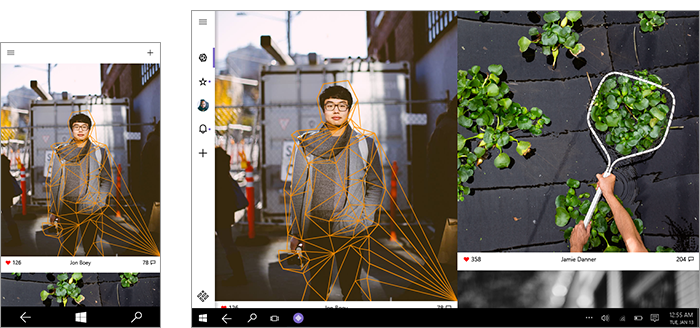
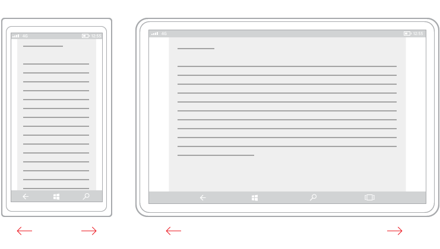
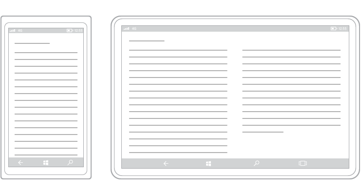
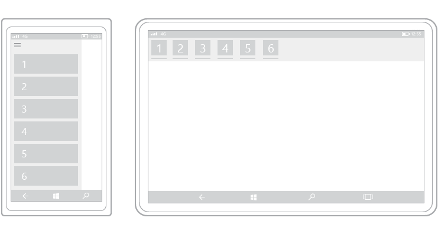
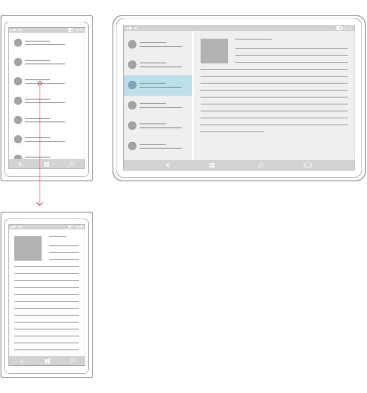

# Responsive design techniquess

When you optimize your app's UI for specific screen widths, we say that you're creating a responsive design. Here are six responsive design techniques you can use to customize your app's UI.

## Reposition

You can alter the location and position of app UI elements to get the most out of each device. In this example, the portrait view on phone or phablet necessitates a scrolling UI because only one full frame is visible at a time. When the app translates to a device that allows two full on-screen frames, whether in portrait or landscape orientation, frame B can occupy a dedicated space. If you're using a grid for positioning, you can stick to the same grid when UI elements are repositioned.

In this example design for a photo app, the photo app repositions its content on larger screens.

## Resize

You can optimize the frame size by adjusting the margins and size of UI elements. This could allow you, as the example here shows, to augment the reading experience on a larger screen by simply growing the content frame.

## Reflow

By changing the flow of UI elements based on device and orientation, your app can offer an optimal display of content. For instance, when going to a larger screen, it might make sense to switch larger containers, add columns, and generate list items in a different way.

This example shows how a single column of vertically scrolling content on phone or phablet can be reflowed on a larger screen to display two columns of text.

## Show/hide

You can show or hide UI elements based on screen real estate, or when the device supports additional functionality, specific situations, or preferred screen orientations.

In this example with tabs, the middle tab with the camera icon might be specific to the app on phone or phablet and not be applicable on larger devices, which is why it's revealed in the device on the right. Another common example of revealing or hiding UI applies to media player controls, where the button set is reduced on smaller devices and expanded on larger devices. The media player on PC, for instance, can handle far more on-screen functionality than it can on a phone.

Part of the reveal-or-hide technique includes choosing when to display more metadata. When real estate is at a premium, such as with a phone or phablet, it's best to show a minimal amount of metadata. With a laptop or desktop PC, a significant amount of metadata can be surfaced. Some examples of how to handle showing or hiding metadata include:

-   In an email app, you can display the user's avatar.
-   In a music app, you can display more info about an album or artist.
-   In a video app, you can display more info about a film or a show, such as showing cast and crew details.
-   In any app, you can break apart columns and reveal more details.
-   In any app, you can take something that's vertically stacked and lay it out horizontally. When going from phone or phablet to larger devices, stacked list items can change to reveal rows of list items and columns of metadata.

## Replace

This technique lets you switch the user interface for a specific device size-class or orientation. In this example, the nav pane and its compact, transient UI works well for a smaller device, but on a larger device tabs might be a better choice.

##  Re-architect

You can collapse or fork the architecture of your app to better target specific devices. In this example, going from the left device to the right device demonstrates the joining of pages.

Here's an example of this technique applied to the design for a smart home app.

## Tailoring your app for specific devices and screen sizes.

UWP apps use effective pixels to guarantee that your design elements will be legible and usable on all Windows-powered devices. So, why would you ever want to customize your app's UI for a specific device family?

> [!NOTE] 
> Before we go any further, Windows doesn't provide a way for your app to detect the specific device your app is running on. It can tell you the device family (mobile, desktop, etc) the app is running on, the effective resolution, and the amount of screen space available to the app (the size of the app's window).

-   **To make the most effective use of space and reduce the need to navigate**

    If you design an app to look good on a device that has a small screen, such as a phone, the app will be usable on a PC with a much bigger display, but there will probably be some wasted space. You can customize the app to display more content when the screen is above a certain size. For example, a shopping app might display one merchandise category at a time on a phone, but show multiple categories and products simultaneously on a PC or laptop.

    By putting more content on the screen, you reduce the amount of navigation that the user needs to perform.

-   **To take advantage of devices' capabilities**

    Certain devices are more likely to have certain device capabilities. For example, phones are likely to have a location sensor and a camera, while a PC might not have either. Your app can detect which capabilities are available and enable features that use them.

-   **To optimize for input**

    The universal control library works with all input types (touch, pen, keyboard, mouse), but you can still optimize for certain input types by re-arranging your UI elements. For example, if you place navigation elements at the bottom of the screen, they'll be easier for phone users to access—but most PC users expect to see navigation elements toward the top of the screen.
