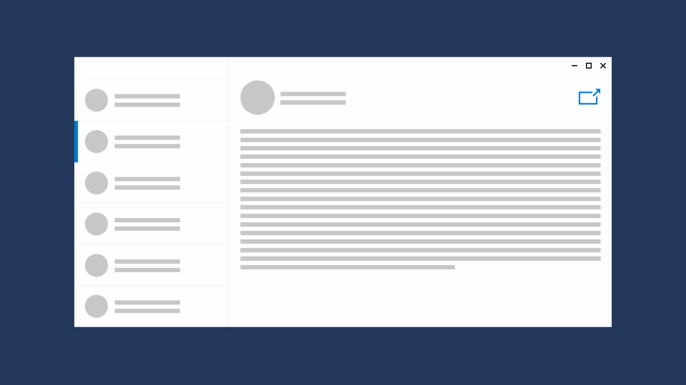

# Show multiple views for an app



Help your users be more productive by letting them view independent parts of your app in separate windows. When you create multiple windows for an app, each window behaves independently. The taskbar shows each window separately. Users can move, resize, show, and hide app windows independently and can switch between app windows as if they were separate apps. Each window operates in its own thread.

> **Important APIs**: [**ApplicationViewSwitcher**](https://msdn.microsoft.com/library/windows/apps/dn281094), [**CreateNewView**](https://msdn.microsoft.com/library/windows/apps/dn297278)

## When should an app use multiple views?
There's a variety of scenarios that can benefit from multiple views. Here are a few examples:
 - An email app that lets users view a list of received messages while composing a new email
 - An address book app that lets users compare contact info for multiple people side-by-side
 - A music player app that lets users see what's playing while browsing through a list of other available music
 - A note-taking app that lets users copy information from one page of notes to another
 - A reading app that lets users open several articles for reading later, after an opportunity to peruse all high-level headlines

To create separate instances of your app, see [Create a multi-instance UWP app](../../launch-resume/multi-instance-uwp.md).

## What is a view?

An app view is the 1:1 pairing of a thread and a window that the app uses to display content. It's represented by a [**Windows.ApplicationModel.Core.CoreApplicationView**](https://msdn.microsoft.com/library/windows/apps/br225017) object.

Views are managed by the [**CoreApplication**](https://msdn.microsoft.com/library/windows/apps/br225016) object. You call [**CoreApplication.CreateNewView**](https://msdn.microsoft.com/library/windows/apps/dn297278) to create a [**CoreApplicationView**](https://msdn.microsoft.com/library/windows/apps/br225017) object. The **CoreApplicationView** brings together a [**CoreWindow**](https://msdn.microsoft.com/library/windows/apps/br208225) and a [**CoreDispatcher**](https://msdn.microsoft.com/library/windows/apps/br208211) (stored in the [**CoreWindow**](https://msdn.microsoft.com/library/windows/apps/br225019) and [**Dispatcher**](https://msdn.microsoft.com/library/windows/apps/dn433264) properties). You can think of the **CoreApplicationView** as the object that the Windows Runtime uses to interact with the core Windows system.

You typically don’t work directly with the [**CoreApplicationView**](https://msdn.microsoft.com/library/windows/apps/br225017). Instead, the Windows Runtime provides the [**ApplicationView**](https://msdn.microsoft.com/library/windows/apps/hh701658) class in the [**Windows.UI.ViewManagement**](https://msdn.microsoft.com/library/windows/apps/br242295) namespace. This class provides properties, methods, and events that you use when your app interacts with the windowing system. To work with an **ApplicationView**, call the static [**ApplicationView.GetForCurrentView**](https://msdn.microsoft.com/library/windows/apps/hh701672) method, which gets an **ApplicationView** instance tied to the current **CoreApplicationView**’s thread.

Likewise, the XAML framework wraps the [**CoreWindow**](https://msdn.microsoft.com/library/windows/apps/br208225) object in a [**Windows.UI.XAML.Window**](https://msdn.microsoft.com/library/windows/apps/br209041) object. In a XAML app, you typically interact with the **Window** object rather than working directly with the **CoreWindow**.

## Show a new view

While each app layout is unique, we recommend including a "new window" button in a predictable location, such as the top right corner of the content that can be opened in a new window. Also consider including a context menu option to "Open in a new window".

Let's look at the steps to create a new view. Here, the new view is launched in response to a button click.

```csharp
private async void Button_Click(object sender, RoutedEventArgs e)
{
    CoreApplicationView newView = CoreApplication.CreateNewView();
    int newViewId = 0;
    await newView.Dispatcher.RunAsync(CoreDispatcherPriority.Normal, () =>
    {
        Frame frame = new Frame();
        frame.Navigate(typeof(SecondaryPage), null);   
        Window.Current.Content = frame;
        // You have to activate the window in order to show it later.
        Window.Current.Activate();

        newViewId = ApplicationView.GetForCurrentView().Id;
    });
    bool viewShown = await ApplicationViewSwitcher.TryShowAsStandaloneAsync(newViewId);
}
```

**To show a new view**

1.  Call [**CoreApplication.CreateNewView**](https://msdn.microsoft.com/library/windows/apps/dn297291) to create a new window and thread for the view content.

    ```csharp
    CoreApplicationView newView = CoreApplication.CreateNewView();
    ```

2.  Track the [**Id**](https://msdn.microsoft.com/library/windows/apps/dn281120) of the new view. You use this to show the view later.

    You might want to consider building some infrastructure into your app to help with tracking the views you create. See the `ViewLifetimeControl` class in the [MultipleViews sample](http://go.microsoft.com/fwlink/p/?LinkId=620574) for an example.

    ```csharp
    int newViewId = 0;
    ```

3.  On the new thread, populate the window.

    You use the [**CoreDispatcher.RunAsync**](https://msdn.microsoft.com/library/windows/apps/hh750317) method to schedule work on the UI thread for the new view. You use a [lambda expression](http://go.microsoft.com/fwlink/p/?LinkId=389615) to pass a function as an argument to the **RunAsync** method. The work you do in the lambda function happens on the new view's thread.

    In XAML, you typically add a [**Frame**](https://msdn.microsoft.com/library/windows/apps/br242682) to the [**Window**](https://msdn.microsoft.com/library/windows/apps/br209041)'s [**Content**](https://msdn.microsoft.com/library/windows/apps/br209051) property, then navigate the **Frame** to a XAML [**Page**](https://msdn.microsoft.com/library/windows/apps/br227503) where you've defined your app content. For more info, see [Peer-to-peer navigation between two pages](../basics/navigate-between-two-pages.md).

    After the new [**Window**](https://msdn.microsoft.com/library/windows/apps/br209041) is populated, you must call the **Window**'s [**Activate**](https://msdn.microsoft.com/library/windows/apps/br209046) method in order to show the **Window** later. This work happens on the new view's thread, so the new **Window** is activated.

    Finally, get the new view's [**Id**](https://msdn.microsoft.com/library/windows/apps/dn281120) that you use to show the view later. Again, this work is on the new view's thread, so [**ApplicationView.GetForCurrentView**](https://msdn.microsoft.com/library/windows/apps/hh701672) gets the **Id** of the new view.

    ```csharp
    await newView.Dispatcher.RunAsync(CoreDispatcherPriority.Normal, () =>
    {
        Frame frame = new Frame();
        frame.Navigate(typeof(SecondaryPage), null);   
        Window.Current.Content = frame;
        // You have to activate the window in order to show it later.
        Window.Current.Activate();

        newViewId = ApplicationView.GetForCurrentView().Id;
    });
    ```

4.  Show the new view by calling [**ApplicationViewSwitcher.TryShowAsStandaloneAsync**](https://msdn.microsoft.com/library/windows/apps/dn281101).

    After you create a new view, you can show it in a new window by calling the [**ApplicationViewSwitcher.TryShowAsStandaloneAsync**](https://msdn.microsoft.com/library/windows/apps/dn281101) method. The *viewId* parameter for this method is an integer that uniquely identifies each of the views in your app. You retrieve the view [**Id**](https://msdn.microsoft.com/library/windows/apps/dn281120) by using either the **ApplicationView.Id** property or the [**ApplicationView.GetApplicationViewIdForWindow**](https://msdn.microsoft.com/library/windows/apps/dn281109) method.

    ```csharp
    bool viewShown = await ApplicationViewSwitcher.TryShowAsStandaloneAsync(newViewId);
    ```

## The main view


The first view that’s created when your app starts is called the *main view*. This view is stored in the [**CoreApplication.MainView**](https://msdn.microsoft.com/library/windows/apps/hh700465) property, and its [**IsMain**](https://msdn.microsoft.com/library/windows/apps/hh700452) property is true. You don’t create this view; it’s created by the app. The main view's thread serves as the manager for the app, and all app activation events are delivered on this thread.

If secondary views are open, the main view’s window can be hidden – for example, by clicking the close (x) button in the window title bar - but its thread remains active. Calling [**Close**](https://msdn.microsoft.com/library/windows/apps/br209049) on the main view’s [**Window**](https://msdn.microsoft.com/library/windows/apps/br209041) causes an **InvalidOperationException** to occur. (Use [**Application.Exit**](https://msdn.microsoft.com/library/windows/apps/br242327) to close your app.) If the main view’s thread is terminated, the app closes.

## Secondary views


Other views, including all views that you create by calling [**CreateNewView**](https://msdn.microsoft.com/library/windows/apps/dn297278) in your app code, are secondary views. Both the main view and secondary views are stored in the [**CoreApplication.Views**](https://msdn.microsoft.com/library/windows/apps/br205861) collection. Typically, you create secondary views in response to a user action. In some instances, the system creates secondary views for your app.

> [!NOTE]
> You can use the Windows *assigned access* feature to run an app in [kiosk mode](https://technet.microsoft.com/library/mt219050.aspx). When you do this, the system creates a secondary view to present your app UI above the lock screen. App-created secondary views are not allowed, so if you try to show your own secondary view in kiosk mode, an exception is thrown.

## Switch from one view to another

Consider providing a way for the user to navigate from a secondary window back to its parent window. To do this, use the [**ApplicationViewSwitcher.SwitchAsync**](https://msdn.microsoft.com/library/windows/apps/dn281097) method. You call this method from the thread of the window you're switching from and pass the view ID of the window you're switching to.

```csharp
await ApplicationViewSwitcher.SwitchAsync(viewIdToShow);
```

When you use [**SwitchAsync**](https://msdn.microsoft.com/library/windows/apps/dn281097), you can choose if you want to close the initial window and remove it from the taskbar by specifying the value of [**ApplicationViewSwitchingOptions**](https://msdn.microsoft.com/library/windows/apps/dn281105).

## Do's and don'ts

* Do provide a clear entry point to the secondary view by utilizing the "open new window" glyph.
* Do communicate the purpose of the secondary view to users.
* Do ensure that your app works is fully functional in a single view and users will open a secondary view only for convenience.
* Don't rely on the secondary view to provide notifications or other transient visuals.

## Related topics

* [ApplicationViewSwitcher](https://msdn.microsoft.com/library/windows/apps/dn281094)
* [CreateNewView](https://msdn.microsoft.com/library/windows/apps/dn297278)
 
