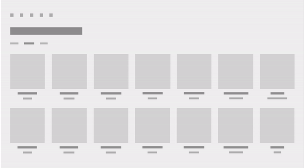

# Motion for UWP apps

Purposeful, well-designed motion brings your app to life and makes the experience feel crafted and polished. Motion helps your users understand context changes and where they are within your app’s navigation hierarchy. It ties experiences together with visual transitions. Motion adds a sense of pacing and dimensionality to the experience.

## Benefits of motion

Motion is more than making things move. Motion is a tool for creating a physical ecosystem for the user to live inside and manipulate through a variety of input types, like mouse, keyboard, touch, and pen. The quality of the experience depends on how well the app responds to the user, and what kind of personality the UI communicates.

Make sure motion serves a purpose in your app. The best Universal Windows Platform (UWP) apps use motion to bring the UI to life. Motion should:

- Give feedback based on the user's behavior.
- Teach the user how to interact with the UI.
- Indicate how to navigate to previous or succeeding views.

As a user spends more time inside your app, or as tasks in your app become more sophisticated, high-quality motion becomes increasingly important: it can be used to change how the user perceives their cognitive load and your app's ease of use. Motion has many other direct benefits:

- **Motion supports interaction and wayfinding.**

    Motion is directional: it moves forward and backward, in and out of content, leaving mental "breadcrumb" clues as to how the user arrived at the present view. Transitions can help users learn how to operate new applications by drawing analogies to tasks that the user is already familiar with.

- **Motion can give the impression of enhanced performance.**

    When network speeds lag or the system pauses to work, animations can make the user's wait feel shorter. Animations can be used to let the user know that the app is processing, not frozen, and it can passively surface new information that the user may be interested in.

- **Motion adds personality.**

    Motion is often the common thread that communicates your apps personality as a user moves through an experience.

- **Motion adds elegance.**

    Fluid, responsive, motion makes experiences feel natural, creating emotional connections to the experience.

## Examples of motion

Here are some examples of motion in an app.

Here, an app uses a connected animation to animate an item image as it “continues” to become part of the header of the next page. The effect helps maintain user context across the transition.

Here, a visual parallax effect moves different objects at different rates when the UI scrolls or pans to create a feeling of depth, perspective, and movement.

## Types of motion

<table>
    <tr>
        <th align="left">Motion type</th>
        <th align="left">Description</th>
    </tr>
    <tr>
        <td>[Add and delete](motion-list.md)
        </td>
        <td>List animations let you insert or remove single or multiple items from a collection, such as a photo album or a list of search results.
        </td>
    </tr>
    <tr>
        <td>[Connected animation](connected-animation.md)
        </td>
        <td>Connected animations let you create a dynamic and compelling navigation experience by animating the transition of an element between two different views. This helps the user maintain their context and provides continuity between the views. In a connected animation, an element appears to “continue” between two views during a change in UI content, flying across the screen from its location in the source view to its destination in the new view. This emphasizes the common content in between the views and creates a beautiful and dynamic effect as part of a transition. 
        </td>
    </tr>
    <tr>
        <td>[Content transition](content-transition-animations.md)
        </td>
        <td>Content transition animations let you change the content of an area of the screen while keeping the container or background constant. New content fades in. If there is existing content to be replaced, that content fades out.
        </td>
    </tr>
    <tr>
        <td>[Drill](https://docs.microsoft.com/uwp/api/windows.ui.xaml.media.animation.drillinthemeanimation)
        </td>
        <td>Use a drill-in animation when a user navigates forward in a logical hierarchy, like from a master list to a detail page. Use a drill-out animation when a user navigates backward in a logical hierarchy, like from a detail page to a master page.
        </td>
    </tr>
    <tr>
        <td>[Fade](motion-fade.md)
        </td>
        <td>Use fade animations to bring items into a view or to take items out of a view. The two common fade animations are fade-in and fade-out.
        </td>
    </tr>
        <tr>
        <td>[Parallax](parallax.md)
        </td>
        <td>A visual parallax effect helps create a feeling of depth, perspective, and movement. It achieves this effect by moving different objects at different rates when the UI scrolls or pans.
        </td>
    </tr> 
    <tr>
        <td>[Press feedback](motion-pointer.md)
        </td>
        <td>Pointer press animations provide users with visual feedback when the user taps on an item. The pointer down animation slightly shrinks and tilts the pressed item, and plays when an item is first tapped. The pointer up animation, which restores the item to its original position, is played when the user releases the pointer.
        </td>
    </tr>
</table>

## Animations in XAML

To learn more about how to use built-in animations in XAML or create your own, check out [Animations in XAML](xaml-animation.md). L