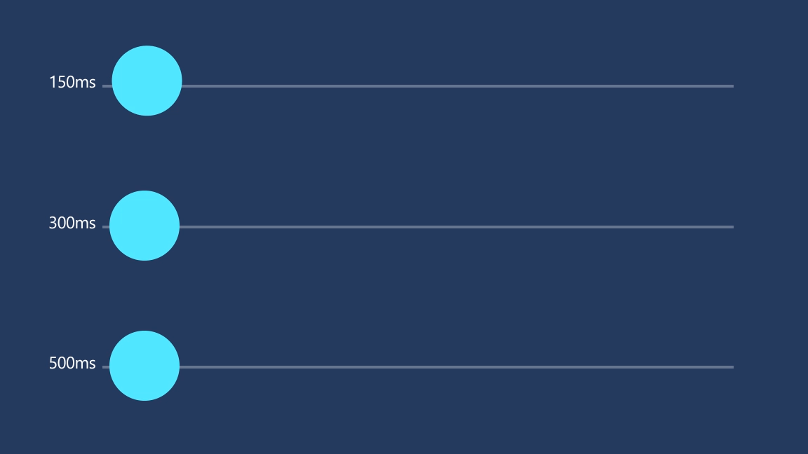
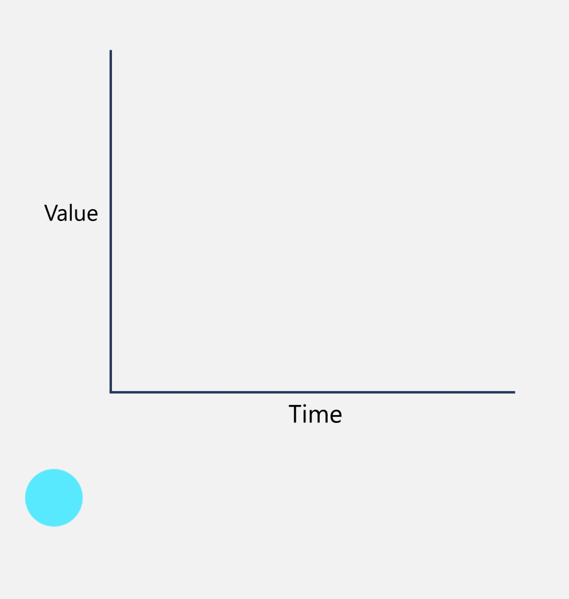

# Timing and easing

While motion is based in the real world, we are also a digital medium, which comes with an expectation of speed and performance.​

## Examples

<table>
<tr>
<td></img></td>
<td>
    <p>If you have the <strong style="font-weight: semi-bold">XAML Controls Gallery</strong> app installed, click here to <a href="xamlcontrolsgallery:/item/EasingFunction">open the app and see Easing Functions in action</a>.</p>
    <ul>
    <li><a href="https://www.microsoft.com/store/productId/9MSVH128X2ZT">Get the XAML Controls Gallery app (Microsoft Store)</a></li>
    <li><a href="https://github.com/Microsoft/Xaml-Controls-Gallery">Get the source code (GitHub)</a></li>
    </ul>
</td>
</tr>
</table>

## How Fluent motion uses time

Timing is an important element to making motion feel natural for objects entering, exiting, or moving within the UI.

1. Objects or scenes entering the view are quick, but celebrated. These animations are typically longer in duration than exits to allow for hierarchical build-up of a scene.
1. Objects or scenes exiting the view are very quick. The user should be able to understand where the UI went. However, once the UI is dismissed, it should get out of the way.
1. Objects translating across a scene should have a duration appropriate to the amount of distance they travel.

## Timing in Fluent motion

The timing of motion in Fluent uses 500ms (or one-half second) as a baseline because this is the maximum amount of time that a user perceives as instant.



### **150ms** (Exit)

:::row:::
    :::column:::
Use for objects or pages that are exiting the scene or closing.​
Allows for very quick directional feedback of exiting UI where timing does not impede upon framerate to achieve a smooth animation.
    :::column-end:::
    :::column:::
        
    :::column-end:::
:::row-end:::

### **300ms** (Enter)

:::row:::
    :::column:::
Use for objects or pages that are entering the scene or opening.​
Allows a reasonable amount of time to celebrate content as it enters the scene.​
    :::column-end:::
    :::column:::
        
    :::column-end:::
:::row-end:::

### **≤500ms** (Move)

:::row:::
    :::column:::
Use for objects which are translating across a single scene or multiple scenes. ​
    :::column-end:::
    :::column:::
        
    :::column-end:::
:::row-end:::

## Easing in Fluent motion

Easing is a way to manipulate the velocity of an object as it travels. It's the glue that ties together all the Fluent motion experiences.​ While extreme, the easing used in the system helps unify the physical feel of objects moving throughout the system. This is one way to mimic the real world, and make objects in motion feel like they belong in their environment.


## Apply easing to motion

These easings will help you achieve a more natural feel, and are the baseline we use for Fluent motion.

The code examples show how to apply recommended easing values to Storyboard animations (XAML) or Composition animations (C#).

### **Accelerate** (Exit)

:::row:::
    :::column:::
Use for UI or objects that are exiting the scene.

Objects become powered and gain momentum until they reach escape velocity.​
The resulting feel is that the object is trying its hardest to get out of the user's way and make room for new content to come in.​
    :::column-end:::
    :::column:::
        
    :::column-end:::
:::row-end:::

```
cubic-bezier(0.7 , 0 , 1 , 0.5)
```

```xaml
<!-- Use for XAML Storyboard animations. -->
<Storyboard x:Name="Storyboard">
    <DoubleAnimation Storyboard.TargetName="Translation" Storyboard.TargetProperty="X" From="0" To="200" Duration="0:0:0.15">
        <DoubleAnimation.EasingFunction>
            <ExponentialEase Exponent="4.5" EasingMode="EaseIn" />
        </DoubleAnimation.EasingFunction>
    </DoubleAnimation>
</Storyboard>
```

```csharp
// Use for Composition animations.
CubicBezierEasingFunction accelerate =
    _compositor.CreateCubicBezierEasingFunction(new Vector2(0.7f, 0.0f), new Vector2(1.0f, 0.5f));
_exitAnimation = _compositor.CreateScalarKeyFrameAnimation();
_exitAnimation.InsertKeyFrame(0.0f, _startValue);
_exitAnimation.InsertKeyFrame(1.0f, _endValue, accelerate);
_exitAnimation.Duration = TimeSpan.FromMilliseconds(150);
```

### **Decelerate** (Enter)

:::row:::
    :::column:::
Use for objects or UI entering the scene, either navigating or spawning​.

Once on-scene, the object is met with extreme friction, which slows the object to rest.​
The resulting feel is that the object traveled from a long distance away and entered at an extreme velocity, or is quickly returning to a rest state.​

Even if it's preceded by a moment of unresponsiveness, the velocity of the incoming object has the effect of feeling fast and responsive.​
    :::column-end:::
    :::column:::
        
    :::column-end:::
:::row-end:::

```
cubic-bezier(0.1 , 0.9 , 0.2 , 1)
```

```xaml
<!-- Use for XAML Storyboard animations. -->
<Storyboard x:Name="Storyboard">
    <DoubleAnimation Storyboard.TargetName="Translation" Storyboard.TargetProperty="X" From="0" To="200" Duration="0:0:0.3">
        <DoubleAnimation.EasingFunction>
            <ExponentialEase Exponent="7" EasingMode="EaseOut" />
        </DoubleAnimation.EasingFunction>
    </DoubleAnimation>
</Storyboard>
```

```csharp
// Use for Composition animations.
CubicBezierEasingFunction decelerate =
    _compositor.CreateCubicBezierEasingFunction(new Vector2(0.1f, 0.9f), new Vector2(0.2f, 1.0f));
_enterAnimation = _compositor.CreateScalarKeyFrameAnimation();
_enterAnimation.InsertKeyFrame(0.0f, _startValue);
_enterAnimation.InsertKeyFrame(1.0f, _endValue, decelerate);
_enterAnimation.Duration = TimeSpan.FromMilliseconds(300);
```

### **Standard Easing** (Move)

:::row:::
    :::column:::
This is the baseline easing for any animated parameter change inside of the system.
Use standard easing for objects that change from state to state on-screen, such as a simple position change. Also, use it for objects morphing in-scene, like an object that grows.

The resulting feel is that objects changing state from A to B are overcoming, and taken over by, natural forces.​
    :::column-end:::
    :::column:::
        
    :::column-end:::
:::row-end:::

```
cubic-bezier(0.8 , 0 , 0.2 , 1)
```

```xaml
<!-- Use for XAML Storyboard animations. -->
<Storyboard x:Name="Storyboard">
    <DoubleAnimation Storyboard.TargetName="Translation" Storyboard.TargetProperty="X" From="0" To="200" Duration="0:0:0.5">
        <DoubleAnimation.EasingFunction>
            <CircleEase EasingMode="EaseInOut" />
        </DoubleAnimation.EasingFunction>
    </DoubleAnimation>
</Storyboard>
```

```csharp
// Use for Composition animations.
CubicBezierEasingFunction standard =
    _compositor.CreateCubicBezierEasingFunction(new Vector2(0.8f, 0.0f), new Vector2(0.2f, 1.0f));
 _moveAnimation = _compositor.CreateScalarKeyFrameAnimation();
 _moveAnimation.InsertKeyFrame(0.0f, _startValue);
 _moveAnimation.InsertKeyFrame(1.0f, _endValue, standard);
 _moveAnimation.Duration = TimeSpan.FromMilliseconds(500);
```

## Related articles

- [Motion overview](index.md)
- [Directionality and gravity](directionality-and-gravity.md)
