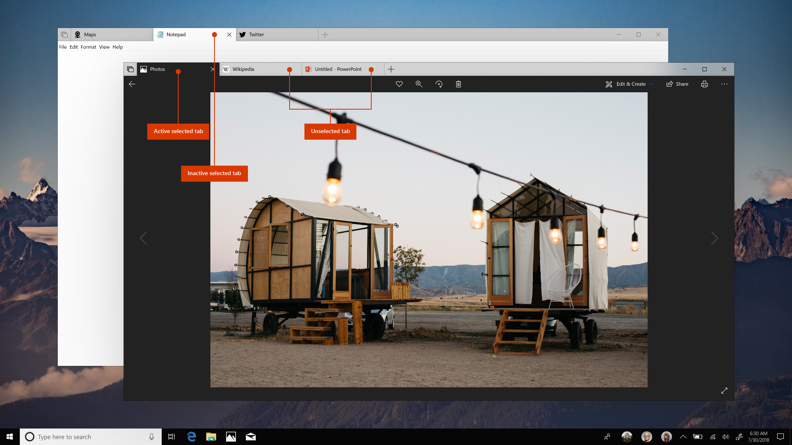
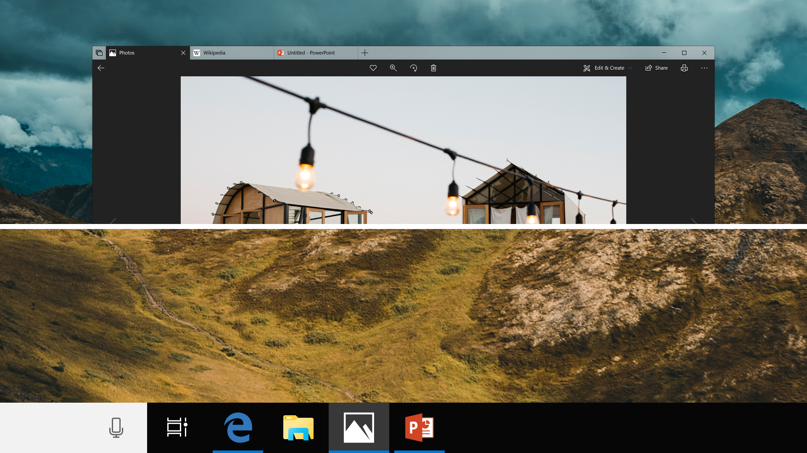
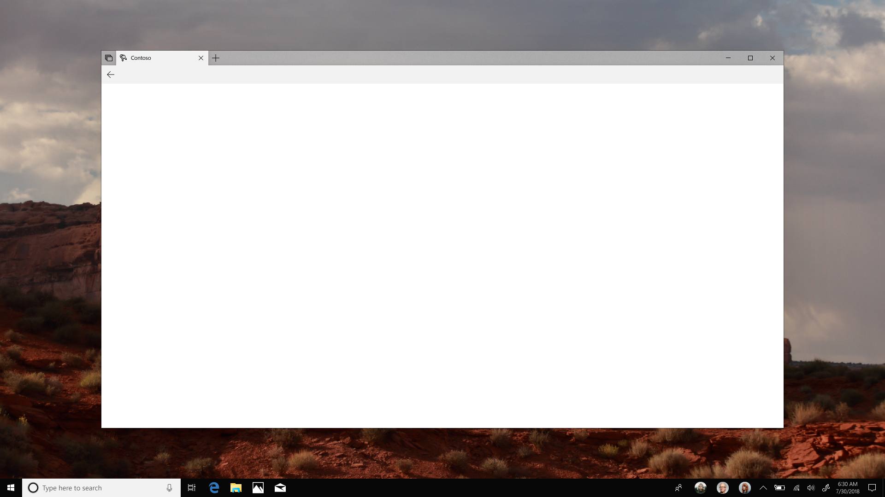

# Designing for Sets

> [!IMPORTANT]
> This article describes functionality that hasn’t been released yet and may be substantially modified before it's commercially released. Microsoft makes no warranties, express or implied, with respect to the information provided here.

Starting with the Windows Insider Preview, the Sets feature is available to your app's users. With Sets, your app is drawn in a window that might be shared with other apps, and each app gets its own tab in the title bar.

In this article, we go over the areas where you might want to optimize your app to provide the best experience in the Sets UI.

> [!TIP]
> For more info about Sets, see the [Introducing Sets](https://insider.windows.com/en-us/articles/introducing-sets/) blog post and the [Developing for Sets](https://developer.microsoft.com/events/build/content/developing-for-sets-on-windows-10) talk from Microsoft Build 2018.

## Customizing tab visuals

By default, the system attempts to select appropriate text and icon colors for your app's tab when it is active. This ensures that your app's tab will look good with minimal effort on your part, or even if you don't do any optimization for Sets.

However, there may be cases where it's best to customize the tab color for your app. In this section, we explain the default tab behaviors, and discuss when you should or shouldn't modify them for your app.

### Tab states

When your app is in a Set, its tab can be in one of three states: selected and active, selected and inactive, or unselected and inactive.

- **Selected-Active**: A tab that is selected from within a set of grouped windows, and is in the active foreground window.

    (In this document, any discussion of modifying the _active_ tab means the tab is Selected-Active.)
- **Selected-Inactive**: A tab that is selected from within a set of grouped windows, but is not in the active foreground window.
- **Unselected-Inactive**: A tab that is not selected from within a set of grouped windows.

The color of any inactive tabs is updated and maintained by the system based on system theme. There is no way to influence it from your app.

By default, the selected and active tab respects the system theme color specified by the user in Windows Settings. You can customize tab color for your app only when the tab is active.



### Coloring of active tabs

The color of the active tab is determined by values you set in your app or by system settings. The tab color used when your app is active is determined as follows:

- If you specify a tab color in your app, it has highest priority. The tab color you specify in your app is used when your app is active regardless of system settings.
- Otherwise, if the user selects the option in Windows Settings to show the accent color on title bars, the system accent color is used.
  - This setting is found in the Windows Settings app under Personalization > Colors > Show accent color on the following surfaces: Title bars.
- Finally, if no app or user settings are applied, the tab uses the current system theme color.

### Considerations when you modify tab colors

Here, we discuss situations where you might want to modify the tab color for your app, and things you should consider in those cases. We also discuss some situations where we recommend that you not modify the tab color, but let the system manage it.

#### Match your brand colors

Typically, the overriding factor that determines whether you modify the tab color is the desire to match your brand color. When you modify your app tab to match your brand color, you should test how it looks in light of the other considerations outlined in this section, such as your app layout, or different system theme colors.

#### Horizontal layout

If your app layout includes a solid (non-Acrylic) band of color that runs horizontally across the top, it typically works well to connect your app with its tab by using a matching color. Choose a solid color for your tab that feels connected to your app, ideally by providing some continuity to the color used at the top of your app.

#### Horizontal layout with Acrylic

If your app uses a band of Acrylic material that runs horizontally across the top, we recommend that you let the system determine the tab color.

We also recommend using in-app Acrylic here rather than using background Acrylic to let your application background flow to this area rather than creating a banding effect showing through the application or desktop behind this band.

Please note that user is able to set these tabs to use accent color in this case so they could appear either light/dark theme or accent color.

#### Vertical layout

If your app layout includes a vertical pane of solid color that run vertically, we recommend that you not customize the tab colors. The position of the tab above your app can be changed at any time by the user, so you can't count on color continuity between the top part of your app and the tab. The system uses other visual cues, like shadows, to connect the tab with your app.

### How to modify tab colors

The active tab color uses the existing title bar customization APIs. If you've already customized the title bar color for your app, the change also applies to the app tab when your app is in a Set.

To modify tab colors, set [ApplicationViewTitleBar](https://docs.microsoft.com/uwp/api/windows.ui.viewmanagement.applicationviewtitlebar) properties to specify:

- A solid background color to your tab.
- A solid foreground color to your tab text.

This example shows how to get an instance of ApplicationViewTitleBar and set its color properties.

```csharp
// using Windows.UI.ViewManagement;
var titleBar = ApplicationView.GetForCurrentView().TitleBar;

// Set active window colors
titleBar.ForegroundColor = Windows.UI.Colors.White;
titleBar.BackgroundColor = Windows.UI.Colors.Green;
```

For more info, see the _Simple color customization_ section of the [Title bar customization](title-bar.md#simple-color-customization) article and the [Title bar customization sample](http://go.microsoft.com/fwlink/p/?LinkId=620613).

### Considerations for full title bar customization

You can also fully customize your app's title bar, as described in the _Full customization_ section of the [Title bar customization](title-bar.md#full-customization) article. You typically do this to [extend Acrylic into the title bar](../style/acrylic.md#extend-acrylic-into-the-title-bar), or to place custom content in the title bar. If you do this, be sure to follow the guidance for full-screen and tablet mode, and only show your custom title bar content when [CoreApplicationViewTitleBar.IsVisible](/uwp/api/windows.applicationmodel.core.coreapplicationviewtitlebar.isvisible) is **true**.

When your app runs in a Set, CoreApplicationViewTitleBar.IsVisible is **false**, and the title bar content should not be shown. However, if you don't follow this guidance to hide your custom title bar content, it's shown below your app's tab, and not in the title bar area.

If you've placed content or functionality in your custom title bar UI, consider making it available in another UI surface in your app.

### How to modify the tab icon

To make sure your app icon looks its best in a Set, you should provide an alternate, unplated icon for your app. (The app icon used in your app's tab is the same icon used in the taskbar.) The purpose of the alternate icon is to look good against any background color. The alternate icon will be used if available.

In you app manifest, specify an alternate-form unplated icon in addition to your regular icon. For more information, see [Tile and icon asset guidelines](./tiles-and-notifications/app-assets.md). The icon to specify is documented as "Target-size list assets without plate" in the [Asset types](./tiles-and-notifications/app-assets.md#asset-types) section of the article.

If you don't specify an alternate icon in the app manifest, the system will re-plate your the tile icon with the tab color and use that.



> The same icon is used in the task bar and in the app tab.

## Restore previous Sets with user activities

A benefit of Sets is that it lets your users restore previously open tabs for apps and web content when they launch an app or open a document. (See the video in the [Introducing Sets](https://insider.windows.com/en-us/articles/introducing-sets/) blog post for more info.) This is enabled through _user activities_.

By default, the system creates user activities on behalf of your app, which lets your app be restored to a tab when a user launches an app or opens a document. However, the default user activities created by the system can only launch your app in its default state. It can’t restore your app to the state it was in previously as part of the Set.

You can optimize your app for Sets by providing custom user activities. The user activity you provide deep-links into your app to restore it to the state it was last in as part of the Set being restored.

To provide a custom user activity:

- Respond to an OS initiated [UserActivityRequest](https://docs.microsoft.com/uwp/api/windows.applicationmodel.useractivities.useractivityrequest) with an appropriate [UserActivity](https://docs.microsoft.com/uwp/api/windows.applicationmodel.useractivities.useractivity).
- The UserActivity contains an activation deep link URI that the system uses to launch your app with a specific context.

For more info, see [UserActivityRequestManager.UserActivityRequested Event](https://docs.microsoft.com/uwp/api/windows.applicationmodel.useractivities.useractivityrequestmanager.useractivityrequested), [Handle URI activation](https://docs.microsoft.com/windows/uwp/launch-resume/handle-uri-activation), and [Continue user activity, even across devices](https://docs.microsoft.com/windows/uwp/launch-resume/useractivities).

## Enable multi-instance for UWP apps

Starting in Windows 10, version 1803, UWP apps support multi-instancing. UWP are still single-instance by default, and you have to explicitly opt in each app that you want to be multi-instanced.

If you make your app multi-instance, it provides the benefit of letting you users run your app in more than one Set at a time. A single-instance app can only run in one Set at a time.

For more info about how to enable multi-instance for your UWP app, see [Create a multi-instance Universal Windows App](https://docs.microsoft.com/windows/uwp/launch-resume/multi-instance-uwp).

## Use an in-app back button

To implement backwards navigation in your app, we recommend that you place a back button in your app's UI according to the [back button guidance](../basics/navigation-history-and-backwards-navigation.md). If your app uses the NavigationView control, then you should use NavigationView's built-in back button.

If your app uses the system back button, you should replace it with an in-app back button instead. This ensures that users have a consistent back button experience whether or not the app runs in a Set, and also ensures that back button visuals remain consistent across apps.

For detailed guidance about integrating an in-app back button, see [Navigation history and backwards navigation](../basics/navigation-history-and-backwards-navigation.md).

### Support for the system back button in Sets

If your app uses the system back button rather than an in-app button, the system UI will still render the system back button to ensure backward compatibility

- If your app is not in a Set, then the back button is rendered inside the title bar. The visual experience and user interactions for the back button are unchanged.
- If your app is in a Set, then the back button is rendered inside the system back bar.

The system back bar is a "band" that is inserted between the tab band and the app's content area. The band goes across the width of the app, with the back button on the left edge. The band has a vertical height that is large enough to ensure adequate touch target size for the back button.



> The system back bar shown in an app.

The system back bar is displayed dynamically, based on back button visibility. When the back button is visible, the system back bar is inserted, shifting app content down below the tab band. When the back button is hidden, the system back bar is dynamically removed, shifting app content up to meet the tab band.

To avoid having your app's UI shift up or down, we recommend using an in-app back button instead of the system back button.

Title bar customizations carry over to both the app tab and the system back bar. If you use ApplicationViewTitleBar APIs to specify background and foreground color properties, the colors are applied to the tab and system back bar.

## Related articles

- [Title bar customization](title-bar.md)
- [Navigation history and backwards navigation](../basics/navigation-history-and-backwards-navigation.md)
- [Color](../style/color.md)
