# Adaptive and interactive toast notifications


Adaptive and interactive toast notifications let you create flexible notifications with text, images, and buttons/inputs.

> **Important APIs**: [UWP Community Toolkit Notifications nuget package](https://www.nuget.org/packages/Microsoft.Toolkit.Uwp.Notifications/)

> [!NOTE]
> To see the legacy templates from Windows 8.1 and Windows Phone 8.1, see the [legacy toast template catalog](https://msdn.microsoft.com/library/windows/apps/hh761494).


## Getting started

**Install Notifications library.** If you'd like to use C# instead of XML to generate notifications, install the NuGet package named [Microsoft.Toolkit.Uwp.Notifications](https://www.nuget.org/packages/Microsoft.Toolkit.Uwp.Notifications/) (search for "notifications uwp"). The C# samples provided in this article use version 1.0.0 of the NuGet package.

**Install Notifications Visualizer.** This free UWP app helps you design interactive toast notifications by providing an instant visual preview of your toast as you edit it, similar to Visual Studio's XAML editor/design view. You can read [this blog post](http://blogs.msdn.com/b/tiles_and_toasts/archive/2015/09/22/introducing-notifications-visualizer-for-windows-10.aspx) for more information, and you can download Notifications Visualizer [here](https://www.microsoft.com/store/apps/notifications-visualizer/9nblggh5xsl1).


## Sending a toast notification

To learn how to send a notification, see [Send local toast](send-local-toast.md). This documentation only covers creating the toast content.


## Toast notification structure

Toast notifications are a combination of some data properties like Tag/Group (which let you identify the notification) and the *toast content*.

The core components of toast content are...
* **launch**: This defines what arguments will be passed back to your app when the user clicks your toast, allowing you to deep link into the correct content that the toast was displaying. To learn more, see [Send local toast](send-local-toast.md).
* **visual**: The visual portion of the toast, including the generic binding that contains text, images, and app logos.
* **actions**: The interactive portion of the toast, including inputs and actions.
* **audio**: Controls the audio played when the toast is shown to the user.

The toast content is defined in raw XML, but you can use our [NuGet library](https://www.nuget.org/packages/Microsoft.Toolkit.Uwp.Notifications/) to get a C# (or C++) object model for constructing the toast content. This article documents everything that goes within the toast content.

```csharp
ToastContent content = new ToastContent()
{
    Launch = "app-defined-string",
 
    Visual = new ToastVisual()
    {
        BindingGeneric = new ToastBindingGeneric() { ... }
    },
 
    Actions = new ToastActionsCustom() { ... },
 
    Audio = new ToastAudio() { ... }
};
```

```xml
<toast launch="app-defined-string">

  <visual>
    <binding template="ToastGeneric">
      ...
    </binding>
  </visual>

  <actions>
    ...
  </actions>

  <audio src="ms-winsoundevent:Notification.Reminder"/>

</toast>
```

Here is a visual representation of the toast's content:

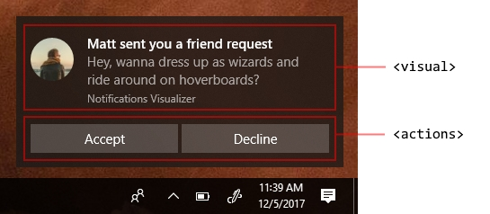


## Visual

Each toast must specify a visual, where you must provide a generic toast binding, which can contain text, images, logos, and more. These elements will be rendered on various Windows devices, including desktop, phones, tablets, and Xbox.

For all attributes supported in the visual section and its child elements, [see the schema documentation](toast-schema.md#toastvisual).

Your app's identity on the toast notification is conveyed via your app icon. However, if you use the app logo override, we will display your app name beneath your lines of text.

| Normal toast                                                                              | Toast with appLogoOverride                                                          |
| ----------------------------------------------------------------------------------------- | ----------------------------------------------------------------------------------- |
| 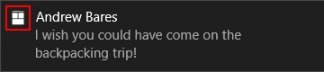 | 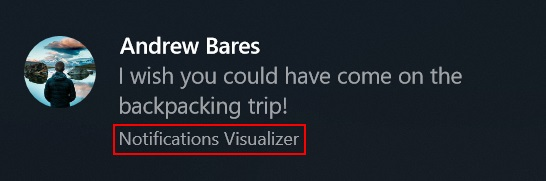 |


## Text elements

Each toast must have at least one text element, and can contain two additional text elements, all of type [AdaptiveText](toast-schema.md#adaptivetext).

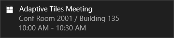

Since the Anniversary Update, you can control how many lines of text are displayed by using the **HintMaxLines** property on the text. By default, the title displays up to 2 lines of text, and the description lines each display up to 4 lines of text.

```csharp
new ToastBindingGeneric()
{
    Children =
    {
        new AdaptiveText()
        {
            Text = "Adaptive Tiles Meeting",
            HintMaxLines = 1
        },

        new AdaptiveText()
        {
            Text = "Conf Room 2001 / Building 135"
        },

        new AdaptiveText()
        {
            Text = "10:00 AM - 10:30 AM"
        }
    }
}
```

```xml
<binding template="ToastGeneric">
    <text hint-maxLines="1">Adaptive Tiles Meeting</text>
    <text>Conf Room 2001 / Building 135</text>
    <text>10:00 AM - 10:30 AM</text>
</binding>
```


## App logo override

By default, your toast will display your app's logo. However, you can override this logo with your own [ToastGenericAppLogo](toast-schema.md#toastgenericapplogo) image. For example, if this is a notification from a person, we recommend overriding the app logo with a picture of that person.

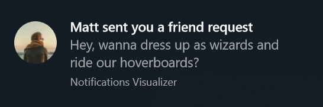

You can use the **HintCrop** property to change the cropping of the image. For example, *circle* results in a circle-cropped image. Otherwise, the image is square. Image dimensions are 48x48 pixels at 100% scaling.

```csharp
new ToastBindingGeneric()
{
    ...

    AppLogoOverride = new ToastGenericAppLogo()
    {
        Source = "https://unsplash.it/64?image=883",
        HintCrop = ToastGenericAppLogoCrop.Circle
    }
}
```

```xml
<binding template="ToastGeneric">
    ...
    <image placement="appLogoOverride" hint-crop="circle" src="https://unsplash.it/64?image=883"/>
</binding>
```


## Hero image

**New in Anniversary Update**: Toasts can display a hero image, which is a featured [ToastGenericHeroImage](toast-schema.md#toastgenericheroimage) displayed prominently within the toast banner and while inside Action Center. Image dimensions are 360x180 pixels at 100% scaling.

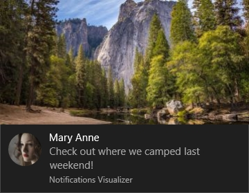

```csharp
new ToastBindingGeneric()
{
    ...

    HeroImage = new ToastGenericHeroImage()
    {
        Source = "https://unsplash.it/360/180?image=1043"
    }
}
```

```xml
<binding template="ToastGeneric">
    ...
    <image placement="hero" src="https://unsplash.it/360/180?image=1043"/>
</binding>
```


## Inline image

You can provide a full-width inline-image that appears when you expand the toast.

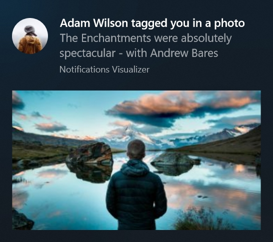

```csharp
new ToastBindingGeneric()
{
    Children =
    {
        ...

        new AdaptiveImage()
        {
            Source = "https://unsplash.it/360/180?image=1043"
        }
    }
}
```

```xml
<binding template="ToastGeneric">
    ...
    <image src="https://unsplash.it/360/180?image=1043" />
</binding>
```


## Attribution text

**New in Anniversary Update**: If you need to reference the source of your content, you can use attribution text. This text is always displayed at the bottom of your notification, along with your app's identity or the notification's timestamp.

On older versions of Windows that don't support attribution text, the text will simply be displayed as another text element (assuming you don't already have the maximum of three text elements).


```csharp
new ToastBindingGeneric()
{
    ...

    Attribution = new ToastGenericAttributionText()
    {
        Text = "Via SMS"
    }
}
```

```xml
<binding template="ToastGeneric">
    ...
    <text placement="attribution">Via SMS</text>
</binding>
```


## Custom timestamp

**New in Creators Update**: You can now override the system-provided timestamp with your own timestamp that accurately represents when the message/information/content was generated. This timestamp is visible within Action Center.


To learn more about using a custom timestamp, please [see this blog post](https://blogs.msdn.microsoft.com/tiles_and_toasts/2017/01/09/custom-timestamp-on-toast-notifications-windows-10-creators-update/).

```csharp
ToastContent toastContent = new ToastContent()
{
    DisplayTimestamp = new DateTime(2017, 04, 15, 19, 45, 00, DateTimeKind.Utc),
    ...
};
```

```xml
<toast displayTimestamp="2017-04-15T19:45:00Z">
  ...
</toast>
```


## Adaptive content

**New in Anniversary Update**: In addition to the content specified above, you can also display additional adaptive content that is visible when the toast is expanded.

This additional content is specified using Adaptive, which you can learn more about by reading the [Adaptive Tiles documentation](create-adaptive-tiles.md).

Note that any adaptive content must be contained within an [AdaptiveGroup](https://docs.microsoft.com/windows/uwp/design/shell/tiles-and-notifications/toast-schema#adaptivegroup). Otherwise it will not be rendered using adaptive.


### Columns and text elements

Here's an example where columns and some advanced adaptive text elements are used. Since the text elements are within an AdaptiveGroup, they support all the rich adaptive styling properties.

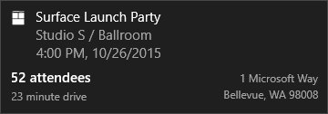

```csharp
new ToastBindingGeneric()
{
    Children =
    {
        ...

        new AdaptiveGroup()
        {
            Children =
            {
                new AdaptiveSubgroup()
                {
                    Children =
                    {
                        new AdaptiveText()
                        {
                            Text = "52 attendees",
                            HintStyle = AdaptiveTextStyle.Base
                        },
                        new AdaptiveText()
                        {
                            Text = "23 minute drive",
                            HintStyle = AdaptiveTextStyle.CaptionSubtle
                        }
                    }
                },
                new AdaptiveSubgroup()
                {
                    Children =
                    {
                        new AdaptiveText()
                        {
                            Text = "1 Microsoft Way",
                            HintStyle = AdaptiveTextStyle.CaptionSubtle,
                            HintAlign = AdaptiveTextAlign.Right
                        },
                        new AdaptiveText()
                        {
                            Text = "Bellevue, WA 98008",
                            HintStyle = AdaptiveTextStyle.CaptionSubtle,
                            HintAlign = AdaptiveTextAlign.Right
                        }
                    }
                }
            }
        }
    }
}
```

```xml
<binding template="ToastGeneric">
    ...
    <group>
        <subgroup>
            <text hint-style="base">52 attendees</text>
            <text hint-style="captionSubtle">23 minute drive</text>
        </subgroup>
        <subgroup>
            <text hint-style="captionSubtle" hint-align="right">1 Microsoft Way</text>
            <text hint-style="captionSubtle" hint-align="right">Bellevue, WA 98008</text>
        </subgroup>
    </group>
</binding>
```


## Inputs and buttons

Inputs and buttons are specified within the Actions region of the toast region of the toast, meaning they are only visible when the toast is expanded.


### Quick reply text box

To enable a quick reply text box, like for a messaging scenario, add a text input and a button, and reference the text input's id so that the button is displayed adjacent to the input.


```csharp
ToastContent content = new ToastContent()
{
    ...
 
    Actions = new ToastActionsCustom()
    {
        Inputs =
        {
            new ToastTextBox("tbReply")
            {
                PlaceholderContent = "Type a reply"
            }
        },

        Buttons =
        {
            new ToastButton("Reply", "action=reply&convId=9318")
            {
                ActivationType = ToastActivationType.Background,

                // To place the button next to the text box,
                // reference the text box's Id and provide an image
                TextBoxId = "tbReply",
                ImageUri = "Assets/Reply.png"
            }
        }
    }
};
```

```xml
<toast launch="app-defined-string">

    ...

    <actions>

        <input id="textBox" type="text" placeHolderContent="Type a reply"/>

        <action
            content="Send"
            arguments="action=reply&amp;convId=9318"
            activationType="background"
            hint-inputId="textBox"
            imageUri="Assets/Reply.png"/>

    </actions>

</toast>
```


### Inputs with buttons bar

You also can have one (or many) inputs with normal buttons displayed below the inputs.

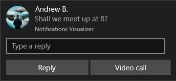

```csharp
ToastContent content = new ToastContent()
{
    ...
 
    Actions = new ToastActionsCustom()
    {
        Inputs =
        {
            new ToastTextBox("tbReply")
            {
                PlaceholderContent = "Type a reply"
            }
        },

        Buttons =
        {
            new ToastButton("Reply", "action=reply&threadId=9218")
            {
                ActivationType = ToastActivationType.Background
            },

            new ToastButton("Video call", "action=videocall&threadId=9218")
            {
                ActivationType = ToastActivationType.Foreground
            }
        }
    }
};
```

```xml
<toast launch="app-defined-string">

    ...

    <actions>

        <input id="textBox" type="text" placeHolderContent="Type a reply"/>

        <action
            content="Reply"
            arguments="action=reply&amp;threadId=9218"
            activationType="background"/>

        <action
            content="Video call"
            arguments="action=videocall&amp;threadId=9218"
            activationType="foreground"/>

    </actions>

</toast>
```


### Selection input

In addition to text boxes, you can also use a selection menu.

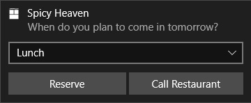

```csharp
ToastContent content = new ToastContent()
{
    ...
 
    Actions = new ToastActionsCustom()
    {
        Inputs =
        {
            new ToastSelectionBox("time")
            {
                DefaultSelectionBoxItemId = "lunch",
                Items =
                {
                    new ToastSelectionBoxItem("breakfast", "Breakfast"),
                    new ToastSelectionBoxItem("lunch", "Lunch"),
                    new ToastSelectionBoxItem("dinner", "Dinner")
                }
            }
        },

        Buttons = { ... }
};
```

```xml
<toast launch="app-defined-string">

    ...

    <actions>

        <input id="time" type="selection" defaultInput="lunch">
            <selection id="breakfast" content="Breakfast" />
            <selection id="lunch" content="Lunch" />
            <selection id="dinner" content="Dinner" />
        </input>

        ...

    </actions>

</toast>
```


## Buttons

Buttons make your toast interactive, letting the user take quick actions on your toast notification without interrupting their current workflow. For example, users can reply to a message directly from within a toast, or delete an email without even opening the email app.

Buttons can perform the following different actions...

-   Activating the app in the foreground, with an argument that can be used to navigate to a specific page/context.
-   Activating the app's background task, for a quick-reply or similar scenario.
-   Activating another app via protocol launch.
-   Performing a system action, like snoozing or dismissing the notification.

Note that you can only have up to 5 buttons (including context menu items which we discuss later).

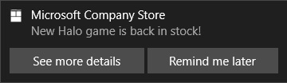

```csharp
ToastContent content = new ToastContent()
{
    ...
 
    Actions = new ToastActionsCustom()
    {
        Buttons =
        {
            new ToastButton("See more details", "action=viewdetails&contentId=351")
            {
                ActivationType = ToastActivationType.Foreground
            },

            new ToastButton("Remind me later", "action=remindlater&contentId=351")
            {
                ActivationType = ToastActivationType.Background
            }
        }
    }
};
```

```xml
<toast launch="app-defined-string">

    ...

    <actions>

        <action
            content="See more details"
            arguments="action=viewdetails&amp;contentId=351"
            activationType="foreground"/>

        <action
            content="Remind me later"
            arguments="action=remindlater&amp;contentId=351"
            activationType="background"/>

    </actions>

</toast>
```


### Snooze/dismiss buttons

Using a selection menu and two buttons, we can create a reminder notification that utilizes the system snooze and dismiss actions. Make sure to set the scenario to Reminder for the notification to behave like a reminder.

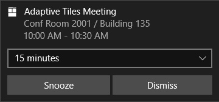

We link the Snooze button to the selection menu input using the *SepectionBoxId* property on the toast button.

```csharp
ToastContent content = new ToastContent()
{
    Scenario = ToastScenario.Reminder,

    ...
 
    Actions = new ToastActionsCustom()
    {
        Inputs =
        {
            new ToastSelectionBox("snoozeTime")
            {
                DefaultSelectionBoxItemId = "15",
                Items =
                {
                    new ToastSelectionBoxItem("5", "5 minutes"),
                    new ToastSelectionBoxItem("15", "15 minutes"),
                    new ToastSelectionBoxItem("60", "1 hour"),
                    new ToastSelectionBoxItem("240", "4 hours"),
                    new ToastSelectionBoxItem("1440", "1 day")
                }
            }
        },

        Buttons =
        {
            new ToastButtonSnooze()
            {
                SelectionBoxId = "snoozeTime"
            },
 
            new ToastButtonDismiss()
        }
    }
};
```

```xml
<toast scenario="reminder" launch="action=viewEvent&amp;eventId=1983">
   
  ...
 
  <actions>
     
    <input id="snoozeTime" type="selection" defaultInput="15">
      <selection id="1" content="1 minute"/>
      <selection id="15" content="15 minutes"/>
      <selection id="60" content="1 hour"/>
      <selection id="240" content="4 hours"/>
      <selection id="1440" content="1 day"/>
    </input>
 
    <action activationType="system" arguments="snooze" hint-inputId="snoozeTime" content="" />
 
    <action activationType="system" arguments="dismiss" content=""/>
     
  </actions>
   
</toast>
```

To use the system snooze and dismiss actions, do the following:

-   Specify a ToastButtonSnooze or ToastButtonDismiss
-   Optionally specify a custom content string:
    -   If you don't provide a string, we'll automatically use localized strings for "Snooze" and "Dismiss".
-   Optionally specify the *SelectionBoxId*:
    -   If you don't want the user to select a snooze interval and instead just want your notification to snooze only once for a system-defined time interval (that is consistent across the OS), then don't construct any &lt;input&gt; at all.
    -   If you want to provide snooze interval selections:
        -   Specify *SelectionBoxId* in the snooze action
        -   Match the id of the input with the *SelectionBoxId* of the snooze action
        -   Specify *ToastSelectionBoxItem*'s value to be a nonNegativeInteger which represents snooze interval in minutes.


## Audio

Custom audio has always been supported by Mobile, and is supported in Desktop Version 1511 (build 10586) or newer. Custom audio can be referenced via the following paths:

-   ms-appx:///
-   ms-appdata:///

Alternatively, you can pick from the [list of ms-winsoundevents](https://msdn.microsoft.com/library/windows/apps/br230842), which have always been supported on both platforms.

```csharp
ToastContent content = new ToastContent()
{
    ...

    Audio = new ToastAudio()
    {
        Src = new Uri("ms-appx:///Assets/NewMessage.mp3")
    }
}
```

```xml
<toast launch="app-defined-string">

    ...

    <audio src="ms-appx:///Assets/NewMessage.mp3"/>

</toast>
```

See the [audio schema page](https://msdn.microsoft.com/library/windows/apps/br230842) for information on audio in toast notifications. To learn how to send a toast using custom audio, [see this blog post](https://blogs.msdn.microsoft.com/tiles_and_toasts/2016/06/18/quickstart-sending-a-toast-notification-with-custom-audio/).


## Alarms, reminders, and incoming calls

To create alarms, reminders, and incoming call notifications, you simply use a normal toast notification with a scenario value assigned to it. The scenario adusts a few behaviors to create a consistent and unified user experience.

* **Reminder**: The notification will stay on screen until the user dismisses it or takes action. On Windows Mobile, the toast will also show pre-expanded. A reminder sound will be played.
* **Alarm**: In addition to the reminder behaviors, alarms will additionally loop audio with a default alarm sound.
* **IncomingCall**: Incoming call notifications are displayed full screen on Windows Mobile devices. Otherwise, they have the same behaviors as alarms except they use ringtone audio.

```csharp
ToastContent content = new ToastContent()
{
    Scenario = ToastScenario.Reminder,

    ...
}
```

```xml
<toast scenario="reminder" launch="app-defined-string">

    ...

</toast>
```


## Handling activation
To learn how to handle toast activations (the user clicking your toast or buttons on the toast), see [Send local toast](send-local-toast.md).

## Tailoring notifications for display language, display scale factor, and high contrast

Your tiles and toasts can load strings and images tailored for display language, display scale factor, high contrast, and other runtime contexts. For more info, see [Tile and toast notification support for language, scale, and high contrast](tile-toast-language-scale-contrast.md).
 
## Related topics

* [Send a local toast and handle activation](send-local-toast.md)
* [Notifications library on GitHub (part of the UWP Community Toolkit)](https://github.com/Microsoft/UWPCommunityToolkit/tree/master/Microsoft.Toolkit.Uwp.Notifications)
* [Tile and toast notification support for language, scale, and high contrast](tile-toast-language-scale-contrast.md)
