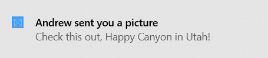

In Windows 10, your toast notification content is described using an adaptive language that allows great flexibility with how your notification looks. For more information, see the [toast content documentation](../adaptive-interactive-toasts.md).

We'll start with a simple text-based notification. Construct the notification content (using the Notifications library), and show the notification! Note that the namespace is `Microsoft.Toolkit.Uwp.Notifications`.

