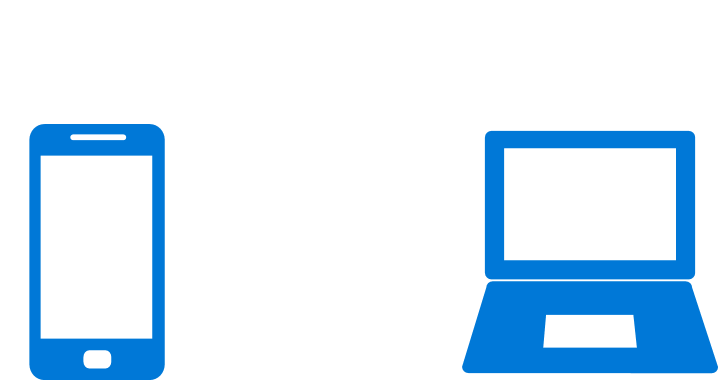

# Notification mirroring

Notification mirroring, powered by Action Center in the Cloud, allows you to see your phone's notifications on your PC.

> [!IMPORTANT]
> **Requires Anniversary Update**: You must be running build 14393 or higher to see notification mirroring work. If you would like to opt your app out of notification mirroring, you must target SDK 14393 to access the mirroring APIs.

With notification mirroring and Cortana, users can receive and act on their phone's notifications (Windows Mobile and Android) from the convenience of their PC. As a developer, you don't have to do anything to enable notification mirroring, mirroring automatically works! Clicking buttons on the mirrored toast, like message quick replies, will be routed back to the phone, invoking you background task or launching your foreground app.



Developers get two great benefits from notification mirroring: The mirrored notifications result in more user engagement with your service, and they also help users discover your Microsoft Store desktop app! Your users might not even know that you have an awesome Windows app available for their Windows 10 desktop. When users receive the mirrored notification from their phone, users can click the toast notification to be taken to the Microsoft Store, where they can install your Windows app.

Mirroring works with both Windows Phone and Android. Users need to be logged into Cortana on both their phone and desktop for notification mirroring to work.


## What if the app is installed on both devices?

If the user already has your app on their PC, we will automatically mute the mirrored phone notification so that they don't see duplicate notifications. Mirrored notifications will be auto-muted based on the following criteria...

1. An app on the PC exists with either the **same display name or the same PFN** (Package Family Name)
2. That PC app has sent a toast notification

If the PC app hasn't sent a toast yet, we'll still show the phone notifications, since chances are, the user hasn't actually launched the PC app yet).


## How to opt out of mirroring

Windows app developers, enterprises, and users can choose to disable notification mirroring.

> [!NOTE]
> Disabling mirroring will also disable [Universal Dismiss](universal-dismiss.md).


### As a developer, opt out an individual notification

You occasionally might have a device-specific notification that you don't want to be mirrored to other devices. You can prevent a specific notification from being mirrored by setting the **Mirroring** property on the toast notification. Currently, this mirroring property can only be set on local notifications (it can not be specified when sending a WNS push notification).

**Known Issue**: Retrieving the Mirroring property via the `ToastNotificationHistory.GetHistory()` API's will always return the default value (**Allowed**) rather than the option you specified. Don't worry, everything is functional - it's only retrieving the value that's broken.

```csharp
var toast = new ToastNotification(xml)
{
    // Disable mirroring of this notification
    Mirroring = NotificationMirroring.Disabled
};
  
ToastNotificationManager.CreateToastNotifier().Show(toast);
```


### As a developer, opt out completely

Some developers might choose to completely opt their app out of notification mirroring. While we believe that all apps would benefit from mirroring, we make it easy to opt out. Just call the following method once, and your app will be opted out. For example, you can place this call in your app's constructor inside `App.xaml.cs`...

```csharp
public App()
{
    this.InitializeComponent();
    this.Suspending += OnSuspending;
 
    // Disable notification mirroring for entire app
    ToastNotificationManager.ConfigureNotificationMirroring(NotificationMirroring.Disabled);
}
```


### As an enterprise, how do I opt out?

Enterprises can choose to completely disable notification mirroring. To do so, they simply edit the Group Policy to turn off notification mirroring.


### As a user, how do I opt out?

Users are able to opt out on individual apps, or completely opt out by disabling the feature. You may not want a specific app's notifications mirrored to your desktop, so you can simply disable that specific app. You can find these options in Cortana's settings on both your phone and PC.
