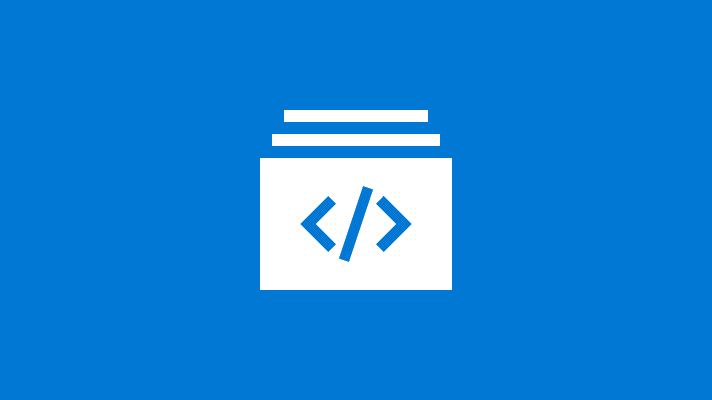
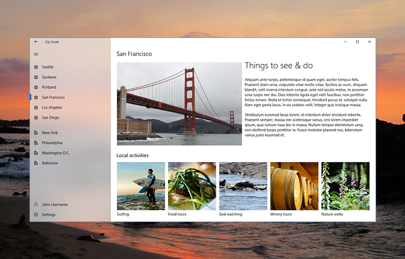
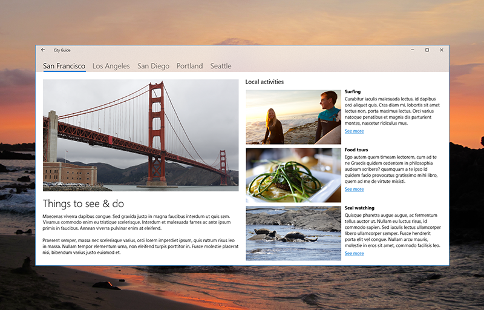
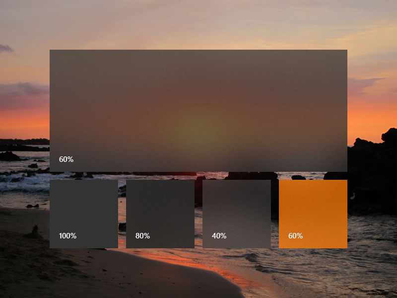
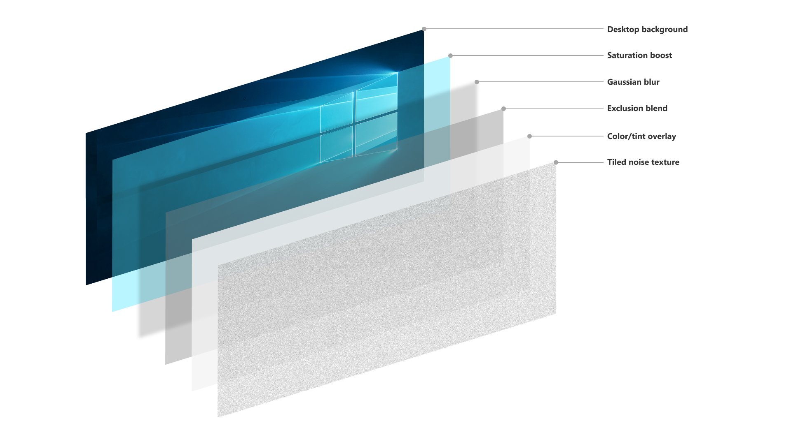

# Acrylic material


Acrylic is a type of [Brush](https://docs.microsoft.com/en-us/uwp/api/Windows.UI.Xaml.Media.Brush) that creates a partially transparent texture. You can apply Acrylic to app surfaces to add depth and help establish a visual hierarchy.  <!-- By allowing user-selected wallpaper or colors to shine through, Acrylic keeps users in touch with the OS personalization they've chosen. -->

> **Important APIs**: [AcrylicBrush class](https://docs.microsoft.com/en-us/uwp/api/windows.ui.xaml.media.acrylicbrush), [Background property](https://docs.microsoft.com/en-us/uwp/api/windows.ui.xaml.controls.control.Background)

:::row:::
    :::column:::
        Acrylic in light theme
        
    :::column-end:::
    :::column:::
        Acrylic in dark theme
        
    :::column-end:::
:::row-end:::

## Acrylic and the Fluent Design System

 The Fluent Design System helps you create modern, bold UI that incorporates light, depth, motion, material, and scale. Acrylic is a Fluent Design System component that adds physical texture (material) and depth to your app. To learn more, see the [Fluent Design for UWP overview](../fluent-design-system/index.md).

 ## Video summary

> [!VIDEO https://channel9.msdn.com/Events/Windows/Windows-Developer-Day-Fall-Creators-Update/WinDev002/player]

## Examples

:::row:::
    :::column span:::
        
    :::column-end:::
    :::column span="2":::
        **XAML Controls Gallery**<br>
        If you have the XAML Controls Gallery app installed, click <a href="xamlcontrolsgallery:/item/Acrylic">here</a> to open the app and see Acrylic in action.

        <a href="https://www.microsoft.com/store/productId/9MSVH128X2ZT">Get the XAML Controls Gallery app (Microsoft Store)</a><br>
        <a href="https://github.com/Microsoft/Windows-universal-samples/tree/master/Samples/XamlUIBasics">Get the source code (GitHub)</a>
    :::column-end:::
:::row-end:::

## When to use acrylic

We recommend that you place supporting UI, such as in-app navigation or commanding elements, on an Acrylic surface. This material is also helpful for transient UI elements, such as dialogs and flyouts, because it helps maintain a visual relationship with the content that triggered the transient UI. We designed acrylic to be used as a background material and show in visually discrete panes, so don't apply acrylic to detailed foreground elements.

Surfaces behind primary app content should use solid, opaque backgrounds.

Consider having Acrylic extend to one or more edges of your app, including the window title bar, to improve visual flow. Avoid creating a striping effect by stacking Acrylic of different blend types adjacent to each other. Acrylic is a tool to bring visual harmony to your designs but, when used incorrectly, can result in visual noise.

Consider the following usage patterns to decide how best to incorporate Acrylic into your app.

### Vertical acrylic pane

For apps with vertical navigation, we recommend applying Acrylic to the secondary pane containing navigation elements.



[NavigationView](../controls-and-patterns/navigationview.md) is a new common control for adding navigation to your app and includes acrylic in its visual design. NavigationView’s pane shows background acrylic when the pane is open side-by-side with primary content, and automatically transitions to in-app Acrylic when the pane is open as an overlay.

If your app is not able to leverage NavigationView and you plan on adding Acrylic on your own, we recommend using relatively transparent acrylic with 60% tint opacity.
 - When the pane opens as an overlay above other app content, this should be [60% in-app Acrylic](#acrylic-theme-resources)
 - When the pane opens side-by-side with main app content, this should be [60% background Acrylic](#acrylic-theme-resources)

### Multiple acrylic panes

For apps with three distinct vertical panes, we recommend adding Acrylic to non-primary content.
 - For the secondary pane closest to primary content, use [80% background Acrylic](#acrylic-theme-resources)
 - For the tertiary pane further away from primary content, use [60% background Acrylic](#acrylic-theme-resources)


### Horizontal acrylic pane

For apps with horizontal navigation, commanding, or other strong horizontal elements across the top of the app, we recommend applying [70% Acrylic](#acrylic-theme-resources) to this visual element.



Canvas apps with emphasis on continuous, zoomable content should use in-app Acrylic in the top bar to let users connect with this content. Examples of canvas apps include maps, painting and drawing.

For apps without a single continuous canvas, we recommend using background Acrylic to connect users to their overall desktop environment.

### Acrylic in utility apps

Widgets or light-weight apps can reinforce their usage as utility apps by drawing Acrylic edge-to-edge inside their app window. Apps belonging to this category typically have brief user engagement times and are unlikely to occupy the user's entire desktop screen. Examples include Calculator and Action Center.


> [!Note]
> Rendering Acrylic surfaces is GPU intensive, which can increase device power consumption and shorten battery life. Acrylic is automatically disabled when devices enter battery saver mode, and users can disable transparency (and therefore, transluscency including Acrylic) for all apps, if they choose via Settings.


## Acrylic blend types
Acrylic's most noticeable characteristic is its transluscency. There are two Acrylic blend types that change what’s visible through the material:
 - **Background Acrylic** reveals the desktop wallpaper and other windows that are behind the currently active app, adding depth between application windows while celebrating the user’s personalization preferences.
 - **In-app Acrylic** adds a sense of depth within the app frame, providing both focus and hierarchy.

 

 

 Layer multiple Acrylic surfaces with caution. Background Acrylic, as its name implies, should not be closest to the user in z-order. Multiple layers of background Acrylic tend to result in unexpected optical illusions and should also be avoided. If you choose to layer Acrylic, do so with in-app Acrylic and consider making Acrylic’s tint lighter in value to help visually bring the layers forward to the viewer.


## Usability and adaptability
Acrylic automatically adapts its appearance for a wide variety of devices and contexts.

In High Contrast mode, users continue to see the familiar background color of their choosing in place of Acrylic. In addition, both background Acrylic and in-app Acrylic appear as a solid color
 - When the user turns off transparency in Personalization settings
 - When battery saver mode is activated
 - When the app runs on low-end hardware

In addition, only background Acrylic will replace its transluscency and texture with a solid color
 - When an app window on desktop deactivates
 - When the UWP app is running on phone, Xbox, HoloLens or tablet mode

### Legibility considerations
It’s important to ensure that any text your app presents to users [meets contrast ratios](../accessibility/accessible-text-requirements.md). We’ve optimized the Acrylic recipe so that high-color black, white or even medium-color gray text meets contrast ratios on top of Acrylic. The theme resources provided by the platform default to contrasting tint colors at 80% opacity. When placing high-color body text on Acrylic, you can reduce tint opacity while maintaining legibility. In dark mode, tint opacity can be 70%, while light mode Acrylic will meet contrast ratios at 50% opacity.

We don't recommend placing accent-colored text on your Acrylic surfaces because these combinations are likely to not pass minimum contrast ratio requirements at 15px font size. Try to avoid placing [hyperlinks](../controls-and-patterns/hyperlinks.md) over Acrylic elements. Also, if you choose to customize the Acrylic tint color or opacity level outside of the platform defaults provided by the theme resource, keep the impact on legibility in mind.

## Acrylic theme resources
You can easily apply Acrylic to your app’s surfaces using the new XAML AcrylicBrush or predefined AcrylicBrush theme resources. First, you’ll need to decide whether to use in-app or background Acrylic. Be sure to review common app patterns described earlier in this article for recommendations.

We’ve created a collection of brush theme resources for both background and in-app Acrylic types that respect the app’s theme and fall back to solid colors as needed. Resources named *AcrylicWindow* represent background Acrylic, while *AcrylicElement* refers to in-app Acrylic.

<table>
    <tr>
        <th align="center">Resource key</th>
        <th align="center">Tint opacity</th>
        <th align="center"><a href="color.md">Fallback color</a> </th>
    </tr>
    <tr>
        <td> SystemControlAcrylicWindowBrush, SystemControlAcrylicElementBrush <br/> SystemControlChromeLowAcrylicWindowBrush, SystemControlChromeLowAcrylicElementBrush <br/> SystemControlBaseHighAcrylicWindowBrush, SystemControlBaseHighAcrylicElementBrush <br/> SystemControlBaseLowAcrylicWindowBrush, SystemControlBaseLowAcrylicElementBrush <br/> SystemControlAltHighAcrylicWindowBrush, SystemControlAltHighAcrylicElementBrush <br/> SystemControlAltLowAcrylicWindowBrush, SystemControlAltLowAcrylicElementBrush </td>
        <td align="center"> 80% </td>
        <td> ChromeMedium <br/> ChromeLow <br/><br/> BaseHigh <br/><br/> BaseLow <br/><br/> AltHigh <br/><br/> AltLow </td>
    </tr>
    </tr>
        <td> <b>Recommended usage:</b> These are general-purpose acrylic resources that work well in a wide variety of usages. If your app uses secondary text of AltMedium color with text size smaller than 18px, place an 80% acrylic resource behind the text to <a href="../accessibility/accessible-text-requirements.md">meet contrast ratio requirements</a>. </td>
    </tr>
    <tr>
        <td> SystemControlAcrylicWindowMediumHighBrush, SystemControlAcrylicElementMediumHighBrush <br/> SystemControlBaseHighAcrylicWindowMediumHighBrush, SystemControlBaseHighAcrylicElementMediumHighBrush </td>
        <td align="center"> 70% </td>
        <td> ChromeMedium <br/><br/> BaseHigh </td>
    </tr>
    <tr>
        <td> <b>Recommended usage:</b> If your app uses secondary text of AltMedium color with a text size of 18px or larger, you can place these more transparent 70% acrylic resources behind the text. We recommend using these resources in your app's top horizontal navigation and commanding areas.  </td>
    </tr>
    <tr>
        <td> SystemControlChromeHighAcrylicWindowMediumBrush, SystemControlChromeHighAcrylicElementMediumBrush <br/> SystemControlChromeMediumAcrylicWindowMediumBrush, SystemControlChromeMediumAcrylicElementMediumBrush <br/> SystemControlChromeMediumLowAcrylicWindowMediumBrush, SystemControlChromeMediumLowAcrylicElementMediumBrush <br/> SystemControlBaseHighAcrylicWindowMediumBrush, SystemControlBaseHighAcrylicElementMediumBrush <br/> SystemControlBaseMediumLowAcrylicWindowMediumBrush, SystemControlBaseMediumLowAcrylicElementMediumBrush <br/> SystemControlAltMediumLowAcrylicWindowMediumBrush, SystemControlAltMediumLowAcrylicElementMediumBrush  </td>
        <td align="center"> 60% </td>
        <td> ChromeHigh <br/><br/> ChromeMedium <br/><br/> ChromeMediumLow <br/><br/> BaseHigh <br/><br/> BaseLow <br/><br/> AltMediumLow </td>
    </tr>
    <tr>
        <td> <b>Recommended usage:</b> When placing only primary text of AltHigh color over acrylic, your app can utilize these 60% resources. We recommend painting your app's <a href="../controls-and-patterns/navigationview.md">vertical navigation pane</a>, i.e. hamburger menu, with 60% acrylic. </td>
    </tr>
</table>

In addition to color-neutral acrylic, we've also added resources that tint acrylic using the user-specified accent color. We recommend using colored acrylic sparingly. For the dark1 and dark2 variants provided, place white or light-colored text consistent with dark theme text color over these resources.
<table>
    <tr>
        <th align="center">Resource key</th>
        <th align="center">Tint opacity</th>
        <th align="center"><a href="color.md">Tint and Fallback colors</a> </th>
    </tr>
    <tr>
        <td> SystemControlAccentAcrylicWindowAccentMediumHighBrush, SystemControlAccentAcrylicElementAccentMediumHighBrush  </td>
        <td align="center"> 70% </td>
        <td> SystemAccentColor </td>
    </tr>
    <tr>
        <td> SystemControlAccentDark1AcrylicWindowAccentDark1Brush, SystemControlAccentDark1AcrylicElementAccentDark1Brush  </td>
        <td align="center"> 80% </td>
        <td> SystemAccentColorDark1 </td>
    </tr>
    <tr>
        <td> SystemControlAccentDark2AcrylicWindowAccentDark2MediumHighBrush, SystemControlAccentDark2AcrylicElementAccentDark2MediumHighBrush  </td>
        <td align="center"> 70% </td>
        <td> SystemAccentColorDark2 </td>
    </tr>
</table>


To paint a specific surface, apply one of the above theme resources to element backgrounds just as you would apply any other brush resource.

```xaml
<Grid Background="{ThemeResource SystemControlAcrylicElementBrush}">
```

## Custom acrylic brush
You may choose to add a color tint to your app’s acrylic to show branding or provide visual balance with other elements on the page. To show color rather than greyscale, you’ll need to define your own acrylic brushes using the following properties.
 - **TintColor**: the color/tint overlay layer. Consider specifying both the RGB color value and alpha channel opacity.
 - **TintOpacity**: the opacity of the tint layer. We recommend 80% opacity as a starting point, although different colors may look more compelling at other transparencies.
 - **BackgroundSource**: the flag to specify whether you want background or in-app acrylic.
 - **FallbackColor**: the solid color that replaces acrylic in low-battery mode. For background acrylic, fallback color also replaces acrylic when your app isn’t in the active desktop window or when the app is running on phone and Xbox.




To add an acrylic brush, define the three resources for dark, light and high contrast themes. Note that in high contrast, we recommend using a SolidColorBrush with the same x:Key as the dark/light AcrylicBrush.

```xaml
<ResourceDictionary.ThemeDictionaries>
    <ResourceDictionary x:Key="Default">
        <AcrylicBrush x:Key="MyAcrylicBrush"
            BackgroundSource="HostBackdrop"
            TintColor="#FFFF0000"
            TintOpacity="0.8"
            FallbackColor="#FF7F0000"/>
    </ResourceDictionary>

    <ResourceDictionary x:Key="HighContrast">
        <SolidColorBrush x:Key="MyAcrylicBrush"
            Color="{ThemeResource SystemColorWindowColor}"/>
    </ResourceDictionary>

    <ResourceDictionary x:Key="Light">
        <AcrylicBrush x:Key="MyAcrylicBrush"
            BackgroundSource="HostBackdrop"
            TintColor="#FFFF0000"
            TintOpacity="0.8"
            FallbackColor="#FFFF7F7F"/>
    </ResourceDictionary>
</ResourceDictionary.ThemeDictionaries>
```

The following sample shows how to declare AcrylicBrush in code. If your app supports multiple OS targets, be sure to check that this API is available on the user’s machine.

```csharp
if (Windows.Foundation.Metadata.ApiInformation.IsTypePresent("Windows.UI.Xaml.Media.XamlCompositionBrushBase"))
{
    Windows.UI.Xaml.Media.AcrylicBrush myBrush = new Windows.UI.Xaml.Media.AcrylicBrush();
    myBrush.BackgroundSource = Windows.UI.Xaml.Media.AcrylicBackgroundSource.HostBackdrop;
    myBrush.TintColor = Color.FromArgb(255, 202, 24, 37);
    myBrush.FallbackColor = Color.FromArgb(255, 202, 24, 37);
    myBrush.TintOpacity = 0.6;

    grid.Fill = myBrush;
}
else
{
    SolidColorBrush myBrush = new SolidColorBrush(Color.FromArgb(255, 202, 24, 37));

    grid.Fill = myBrush;
}
```

## Extend Acrylic into the title bar

To give your app's window a seamless look, you can use Acrylic in the title bar area. This example extends Acrylic into the title bar by setting the [ApplicationViewTitleBar](https://docs.microsoft.com/uwp/api/Windows.UI.ViewManagement.ApplicationViewTitleBar) object's [ButtonBackgroundColor](https://docs.microsoft.com/uwp/api/Windows.UI.ViewManagement.ApplicationViewTitleBar.ButtonBackgroundColor) and [ButtonInactiveBackgroundColor](https://docs.microsoft.com/uwp/api/Windows.UI.ViewManagement.ApplicationViewTitleBar.ButtonInactiveBackgroundColor) properties to [Colors.Transparent](https://docs.microsoft.com/uwp/api/Windows.UI.Colors.Transparent). 

```csharp
/// Extend Acrylic into the title bar. 
private void ExtendAcrylicIntoTitleBar()
{
    CoreApplication.GetCurrentView().TitleBar.ExtendViewIntoTitleBar = true;
    ApplicationViewTitleBar titleBar = ApplicationView.GetForCurrentView().TitleBar;
    titleBar.ButtonBackgroundColor = Colors.Transparent;
    titleBar.ButtonInactiveBackgroundColor = Colors.Transparent;
}
```

This code can be placed in your app's [OnLaunched](https://docs.microsoft.com/uwp/api/windows.ui.xaml.application#Windows_UI_Xaml_Application_OnLaunched_Windows_ApplicationModel_Activation_LaunchActivatedEventArgs_) method (_App.xaml.cs_), after the call to [Window.Activate](https://docs.microsoft.com/uwp/api/windows.ui.xaml.window.Activate), as shown here, or in your app's first page. 


```csharp
// Call your extend Acrylic code in the OnLaunched event, after 
// calling Window.Current.Activate.
protected override void OnLaunched(LaunchActivatedEventArgs e)
{
    Frame rootFrame = Window.Current.Content as Frame;

    // Do not repeat app initialization when the Window already has content,
    // just ensure that the window is active
    if (rootFrame == null)
    {
        // Create a Frame to act as the navigation context and navigate to the first page
        rootFrame = new Frame();

        rootFrame.NavigationFailed += OnNavigationFailed;

        if (e.PreviousExecutionState == ApplicationExecutionState.Terminated)
        {
            //TODO: Load state from previously suspended application
        }

        // Place the frame in the current Window
        Window.Current.Content = rootFrame;
    }

    if (e.PrelaunchActivated == false)
    {
        if (rootFrame.Content == null)
        {
            // When the navigation stack isn't restored navigate to the first page,
            // configuring the new page by passing required information as a navigation
            // parameter
            rootFrame.Navigate(typeof(MainPage), e.Arguments);
        }
        // Ensure the current window is active
        Window.Current.Activate();

        // Extend Acrylic
        ExtendAcrylicIntoTitleBar();
    }
}
```

In addition, you'll need to draw your app's title, which normally appears automatically in the title bar, with a TextBlock using `CaptionTextBlockStyle`. For more info, see [Title bar customization](../shell/title-bar.md).

## Do's and don'ts
* Do use Acrylic as the background material of non-primary app surfaces like navigation panes.
* Do extend Acrylic to at least one edge of your app to provide a seamless experience by subtly blending with the app’s surroundings.
* Don’t place in-app and background Acrylics directly adjacent to avoid visual tension at the seams.
* Don't place multiple Acrylic panes with the same tint and opacity next to each other because this results in an undesirable visible seam.
* Don’t place accent-colored text over Acrylic surfaces.

## How we designed Acrylic

We fine-tuned Acrylic’s key components to arrive at its unique appearance and properties. We started with transparency, blur and noise to add visual depth and dimension to flat surfaces. We added an exclusion blend mode layer to ensure contrast and legibility of UI placed on an Acrylic background. Finally, we added color tint for personalization opportunities. In concert these layers add up to a fresh, usable material.


<br/>The Acrylic recipe: background, blur, exclusion blend, color/tint overlay, noise

<!--
<div class="microsoft-internal-note">
When designing your app, please utilize these [design resources](http://uni/DesignDepot.FrontEnd/#/Search?t=Resources%7CNeon%7CToolkit&f=Acrylic%20Material) to show Acrylic in comps. The linked templates are the most accurate way to represent Acrylic material in Photoshop and Illustrator. The ordering, as noted in the recipe diagram above, should start from the top: <br/>
 - Noise asset (tiled) at 2% opacity <br/>
 - Base color/tint/alpha layer <br/>
 - Exclusion blend (white @ 10% opacity) <br/>
 - Gaussian blur (30px radius) <br/>
</div>
-->

## Get the sample code

- [XAML Controls Gallery sample](https://github.com/Microsoft/Windows-universal-samples/tree/master/Samples/XamlUIBasics) - See all the XAML controls in an interactive format.

## Related articles

[**Reveal highlight**](reveal.md)
