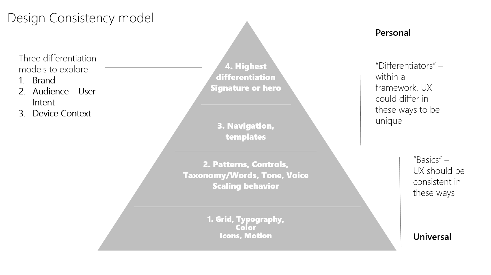

# Balancing style and consistency

 

> Note: This article is an early draft for Windows 10 RS2. Feature names, terminology, and functionality are not final.

When you design a product, you are the advocate for the customer. We all strive to create the best design that’s appropriate and true to our intent. This article explores the balance between following conventions to create a consistent user experience versus creating unique features and experiences that differentiate your app. 

 
## The importance of consistency
Why does consistency matter? Consistency can make an app easier to use. A key part of good design is learnability; having a consistent design across apps reduces the number of times the end user has to “re-learn” how to use them. Look at the real-world examples: a gas pedal is always on the right, a door knob always rotates counter-clockwise to open, a stop sign is always red. 

Making an app consistent doesn't mean making all apps look and behave identically to each other, however. Going back to real world examples, there is an almost infinite number of chair designs, yet very few of them require re-learning how to sit. That's because the important elements--the sitting surface--are consistent enough for the user to understand them. 

One of the challenges in creating a good app design is understanding where it's important to be consistent, and where it's important to be unique. 

## The consistency spectrum
 It's helpful to think of consistency as a spectrum with two opposing ends:

Familiar experience elements include:
-	Established UI paradigms (behavior on a mouse click, pressing and holding on an element, icons that look similar)
-	Elements of your brand that you want to apply across products (typography, colors)

Differentiators include:
-	Elements that form the unique “soul” of the products
-	Elements that help you tailor the experience to the intended form factor

Let's create a design model by taking this spectrum and applies it to the major elements of an app. 

In this model, the base layers provide a tried-and-tested foundation of consistency while the upper layers focus on flexibility and customization.  

1. App basics make up the first layer of our model: the layout grid, [color palette](color.md), [typography conventions](typography.md), and [icon styles](icons.md). These fundamentals features should be consistently applied. 

2. For the second layer, UWP provides a core set of [common controls](../controls-and-patterns/index.md) that balances efficiency with flexibility. We’ve also created guidelines to help establish a consistent voice and tone, using the same words to describe and guide people through app experiences. We created a set of patterns that apps can use for their design, to making sure our designs can scale across different size devices and inputs. 
3. Layer three is where you tailor navigation to different devices and contexts. For example, how you navigate with touch on a phone will likely be different than on a 32” monitor with keyboard and mouse or a hololens with gestures and 100 points of touch on a 84” surface.
4. Layer four is where you define your brand personality. What signature design elements reinforce your brand and differentiate it from the competition? This is also where you tailor your app for different end users. Is your app for gamers, for information workers, or K-12 students or educators. What are unique needs for these different customers and can we make the design work better for them? Don’t just make it the same, continue to look at creating more value for your different customers.  

## Design principles
To use this model effectively, we need a set of design principles that help us to make the right tradeoffs. Here are our working design consistency principles:

**If it looks the same, make it act the same**
-	When the user sees a text box, or the hamburger control, they most likely will expect that it will behave the same way on different devices. If you have a good reason to deviate from an established behavior, set user expectations by making it seem different as well.

**If an element looks very similar to an existing element or convention, consider making it the same**
-	You need a “new document” icon. Why design a new one that’s just a little bit different, when you can use one that’s already recognized by the user.

**Usability trumps consistency**
-	It is better to be usable than to be consistent. In some cases, you may need to develop new controls or behaviors to aid usability. Using phone with one hand has unique challenges. So does working with an 80” screen. A good design makes the user feel an expert. 

**Engagement is important**
-	Don’t make it boring. If everything is flat and the same color with squares, will our customers want to pick it up and use it? Create delight. Introduce new elements which surprise without breaking learnability. 

**Behaviors evolve**
-	This is the tricky one: as industry evolves new conventions get established. It is possible that current behaviors will fade, and our consistent behaviors many need to adopt new standards. Look at pinch and zoom. It used to be a common expectation to zoom in/out with the +/- UI, yet in the modern UI it’s expected to pinch and zoom. Look at new experience paradigms, and evolve. 
