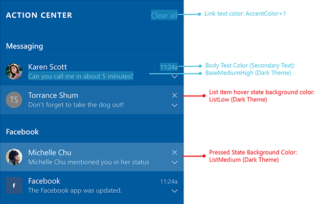

# Color

Color provides an intuitive way of communicating information to users. It can be used to signal interactivity, give feedback to user actions, convey state information, and give your interface a sense of visual continuity.

**Use color carefully.** When color is used sparingly to highlight important elements, it can help create a user interface that is fluid and intuitive.

**Use color to indicate interactivity.** It's a good idea to choose one color to indicate elements of your application that are interactive. For example, many web pages use blue text to denote a hyperlink. This also means you should avoid using the same color for noninteractive elements, as users may find this confusing.

**Color is personal.** In Windows users can choose an accent color and a light or dark theme, which are reflected throughout their experience. You can choose how to incorporate the user's accent color and theme into your application, personalizing their experience.

**Color is cultural.** Consider how the colors you use will be interpreted by people from different cultures. For example, in some cultures the color blue is associated with virtue and protection, while in others it represents mourning.


## Accent color
Windows and Xbox users can pick a single color called an "accent" from the *Settings > Personalization > Colors* menu. This color is reflected throughout their experience--in the Start menu, the taskbar, and many other places. On Windows, they can choose from a curated set of 48 color swatches. On Xbox, they can choose from a palette of 21 colors.

### Windows accent colors
<table class="uwpd-color-table" style="border: solid 4px white;">
        <tr >
            <td class="uwpd-color-table" style="background-color: #FFB900">FFB900</td>
            <td class="uwpd-color-table" style=" background-color: #E74856">E74856</td>
            <td class="uwpd-color-table" style=" background-color: #0078D7">0078D7</td>
            <td class="uwpd-color-table" style=" background-color: #0099BC">0099BC</td>
            <td class="uwpd-color-table" style=" background-color: #7A7574">7A7574</td>
            <td class="uwpd-color-table" style=" background-color: #767676">767676</td>
        </tr>
        <tr >
            <td class="uwpd-color-table" style=" background-color: #FF8C00">FF8C00</td>
            <td class="uwpd-color-table" style=" background-color: #E81123">E81123</td>
            <td class="uwpd-color-table" style=" background-color: #0063B1">0063B1</td>
            <td class="uwpd-color-table" style=" background-color: #2D7D9A">2D7D9A</td>
            <td class="uwpd-color-table" style=" background-color: #5D5A58">5D5A58</td>
            <td class="uwpd-color-table" style=" background-color: #4C4A48" >4C4A48</td>
        </tr>
        <tr >
            <td class="uwpd-color-table" style=" background-color: #F7630C" >F7630C</td>
            <td class="uwpd-color-table" style=" background-color: #EA005E" >EA005E</td>
            <td class="uwpd-color-table" style=" background-color: #8E8CD8" >8E8CD8</td>
            <td class="uwpd-color-table" style=" background-color: #00B7C3" >00B7C3</td>
            <td class="uwpd-color-table" style=" background-color: #68768A" >68768A</td>
            <td class="uwpd-color-table" style=" background-color: #69797E" >69797E</td>
        </tr>
        <tr >
            <td class="uwpd-color-table" style=" background-color: #CA5010" >CA5010</td>
            <td class="uwpd-color-table" style=" background-color: #C30052" >C30052</td>
            <td class="uwpd-color-table" style=" background-color: #6B69D6" >6B69D6</td>
            <td class="uwpd-color-table" style=" background-color: #038387" >038387</td>
            <td class="uwpd-color-table" style=" background-color: #515C6B" >515C6B</td>
            <td class="uwpd-color-table" style=" background-color: #4A5459" >4A5459</td>
        </tr>
        <tr >
            <td class="uwpd-color-table" style=" background-color: #DA3B01" >DA3B01</td>
            <td class="uwpd-color-table" style=" background-color: #E3008C" >E3008C</td>
            <td class="uwpd-color-table" style=" background-color: #8764B8" >8764B8</td>
            <td class="uwpd-color-table" style=" background-color: #00B294" >00B294</td>
            <td class="uwpd-color-table" style=" background-color: #567C73" >567C73</td>
            <td class="uwpd-color-table" style=" background-color: #647C64" >647C64</td>
        </tr>
        <tr >
            <td class="uwpd-color-table" style=" background-color: #EF6950" >EF6950</td>
            <td class="uwpd-color-table" style=" background-color: #BF0077" >BF0077</td>
            <td class="uwpd-color-table" style=" background-color: #744DA9" >744DA9</td>
            <td class="uwpd-color-table" style=" background-color: #018574" >018574</td>
            <td class="uwpd-color-table" style=" background-color: #486860" >486860</td>
            <td class="uwpd-color-table" style=" background-color: #525E54" >525E54</td>
        </tr>
        <tr >
            <td class="uwpd-color-table" style=" background-color: #D13438" >D13438</td>
            <td class="uwpd-color-table" style=" background-color: #C239B3" >C239B3</td>
            <td class="uwpd-color-table" style=" background-color: #B146C2" >B146C2</td>
            <td class="uwpd-color-table" style=" background-color: #00CC6A" >00CC6A</td>
            <td class="uwpd-color-table" style=" background-color: #498205" >498205</td>
            <td class="uwpd-color-table" style=" background-color: #847545" >847545</td>
        </tr>
        <tr >
            <td class="uwpd-color-table" style=" background-color: #FF4343" >FF4343</td>
            <td class="uwpd-color-table" style=" background-color: #9A0089" >9A0089</td>
            <td class="uwpd-color-table" style=" background-color: #881798" >881798</td>
            <td class="uwpd-color-table" style=" background-color: #10893E" >10893E</td>
            <td class="uwpd-color-table" style=" background-color: #107C10" >107C10</td>
            <td class="uwpd-color-table" style=" background-color: #7E735F" >7E735F</td>
        </tr>

</table>

### Xbox accent colors
  <table class="uwpd-color-table" style="border: solid 4px white;">
      <tr >
          <td class="uwpd-color-table" style="background-color: #FF8C00" >FF8C00</td>
          <td class="uwpd-color-table" style="background-color: #DE507F" >DE507F</td>
          <td class="uwpd-color-table" style="background-color: #0F68C2" >0F68C2</td>
          <td class="uwpd-color-table" style="background-color: #137D7D" >137D7D</td>
          <td class="uwpd-color-table" style="background-color: #107C10" >107C10</td>
          <td class="uwpd-color-table" style="background-color: #5D5A58" >5D5A58</td>
      </tr>
      <tr >
          <td class="uwpd-color-table" style="background-color: #DE4710" >DE4710</td>
          <td class="uwpd-color-table" style="background-color: #AB0E6B" >AB0E6B</td>
          <td class="uwpd-color-table" style="background-color: #1A3999" >1A3999</td>
          <td class="uwpd-color-table" style="background-color: #4A9418" >4A9418</td>
          <td class="uwpd-color-table" style="background-color: #767676" >767676</td>
          <td class="uwpd-color-table" style="background-color: #7D705B" >7D705B</td>
      </tr>
      <tr >
          <td class="uwpd-color-table" style="background-color: #C20F1E" >C20F1E</td>
          <td class="uwpd-color-table" style="background-color: #81318C" >81318C</td>
          <td class="uwpd-color-table" style="background-color: #0F76B8" >0F76B8</td>
          <td class="uwpd-color-table" style="background-color: #547A72" >547A72</td>
          <td class="uwpd-color-table" style="background-color: #68768A" >68768A</td>
          <td class="uwpd-color-table" style="background-color: #724F2F" >724F2F</td>
      </tr>
      <tr >
          <td class="uwpd-color-table" style="background-color: #A31127" >A31127</td>
          <td class="uwpd-color-table" style="background-color: #744DA9" >744DA9</td>
          <td class="uwpd-color-table" style="background-color: #107D6D" >107D6D</td>
          <td class="uwpd-color-table"></td>
          <td class="uwpd-color-table"></td>
          <td class="uwpd-color-table"></td>
      </tr>
  </table>

You can personalize the experience of each user by incorporating their accent color into your application. For example, see how the Settings app highlights interactive elements of its interface using shades of the user accent color.


In XAML, the primary accent color is exposed as a [theme resource](https://msdn.microsoft.com/library/windows/apps/Mt187274.aspx) named `SystemAccentColor`

```xaml
<SolidColorBrush x:Key"UserAccentColor" Color="{ThemeResource SystemAccentColor}" />
```
Avoid using the user's accent color as a background, especially for text and icons. Because the accent color can change, if you must use it as a background, additional work must be done to ensure that foreground text is easy to read. For example, if your text is white and the accent color is light gray, your text will be difficult to see because the contrast ratio between white and light gray is small. You can work around the issue by testing the accent color to determine whether it’s a dark color.

Use the following code to determine whether a background color is light or dark.

```C#
void accentColorUpdated(FrameworkElement elementWithText)
{
    var uiSettings = new Windows.UI.ViewManagement.UISettings();
    Windows.UI.Color c = uiSettings.GetColorValue(UIColorType.Accent);

    bool colorIsDark = (5 * c.G + 2 * c.R + c.B) <= 8 * 128;
    if (colorIsDark)
    {
        elementWithText.RequestedTheme = ElementTheme.Light;
    }
    else
    {
        elementWithText.RequestedTheme = ElementTheme.Dark;
    }
}
```

Once you’ve determined whether the accent color is light or dark, choose an appropriate foreground color. We recommend using `SystemControlForegroundBaseHighBrush` from the light theme for dark backgrounds and using the dark theme version, `SystemControlForegroundAltHighBrush` for light backgrounds.

### Accent color palette

Once an accent color is selected, light and dark shades of the accent color are created based on HSB values of color luminosity. Apps can use shade variations to create visual hierarchy and to provide an indication of interaction.

By default, hyperlinks will use the user's accent color. If the page background is a similar color, you can choose to assign a lighter (or darker) shade of accent to the hyperlinks for better contrast.

<table class="uwpd-color-table" style="border: solid 4px white; width: 30pc">
   <caption>The various light/dark shades of the default accent color.</caption>
    <tr>
        <td class="uwpd-color-table" style="background-color: #A6D8FF; color: black">3 shades lighter</td>
    </tr>
    <tr>
        <td class="uwpd-color-table" style="background-color: #76B9ED; color: black">2 shades lighter</td>
    </tr>
    <tr>
        <td class="uwpd-color-table" style="background-color: #429CE3; color: black">1 shade lighter</td>
    </tr>
    <tr>
        <td class="uwpd-color-table" style="background-color: #0078D7; color: white">Sample accent color</td>
    </tr>
    <tr>
        <td class="uwpd-color-table" style="background-color: #005A9E; color: white">1 shade darker</td>
    </tr>
    <tr>
        <td class="uwpd-color-table" style="background-color: #004275; color: white">2 shades darker</td>
    </tr>
    <tr>
        <td class="uwpd-color-table" style="background-color: #002642; color: white">3 shades darker</td>
    </tr>
</table>

Just like the primary accent, these shades are exposed as [theme resources](https://msdn.microsoft.com/library/windows/apps/Mt187274.aspx), labeled `SystemAccentColorLight3`, `SystemAccentColorLight2`, `SystemAccentColorLight1`, `SystemAccentColorDark1`, `SystemAccentColorDark2`, and `SystemAccentColorDark3`. You can also access them programmatically with the [**UISettings.GetColorValue**](https://msdn.microsoft.com/library/windows/apps/windows.ui.viewmanagement.uisettings.getcolorvalue.aspx) method and [**UIColorType**](https://msdn.microsoft.com/library/windows/apps/windows.ui.viewmanagement.uicolortype.aspx) enum.

Here's an example of how color logic gets applied to a design spec.



## Themes

Windows users can choose between a light, dark, or high contrast theme for their operating system. You can choose to alter the look of your application based on the user’s theme preference, or to opt out. For example, see how the Settings app changes to fit the user's chosen theme.


To make designing for themes easier, Windows provides the following theme resources, which automatically adapt to the users theme and accent color.

### Light theme
#### Base

#### Alt

#### List

#### Chrome


### Dark theme
#### Base

#### Alt

#### List

#### Chrome


### Changing the theme

You can change themes by changing the **RequestedTheme** property in your App.xaml file.

```XAML
<Application
    x:Class="App9.App"
    xmlns="http://schemas.microsoft.com/winfx/2006/xaml/presentation"
    xmlns:x="http://schemas.microsoft.com/winfx/2006/xaml"
    xmlns:local="using:App9"
    RequestedTheme="Dark">
</Application>
```

Removing the **RequestedTheme** property means that your application will honor the user’s system settings, and they will be able to view your app in either the dark or light themes.

### Learn more
To learn more about theme resources and how to use them, see [XAML theme resources](https://docs.microsoft.com/en-us/windows/uwp/controls-and-patterns/xaml-theme-resources)


## Color APIs

There are several APIs that can be used to add color to your application. First, the [**Colors**](https://docs.microsoft.com/en-us/uwp/api/windows.ui.colors) class, which implements a large list of predefined colors. These can be accessed automatically with XAML properties. In the example below, we create a button and set the background and foreground color properties to members of the **Colors** class.

```xaml
<Button Background="MediumSlateBlue" Foreground="White">Button text</Button>
```

You can create your own colors from RGB or hex values using the [**Color**](https://docs.microsoft.com/en-us/uwp/api/windows.ui.color) struct in XAML.

```xaml
<Color x:Key="LightBlue">#FF36C0FF</Color>
```

You can also create the same color in code by using the **FromArgb** method.

```csharp
Color LightBlue = Color.FromArgb(255,54,192,255);
```

The letters "Argb" stands for Alpha (opacity), Red, Green, and Blue, which are the four components of a color. Each argument can range from 0 to 255. You can choose to omit the first value, which will give you a default opacity of 255, or 100% opaque.

> [!Note]
> If you're using C++, you must create colors by using the [**ColorHelper**](https://docs.microsoft.com/en-us/uwp/api/windows.ui.colorhelper) class.

The most common use for a **Color** is as an argument for a [**SolidColorBrush**](https://docs.microsoft.com/en-us/uwp/api/windows.ui.xaml.media.solidcolorbrush), which can be used to paint UI elements a single solid color. These brushes are generally defined in a [**ResourceDictionary**](https://docs.microsoft.com/en-us/uwp/api/Windows.UI.Xaml.ResourceDictionary), so they can be reused for multiple elements.

```xaml
<ResourceDictionary>
    <SolidColorBrush x:Key="ButtonBackgroundBrush" Color="#FFFF4F67"/>
    <SolidColorBrush x:Key="ButtonForegroundBrush" Color="White"/>
</ResourceDictionary>
```

The brush can then be applied to a XAML elements.

```xaml
<Button 
  Background="{StaticResource ButtonBackgroundBrush}" 
  Foreground="{StaticResource ButtonForegroundBrush}">
    Button text
</Button>
```


## Color picker control

The [color picker](https://docs.microsoft.com/en-us/windows/uwp/controls-and-patterns/color-picker) is a new control introduced in the Fall Creators Update. It allows users to select colors in your application, using hex codes, RGB values, or by using its graphical interface. Use the color picker in scenarios where you want users to select colors in your application.


## Accessibility
When considering what colors to use in your application, accessiblity should be a primary concern. Use the guidance below to make sure your application is accessible to as many users as possible.

### Contrast
Make sure that elements and images have sufficient contrast to differentiate between them, regardless of the user's chosen theme. We recommend maintaining a contrast ratio for text of 4.5:1 against the background for optimal readability. There are many free tools available to test whether or not your colors pass, like [Contrast Ratio](http://leaverou.github.io/contrast-ratio/).

Many users will require an extra-high level of contrast to differentiate between elements. Windows 10 comes with built-in high contrast themes, which automatically effect common controls in UWP apps. See [High contrast themes](https://docs.microsoft.com/en-us/windows/uwp/accessibility/high-contrast-themes) to learn how to optimize your user interface for use with high contrast themes. 

### Transparency

Adding transparency effects to elements like the new [acrylic](acrylic.md) brush can make your app more exciting and help establish a visual hierarchy, but be aware of how these effects can affect accessibility. A translucent background with low opacity could make foreground text hard to read if an element moves behind it with low contrast to the text. Make sure that foreground elements are still legible, no matter how their background shifts.

### Lighting

Be aware that variation in ambient lighting can affect the useability of your app. For example, a page with a black background might unreadable outside due to screen glare, while a page with a white background might be painful to look at in a dark room. (This a great reason to implement both light and dark themes in your application!) Always be sure to test your application in a variety of indoor and outdoor environments.

### Colorblindness
Be aware of how colorblindness could affect the useability of your application. For example, a user with red-green colorblindness will have difficulty distinguishing red and green elements from each other. Avoid using these color combinations as the sole differentiator between application elements, or consider adding a colorblind-safe mode, which alters the color palette used to make it more accessible.

### Learn more
To learn more about accessibility outside the realm of color, see the [Accessibility home page](https://docs.microsoft.com/en-us/windows/uwp/accessibility/accessibility).

## Related articles

* [XAML Styles](https://docs.microsoft.com/en-us/windows/uwp/controls-and-patterns/xaml-styles)
* [XAML Theme Resources](https://msdn.microsoft.com/windows/uwp/controls-and-patterns/xaml-theme-resources)
