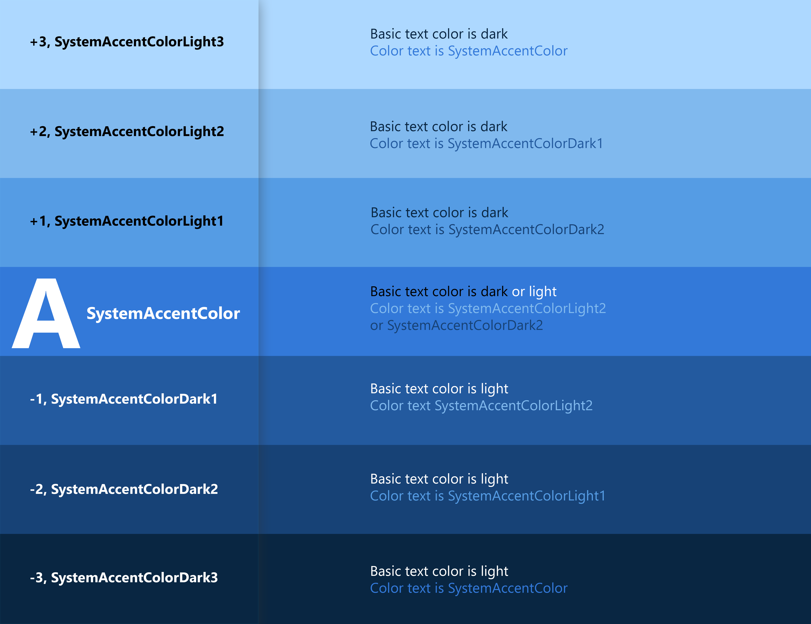

# Color


Color provides an intuitive way of communicating information to users in your app: it can be used to indicate interactivity, give feedback to user actions, and give your interface a sense of visual continuity.

In Windows apps, colors are primarily determined by accent color and theme. In this article, we'll discuss how you can use color in your app, and how to use accent color and theme resources to make your Windows app usable in any theme context.

## Color principles

:::row:::
    :::column:::
**Use color meaningfully.**
When color is used sparingly to highlight important elements, it can help create a user interface that is fluid and intuitive.
    :::column-end:::
    :::column:::
**Use color to indicate interactivity.**
It's a good idea to choose one color to indicate elements of your application that are interactive. For example, many web pages use blue text to denote a hyperlink.
    :::column-end:::
:::row-end:::

:::row:::
    :::column:::
**Color is personal.**
In Windows, users can choose an accent color and a light or dark theme, which are reflected throughout their experience. You can choose how to incorporate the user's accent color and theme into your application, personalizing their experience.
    :::column-end:::
    :::column:::
**Color is cultural.**
Consider how the colors you use will be interpreted by people from different cultures. For example, in some cultures the color blue is associated with virtue and protection, while in others it represents mourning.
    :::column-end:::
:::row-end:::

## Themes

Windows apps can use a light or dark application theme. The theme affects the colors of the app's background, text, icons, and [common controls](../controls-and-patterns/index.md).

### Light theme


### Dark theme


By default, your Windows app's theme is the user’s theme preference from Windows Settings or the device's default theme (i.e., dark on Xbox). However, you can set the theme for your Windows app.

### Changing the theme

You can change themes by changing the **RequestedTheme** property in your `App.xaml` file.

```XAML
<Application
    x:Class="App9.App"
    xmlns="http://schemas.microsoft.com/winfx/2006/xaml/presentation"
    xmlns:x="http://schemas.microsoft.com/winfx/2006/xaml"
    xmlns:local="using:App9"
    RequestedTheme="Dark">
</Application>
```

Removing the **RequestedTheme** property means that your application will use the user’s system settings.

Users can also select the high contrast theme, which uses a small palette of contrasting colors that makes the interface easier to see. In that case, the system will override your RequestedTheme.

### Testing themes

If you don't request a theme for your app, make sure to test your app in both light and dark themes to ensure that your app will be legible in all conditions.

**Note**: In Visual Studio, the default RequestedTheme is light, so you'll need to change the RequestedTheme to test both.

## Theme brushes

Common controls automatically use [theme brushes](../controls-and-patterns/xaml-theme-resources.md#the-xaml-color-ramp-and-theme-dependent-brushes) to adjust contrast for light and dark themes.

For example, here's an illustration of how the [AutoSuggestBox](../controls-and-patterns/auto-suggest-box.md) uses theme brushes:


The theme brushes are used for the following purposes:

- **Base** is for text.
- **Alt** is the inverse of Base.
- **Chrome** is for top-level elements, such as navigation panes or command bars.
- **List** is for list controls.

**Low**/**Medium**/**High** refer to the intensity of the color.

### Using theme brushes

:::row:::
    :::column:::
When creating templates for custom controls, use theme brushes rather than hard code color values. This way, your app can easily adapt to any theme.

For example, these [item templates for ListView](../controls-and-patterns/item-templates-listview.md) demonstrate how to use theme brushes in a custom template.
    :::column-end:::
    :::column:::
 
    :::column-end:::
:::row-end:::

```xaml
<ListView ItemsSource="{x:Bind ViewModel.Recordings}">
    <ListView.ItemTemplate>
        <DataTemplate x:Name="DoubleLineDataTemplate" x:DataType="local:Recording">
            <StackPanel Orientation="Horizontal" Height="64" AutomationProperties.Name="{x:Bind CompositionName}">
                <Ellipse Height="48" Width="48" VerticalAlignment="Center">
                    <Ellipse.Fill>
                        <ImageBrush ImageSource="Placeholder.png"/>
                    </Ellipse.Fill>
                </Ellipse>
                <StackPanel Orientation="Vertical" VerticalAlignment="Center" Margin="12,0,0,0">
                    <TextBlock Text="{x:Bind CompositionName}"  Style="{ThemeResource BaseTextBlockStyle}" Foreground="{ThemeResource SystemControlPageTextBaseHighBrush}" />
                    <TextBlock Text="{x:Bind ArtistName}" Style="{ThemeResource BodyTextBlockStyle}" Foreground="{ThemeResource SystemControlPageTextBaseMediumBrush}"/>
                </StackPanel>
            </StackPanel>
        </DataTemplate>
    </ListView.ItemTemplate>
</ListView>
```

For more information about how to use theme brushes in your app, see [Theme Resources](../controls-and-patterns/xaml-theme-resources.md).

## Accent color

Common controls use an accent color to convey state information. By default, the accent color is the `SystemAccentColor` that users select in their Settings. However, you can also customize your app's accent color to reflect your brand.


:::row:::
    :::column:::


    :::column-end:::
    :::column:::


    :::column-end:::
:::row-end:::

### Overriding the accent color

To change your app's accent color, place the following code in `app.xaml`.

```xaml
<Application.Resources>
    <ResourceDictionary>
        <Color x:Key="SystemAccentColor">#107C10</Color>
    </ResourceDictionary>
</Application.Resources>
```

### Choosing an accent color

If you select a custom accent color for your app, please make sure that text and backgrounds that use the accent color have sufficient contrast for optimal readability. To test contrast, you can use the color picker tool in Windows Settings, or you can use these [online contrast tools](https://www.w3.org/TR/WCAG20-TECHS/G18.html#G18-resources).


## Accent color palette

An accent color algorithm in the Windows shell generates light and dark shades of the accent color.


These shades can be accessed as [theme resources](../controls-and-patterns/xaml-theme-resources.md):

- `SystemAccentColorLight3`
- `SystemAccentColorLight2`
- `SystemAccentColorLight1`
- `SystemAccentColorDark1`
- `SystemAccentColorDark2`
- `SystemAccentColorDark3`

<!-- check this is true -->
You can also access the accent color palette programmatically with the [**UISettings.GetColorValue**](/uwp/api/Windows.UI.ViewManagement.UISettings#Windows_UI_ViewManagement_UISettings_GetColorValue_Windows_UI_ViewManagement_UIColorType_) method and [**UIColorType**](/uwp/api/Windows.UI.ViewManagement.UIColorType) enum.

You can use the accent color palette for color theming in your app. Below is an example of how you can use the accent color palette on a button.


```xaml
<Page.Resources>
    <ResourceDictionary>
        <ResourceDictionary.ThemeDictionaries>
            <ResourceDictionary x:Key="Light">
                <SolidColorBrush x:Key="ButtonBackground" Color="{ThemeResource SystemAccentColor}"/>
                <SolidColorBrush x:Key="ButtonBackgroundPointerOver" Color="{ThemeResource SystemAccentColorLight1}"/>
                <SolidColorBrush x:Key="ButtonBackgroundPressed" Color="{ThemeResource SystemAccentColorDark1}"/>
            </ResourceDictionary>
        </ResourceDictionary.ThemeDictionaries>
    </ResourceDictionary>
</Page.Resources>

<Button Content="Button"></Button>
```

When using colored text on a colored background, make sure there is enough contrast between text and background. By default, hyperlink or hypertext will use the accent color. If you apply variations of the accent color to the background, you should use a variation of the original accent color to optimize the contrast of colored text on a colored background.

The chart below illustrates an example of the various light/dark shades of accent color, and how colored type can be applied on a colored surface.



For more information about styling controls, see [XAML styles](../controls-and-patterns/xaml-styles.md).

## Color API

There are several APIs that can be used to add color to your application. First, the [**Colors**](/uwp/api/windows.ui.colors) class, which implements a large list of predefined colors. These can be accessed automatically with XAML properties. In the example below, we create a button and set the background and foreground color properties to members of the **Colors** class.

```xaml
<Button Background="MediumSlateBlue" Foreground="White">Button text</Button>
```

You can create your own colors from RGB or hex values using the [**Color**](/uwp/api/windows.ui.color) struct in XAML.

```xaml
<Color x:Key="LightBlue">#FF36C0FF</Color>
```

You can also create the same color in code by using the **FromArgb** method.

```csharp
Color LightBlue = Color.FromArgb(255,54,192,255);
```
```cppwinrt
Windows::UI::Color LightBlue = Windows::UI::ColorHelper::FromArgb(255,54,192,255);
```

The letters "Argb" stands for Alpha (opacity), Red, Green, and Blue, which are the four components of a color. Each argument can range from 0 to 255. You can choose to omit the first value, which will give you a default opacity of 255, or 100% opaque.

> [!Note]
> If you're using C++, you must create colors by using the [**ColorHelper**](/uwp/api/windows.ui.colorhelper) class.

The most common use for a **Color** is as an argument for a [**SolidColorBrush**](/uwp/api/windows.ui.xaml.media.solidcolorbrush), which can be used to paint UI elements a single solid color. These brushes are generally defined in a [**ResourceDictionary**](/uwp/api/Windows.UI.Xaml.ResourceDictionary), so they can be reused for multiple elements.

```xaml
<ResourceDictionary>
    <SolidColorBrush x:Key="ButtonBackgroundBrush" Color="#FFFF4F67"/>
    <SolidColorBrush x:Key="ButtonForegroundBrush" Color="White"/>
</ResourceDictionary>
```

For more information on how to use brushes, see [XAML brushes](brushes.md).

## Scoping system colors

In addition to defining your own colors in your app, you can also scope our systematized colors to desired regions throughout your app by using the **ColorPaletteResources** tag. This API allows you to not only colorize and theme large groups of controls at once by setting a few properties, but also gives you many other system benefits that you wouldn't normally get with defining your own custom colors manually:

- Any color set using **ColorPaletteResources** will not effect High Contrast
  * Meaning your app will be accessible to more people without any additional design or dev cost
- Can easily set colors to Light, Dark or pervasive across both themes by setting one property on the API
- Colors set on **ColorPaletteResources** will cascade down to all similar controls that also use that system color
  * This ensures that you will have a consistent color story across your app while maintaining the look of your brand
- Effects all visual states, animations and opacity variations without needing to re-template

### How to use ColorPaletteResources

ColorPaletteResources is an API that tells the system what resources are being scoped where. ColorPaletteResources must take an [x:Key](../../xaml-platform/x-key-attribute.md), that can be one of three choices:
- Default
  * Will show your color changes in both [Light](#light-theme) and [Dark](#dark-theme) theme
- Light
  * Will show your color changes only in [Light theme](#light-theme)
- Dark
  * Will show your color changes only in [Dark theme](#dark-theme)

Setting that x:Key will ensure that your colors change appropriately to the system or app theme, should you want a different custom appearance when in either theme.

### How to apply scoped colors

Scoping resources through the **ColorPaletteResources** API in XAML allows you to take any system color or brush that's in our [theme resources](../controls-and-patterns/xaml-theme-resources.md) library and redefine them within the scope of a page or container.

For example, if you defined two system colors - **BaseLow** and **BaseMediumLow** inside a grid, and then placed two buttons on your page: one inside that grid, and one outside:

```xaml
<Grid x:Name="Grid_A">
    <Grid.Resources>
        <ColorPaletteResources x:Key="Default"
        BaseLow="LightGreen"
        BaseMediumLow="DarkCyan"/>
    </Grid.Resources>

    <Buton Content="Button_A"/>
</Grid>
<Buton Content="Button_B"/>
```

You would get **Button_A** with the applied new colors, and **Button_B** would remain looking like our system default button:


However, since all our system colors cascade down to other controls too, setting **BaseLow** and **BaseMediumLow** will affect more than just buttons. In this case, controls like **ToggleButton**, **RadioButton** and **Slider** will also be effected by these system color changes, should those controls be put in above example grid's scope.
If you wish to scope a system color change *to a single controls only* you can do so by defining **ColorPaletteResources** within that control's resources:

```xaml
<Grid x:Name="Grid_A">
    <Button Content="Button_A">
        <Button.Resources>
            <ColorPaletteResources x:Key="Default"
                BaseLow="LightGreen"
                BaseMediumLow="DarkCyan"/>
        </Button.Resources>
    </Button>
</Grid>
<Button Content="Button_B"/>
```
You essentially have the exact same thing as before, but now any other controls added to the grid will not pick up the color changes. This is because those system colors are scoped to **Button_A** only.

### Nesting scoped resources

Nesting system colors is also possible, and is done so by placing **ColorPaletteResources** in the nested elements' resources within the markup of your app layout:

```xaml
<Grid x:Name="Grid_A">
    <Grid.Resources>
        <ColorPaletteResources x:Key="Default"
            BaseLow="LightGreen"
            BaseMediumLow="DarkCyan"/>
    </Grid.Resources>

    <Button Content="Button_A"/>
    <Grid x:Name="Grid_B">
        <Grid.Resources>
            <ColorPaletteResources x:Key="Default"
                BaseLow="Goldenrod"
                BaseMediumLow="DarkGoldenrod"/>
        </Grid.Resources>

        <Button Content="Nested Button"/>
    </Grid>
</Grid>
```

In this example, **Button_A** is inheriting colors define in **Grid_A**'s resources, and **Nested Button** is inheriting colors from **Grid_B**'s resources. By extension, this means that any other controls placed within **Grid_B** will check or apply **Grid_B**'s resources first, before checking or applying **Grid_A**'s resources, and finally applying our default colors if nothing is defined at the page or app level.

This works for any number of nested elements whose resources have color definitions.

### Scoping with a ResourceDictionary

You are not limited to a container or page’s resources, and can also define these system colors in a ResourceDictionary that can then be merged at any scope the way you normally would merge a dictionary.

#### MyCustomTheme.xaml

First, you would create a ResourceDictionary. Then place the **ColorPaletteResources** within the ThemeDictionaries and override the desired system colors:

```xaml
<ResourceDictionary
    xmlns="http://schemas.microsoft.com/winfx/2006/xaml/presentation"
    xmlns:x="http://schemas.microsoft.com/winfx/2006/xaml"
    xmlns:local="using:TestApp">

    <ResourceDictionary.ThemeDictionaries>
        <ResourceDictionary x:Key="Default">
            <ResourceDictionary.MergedDictionaries>

                <ColorPaletteResources x:Key="Default"
                    Accent="#FF0073CF"
                    AltHigh="#FF000000"
                    AltLow="#FF000000"/>

            </ResourceDictionary>
        </ResourceDictionary.MergedDictionaries>        
    </ResourceDictionary.ThemeDictionaries>
</ResourceDictionary>
```

#### MainPage.xaml

On the page containing your layout, simply merge that dictionary in at the scope you want:

```xaml
<Grid x:Name="Grid_A">
    <Grid.Resources>
            <ResourceDictionary>
                <ResourceDictionary.MergedDictionaries>
                    <ResourceDictionary Source="MyCustomTheme.xaml"/>
                </ResourceDictionary.MergedDictionaries>
            </ResourceDictionary>
    </Grid.Resources>

    <Button Content="Button_A"/>
</Grid>
```

Now, all resources, theming, and custom colors can be placed in a single **MyCustomTheme** resource dictionary and scoped where needed without having to worry about extra clutter in your layout markup.

### Other ways to define color resources

ColorPaletteResources also allows for system colors to be placed and defining directly within it as a wrapper, rather than in line:

``` xaml
<ColorPaletteResources x:Key="Dark">
    <Color x:Key="SystemBaseLowColor">Goldenrod</Color>
</ColorPaletteResources>
```

## Usability

:::row:::
    :::column:::

    :::column-end:::
    :::column span="2":::
**Contrast**

Make sure that elements and images have sufficient contrast to differentiate between them, regardless of the accent color or theme.

When considering what colors to use in your application, accessibility should be a primary concern. Use the guidance below to make sure your application is accessible to as many users as possible.
    :::column-end:::
:::row-end:::

:::row:::
    :::column:::

    :::column-end:::
    :::column span="2":::
**Lighting**

Be aware that variation in ambient lighting can affect the usability of your app. For example, a page with a black background might unreadable outside due to screen glare, while a page with a white background might be painful to look at in a dark room.
    :::column-end:::
:::row-end:::

:::row:::
    :::column:::

    :::column-end:::
    :::column span="2":::
**Colorblindness**

Be aware of how colorblindness could affect the usability of your application. For example, a user with red-green colorblindness will have difficulty distinguishing red and green elements from each other. About **8 percent of men** and **0.5 percent of women** are red-green colorblind, so avoid using these color combinations as the sole differentiator between application elements.
    :::column-end:::
:::row-end:::

## Related articles

- [XAML Styles](../controls-and-patterns/xaml-styles.md)
- [XAML Theme Resources](../controls-and-patterns/xaml-theme-resources.md)