# Icons for UWP apps

Good icons harmonize with typography and with the rest of the design language. They don’t mix metaphors, and they communicate only what’s needed, as speedily and simply as possible. 

## Linear scaling size ramps 

<table>
    <tr> 
        <td>16px x 16px</td>
        <td>24px x 24px</td>
        <td>32px x 32px</td>
        <td>48px x 48px</td>
    </tr>
    <tr> 
        <td></td>
        <td></td>
        <td></td>
        <td></td>
    </tr>
</table>

## Common shapes

Icons should generally maximize their given space with little padding. These shapes provide starting points for sizing basic shapes. 

Use the shape that corresponds to the icon's orientation and compose around these basic parameters. Icons don't necessarily need to fill or fit completely inside the shape and may be adjusted as needed to ensure optimal balance. 

<table class="uwpd-noborder">
    <tr>
        <td>Circle<td>
        <td>Square</td>
        <td>Triangle</td>
    </tr>
    <tr>
        <td>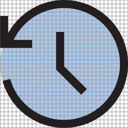<td>
        <td></td>
        <td>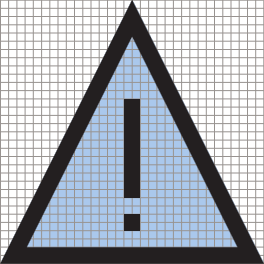</td>
    </tr>
        <tr>
        <td>Horizontal rectangle<td>
        <td colspan="2">Vertical rectangle</td>        
        </tr>
    <tr>
        <td>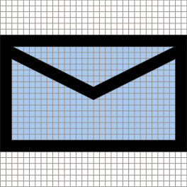<td>
        <td colspan="2">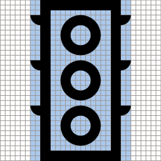</td>
         
    </tr>

</table>

## Angles

In addition to using the same grid and line weight, icons are constructed with common elements. 

Using only these angles in building shapes creates consistency across all our icons, and ensures the icons render correctly. 

These lines can be combined, joined, rotated, and reflected in creating icons. 

<table>
    <tr>
        <td>**1:1** 45°</td>
        <td>**1:2** 26.57° (vertical) 63.43° (horizontal)</td>
        <td>**1:3** 18.43° (vertical) 71.57° (horizontal)</td>
        <td>**1:4** 14.04° (vertical) 75.96° (horizontal)</td>
    </tr>
    <tr>
        
        <td>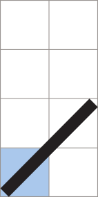</td>
        <td>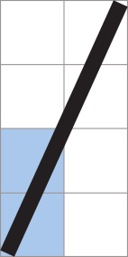</td>
        <td>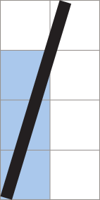</td>
        <td>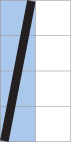</td>
    </tr>  
</table>

Here are some examples:

<table>
    <tr>
        <td>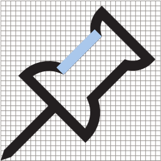</td>
        <td></td>
        <td></td>
        <td></td>
    </tr>
</table>

## Curves

Curved lines are constructed from sections of a whole circle and should not be skewed unless needed to snap to the pixel grid. 

<table>
    <tr>
        <td>1/4 circle</td>
        <td>1/8 circle</td>
    </tr>
    <tr>
        <td></td>
        <td></td>
    </tr>
    <tr>
        <td>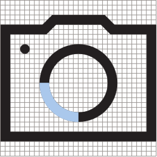</td>
        <td>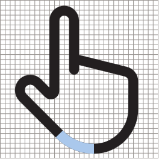</td>
    </tr>    
</table>

## Geometric construction

We recommend using only pure geometric shapes when constructing icons.

## Filled shapes 

Icons can contain filled shapes when needed, but they should not be more than 4px at 32px × 32px. Filled circles should not be larger than 6px × 6px. 

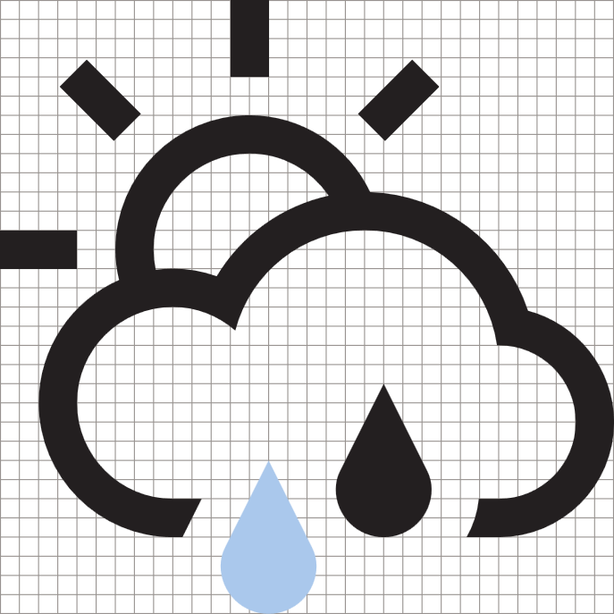

## Badges

A "badge" is a generic term used to describe an element added to an icon that's not meant to be integrated with the base icon element. These usually convey other pieces of information about the icon like status or action. Other commons terms include: overlay, annotation, or modifier. 

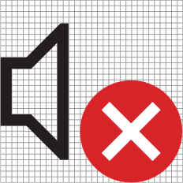

Status badges utilize a filled, colored object that is on top of the icon, whereas action badges are integrated into the icon in the same monochrome style and line weight.

<table>
<tr>
	<td>Common status badges</td>
	<td>Common action badges</td>
</tr>
<tr>
	<td></td>
	<td>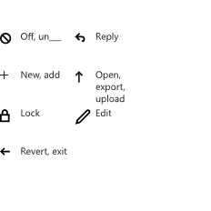</td>
</tr>
</table>

### Badge color 

Color badging should only be used to convey the state of an icon. The colors used in status badging convey specific emotional messages to the user. 

<table>
<tr><td>Green - #128B44</td><td>Blue - #2C71B9</td><td>Yellow - #FDC214</td></tr>
<tr><td>Positive: done, 
completed </td><td>Neutral: help, 
notification </td><td>Cautionary: alert, warning </td></tr>
<tr><td></td><td></td>
<td>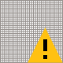</td></tr>
</table>

### Badge position

The default position for any status or action is the bottom right. Only use the other positions when the design will not allow it. 

### Badge sizing

Badges should be sized to 10–18 px on a 32 px × 32 px grid. 

## Related articles

* [Guidelines for tile and icon assets](../shell/tiles-and-notifications/app-assets.md)
