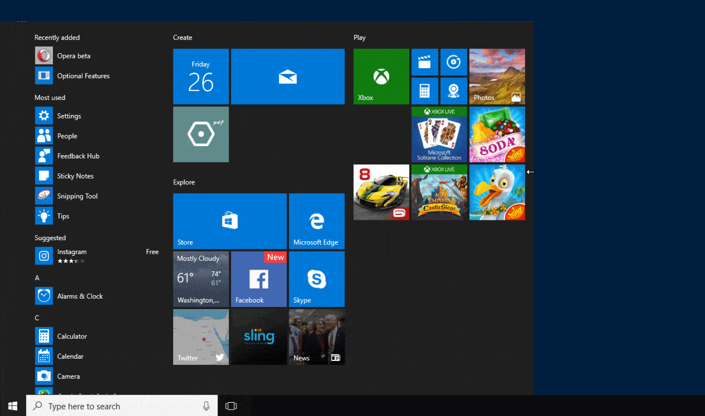
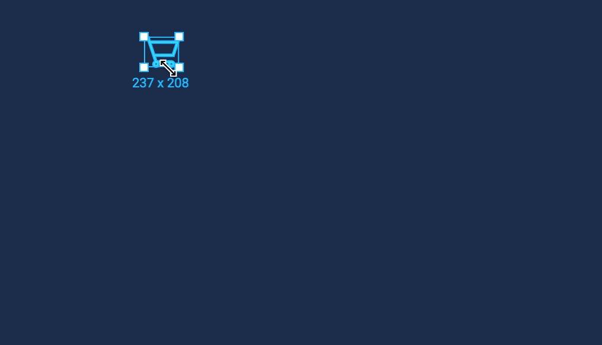
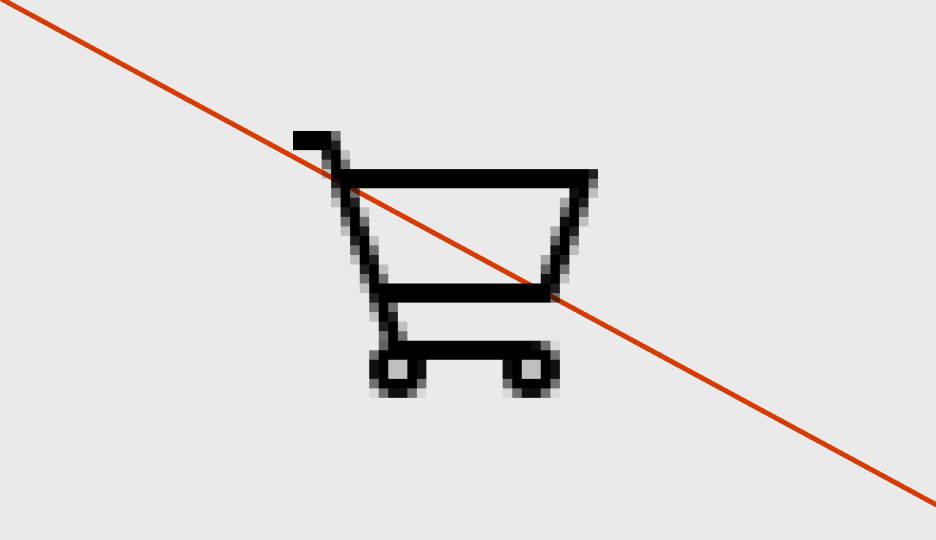
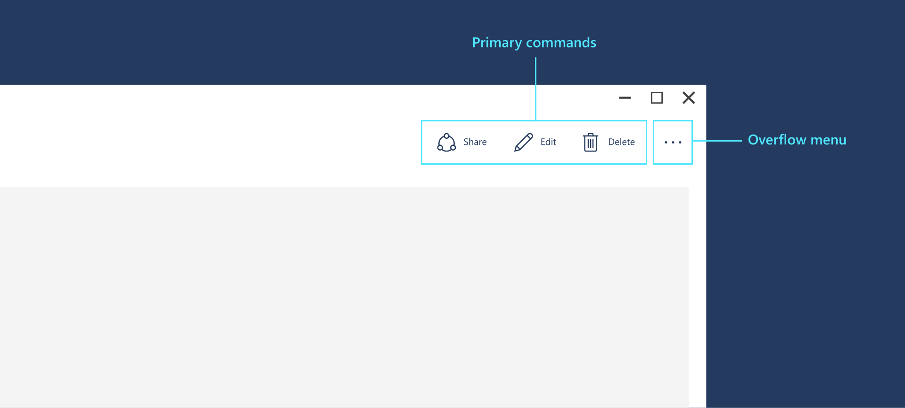
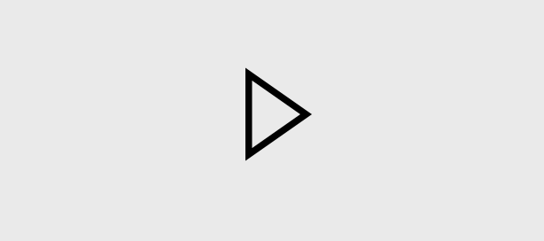

# Icons for Windows apps


Icons provide a visual shorthand for an action, concept, or product. By compressing meaning into a symbolic image, icons can cross language barriers and help conserve an extremely valuable resource: screen space. 

Icons can appear in apps—and outside them: 

:::row:::
    :::column:::
        **Icons inside the app**

        
Inside your app, you use icons to represent an action, such as copying text or navigating to the settings page.
    :::column-end:::
	:::column:::
**Icons outside the app**

		
Outside your app, Windows uses an icon to represent your app in the start menu and in the taskbar. If the user chooses to pin your app to the start menu, your app's start tile can feature your app's icon. Your app's icon appears in the title bar and you can choose to create a splash screen with your app's logo.
    :::column-end:::
:::row-end:::

This article describes icons within your app. To learn about icons outside your app (app icons), see the [app and tile icons article](./app-icons-and-logos.md).

## When to use icons

Icons can save space, but when should you use them? 

:::row:::
    :::column:::
        
        <br>

Use an icon for actions, like cut, copy, paste, and save, or for navigation items in a navigation menu.
    :::column-end:::
	:::column:::
		
        <br>

Use an icon if one already exists for the concept you want to represent. (To see whether an icon exists, check the Segoe icon list.)
    :::column-end:::
:::row-end:::

:::row:::
    :::column:::
        
        <br>

Use an icon if it's easy for the user to understand what the icon means and it's simple enough to be clear at small sizes.
    :::column-end:::
	:::column:::
		
        <br>

Don't use an icon if its meaning isn't clear, or if making it clear requires a complex shape.
    :::column-end:::
:::row-end:::


## Using the right type of icon

There are many ways to create an icon. You can use a symbol font like Segoe MDL2 Assets. You could create your own vector-based image. You can even use a bitmap image, although we don't recommend it. Here's a summary of the different ways you can add an icon to your app. 

### Use a predefined icon.
:::row:::
    :::column:::
Microsoft provides over 1000 icons in the form of the Segoe MDL2 Assets font. It might not be intuitive to get an icon from a font, but our font display technology means these icons will look crisp and sharp on any display, at any resolution, and at any size. For instructions, see [Segoe MDL2 icons](segoe-ui-symbol-font.md).
    :::column-end:::
    :::column:::
        
    :::column-end:::
:::row-end:::

### Use a font.
:::row:::
    :::column:::
You don't have to use the Segoe MDL2 Assets font--you can use any font the user has installed on their system, such as Wingdings or Webdings.
    :::column-end:::
    :::column:::
        
    :::column-end:::
:::row-end:::

### Use a Scalable Vector Graphics (SVG) file.
:::row:::
    :::column:::
SVG resources are ideal for icons, because they always look sharp at any size or resolution. Most drawing applications can export to SVG. For instructions, see [SVGImageSource](/uwp/api/windows.ui.xaml.media.imaging.svgimagesource).
    :::column-end:::
    :::column:::
        
    :::column-end:::
:::row-end:::

### Use Geometry objects.
:::row:::
    :::column:::
Like SVG files, geometries are a vector-based resource, so they always look sharp. However, creating a geometry is complicated because you have to individually specify each point and curve. It's really only a good choice if you need to modify the icon while your app is running (to animate it, for example). For instructions, see [Move and draw commands for geometries](../../xaml-platform/move-draw-commands-syntax.md). 
    :::column-end:::
    :::column:::
        
    :::column-end:::
:::row-end:::

### You can also use a bitmap image, such as PNG, GIF, or JPEG, although we don't recommend it.
:::row:::
    :::column:::
Bitmap images are created at a specific size, so they have to be scaled up or down depending on how large you want the icon to be and the resolution of the screen. When the image is scaled down (shrunk), it can appear blurry; when it's scaled up, it can appear blocky and pixelated. If you have to use a bitmap image we recommend using a PNG or GIF over a JPEG. 
    :::column-end:::
    :::column:::
        
        
    :::column-end:::
:::row-end:::

## Make the icon do something

Once you have an icon, the next step is to make it do something by associating it with command or a navigation action. The best way to do this is to add the icon to a button or a command bar. 



## Create an icon button

You can put an icon in a standard button. Since you can use buttons in a wider variet of places, this gives you a little more flexibility for where your action icon appears. 

The are a few ways to add an icon to a button:

:::row:::
    :::column span="2":::
        <b>Step 1</b><br>
Set the button's font family to `Segoe MDL2 Assets` and its content property to the unicode value of the glyph you want to use:
    :::column-end:::
	:::column:::
        
    :::column-end:::
:::row-end:::

```xaml 
<Button FontFamily="Segoe MDL2 Assets" Content="&#xE102;" />
```

:::row:::
    :::column span="2":::
        <b>Step 2</b><br>
You can use one of the icon element objects: [BitmapIcon](/uwp/api/windows.ui.xaml.controls.bitmapicon),
[FontIcon](/uwp/api/windows.ui.xaml.controls.fonticon), 
[PathIcon](/uwp/api/windows.ui.xaml.controls.pathicon), or
[SymbolIcon](/uwp/api/windows.ui.xaml.controls.symbolicon). This gives you more types of icons to choose from, and enables you to combine icons and other types of content, such as text, if you want:
    :::column-end:::
	:::column:::
        
    :::column-end:::
:::row-end:::

```xaml 
<Button>
    <StackPanel>
        <SymbolIcon Symbol="Play" />
        <TextBlock>Play the movie</TextBlock>
    </StackPanel>
</Button>
```

## Create a series of icons in a command bar

:::row:::
    :::column span:::
When you have a series of commands that go together, such as cut/copy/paste or a set of drawing commands for a photo-editing program, put them together in a [command bar](../controls-and-patterns/app-bars.md). A command bar takes one or more app bar buttons or app bar toggle buttons, each of which represents an action. Each button has an [Icon](/uwp/api/windows.ui.xaml.controls.appbarbutton#Windows_UI_Xaml_Controls_AppBarButton_Icon) property you use to control which icon it displays. There are a variety of ways to specify the icon. 
    :::column-end:::
	:::column:::
        
    :::column-end:::
:::row-end:::

The easiest way is to use the list of predefined icons we provide—simply specify the icon name, such as "Back" or "Stop", and the system will draw it: 

``` xaml
<CommandBar>
    <AppBarToggleButton Icon="Shuffle" Label="Shuffle" Click="AppBarButton_Click" />
    <AppBarToggleButton Icon="RepeatAll" Label="Repeat" Click="AppBarButton_Click"/>
    <AppBarSeparator/>
    <AppBarButton Icon="Back" Label="Back" Click="AppBarButton_Click"/>
    <AppBarButton Icon="Stop" Label="Stop" Click="AppBarButton_Click"/>
    <AppBarButton Icon="Play" Label="Play" Click="AppBarButton_Click"/>
    <AppBarButton Icon="Forward" Label="Forward" Click="AppBarButton_Click"/>
</CommandBar>

```
For the complete list of icon names, see the [Symbol enumeration](/uwp/api/windows.ui.xaml.controls.symbol). 

There are other ways to provide icons for a button in a command bar:

+ [FontIcon](/uwp/api/windows.ui.xaml.controls.fonticon) - the icon is based on a glyph from the specified font family.
+ [BitmapIcon](/uwp/api/windows.ui.xaml.controls.bitmapicon) - the icon is based on a bitmap image file with the specified **Uri**.
+ [PathIcon](/uwp/api/windows.ui.xaml.controls.pathicon) - the icon is based on [Path](/uwp/api/windows.ui.xaml.shapes.path) data.

To learn more about command bars, see the [command bar article](../controls-and-patterns/app-bars.md). 


## Related articles

* [App icons and logos](app-icons-and-logos.md)