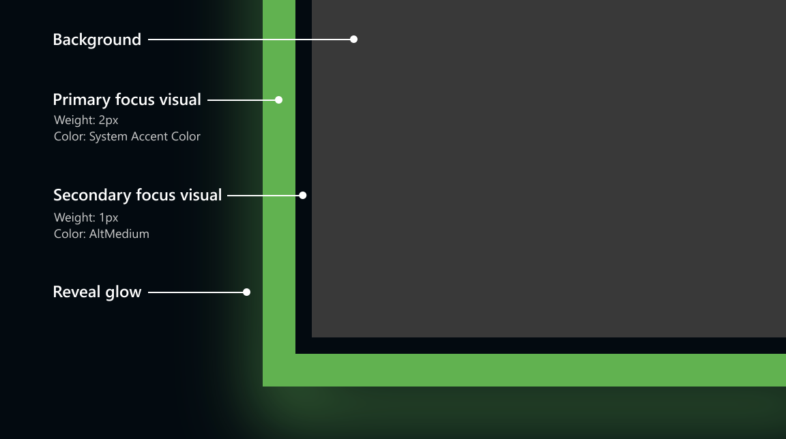

# Reveal focus

Reveal focus is a lighting effect for [10 foot experiences](/windows/uwp/design/devices/designing-for-tv), such as Xbox One and television screens. It  animates the border of focusable elements, such as buttons, when the user moves gamepad or keyboard focus to them. It's turned off by default, but it's simple to enable. 

(For the Reveal highlight effect, a lighting affect that highlights interactive elements, see the [Reveal highlight article](/windows/uwp/design/style/reveal).)


> **Important APIs**: [Application.FocusVisualKind property](https://docs.microsoft.com/uwp/api/windows.ui.xaml.application#Windows_UI_Xaml_Application_FocusVisualKind), [FocusVisualKind enum](https://docs.microsoft.com/uwp/api/windows.ui.xaml.focusvisualkind), [Control.UseSystemFocusVisuals property](/uwp/api/Windows.UI.Xaml.Controls.Control#Windows_UI_Xaml_Controls_Control_UseSystemFocusVisuals)

## How it works
Reveal focus calls attention to focused elements by adding an animated glow around the element's border:


Reveal focus gives call attention to how focus is moving around the UI and which element currently has focus. This is especially helpful in 10 foot scenarios where the user might not be paying full attention to the entire TV screen. 

## Examples

<table>
<th align="left">XAML Controls Gallery<th>
<tr>
<td></img></td>
<td>
    <p>If you have the <strong style="font-weight: semi-bold">XAML Controls Gallery</strong> app installed, click here to <a href="xamlcontrolsgallery:/item/RevealFocus">open the app and see Reveal focus in action</a>.</p>
    <ul>
    <li><a href="https://www.microsoft.com/store/productId/9MSVH128X2ZT">Get the XAML Controls Gallery app (Microsoft Store)</a></li>
    <li><a href="https://github.com/Microsoft/Windows-universal-samples/tree/master/Samples/XamlUIBasics">Get the source code (GitHub)</a></li>
    </ul>
</td>
</tr>
</table>

## How to use it

Reveal focus is off by default. To enable it:
1. In your app's constructor, call the [AnalyticsInfo.VersionInfo.DeviceFamily](/uwp/api/windows.system.profile.analyticsversioninfo#Windows_System_Profile_AnalyticsVersionInfo_DeviceFamily) property and check whether the current device family is `Windows.Xbox`.
2. If the device family is `Windows.Xbox`, set the [Application.FocusVisualKind](/uwp/api/windows.ui.xaml.application#Windows_UI_Xaml_Application_FocusVisualKind) property to `FocusVisualKind.Reveal`. 

```csharp
    if(AnalyticsInfo.VersionInfo.DeviceFamily == "Windows.Xbox")
    {
        this.FocusVisualKind = FocusVisualKind.Reveal;
    }
```

After you set the **FocusVisualKind** property, the system automatically applies the reveal focus effect to all controls whose [UseSystemFocusVisuals](/uwp/api/Windows.UI.Xaml.Controls.Control#Windows_UI_Xaml_Controls_Control_UseSystemFocusVisuals) property is set to **True** (the default value for most controls). 

## Why isn't Reveal focus on by default? 
As you can see, it's fairly easy to turn on Reveal focus when the app detects it's running on an Xbox. So, why doesn't the system just turn it on for you? Because Reveal focus increases the size of the focus visual, which might cause issues with your UI layout. In some cases, you'll want to customize the Reveal focus effect to optimize it for your app.

## Customizing Reveal focus

You can customize the Reveal focus effect by modifying the focus visual properties for each control: [FocusVisualPrimaryThickness](https://docs.microsoft.com/uwp/api/windows.ui.xaml.frameworkelement#Windows_UI_Xaml_FrameworkElement_FocusVisualPrimaryThickness), [FocusVisualSecondaryThickness](https://docs.microsoft.com/uwp/api/windows.ui.xaml.frameworkelement#Windows_UI_Xaml_FrameworkElement_FocusVisualSecondaryThickness), [FocusVisualPrimaryBrush](https://docs.microsoft.com/uwp/api/windows.ui.xaml.frameworkelement#Windows_UI_Xaml_FrameworkElement_FocusVisualPrimaryBrush), and [FocusVisualSecondaryBrush](https://docs.microsoft.com/uwp/api/windows.ui.xaml.frameworkelement#Windows_UI_Xaml_FrameworkElement_FocusVisualSecondaryBrush). These properties let you customize the color and thickness of the focus rectangle. (They're the same properties you use for creating [High Visibility focus visuals](https://docs.microsoft.com/windows/uwp/design/input/guidelines-for-visualfeedback#high-visibility-focus-visuals).) 

But before you start customzing it, it's helpful to know a little more about about the components that make up Reveal focus.

There are three parts to the default Reveal focus visuals: the primary border, the secondary border and the Reveal glow. The primary border is **2px** thick, and runs around the *outside* of the secondary border. The secondary border is **1px** thick and runs around the *inside* of the primary border. The Reveal focus glow has a thickness proportional to the thickness of the primary border and runs around the *outside* of the primary border.

In addition to the static elements, Reveal focus visuals feature an animated light that pulsates when at rests and moves in the direction of focus when moving focus.



## Customize the border thickness

To change the thickness of the border types of a control, use these properties:

| Border type | Property |
| --- | --- |
| Primary, Glow   | [FocusVisualPrimaryThickness](https://docs.microsoft.com/uwp/api/windows.ui.xaml.frameworkelement#Windows_UI_Xaml_FrameworkElement_FocusVisualPrimaryThickness)<br/> (Changing the primary border changes the thickness of the glow proportionately.)   |
| Secondary   | [FocusVisualSecondaryThickness](https://docs.microsoft.com/uwp/api/windows.ui.xaml.frameworkelement#Windows_UI_Xaml_FrameworkElement_FocusVisualSecondaryThickness)   |


This example changes the border thickness of a button's focus visual:

```xaml
<Button FocusVisualPrimaryThickness="2" FocusVisualSecondaryThickness="1"/>
```

## Customize the margin

The margin is the space between the control's visual bounds and the start of the focus visuals secondary border. The default margin is 1px away from the control bounds. You can edit this margin on a per-control basis by changing the [FocusVisualMargin](https://docs.microsoft.com/uwp/api/windows.ui.xaml.frameworkelement#Windows_UI_Xaml_FrameworkElement_FocusVisualMargin) property:

```xaml
<Button FocusVisualPrimaryThickness="2" FocusVisualSecondaryThickness="1" FocusVisualMargin="-3"/>
```

A negative margin pushes the border away from the center of the control, and a positive margin moves the border closer to the center of the control.

## Customize the color

To change color of the reveal focus visual, use the [FocusVisualPrimaryBrush](https://docs.microsoft.com/uwp/api/windows.ui.xaml.frameworkelement#Windows_UI_Xaml_FrameworkElement_FocusVisualPrimaryBrush) and [FocusVisualSecondaryBrush](https://docs.microsoft.com/en-us/uwp/api/windows.ui.xaml.frameworkelement#Windows_UI_Xaml_FrameworkElement_FocusVisualSecondaryBrush) properties.

| Property | Default resource | Default resource value |
| ---- | ---- | --- | 
| [FocusVisualPrimaryBrush](https://docs.microsoft.com/uwp/api/windows.ui.xaml.frameworkelement#Windows_UI_Xaml_FrameworkElement_FocusVisualPrimaryBrush) | SystemControlRevealFocusVisualBrush  | SystemAccentColor |
| [FocusVisualSecondaryBrush](https://docs.microsoft.com/uwp/api/windows.ui.xaml.frameworkelement#Windows_UI_Xaml_FrameworkElement_FocusVisualSecondaryBrush)  | SystemControlFocusVisualSecondaryBrush  | SystemAltMediumColor |

(The FocusPrimaryBrush property only defaults to the **SystemControlRevealFocusVisualBrush** resources when **FocusVisualKind** is set to **Reveal**. Otherwise, it uses **SystemControlFocusVisualPrimaryBrush**.)


To change the color of the focus visual of an individual control, set the properties directly on the control. This example overrides the focus visual colors of a button.

```xaml

<!-- Specifying a color directly -->
<Button
    FocusVisualPrimaryBrush="DarkRed"
    FocusVisualSecondaryBrush="Pink"/>

<!-- Using theme resources -->
<Button
    FocusVisualPrimaryBrush="{ThemeResource SystemBaseHighColor}"
    FocusVisualSecondaryBrush="{ThemeResource SystemAccentColor}"/>    
```

To change the color of all focus visuals in your entire app, override the **SystemControlRevealFocusVisualBrush** and  **SystemControlFocusVisualSecondaryBrush** resources with your own definition:

```xaml
<!-- App.xaml -->
<Application.Resources>

    <!-- Override Reveal focus default resources. -->
    <SolidColorBrush x:Key="SystemControlRevealFocusVisualBrush" Color="{ThemeResource SystemBaseHighColor}"/>
    <SolidColorBrush x:Key="SystemControlFocusVisualSecondaryBrush" Color="{ThemeResource SystemAccentColor}"/>
</Application.Resources>
```

For more information on modifying the focus visual's color, see [Color Branding & Customizing](https://docs.microsoft.com/windows/uwp/design/input/guidelines-for-visualfeedback#color-branding--customizing).


## Show just the glow

If you'd like to use only the glow without the primary or secondary focus visual, simply set the control's [FocusVisualPrimaryBrush](https://docs.microsoft.com/uwp/api/windows.ui.xaml.frameworkelement#Windows_UI_Xaml_FrameworkElement_FocusVisualPrimaryBrush) property to `Transparent` and the [FocusVisualSecondaryThickness](https://docs.microsoft.com/uwp/api/windows.ui.xaml.frameworkelement#Windows_UI_Xaml_FrameworkElement_FocusVisualSecondaryThickness)  to `0`. In this case, the glow will adopt the color of the control background to provide a borderless feel. You can modify the thickness of the glow using [FocusVisualPrimaryThickness](https://docs.microsoft.com/uwp/api/windows.ui.xaml.frameworkelement#Windows_UI_Xaml_FrameworkElement_FocusVisualPrimaryThickness).

```xaml

<!-- Show just the glow -->
<Button
    FocusVisualPrimaryBrush="Transparent"
    FocusVisualSecondaryThickness="0" />    
```


## Use your own focus visuals

Another way to customize reveal focus is to opt out of the system-provided focus visuals by drawing your own using visual states. To learn more, see the [Focus visuals sample](http://go.microsoft.com/fwlink/p/?LinkID=619895).


## Reveal focus and the Fluent Design System

Reveal focus is a Fluent Design System component that adds light to your app. To learn more about the Fluent Design system and its other components, see the [Fluent Design for UWP overview](../fluent-design-system/index.md).

## Related articles

- [Reveal highlight](https://docs.microsoft.com/windows/uwp/design/style/reveal)
- [Designing for Xbox and TV](/windows/uwp/design/devices/designing-for-tv)
- [Gamepad and remote control interactions](https://docs.microsoft.com/windows/uwp/design/input/gamepad-and-remote-interactions)
- [Focus visuals sample](http://go.microsoft.com/fwlink/p/?LinkID=619895)
- [Composition Effects](https://msdn.microsoft.com/windows/uwp/graphics/composition-effects)
- [Science in the System: Fluent Design and Depth](https://medium.com/microsoft-design/science-in-the-system-fluent-design-and-depth-fb6d0f23a53f)
- [Science in the System: Fluent Design and Light](https://medium.com/microsoft-design/the-science-in-the-system-fluent-design-and-light-94a17e0b3a4f)
