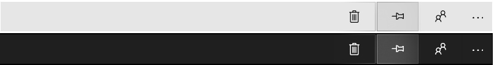

# Reveal Highlight


Reveal Highlight is a lighting effect that highlights interactive elements, such as command bars, when the user moves the pointer near them. 

> **Important APIs**: [RevealBrush class](/uwp/api/windows.ui.xaml.media.revealbrush), [RevealBackgroundBrush class](/uwp/api/windows.ui.xaml.media.revealbackgroundbrush), [RevealBorderBrush class](/uwp/api/windows.ui.xaml.media.revealborderbrush), [RevealBrushHelper class](/uwp/api/windows.ui.xaml.media.revealbrushhelper), [VisualState class](/uwp/api/Windows.UI.Xaml.VisualState)

## How it works
Reveal Highlight calls attention to interactive elements by revealing the element's container when the pointer is nearby, as shown in this illustration:


By exposing the hidden borders around objects, Reveal gives users a better understanding of the space that they are interacting with, and helps them understand the actions available. This is especially important in list controls and groupings of buttons.

## Examples

<table>
<th align="left">XAML Controls Gallery<th>
<tr>
<td></img></td>
<td>
    <p>If you have the <strong style="font-weight: semi-bold">XAML Controls Gallery</strong> app installed, click here to <a href="xamlcontrolsgallery:/item/Reveal">open the app and see Reveal in action</a>.</p>
    <ul>
    <li><a href="https://www.microsoft.com/store/productId/9MSVH128X2ZT">Get the XAML Controls Gallery app (Microsoft Store)</a></li>
    <li><a href="https://github.com/Microsoft/Xaml-Controls-Gallery">Get the source code (GitHub)</a></li>
    </ul>
</td>
</tr>
</table>

## Video summary

> [!VIDEO https://channel9.msdn.com/Events/Windows/Windows-Developer-Day-Fall-Creators-Update/WinDev013/player]

## How to use it

Reveal automatically works for some controls. For other controls, you can enable Reveal by assigning a special style to the control, as described in the [Enabling Reveal on other controls](#enabling-reveal-on-other-controls) and [Enabling Reveal on custom controls](#enabling-reveal-on-custom-controls) sections of this article.

## Controls that automatically use Reveal

- [**ListView**](../controls-and-patterns/lists.md)
- [**GridView**](../controls-and-patterns/lists.md)
- [**TreeView**](../controls-and-patterns/tree-view.md)
- [**NavigationView**](../controls-and-patterns/navigationview.md)
- [**MediaTransportControl**](../controls-and-patterns/media-playback.md)
- [**CommandBar**](../controls-and-patterns/app-bars.md)

These illustrations show Reveal Highlight on several different controls:


## Enabling Reveal on other controls

If you have a scenario where Reveal should be applied (these controls are main content and/or are used in a list or collection orientation), we've provided opt-in resource styles that allow you to enable Reveal for those types of situations.

These controls do not have Reveal by default as they are smaller controls that are usually helper controls to the main focal points of your application; but every app is different, and if these controls are used the most in your app, we've provided some styles to aid with that:

| Control Name   | Resource Name |
|----------|:-------------:|
| Button |  ButtonRevealStyle |
| ToggleButton | ToggleButtonRevealStyle |
| RepeatButton | RepeatButtonRevealStyle |
| AppBarButton | AppBarButtonRevealStyle |
| AppBarToggleButton | AppBarToggleButtonRevealStyle |
| GridViewItem (Reveal overtop of content) | GridViewItemRevealBackgroundShowsAboveContentStyle |

To apply these styles, simply set the control's [Style](/uwp/api/Windows.UI.Xaml.Style) property:

```xaml
<Button Content="Button Content" Style="{ThemeResource ButtonRevealStyle}"/>
```

### Reveal in themes

Reveal changes slightly depending on the requested theme of the control, app or user setting. In Dark theme Reveal's Border and Hover light is white, but in Light theme just the Borders darken to a light gray.



To enabled white borders while in light theme, simply set the requested theme on the control to Dark.

```xaml
<Grid RequestedTheme="Dark">
    <Button Content="Button" Click="Button_Click" Style="{ThemeResource ButtonRevealStyle}"/>
</Grid>
```

Or change the TargetTheme on the RevealBorderBrush to Dark. Remember! If the TargetTheme is set to Dark, then Reveal will be white, but if it's set to Light, Reveal's borders will be gray.

```xaml
 <RevealBorderBrush x:Key="MyLightBorderBrush" TargetTheme="Dark" Color="{ThemeResource SystemAccentColor}" FallbackColor="{ThemeResource SystemAccentColor}" />
```

## Enabling Reveal on custom controls

You can add Reveal to custom controls. Before you do, it's helpful to know a little more about how the Reveal effect works. Reveal is made up of two separate effects: **Reveal border** and **Reveal hover**.

- **Border** shows the borders of interactive elements when a pointer is nearby by. This effect shows you that those nearby objects can take actions similar to the one currently focused.
- **Hover**  applies a gentle halo shape around the hovered or focused item and plays a press animation on click. 


<!-- The Reveal recipe breakdown is:

- Border reveal will be on top of all content but on the designated edges
- Text and content will be displayed directly under Border Reveal
- Hover reveal will be beneath content and text
- The backplate (that turns on and enables Hover Reveal)
- The background (background of control) -->


These effects are defined by two brushes: 
* Border Reveal is defined by  **RevealBorderBrush**
* Hover Reveal is defined by **RevealBackgroundBrush**

```xaml
<RevealBorderBrush x:Key="MyRevealBorderBrush" TargetTheme="Light" Color="{ThemeResource SystemAccentColor}" FallbackColor="{ThemeResource SystemAccentColor}"/>
<RevealBackgroundBrush x:Key="MyRevealBackgroundBrush" TargetTheme="Light" Color="{StaticResource SystemAccentColor}" FallbackColor="{StaticResource SystemAccentColor}" />
```
In most cases we handle the usage of both of them by turning Reveal on automatically for a certain controls. However, other controls will need to be enabled through applying a style, or changing their templates directly.

### When to add Reveal
You can add Reveal to your custom controls--but before you do, consider the type of control and how it behaves. 
* If your custom control is a single interactive element and doesn't have similar controls sharing it's space (such as menu items in a menu), it's likely that your custom control doesn't need Reveal.  
* If you have a grouping of related interactive content or elements, then it's likely that that region of your app does need Reveal - this is commonly referred to as a [Commanding](../controls-and-patterns/collection-commanding.md) surface.

For example, a button by itself shouldn't use reveal, but a set of buttons in a command bar should use Reveal.

<!-- For example, NavigationView's items are related to page navigation. CommandBar's buttons relate to menu actions or page feature actions. MediaTransportControl's buttons beneath all relate to the media being played. -->

### Using the control template to add Reveal 
To enable Reveal on custom controls or re-templated controls, you modify the control's control template. Most control templates have a grid at the root; update the [VisualState](/uwp/api/windows.ui.xaml.visualstate) of that root grid to use Reveal:

```xaml
<VisualState x:Name="PointerOver">
    <VisualState.Setters>
        <Setter Target="RootGrid.(RevealBrush.State)" Value="PointerOver" />
        <Setter Target="RootGrid.Background" Value="{ThemeResource ButtonRevealBackgroundPointerOver}" />
        <Setter Target="ContentPresenter.BorderBrush" Value="Transparent"/>
        <Setter Target="ContentPresenter.Foreground" Value="{ThemeResource ButtonForegroundPointerOver}" />
    </VisualState.Setters>
</VisualState>
```

It's important to note that Reveal needs both the brush and the setters in it's Visual State to work correctly. Simply setting a control's brush to one of our Reveal brush resources alone won't enable Reveal for that control. Conversely, having only the targets or settings without the values being Reveal brushes will also not enable Reveal.

To learn more about modifying control templates, see the [XAML control templates](../controls-and-patterns/control-templates.md) article.

We've created a set of system Reveal brushes you can use to customize your template. For example, you can use the **ButtonRevealBackground** brush to create a custom button background, or the **ListViewItemRevealBackground** brush for custom lists, and so on. (To learn about how resources work in XAML, check out the [Xaml Resource Dictionary](../controls-and-patterns/resourcedictionary-and-xaml-resource-references.md) article.)

### Full template example

Here's an entire template for what a Reveal Button would look like:

```xaml
<Style TargetType="Button" x:Key="ButtonStyle1">
    <Setter Property="Background" Value="{ThemeResource ButtonRevealBackground}" />
    <Setter Property="Foreground" Value="{ThemeResource ButtonForeground}" />
    <Setter Property="BorderBrush" Value="{ThemeResource ButtonRevealBorderBrush}" />
    <Setter Property="BorderThickness" Value="2" />
    <Setter Property="Padding" Value="8,4,8,4" />
    <Setter Property="HorizontalAlignment" Value="Left" />
    <Setter Property="VerticalAlignment" Value="Center" />
    <Setter Property="FontFamily" Value="{ThemeResource ContentControlThemeFontFamily}" />
    <Setter Property="FontWeight" Value="Normal" />
    <Setter Property="FontSize" Value="{ThemeResource ControlContentThemeFontSize}" />
    <Setter Property="UseSystemFocusVisuals" Value="True" />
    <Setter Property="FocusVisualMargin" Value="-3" />
    <Setter Property="Template">
        <Setter.Value>
            <ControlTemplate TargetType="Button">
                <Grid x:Name="RootGrid" Background="{TemplateBinding Background}">

                    <VisualStateManager.VisualStateGroups>
                        <VisualStateGroup x:Name="CommonStates">
                            <VisualState x:Name="Normal">

                                <Storyboard>
                                    <PointerUpThemeAnimation Storyboard.TargetName="RootGrid" />
                                </Storyboard>
                            </VisualState>

                            <VisualState x:Name="PointerOver">
                                <VisualState.Setters>
                                    <Setter Target="RootGrid.(RevealBrush.State)" Value="PointerOver" />
                                    <Setter Target="RootGrid.Background" Value="{ThemeResource ButtonRevealBackgroundPointerOver}" />
                                    <Setter Target="ContentPresenter.BorderBrush" Value="Transparent"/>
                                    <Setter Target="ContentPresenter.Foreground" Value="{ThemeResource ButtonForegroundPointerOver}" />
                                </VisualState.Setters>

                                <Storyboard>
                                    <PointerUpThemeAnimation Storyboard.TargetName="RootGrid" />
                                </Storyboard>
                            </VisualState>

                            <VisualState x:Name="Pressed">
                                <VisualState.Setters>
                                    <Setter Target="RootGrid.(RevealBrush.State)" Value="Pressed" />
                                    <Setter Target="RootGrid.Background" Value="{ThemeResource ButtonRevealBackgroundPressed}" />
                                    <Setter Target="ContentPresenter.BorderBrush" Value="{ThemeResource ButtonRevealBackgroundPressed}" />
                                    <Setter Target="ContentPresenter.Foreground" Value="{ThemeResource ButtonForegroundPressed}" />
                                </VisualState.Setters>

                                <Storyboard>
                                    <PointerDownThemeAnimation Storyboard.TargetName="RootGrid" />
                                </Storyboard>
                            </VisualState>

                            <VisualState x:Name="Disabled">
                                <VisualState.Setters>
                                    <Setter Target="RootGrid.Background" Value="{ThemeResource ButtonRevealBackgroundDisabled}" />
                                    <Setter Target="ContentPresenter.BorderBrush" Value="{ThemeResource ButtonRevealBorderBrushDisabled}" />
                                    <Setter Target="ContentPresenter.Foreground" Value="{ThemeResource ButtonForegroundDisabled}" />
                                </VisualState.Setters>
                            </VisualState>
                        </VisualStateGroup>

              </VisualStateManager.VisualStateGroups>
                    <ContentPresenter x:Name="ContentPresenter"
                    BorderBrush="{TemplateBinding BorderBrush}"
                    BorderThickness="{TemplateBinding BorderThickness}"
                    Content="{TemplateBinding Content}"
                    ContentTransitions="{TemplateBinding ContentTransitions}"
                    ContentTemplate="{TemplateBinding ContentTemplate}"
                    Padding="{TemplateBinding Padding}"
                    HorizontalContentAlignment="{TemplateBinding HorizontalContentAlignment}"
                    VerticalContentAlignment="{TemplateBinding VerticalContentAlignment}"
                    AutomationProperties.AccessibilityView="Raw" />
                </Grid>
            </ControlTemplate>
        </Setter.Value>
    </Setter>
</Style>
```

### Fine-tuning the Reveal effect on a custom control 

When you enable Reveal on a custom or re-templated control or a custom commanding surface, these tips can help you optimize the effect:
 
* On adjacent items with sizes that do not align either in height or width (particularly in lists): 
Remove the border approach behavior and keep the borders shown on hover only.
* For commanding items that frequently go in and out of the disabled state: 
Place the border approach brush on the elements' backplates as well as their borders to emphasize their state.
* For adjacent commanding elements that are so close they touch: Add a 1px margin between the two elements. 

## Do's and don'ts
### Do:
- Do use Reveal on elements where the user can take many actions (CommandBars, Navigation menus)
- Do use Reveal in groupings of interactive elements that do not have visual separators by default (lists, ribbons)
- Do use Reveal in areas with a high density of interactive elements (commanding scenarios)
- Do put 1px margin spaces between Reveal items

### Don't
- Don’t use Reveal on static content (backgrounds, text)
- Don't use Reveal on popups, flyouts or dropdowns
- Don’t use Reveal in one-off, isolated situations
- Don’t use Reveal on very large items (greater than 500epx)
- Don’t use Reveal in security decisions, as it may draw attention away from the message you need to
  deliver to your user


## Get the sample code

- [XAML Controls Gallery sample](https://github.com/Microsoft/Xaml-Controls-Gallery) - See all the XAML controls in an interactive format.

## Reveal and the Fluent Design System

 The Fluent Design System helps you create modern, bold UI that incorporates light, depth, motion, material, and scale. Reveal is a Fluent Design System component that adds light to your app. To learn more, see the [Fluent Design overview](/windows/apps/fluent-design-system).

## Related articles

- [RevealBrush class](/uwp/api/windows.ui.xaml.media.revealbrush)
- [Acrylic](acrylic.md)
- [Composition Effects](../../composition/composition-effects.md)
- [Fluent Design for UWP](/windows/apps/fluent-design-system)
- [Science in the System: Fluent Design and Depth](https://medium.com/microsoft-design/science-in-the-system-fluent-design-and-depth-fb6d0f23a53f)
- [Science in the System: Fluent Design and Light](https://medium.com/microsoft-design/the-science-in-the-system-fluent-design-and-light-94a17e0b3a4f)