# Segoe MDL2 icons

 

This article lists the icons provided by the Segoe MDL2 Assets font. 

> **Important APIs**: [**Symbol enum**](https://docs.microsoft.com/uwp/api/windows.ui.xaml.controls.symbol), [**FontIcon class**](https://docs.microsoft.com/uwp/api/windows.ui.xaml.controls.fonticon)

## About Segoe MDL2 Assets

With the release of Windows 10, the Segoe MDL2 Assets font replaced the Windows 8/8.1 Segoe UI Symbol icon font. <!-- It can be used in much the same manner as the older font, but many glyphs have been redrawn in the Windows 10 icon style with the font’s metrics set so that icons are aligned within the font’s em-square instead of on a typographic baseline. --> (**Segoe UI Symbol** will still be available as a "legacy" resource, but we recommend updating your app to use the new **Segoe MDL2 Assets**.)

Most of the icons and UI controls included in the **Segoe MDL2 Assets** font are mapped to the Private Use Area of Unicode (PUA). The PUA allows font developers to assign private Unicode values to glyphs that don’t map to existing code points. This is useful when creating a symbol font, but it creates an interoperability problem. If the font is not available, the glyphs won’t show up. Only use these glyphs when you can specify the **Segoe MDL2 Assets** font.

Use these glyphs only when you can explicitly specify the **Segoe MDL2 Assets** font. If you are working with tiles, you can't use these glyphs because you can't specify the tile font and PUA glyphs are not available via font-fallback.

Unlike with **Segoe UI Symbol**, the icons in the **Segoe MDL2 Assets** font are not intended for use in-line with text. This means that some older "tricks" like the progressive disclosure arrows no longer apply. Likewise, since all of the new icons are sized and positioned the same, they do not have to be made with zero width; we have just made sure they work as a set. Ideally, you can overlay two icons that were designed as a set and they will fall into place. We may do this to allow colorization in the code. For example, U+EA3A and U+EA3B were created for the Start tile Badge status. Because these are already centered the circle fill can be colored for different states.

## Layering and mirroring

All glyphs in **Segoe MDL2 Assets** have the same fixed width with a consistent height and left origin point, so layering and colorization effects can be achieved by drawing glyphs directly on top of each other. This example show a black outline drawn on top of the zero-width red heart.


Many of the icons also have mirrored forms available for use in languages that use right-to-left text directionality such as Arabic, Farsi, and Hebrew.

## Using the icons
If you are developing an app in C#/VB/C++ and XAML, you can use specified glyphs from Seogoe MDL2 Assets with the [Symbol enumeration](https://docs.microsoft.com/uwp/api/windows.ui.xaml.controls.symbol). 

```xaml
<SymbolIcon Symbol="GlobalNavigationButton"/>
```

If you would like to use a glyph from the **Segoe MDL2 Assets** font that is not included in the Symbol enum, then use a [**FontIcon**](https://docs.microsoft.com/uwp/api/windows.ui.xaml.controls.fonticon).

```xaml
<FontIcon FontFamily="Segoe MDL2 Assets" Glyph="&#xE700;"/>
```

## How do I get this font?
To obtain Segoe MDL2 Assets, you must install Windows 10. 

## Icon list
Please keep in mind that the **Segoe MDL2 Assets** font includes many more icons than we can show here. Many of the icons are intended for specialized purposed and are not typically used anywhere else.


<table style="background-color: white; color: black">

 <tr>
  <td>Symbol</td>
  <td>Unicode point</td>
  <td>Description</td>
 </tr>
 <tr><td></td>
  <td>E700</td>
  <td>GlobalNavigationButton</td>
 </tr>
 <tr><td></td>
  <td>E701</td>
  <td>Wifi</td>
 </tr>
 <tr><td>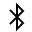</td>
  <td>E702</td>
  <td>Bluetooth</td>
 </tr>
 <tr><td></td>
  <td>E703</td>
  <td>Connect</td>
 </tr>
 <tr><td></td>
  <td>E704</td>
  <td>InternetSharing</td>
 </tr>
 <tr><td></td>
  <td>E705</td>
  <td>VPN</td>
 </tr>
 <tr><td></td>
  <td>E706</td>
  <td>Brightness</td>
 </tr>
 <tr><td></td>
  <td>E707</td>
  <td>MapPin</td>
 </tr>
 <tr><td></td>
  <td>E708</td>
  <td>QuietHours</td>
 </tr>
 <tr><td></td>
  <td>E709</td>
  <td>Airplane</td>
 </tr>
 <tr><td></td>
  <td>E70A</td>
  <td>Tablet</td>
 </tr>
 <tr><td></td>
  <td>E70B</td>
  <td>QuickNote</td>
 </tr>
 <tr><td></td>
  <td>E70C</td>
  <td>RememberedDevice</td>
 </tr>
 <tr><td></td>
  <td>E70D</td>
  <td>ChevronDown</td>
 </tr>
 <tr><td></td>
  <td>E70E</td>
  <td>ChevronUp</td>
 </tr>
 <tr><td></td>
  <td>E70F</td>
  <td>Edit</td>
 </tr>
 <tr><td></td>
  <td>E710</td>
  <td>Add</td>
 </tr>
 <tr><td></td>
  <td>E711</td>
  <td>Cancel</td>
 </tr>
 <tr><td></td>
  <td>E712</td>
  <td>More</td>
 </tr>
 <tr><td></td>
  <td>E713</td>
  <td>Settings</td>
 </tr>
 <tr><td></td>
  <td>E714</td>
  <td>Video</td>
 </tr>
 <tr><td></td>
  <td>E715</td>
  <td>Mail</td>
 </tr>
 <tr><td></td>
  <td>E716</td>
  <td>People</td>
 </tr>
 <tr><td></td>
  <td>E717</td>
  <td>Phone</td>
 </tr>
 <tr><td></td>
  <td>E718</td>
  <td>Pin</td>
 </tr>
 <tr><td></td>
  <td>E719</td>
  <td>Shop</td>
 </tr>
 <tr><td></td>
  <td>E71A</td>
  <td>Stop</td>
 </tr>
 <tr><td></td>
  <td>E71B</td>
  <td>Link</td>
 </tr>
 <tr><td></td>
  <td>E71C</td>
  <td>Filter</td>
 </tr>
 <tr><td></td>
  <td>E71D</td>
  <td>AllApps</td>
 </tr>
 <tr><td></td>
  <td>E71E</td>
  <td>Zoom</td>
 </tr>
 <tr><td></td>
  <td>E71F</td>
  <td>ZoomOut</td>
 </tr>
 <tr><td></td>
  <td>E720</td>
  <td>Microphone</td>
 </tr>
 <tr><td></td>
  <td>E721</td>
  <td>Search</td>
 </tr>
 <tr><td></td>
  <td>E722</td>
  <td>Camera</td>
 </tr>
 <tr><td></td>
  <td>E723</td>
  <td>Attach</td>
 </tr>
 <tr><td></td>
  <td>E724</td>
  <td>Send</td>
 </tr>
 <tr><td></td>
  <td>E725</td>
  <td>SendFill</td>
 </tr>
 <tr><td></td>
  <td>E726</td>
  <td>WalkSolid</td>
 </tr>
 <tr><td></td>
  <td>E727</td>
  <td>InPrivate</td>
 </tr>
 <tr><td></td>
  <td>E728</td>
  <td>FavoriteList</td>
 </tr>
 <tr><td></td>
  <td>E729</td>
  <td>PageSolid</td>
 </tr>
 <tr><td></td>
  <td>E72A</td>
  <td>Forward</td>
 </tr>
 <tr><td>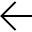</td>
  <td>E72B</td>
  <td>Back</td>
 </tr>
 <tr><td></td>
  <td>E72C</td>
  <td>Refresh</td>
 </tr>
 <tr><td></td>
  <td>E72D</td>
  <td>Share</td>
 </tr>
 <tr><td></td>
  <td>E72E</td>
  <td>Lock</td>
 </tr>
 <tr><td></td>
  <td>E730</td>
  <td>ReportHacked</td>
 </tr>
 <tr><td></td>
  <td>E734</td>
  <td>FavoriteStar</td>
 </tr>
 <tr><td></td>
  <td>E735</td>
  <td>FavoriteStarFill</td>
 </tr>
 <tr><td></td>
  <td>E738</td>
  <td>Remove</td>
 </tr>
 <tr><td></td>
  <td>E739</td>
  <td>Checkbox</td>
 </tr>
 <tr><td></td>
  <td>E73A</td>
  <td>CheckboxComposite</td>
 </tr>
 <tr><td></td>
  <td>E73B</td>
  <td>CheckboxFill</td>
 </tr>
 <tr><td></td>
  <td>E73C</td>
  <td>CheckboxIndeterminate</td>
 </tr>
 <tr><td></td>
  <td>E73D</td>
  <td>CheckboxCompositeReversed</td>
 </tr>
 <tr><td></td>
  <td>E73E</td>
  <td>CheckMark</td>
 </tr>
 <tr><td></td>
  <td>E73F</td>
  <td>BackToWindow</td>
 </tr>
 <tr><td></td>
  <td>E740</td>
  <td>FullScreen</td>
 </tr>
 <tr><td></td>
  <td>E741</td>
  <td>ResizeTouchLarger</td>
 </tr>
 <tr><td>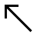</td>
  <td>E742</td>
  <td>ResizeTouchSmaller</td>
 </tr>
 <tr><td></td>
  <td>E743</td>
  <td>ResizeMouseSmall</td>
 </tr>
 <tr><td></td>
  <td>E744</td>
  <td>ResizeMouseMedium</td>
 </tr>
 <tr><td></td>
  <td>E745</td>
  <td>ResizeMouseWide</td>
 </tr>
 <tr><td></td>
  <td>E746</td>
  <td>ResizeMouseTall</td>
 </tr>
 <tr><td></td>
  <td>E747</td>
  <td>ResizeMouseLarge</td>
 </tr>
 <tr><td>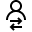</td>
  <td>E748</td>
  <td>SwitchUser</td>
 </tr>
 <tr><td></td>
  <td>E749</td>
  <td>Print</td>
 </tr>
 <tr><td>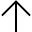</td>
  <td>E74A</td>
  <td>Up</td>
 </tr>
 <tr><td></td>
  <td>E74B</td>
  <td>Down</td>
 </tr>
 <tr><td></td>
  <td>E74C</td>
  <td>OEM</td>
 </tr>
 <tr><td></td>
  <td>E74D</td>
  <td>Delete</td>
 </tr>
 <tr><td></td>
  <td>E74E</td>
  <td>Save</td>
 </tr>
 <tr><td></td>
  <td>E74F</td>
  <td>Mute</td>
 </tr>
 <tr><td></td>
  <td>E750</td>
  <td>BackSpaceQWERTY</td>
 </tr>
 <tr><td>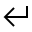</td>
  <td>E751</td>
  <td>ReturnKey</td>
 </tr>
 <tr><td>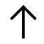</td>
  <td>E752</td>
  <td>UpArrowShiftKey</td>
 </tr>
 <tr><td></td>
  <td>E753</td>
  <td>Cloud</td>
 </tr>
 <tr><td></td>
  <td>E754</td>
  <td>Flashlight</td>
 </tr>
 <tr><td></td>
  <td>E755</td>
  <td>RotationLock</td>
 </tr>
 <tr><td></td>
  <td>E756</td>
  <td>CommandPrompt</td>
 </tr>
 <tr><td></td>
  <td>E759</td>
  <td>SIPMove</td>
 </tr>
 <tr><td></td>
  <td>E75A</td>
  <td>SIPUndock</td>
 </tr>
 <tr><td></td>
  <td>E75B</td>
  <td>SIPRedock</td>
 </tr>
 <tr><td>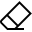</td>
  <td>E75C</td>
  <td>EraseTool</td>
 </tr>
 <tr><td></td>
  <td>E75D</td>
  <td>UnderscoreSpace</td>
 </tr>
 <tr><td></td>
  <td>E75E</td>
  <td>GripperTool</td>
 </tr>
 <tr><td></td>
  <td>E75F</td>
  <td>Dialpad</td>
 </tr>
 <tr><td></td>
  <td>E760</td>
  <td>PageLeft</td>
 </tr>
 <tr><td></td>
  <td>E761</td>
  <td>PageRight</td>
 </tr>
 <tr><td></td>
  <td>E762</td>
  <td>MultiSelect</td>
 </tr>
 <tr><td></td>
  <td>E763</td>
  <td>KeyboardLeftHanded</td>
 </tr>
 <tr><td></td>
  <td>E764</td>
  <td>KeyboardRightHanded</td>
 </tr>
 <tr><td></td>
  <td>E765</td>
  <td>KeyboardClassic</td>
 </tr>
 <tr><td></td>
  <td>E766</td>
  <td>KeyboardSplit</td>
 </tr>
 <tr><td></td>
  <td>E767</td>
  <td>Volume</td>
 </tr>
 <tr><td></td>
  <td>E768</td>
  <td>Play</td>
 </tr>
 <tr><td></td>
  <td>E769</td>
  <td>Pause</td>
 </tr>
 <tr><td></td>
  <td>E76B</td>
  <td>ChevronLeft</td>
 </tr>
 <tr><td></td>
  <td>E76C</td>
  <td>ChevronRight</td>
 </tr>
 <tr><td></td>
  <td>E76D</td>
  <td>InkingTool</td>
 </tr>
 <tr><td></td>
  <td>E76E</td>
  <td>Emoji2</td>
 </tr>
 <tr><td></td>
  <td>E76F</td>
  <td>GripperBarHorizontal</td>
 </tr>
 <tr><td></td>
  <td>E770</td>
  <td>System</td>
 </tr>
 <tr><td></td>
  <td>E771</td>
  <td>Personalize</td>
 </tr>
 <tr><td></td>
  <td>E772</td>
  <td>Devices</td>
 </tr>
 <tr><td></td>
  <td>E773</td>
  <td>SearchAndApps</td>
 </tr>
 <tr><td></td>
  <td>E774</td>
  <td>Globe</td>
 </tr>
 <tr><td>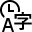</td>
  <td>E775</td>
  <td>TimeLanguage</td>
 </tr>
 <tr><td></td>
  <td>E776</td>
  <td>EaseOfAccess</td>
 </tr>
 <tr><td></td>
  <td>E777</td>
  <td>UpdateRestore</td>
 </tr>
 <tr><td></td>
  <td>E778</td>
  <td>HangUp</td>
 </tr>
 <tr><td></td>
  <td>E779</td>
  <td>ContactInfo</td>
 </tr>
 <tr><td></td>
  <td>E77A</td>
  <td>Unpin</td>
 </tr>
 <tr><td></td>
  <td>E77B</td>
  <td>Contact</td>
 </tr>
 <tr><td></td>
  <td>E77C</td>
  <td>Memo</td>
 </tr>
 <tr><td></td>
  <td>E77F</td>
  <td>Paste</td>
 </tr>
 <tr><td></td>
  <td>E780</td>
  <td>PhoneBook</td>
 </tr>
 <tr><td></td>
  <td>E781</td>
  <td>LEDLight</td>
 </tr>
 <tr><td></td>
  <td>E783</td>
  <td>Error</td>
 </tr>
 <tr><td>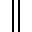</td>
  <td>E784</td>
  <td>GripperBarVertical</td>
 </tr>
 <tr><td></td>
  <td>E785</td>
  <td>Unlock</td>
 </tr>
 <tr><td></td>
  <td>E786</td>
  <td>Slideshow</td>
 </tr>
 <tr><td></td>
  <td>E787</td>
  <td>Calendar</td>
 </tr>
 <tr><td></td>
  <td>E788</td>
  <td>GripperResize</td>
 </tr>
 <tr><td></td>
  <td>E789</td>
  <td>Megaphone</td>
 </tr>
 <tr><td></td>
  <td>E78A</td>
  <td>Trim</td>
 </tr>
 <tr><td></td>
  <td>E78B</td>
  <td>NewWindow</td>
 </tr>
 <tr><td></td>
  <td>E78C</td>
  <td>SaveLocal</td>
 </tr>
 <tr><td></td>
  <td>E790</td>
  <td>Color</td>
 </tr>
 <tr><td></td>
  <td>E791</td>
  <td>DataSense</td>
 </tr>
 <tr><td></td>
  <td>E792</td>
  <td>SaveAs</td>
 </tr>
 <tr><td></td>
  <td>E793</td>
  <td>Light</td>
 </tr>
 <tr><td></td>
  <td>E799</td>
  <td>AspectRatio</td>
 </tr>
 <tr><td></td>
  <td>E7A5</td>
  <td>DataSenseBar</td>
 </tr>
 <tr><td>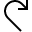</td>
  <td>E7A6</td>
  <td>Redo</td>
 </tr>
 <tr><td>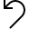</td>
  <td>E7A7</td>
  <td>Undo</td>
 </tr>
 <tr><td>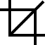</td>
  <td>E7A8</td>
  <td>Crop</td>
 </tr>
 <tr><td>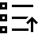</td>
  <td>E7AC</td>
  <td>OpenWith</td>
 </tr>
 <tr><td></td>
  <td>E7AD</td>
  <td>Rotate</td>
 </tr>
 <tr><td></td>
  <td>E7B5</td>
  <td>SetlockScreen</td>
 </tr>
 <tr><td></td>
  <td>E7B7</td>
  <td>MapPin2</td>
 </tr>
 <tr><td></td>
  <td>E7B8</td>
  <td>Package</td>
 </tr>
 <tr><td></td>
  <td>E7BA</td>
  <td>Warning</td>
 </tr>
 <tr><td></td>
  <td>E7BC</td>
  <td>ReadingList</td>
 </tr>
 <tr><td></td>
  <td>E7BE</td>
  <td>Education</td>
 </tr>
 <tr><td></td>
  <td>E7BF</td>
  <td>ShoppingCart</td>
 </tr>
 <tr><td></td>
  <td>E7C0</td>
  <td>Train</td>
 </tr>
 <tr><td></td>
  <td>E7C1</td>
  <td>Flag</td>
 </tr>
 <tr><td></td>
  <td>E7C3</td>
  <td>Page</td>
 </tr>
 <tr><td></td>
  <td>E7C4</td>
  <td>Multitask</td>
 </tr>
 <tr><td></td>
  <td>E7C5</td>
  <td>BrowsePhotos</td>
 </tr>
 <tr><td></td>
  <td>E7C6</td>
  <td>HalfStarLeft</td>
 </tr>
 <tr><td></td>
  <td>E7C7</td>
  <td>HalfStarRight</td>
 </tr>
 <tr><td></td>
  <td>E7C8</td>
  <td>Record</td>
 </tr>
 <tr><td></td>
  <td>E7C9</td>
  <td>TouchPointer</td>
 </tr>
 <tr><td></td>
  <td>E7DE</td>
  <td>LangJPN</td>
 </tr>
 <tr><td></td>
  <td>E7E3</td>
  <td>Ferry</td>
 </tr>
 <tr><td></td>
  <td>E7E6</td>
  <td>Highlight</td>
 </tr>
 <tr><td></td>
  <td>E7E7</td>
  <td>ActionCenterNotification</td>
 </tr>
 <tr><td></td>
  <td>E7E8</td>
  <td>PowerButton</td>
 </tr>
 <tr><td></td>
  <td>E7EA</td>
  <td>ResizeTouchNarrower</td>
 </tr>
 <tr><td>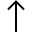</td>
  <td>E7EB</td>
  <td>ResizeTouchShorter</td>
 </tr>
 <tr><td></td>
  <td>E7EC</td>
  <td>DrivingMode</td>
 </tr>
 <tr><td></td>
  <td>E7ED</td>
  <td>RingerSilent</td>
 </tr>
 <tr><td></td>
  <td>E7EE</td>
  <td>OtherUser</td>
 </tr>
 <tr><td></td>
  <td>E7EF</td>
  <td>Admin</td>
 </tr>
 <tr><td></td>
  <td>E7F0</td>
  <td>CC</td>
 </tr>
 <tr><td></td>
  <td>E7F1</td>
  <td>SDCard</td>
 </tr>
 <tr><td></td>
  <td>E7F2</td>
  <td>CallForwarding</td>
 </tr>
 <tr><td></td>
  <td>E7F3</td>
  <td>SettingsDisplaySound</td>
 </tr>
 <tr><td></td>
  <td>E7F4</td>
  <td>TVMonitor</td>
 </tr>
 <tr><td></td>
  <td>E7F5</td>
  <td>Speakers</td>
 </tr>
 <tr><td></td>
  <td>E7F6</td>
  <td>Headphone</td>
 </tr>
 <tr><td></td>
  <td>E7F7</td>
  <td>DeviceLaptopPic</td>
 </tr>
 <tr><td></td>
  <td>E7F8</td>
  <td>DeviceLaptopNoPic</td>
 </tr>
 <tr><td></td>
  <td>E7F9</td>
  <td>DeviceMonitorRightPic</td>
 </tr>
 <tr><td></td>
  <td>E7FA</td>
  <td>DeviceMonitorLeftPic</td>
 </tr>
 <tr><td></td>
  <td>E7FB</td>
  <td>DeviceMonitorNoPic</td>
 </tr>
 <tr><td></td>
  <td>E7FC</td>
  <td>Game</td>
 </tr>
 <tr><td></td>
  <td>E7FD</td>
  <td>HorizontalTabKey</td>
 </tr>
 <tr><td></td>
  <td>E802</td>
  <td>StreetsideSplitMinimize</td>
 </tr>
 <tr><td></td>
  <td>E803</td>
  <td>StreetsideSplitExpand</td>
 </tr>
 <tr><td></td>
  <td>E804</td>
  <td>Car</td>
 </tr>
 <tr><td></td>
  <td>E805</td>
  <td>Walk</td>
 </tr>
 <tr><td></td>
  <td>E806</td>
  <td>Bus</td>
 </tr>
 <tr><td>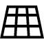</td>
  <td>E809</td>
  <td>TiltUp</td>
 </tr>
 <tr><td></td>
  <td>E80A</td>
  <td>TiltDown</td>
 </tr>
 <tr><td></td>
  <td>E80C</td>
  <td>RotateMapRight</td>
 </tr>
 <tr><td></td>
  <td>E80D</td>
  <td>RotateMapLeft</td>
 </tr>
 <tr><td></td>
  <td>E80F</td>
  <td>Home</td>
 </tr>
 <tr><td></td>
  <td>E811</td>
  <td>ParkingLocation</td>
 </tr>
 <tr><td></td>
  <td>E812</td>
  <td>MapCompassTop</td>
 </tr>
 <tr><td></td>
  <td>E813</td>
  <td>MapCompassBottom</td>
 </tr>
 <tr><td></td>
  <td>E814</td>
  <td>IncidentTriangle</td>
 </tr>
 <tr><td></td>
  <td>E815</td>
  <td>Touch</td>
 </tr>
 <tr><td></td>
  <td>E816</td>
  <td>MapDirections</td>
 </tr>
 <tr><td></td>
  <td>E819</td>
  <td>StartPoint</td>
 </tr>
 <tr><td></td>
  <td>E81A</td>
  <td>StopPoint</td>
 </tr>
 <tr><td></td>
  <td>E81B</td>
  <td>EndPoint</td>
 </tr>
 <tr><td></td>
  <td>E81C</td>
  <td>History</td>
 </tr>
 <tr><td></td>
  <td>E81D</td>
  <td>Location</td>
 </tr>
 <tr><td></td>
  <td>E81E</td>
  <td>MapLayers</td>
 </tr>
 <tr><td></td>
  <td>E81F</td>
  <td>Accident</td>
 </tr>
 <tr><td></td>
  <td>E821</td>
  <td>Work</td>
 </tr>
 <tr><td></td>
  <td>E822</td>
  <td>Construction</td>
 </tr>
 <tr><td></td>
  <td>E823</td>
  <td>Recent</td>
 </tr>
 <tr><td></td>
  <td>E825</td>
  <td>Bank</td>
 </tr>
 <tr><td></td>
  <td>E826</td>
  <td>DownloadMap</td>
 </tr>
 <tr><td></td>
  <td>E829</td>
  <td>InkingToolFill2</td>
 </tr>
 <tr><td></td>
  <td>E82A</td>
  <td>HighlightFill2</td>
 </tr>
 <tr><td></td>
  <td>E82B</td>
  <td>EraseToolFill</td>
 </tr>
 <tr><td></td>
  <td>E82C</td>
  <td>EraseToolFill2</td>
 </tr>
 <tr><td></td>
  <td>E82D</td>
  <td>Dictionary</td>
 </tr>
 <tr><td></td>
  <td>E82E</td>
  <td>DictionaryAdd</td>
 </tr>
 <tr><td></td>
  <td>E82F</td>
  <td>ToolTip</td>
 </tr>
 <tr><td></td>
  <td>E830</td>
  <td>ChromeBack</td>
 </tr>
 <tr><td></td>
  <td>E835</td>
  <td>ProvisioningPackage</td>
 </tr>
 <tr><td></td>
  <td>E836</td>
  <td>AddRemoteDevice</td>
 </tr>
 <tr><td></td>
  <td>E839</td>
  <td>Ethernet</td>
 </tr>
 <tr><td></td>
  <td>E83A</td>
  <td>&nbsp;ShareBroadband</td>
 </tr>
 <tr><td></td>
  <td>E83B</td>
  <td>DirectAccess</td>
 </tr>
 <tr><td></td>
  <td>E83C</td>
  <td>&nbsp;DialUp</td>
 </tr>
 <tr><td></td>
  <td>E83D</td>
  <td>DefenderApp</td>
 </tr>
 <tr><td></td>
  <td>E83E</td>
  <td>BatteryCharging9</td>
 </tr>
 <tr><td></td>
  <td>E83F</td>
  <td>Battery10</td>
 </tr>
 <tr><td></td>
  <td>E840</td>
  <td>Pinned</td>
 </tr>
 <tr><td></td>
  <td>E841</td>
  <td>PinFill</td>
 </tr>
 <tr><td></td>
  <td>E842</td>
  <td>PinnedFill</td>
 </tr>
 <tr><td></td>
  <td>E843</td>
  <td>PeriodKey</td>
 </tr>
 <tr><td></td>
  <td>E844</td>
  <td>PuncKey</td>
 </tr>
 <tr><td>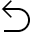</td>
  <td>E845</td>
  <td>RevToggleKey</td>
 </tr>
 <tr><td>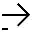</td>
  <td>E846</td>
  <td>RightArrowKeyTime1</td>
 </tr>
 <tr><td></td>
  <td>E847</td>
  <td>RightArrowKeyTime2</td>
 </tr>
 <tr><td></td>
  <td>E848</td>
  <td>LeftQuote</td>
 </tr>
 <tr><td></td>
  <td>E849</td>
  <td>RightQuote</td>
 </tr>
 <tr><td></td>
  <td>E84A</td>
  <td>DownShiftKey</td>
 </tr>
 <tr><td></td>
  <td>E84B</td>
  <td>UpShiftKey</td>
 </tr>
 <tr><td></td>
  <td>E84C</td>
  <td>PuncKey0</td>
 </tr>
 <tr><td></td>
  <td>E84D</td>
  <td>PuncKeyLeftBottom</td>
 </tr>
 <tr><td></td>
  <td>E84E</td>
  <td>RightArrowKeyTime3</td>
 </tr>
 <tr><td></td>
  <td>E84F</td>
  <td>RightArrowKeyTime4</td>
 </tr>
 <tr><td></td>
  <td>E850</td>
  <td>Battery0</td>
 </tr>
 <tr><td></td>
  <td>E851</td>
  <td>Battery1</td>
 </tr>
 <tr><td></td>
  <td>E852</td>
  <td>Battery2</td>
 </tr>
 <tr><td></td>
  <td>E853</td>
  <td>Battery3</td>
 </tr>
 <tr><td></td>
  <td>E854</td>
  <td>Battery4</td>
 </tr>
 <tr><td></td>
  <td>E855</td>
  <td>Battery5</td>
 </tr>
 <tr><td></td>
  <td>E856</td>
  <td>Battery6</td>
 </tr>
 <tr><td></td>
  <td>E857</td>
  <td>Battery7</td>
 </tr>
 <tr><td></td>
  <td>E858</td>
  <td>Battery8</td>
 </tr>
 <tr><td></td>
  <td>E859</td>
  <td>Battery9</td>
 </tr>
 <tr><td>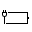</td>
  <td>E85A</td>
  <td>BatteryCharging0</td>
 </tr>
 <tr><td>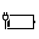</td>
  <td>E85B</td>
  <td>BatteryCharging1</td>
 </tr>
 <tr><td></td>
  <td>E85C</td>
  <td>BatteryCharging2</td>
 </tr>
 <tr><td></td>
  <td>E85D</td>
  <td>BatteryCharging3</td>
 </tr>
 <tr><td></td>
  <td>E85E</td>
  <td>BatteryCharging4</td>
 </tr>
 <tr><td></td>
  <td>E85F</td>
  <td>BatteryCharging5</td>
 </tr>
 <tr><td></td>
  <td>E860</td>
  <td>BatteryCharging6</td>
 </tr>
 <tr><td></td>
  <td>E861</td>
  <td>BatteryCharging7</td>
 </tr>
 <tr><td></td>
  <td>E862</td>
  <td>BatteryCharging8</td>
 </tr>
 <tr><td></td>
  <td>E863</td>
  <td>BatterySaver0</td>
 </tr>
 <tr><td></td>
  <td>E864</td>
  <td>BatterySaver1</td>
 </tr>
 <tr><td></td>
  <td>E865</td>
  <td>BatterySaver2</td>
 </tr>
 <tr><td></td>
  <td>E866</td>
  <td>BatterySaver3</td>
 </tr>
 <tr><td></td>
  <td>E867</td>
  <td>BatterySaver4</td>
 </tr>
 <tr><td></td>
  <td>E868</td>
  <td>BatterySaver5</td>
 </tr>
 <tr><td></td>
  <td>E869</td>
  <td>BatterySaver6</td>
 </tr>
 <tr><td></td>
  <td>E86A</td>
  <td>BatterySaver7</td>
 </tr>
 <tr><td></td>
  <td>E86B</td>
  <td>BatterySaver8</td>
 </tr>
 <tr><td></td>
  <td>E86C</td>
  <td>SignalBars1</td>
 </tr>
 <tr><td></td>
  <td>E86D</td>
  <td>SignalBars2</td>
 </tr>
 <tr><td></td>
  <td>E86E</td>
  <td>SignalBars3</td>
 </tr>
 <tr><td></td>
  <td>E86F</td>
  <td>SignalBars4</td>
 </tr>
 <tr><td></td>
  <td>E870</td>
  <td>SignalBars5</td>
 </tr>
 <tr><td></td>
  <td>E871</td>
  <td>SignalNotConnected</td>
 </tr>
 <tr><td></td>
  <td>E872</td>
  <td>Wifi1</td>
 </tr>
 <tr><td></td>
  <td>E873</td>
  <td>Wifi2</td>
 </tr>
 <tr><td></td>
  <td>E874</td>
  <td>Wifi3</td>
 </tr>
 <tr><td></td>
  <td>E875</td>
  <td>SIMLock</td>
 </tr>
 <tr><td></td>
  <td>E876</td>
  <td>SIMMissing</td>
 </tr>
 <tr><td></td>
  <td>E877</td>
  <td>Vibrate</td>
 </tr>
 <tr><td></td>
  <td>E878</td>
  <td>RoamingInternational</td>
 </tr>
 <tr><td></td>
  <td>E879</td>
  <td>RoamingDomestic</td>
 </tr>
 <tr><td></td>
  <td>E87A</td>
  <td>CallForwardInternational</td>
 </tr>
 <tr><td>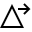</td>
  <td>E87B</td>
  <td>CallForwardRoaming</td>
 </tr>
 <tr><td></td>
  <td>E87C</td>
  <td>JpnRomanji</td>
 </tr>
 <tr><td></td>
  <td>E87D</td>
  <td>JpnRomanjiLock</td>
 </tr>
 <tr><td></td>
  <td>E87E</td>
  <td>JpnRomanjiShift</td>
 </tr>
 <tr><td></td>
  <td>E87F</td>
  <td>JpnRomanjiShiftLock</td>
 </tr>
 <tr><td></td>
  <td>E880</td>
  <td>StatusDataTransfer</td>
 </tr>
 <tr><td></td>
  <td>E881</td>
  <td>StatusDataTransferVPN</td>
 </tr>
 <tr><td></td>
  <td>E882</td>
  <td>StatusDualSIM2</td>
 </tr>
 <tr><td>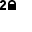</td>
  <td>E883</td>
  <td>StatusDualSIM2VPN</td>
 </tr>
 <tr><td></td>
  <td>E884</td>
  <td>StatusDualSIM1</td>
 </tr>
 <tr><td></td>
  <td>E885</td>
  <td>StatusDualSIM1VPN</td>
 </tr>
 <tr><td></td>
  <td>E886</td>
  <td>StatusSGLTE</td>
 </tr>
 <tr><td></td>
  <td>E887</td>
  <td>StatusSGLTECell</td>
 </tr>
 <tr><td></td>
  <td>E888</td>
  <td>StatusSGLTEDataVPN</td>
 </tr>
 <tr><td></td>
  <td>E889</td>
  <td>StatusVPN</td>
 </tr>
 <tr><td></td>
  <td>E88A</td>
  <td>WifiHotspot</td>
 </tr>
 <tr><td></td>
  <td>E88B</td>
  <td>LanguageKor</td>
 </tr>
 <tr><td></td>
  <td>E88C</td>
  <td>LanguageCht</td>
 </tr>
 <tr><td></td>
  <td>E88D</td>
  <td>LanguageChs</td>
 </tr>
 <tr><td></td>
  <td>E88E</td>
  <td>USB</td>
 </tr>
 <tr><td></td>
  <td>E88F</td>
  <td>InkingToolFill</td>
 </tr>
 <tr><td></td>
  <td>E890</td>
  <td>View</td>
 </tr>
 <tr><td></td>
  <td>E891</td>
  <td>HighlightFill</td>
 </tr>
 <tr><td></td>
  <td>E892</td>
  <td>Previous</td>
 </tr>
 <tr><td></td>
  <td>E893</td>
  <td>Next</td>
 </tr>
 <tr><td></td>
  <td>E894</td>
  <td>Clear</td>
 </tr>
 <tr><td></td>
  <td>E895</td>
  <td>Sync</td>
 </tr>
 <tr><td></td>
  <td>E896</td>
  <td>Download</td>
 </tr>
 <tr><td></td>
  <td>E897</td>
  <td>Help</td>
 </tr>
 <tr><td>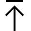</td>
  <td>E898</td>
  <td>Upload</td>
 </tr>
 <tr><td></td>
  <td>E899</td>
  <td>Emoji</td>
 </tr>
 <tr><td></td>
  <td>E89A</td>
  <td>TwoPage</td>
 </tr>
 <tr><td></td>
  <td>E89B</td>
  <td>LeaveChat</td>
 </tr>
 <tr><td></td>
  <td>E89C</td>
  <td>MailForward</td>
 </tr>
 <tr><td></td>
  <td>E89E</td>
  <td>RotateCamera</td>
 </tr>
 <tr><td></td>
  <td>E89F</td>
  <td>ClosePane</td>
 </tr>
 <tr><td></td>
  <td>E8A0</td>
  <td>OpenPane</td>
 </tr>
 <tr><td></td>
  <td>E8A1</td>
  <td>PreviewLink</td>
 </tr>
 <tr><td></td>
  <td>E8A2</td>
  <td>AttachCamera</td>
 </tr>
 <tr><td></td>
  <td>E8A3</td>
  <td>ZoomIn</td>
 </tr>
 <tr><td></td>
  <td>E8A4</td>
  <td>Bookmarks</td>
 </tr>
 <tr><td></td>
  <td>E8A5</td>
  <td>Document</td>
 </tr>
 <tr><td></td>
  <td>E8A6</td>
  <td>ProtectedDocument</td>
 </tr>
 <tr><td></td>
  <td>E8A7</td>
  <td>OpenInNewWindow</td>
 </tr>
 <tr><td></td>
  <td>E8A8</td>
  <td>MailFill</td>
 </tr>
 <tr><td></td>
  <td>E8A9</td>
  <td>ViewAll</td>
 </tr>
 <tr><td></td>
  <td>E8AA</td>
  <td>VideoChat</td>
 </tr>
 <tr><td></td>
  <td>E8AB</td>
  <td>Switch</td>
 </tr>
 <tr><td></td>
  <td>E8AC</td>
  <td>Rename</td>
 </tr>
 <tr><td></td>
  <td>E8AD</td>
  <td>Go</td>
 </tr>
 <tr><td></td>
  <td>E8AE</td>
  <td>SurfaceHub</td>
 </tr>
 <tr><td></td>
  <td>E8AF</td>
  <td>Remote</td>
 </tr>
 <tr><td></td>
  <td>E8B0</td>
  <td>Click</td>
 </tr>
 <tr><td></td>
  <td>E8B1</td>
  <td>Shuffle</td>
 </tr>
 <tr><td></td>
  <td>E8B2</td>
  <td>Movies</td>
 </tr>
 <tr><td></td>
  <td>E8B3</td>
  <td>SelectAll</td>
 </tr>
 <tr><td></td>
  <td>E8B4</td>
  <td>Orientation</td>
 </tr>
 <tr><td></td>
  <td>E8B5</td>
  <td>Import</td>
 </tr>
 <tr><td></td>
  <td>E8B6</td>
  <td>ImportAll</td>
 </tr>
 <tr><td></td>
  <td>E8B7</td>
  <td>Folder</td>
 </tr>
 <tr><td></td>
  <td>E8B8</td>
  <td>Webcam</td>
 </tr>
 <tr><td></td>
  <td>E8B9</td>
  <td>Picture</td>
 </tr>
 <tr><td></td>
  <td>E8BA</td>
  <td>Caption</td>
 </tr>
 <tr><td></td>
  <td>E8BB</td>
  <td>ChromeClose</td>
 </tr>
 <tr><td></td>
  <td>E8BC</td>
  <td>ShowResults</td>
 </tr>
 <tr><td></td>
  <td>E8BD</td>
  <td>Message</td>
 </tr>
 <tr><td>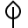</td>
  <td>E8BE</td>
  <td>Leaf</td>
 </tr>
 <tr><td></td>
  <td>E8BF</td>
  <td>CalendarDay</td>
 </tr>
 <tr><td></td>
  <td>E8C0</td>
  <td>CalendarWeek</td>
 </tr>
 <tr><td>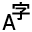</td>
  <td>E8C1</td>
  <td>Characters</td>
 </tr>
 <tr><td></td>
  <td>E8C2</td>
  <td>MailReplyAll</td>
 </tr>
 <tr><td></td>
  <td>E8C3</td>
  <td>Read</td>
 </tr>
 <tr><td></td>
  <td>E8C4</td>
  <td>ShowBcc</td>
 </tr>
 <tr><td></td>
  <td>E8C5</td>
  <td>HideBcc</td>
 </tr>
 <tr><td></td>
  <td>E8C6</td>
  <td>Cut</td>
 </tr>
 <tr><td></td>
  <td>E8C8</td>
  <td>Copy</td>
 </tr>
 <tr><td></td>
  <td>E8C9</td>
  <td>Important</td>
 </tr>
 <tr><td></td>
  <td>E8CA</td>
  <td>MailReply</td>
 </tr>
 <tr><td>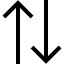</td>
  <td>E8CB</td>
  <td>Sort</td>
 </tr>
 <tr><td></td>
  <td>E8CC</td>
  <td>MobileTablet</td>
 </tr>
 <tr><td></td>
  <td>E8CD</td>
  <td>DisconnectDrive</td>
 </tr>
 <tr><td></td>
  <td>E8CE</td>
  <td>MapDrive</td>
 </tr>
 <tr><td></td>
  <td>E8CF</td>
  <td>ContactPresence</td>
 </tr>
 <tr><td>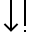</td>
  <td>E8D0</td>
  <td>Priority</td>
 </tr>
 <tr><td></td>
  <td>E8D1</td>
  <td>GotoToday</td>
 </tr>
 <tr><td></td>
  <td>E8D2</td>
  <td>Font</td>
 </tr>
 <tr><td>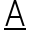</td>
  <td>E8D3</td>
  <td>FontColor</td>
 </tr>
 <tr><td></td>
  <td>E8D4</td>
  <td>Contact2</td>
 </tr>
 <tr><td></td>
  <td>E8D5</td>
  <td>FolderFill</td>
 </tr>
 <tr><td></td>
  <td>E8D6</td>
  <td>Audio</td>
 </tr>
 <tr><td></td>
  <td>E8D7</td>
  <td>Permissions</td>
 </tr>
 <tr><td></td>
  <td>E8D8</td>
  <td>DisableUpdates</td>
 </tr>
 <tr><td></td>
  <td>E8D9</td>
  <td>Unfavorite</td>
 </tr>
 <tr><td></td>
  <td>E8DA</td>
  <td>OpenLocal</td>
 </tr>
 <tr><td></td>
  <td>E8DB</td>
  <td>Italic</td>
 </tr>
 <tr><td></td>
  <td>E8DC</td>
  <td>Underline</td>
 </tr>
 <tr><td></td>
  <td>E8DD</td>
  <td>Bold</td>
 </tr>
 <tr><td></td>
  <td>E8DE</td>
  <td>MoveToFolder</td>
 </tr>
 <tr><td></td>
  <td>E8DF</td>
  <td>LikeDislike</td>
 </tr>
 <tr><td></td>
  <td>E8E0</td>
  <td>Dislike</td>
 </tr>
 <tr><td></td>
  <td>E8E1</td>
  <td>Like</td>
 </tr>
 <tr><td>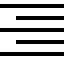</td>
  <td>E8E2</td>
  <td>AlignRight</td>
 </tr>
 <tr><td>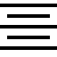</td>
  <td>E8E3</td>
  <td>AlignCenter</td>
 </tr>
 <tr><td></td>
  <td>E8E4</td>
  <td>AlignLeft</td>
 </tr>
 <tr><td></td>
  <td>E8E5</td>
  <td>OpenFile</td>
 </tr>
 <tr><td></td>
  <td>E8E6</td>
  <td>ClearSelection</td>
 </tr>
 <tr><td></td>
  <td>E8E7</td>
  <td>FontDecrease</td>
 </tr>
 <tr><td></td>
  <td>E8E8</td>
  <td>FontIncrease</td>
 </tr>
 <tr><td></td>
  <td>E8E9</td>
  <td>FontSize</td>
 </tr>
 <tr><td></td>
  <td>E8EA</td>
  <td>CellPhone</td>
 </tr>
 <tr><td></td>
  <td>E8EB</td>
  <td>Reshare</td>
 </tr>
 <tr><td></td>
  <td>E8EC</td>
  <td>Tag</td>
 </tr>
 <tr><td></td>
  <td>E8ED</td>
  <td>RepeatOne</td>
 </tr>
 <tr><td></td>
  <td>E8EE</td>
  <td>RepeatAll</td>
 </tr>
 <tr><td></td>
  <td>E8EF</td>
  <td>Calculator</td>
 </tr>
 <tr><td>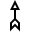</td>
  <td>E8F0</td>
  <td>Directions</td>
 </tr>
 <tr><td></td>
  <td>E8F1</td>
  <td>Library</td>
 </tr>
 <tr><td></td>
  <td>E8F2</td>
  <td>ChatBubbles</td>
 </tr>
 <tr><td>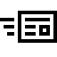</td>
  <td>E8F3</td>
  <td>PostUpdate</td>
 </tr>
 <tr><td></td>
  <td>E8F4</td>
  <td>NewFolder</td>
 </tr>
 <tr><td></td>
  <td>E8F5</td>
  <td>CalendarReply</td>
 </tr>
 <tr><td></td>
  <td>E8F6</td>
  <td>UnsyncFolder</td>
 </tr>
 <tr><td></td>
  <td>E8F7</td>
  <td>SyncFolder</td>
 </tr>
 <tr><td></td>
  <td>E8F8</td>
  <td>BlockContact</td>
 </tr>
 <tr><td></td>
  <td>E8F9</td>
  <td>SwitchApps</td>
 </tr>
 <tr><td></td>
  <td>E8FA</td>
  <td>AddFriend</td>
 </tr>
 <tr><td></td>
  <td>E8FB</td>
  <td>Accept</td>
 </tr>
 <tr><td></td>
  <td>E8FC</td>
  <td>GoToStart</td>
 </tr>
 <tr><td></td>
  <td>E8FD</td>
  <td>BulletedList</td>
 </tr>
 <tr><td></td>
  <td>E8FE</td>
  <td>Scan</td>
 </tr>
 <tr><td></td>
  <td>E8FF</td>
  <td>Preview</td>
 </tr>
 <tr><td></td>
  <td>E904</td>
  <td>ZeroBars</td>
 </tr>
 <tr><td></td>
  <td>E905</td>
  <td>OneBar</td>
 </tr>
 <tr><td></td>
  <td>E906</td>
  <td>TwoBars</td>
 </tr>
 <tr><td></td>
  <td>E907</td>
  <td>ThreeBars</td>
 </tr>
 <tr><td></td>
  <td>E908</td>
  <td>FourBars</td>
 </tr>
 <tr><td></td>
  <td>E909</td>
  <td>World</td>
 </tr>
 <tr><td></td>
  <td>E90A</td>
  <td>Comment</td>
 </tr>
 <tr><td></td>
  <td>E90B</td>
  <td>MusicInfo</td>
 </tr>
 <tr><td></td>
  <td>E90C</td>
  <td>DockLeft</td>
 </tr>
 <tr><td></td>
  <td>E90D</td>
  <td>DockRight</td>
 </tr>
 <tr><td></td>
  <td>E90E</td>
  <td>DockBottom</td>
 </tr>
 <tr><td></td>
  <td>E90F</td>
  <td>Repair</td>
 </tr>
 <tr><td></td>
  <td>E910</td>
  <td>Accounts</td>
 </tr>
 <tr><td></td>
  <td>E911</td>
  <td>DullSound</td>
 </tr>
 <tr><td></td>
  <td>E912</td>
  <td>Manage</td>
 </tr>
 <tr><td></td>
  <td>E913</td>
  <td>Street</td>
 </tr>
 <tr><td></td>
  <td>E914</td>
  <td>Printer3D</td>
 </tr>
 <tr><td></td>
  <td>E915</td>
  <td>RadioBullet</td>
 </tr>
 <tr><td></td>
  <td>E916</td>
  <td>Stopwatch</td>
 </tr>
 <tr><td></td>
  <td>E91B</td>
  <td>Photo</td>
 </tr>
 <tr><td></td>
  <td>E91C</td>
  <td>ActionCenter</td>
 </tr>
 <tr><td></td>
  <td>E91F</td>
  <td>FullCircleMask</td>
 </tr>
 <tr><td></td>
  <td>E921</td>
  <td>ChromeMinimize</td>
 </tr>
 <tr><td></td>
  <td>E922</td>
  <td>ChromeMaximize</td>
 </tr>
 <tr><td></td>
  <td>E923</td>
  <td>ChromeRestore</td>
 </tr>
 <tr><td></td>
  <td>E924</td>
  <td>Annotation</td>
 </tr>
 <tr><td></td>
  <td>E925</td>
  <td>BackSpaceQWERTYSm</td>
 </tr>
 <tr><td></td>
  <td>E926</td>
  <td>BackSpaceQWERTYMd</td>
 </tr>
 <tr><td></td>
  <td>E927</td>
  <td>Swipe</td>
 </tr>
 <tr><td></td>
  <td>E928</td>
  <td>Fingerprint</td>
 </tr>
 <tr><td></td>
  <td>E929</td>
  <td>Handwriting</td>
 </tr>
 <tr><td>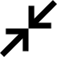</td>
  <td>E92C</td>
  <td>ChromeBackToWindow</td>
 </tr>
 <tr><td></td>
  <td>E92D</td>
  <td>ChromeFullScreen</td>
 </tr>
 <tr><td></td>
  <td>E92E</td>
  <td>KeyboardStandard</td>
 </tr>
 <tr><td></td>
  <td>E92F</td>
  <td>KeyboardDismiss</td>
 </tr>
 <tr><td></td>
  <td>E930</td>
  <td>Completed</td>
 </tr>
 <tr><td></td>
  <td>E931</td>
  <td>ChromeAnnotate</td>
 </tr>
 <tr><td></td>
  <td>E932</td>
  <td>Label</td>
 </tr>
 <tr><td>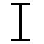</td>
  <td>E933</td>
  <td>IBeam</td>
 </tr>
 <tr><td></td>
  <td>E934</td>
  <td>IBeamOutline</td>
 </tr>
 <tr><td></td>
  <td>E935</td>
  <td>FlickDown</td>
 </tr>
 <tr><td></td>
  <td>E936</td>
  <td>FlickUp</td>
 </tr>
 <tr><td></td>
  <td>E937</td>
  <td>FlickLeft</td>
 </tr>
 <tr><td></td>
  <td>E938</td>
  <td>FlickRight</td>
 </tr>
 <tr><td></td>
  <td>E939</td>
  <td>FeedbackApp</td>
 </tr>
 <tr><td></td>
  <td>E93C</td>
  <td>MusicAlbum</td>
 </tr>
 <tr><td></td>
  <td>E93E</td>
  <td>Streaming</td>
 </tr>
 <tr><td></td>
  <td>E943</td>
  <td>Code</td>
 </tr>
 <tr><td></td>
  <td>E944</td>
  <td>ReturnToWindow</td>
 </tr>
 <tr><td></td>
  <td>E945</td>
  <td>LightningBolt</td>
 </tr>
 <tr><td></td>
  <td>E946</td>
  <td>Info</td>
 </tr>
 <tr><td></td>
  <td>E947</td>
  <td>CalculatorMultiply</td>
 </tr>
 <tr><td>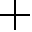</td>
  <td>E948</td>
  <td>CalculatorAddition</td>
 </tr>
 <tr><td></td>
  <td>E949</td>
  <td>CalculatorSubtract</td>
 </tr>
 <tr><td>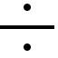</td>
  <td>E94A</td>
  <td>CalculatorDivide</td>
 </tr>
 <tr><td></td>
  <td>E94B</td>
  <td>CalculatorSquareroot</td>
 </tr>
 <tr><td></td>
  <td>E94C</td>
  <td>CalculatorPercentage</td>
 </tr>
 <tr><td></td>
  <td>E94D</td>
  <td>CalculatorNegate</td>
 </tr>
 <tr><td></td>
  <td>E94E</td>
  <td>CalculatorEqualTo</td>
 </tr>
 <tr><td></td>
  <td>E94F</td>
  <td>CalculatorBackspace</td>
 </tr>
 <tr><td>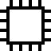</td>
  <td>E950</td>
  <td>Component</td>
 </tr>
 <tr><td></td>
  <td>E951</td>
  <td>DMC</td>
 </tr>
 <tr><td></td>
  <td>E952</td>
  <td>Dock</td>
 </tr>
 <tr><td></td>
  <td>E953</td>
  <td>MultimediaDMS</td>
 </tr>
 <tr><td></td>
  <td>E954</td>
  <td>MultimediaDVR</td>
 </tr>
 <tr><td></td>
  <td>E955</td>
  <td>MultimediaPMP</td>
 </tr>
 <tr><td></td>
  <td>E956</td>
  <td>PrintfaxPrinterFile</td>
 </tr>
 <tr><td></td>
  <td>E957</td>
  <td>Sensor</td>
 </tr>
 <tr><td></td>
  <td>E958</td>
  <td>StorageOptical</td>
 </tr>
 <tr><td></td>
  <td>E95A</td>
  <td>Communications</td>
 </tr>
 <tr><td></td>
  <td>E95B</td>
  <td>Headset</td>
 </tr>
 <tr><td></td>
  <td>E95D</td>
  <td>Projector</td>
 </tr>
 <tr><td></td>
  <td>E95E</td>
  <td>Health</td>
 </tr>
 <tr><td></td>
  <td>E960</td>
  <td>Webcam2</td>
 </tr>
 <tr><td></td>
  <td>E961</td>
  <td>Input</td>
 </tr>
 <tr><td></td>
  <td>E962</td>
  <td>Mouse</td>
 </tr>
 <tr><td></td>
  <td>E963</td>
  <td>Smartcard</td>
 </tr>
 <tr><td>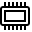</td>
  <td>E964</td>
  <td>SmartcardVirtual</td>
 </tr>
 <tr><td></td>
  <td>E965</td>
  <td>MediaStorageTower</td>
 </tr>
 <tr><td></td>
  <td>E966</td>
  <td>ReturnKeySm</td>
 </tr>
 <tr><td></td>
  <td>E967</td>
  <td>GameConsole</td>
 </tr>
 <tr><td></td>
  <td>E968</td>
  <td>Network</td>
 </tr>
 <tr><td></td>
  <td>E969</td>
  <td>StorageNetworkWireless</td>
 </tr>
 <tr><td></td>
  <td>E96A</td>
  <td>StorageTape</td>
 </tr>
 <tr><td></td>
  <td>E96D</td>
  <td>ChevronUpSmall</td>
 </tr>
 <tr><td></td>
  <td>E96E</td>
  <td>ChevronDownSmall</td>
 </tr>
 <tr><td></td>
  <td>E96F</td>
  <td>ChevronLeftSmall</td>
 </tr>
 <tr><td></td>
  <td>E970</td>
  <td>ChevronRightSmall</td>
 </tr>
 <tr><td></td>
  <td>E971</td>
  <td>ChevronUpMed</td>
 </tr>
 <tr><td></td>
  <td>E972</td>
  <td>ChevronDownMed</td>
 </tr>
 <tr><td></td>
  <td>E973</td>
  <td>ChevronLeftMed</td>
 </tr>
 <tr><td></td>
  <td>E974</td>
  <td>ChevronRightMed</td>
 </tr>
 <tr><td></td>
  <td>E975</td>
  <td>Devices2</td>
 </tr>
 <tr><td></td>
  <td>E976</td>
  <td>ExpandTile</td>
 </tr>
 <tr><td></td>
  <td>E977</td>
  <td>PC1</td>
 </tr>
 <tr><td></td>
  <td>E978</td>
  <td>PresenceChicklet</td>
 </tr>
 <tr><td></td>
  <td>E979</td>
  <td>PresenceChickletVideo</td>
 </tr>
 <tr><td>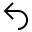</td>
  <td>E97A</td>
  <td>Reply</td>
 </tr>
 <tr><td></td>
  <td>E97B</td>
  <td>SetTile</td>
 </tr>
 <tr><td></td>
  <td>E97C</td>
  <td>Type</td>
 </tr>
 <tr><td></td>
  <td>E97D</td>
  <td>Korean</td>
 </tr>
 <tr><td></td>
  <td>E97E</td>
  <td>HalfAlpha</td>
 </tr>
 <tr><td></td>
  <td>E97F</td>
  <td>FullAlpha</td>
 </tr>
 <tr><td>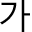</td>
  <td>E980</td>
  <td>Key12On</td>
 </tr>
 <tr><td></td>
  <td>E981</td>
  <td>ChineseChangjie</td>
 </tr>
 <tr><td>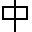</td>
  <td>E982</td>
  <td>QWERTYOn</td>
 </tr>
 <tr><td></td>
  <td>E983</td>
  <td>QWERTYOff</td>
 </tr>
 <tr><td></td>
  <td>E984</td>
  <td>ChineseQuick</td>
 </tr>
 <tr><td>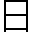</td>
  <td>E985</td>
  <td>Japanese</td>
 </tr>
 <tr><td></td>
  <td>E986</td>
  <td>FullHiragana</td>
 </tr>
 <tr><td></td>
  <td>E987</td>
  <td>FullKatakana</td>
 </tr>
 <tr><td></td>
  <td>E988</td>
  <td>HalfKatakana</td>
 </tr>
 <tr><td>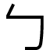</td>
  <td>E989</td>
  <td>ChineseBoPoMoFo</td>
 </tr>
 <tr><td></td>
  <td>E98A</td>
  <td>ChinesePinyin</td>
 </tr>
 <tr><td></td>
  <td>E98F</td>
  <td>ConstructionCone</td>
 </tr>
 <tr><td></td>
  <td>E990</td>
  <td>XboxOneConsole</td>
 </tr>
 <tr><td></td>
  <td>E992</td>
  <td>Volume0</td>
 </tr>
 <tr><td></td>
  <td>E993</td>
  <td>Volume1</td>
 </tr>
 <tr><td></td>
  <td>E994</td>
  <td>Volume2</td>
 </tr>
 <tr><td></td>
  <td>E995</td>
  <td>Volume3</td>
 </tr>
 <tr><td></td>
  <td>E996</td>
  <td>BatteryUnknown</td>
 </tr>
 <tr><td></td>
  <td>E998</td>
  <td>WifiAttentionOverlay</td>
 </tr>
 <tr><td></td>
  <td>E99A</td>
  <td>Robot</td>
 </tr>
 <tr><td></td>
  <td>E9A1</td>
  <td>TapAndSend</td>
 </tr>
 <tr><td></td>
  <td>E9A8</td>
  <td>PasswordKeyShow</td>
 </tr>
 <tr><td></td>
  <td>E9A9</td>
  <td>PasswordKeyHide</td>
 </tr>
 <tr><td>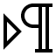</td>
  <td>E9AA</td>
  <td>BidiLtr</td>
 </tr>
 <tr><td>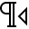</td>
  <td>E9AB</td>
  <td>BidiRtl</td>
 </tr>
 <tr><td>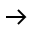</td>
  <td>E9AC</td>
  <td>ForwardSm</td>
 </tr>
 <tr><td></td>
  <td>E9AD</td>
  <td>CommaKey</td>
 </tr>
 <tr><td></td>
  <td>E9AE</td>
  <td>DashKey</td>
 </tr>
 <tr><td>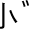</td>
  <td>E9AF</td>
  <td>DullSoundKey</td>
 </tr>
 <tr><td></td>
  <td>E9B0</td>
  <td>HalfDullSound</td>
 </tr>
 <tr><td></td>
  <td>E9B1</td>
  <td>RightDoubleQuote</td>
 </tr>
 <tr><td></td>
  <td>E9B2</td>
  <td>LeftDoubleQuote</td>
 </tr>
 <tr><td></td>
  <td>E9B3</td>
  <td>PuncKeyRightBottom</td>
 </tr>
 <tr><td>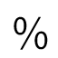</td>
  <td>E9B4</td>
  <td>PuncKey1</td>
 </tr>
 <tr><td></td>
  <td>E9B5</td>
  <td>PuncKey2</td>
 </tr>
 <tr><td></td>
  <td>E9B6</td>
  <td>PuncKey3</td>
 </tr>
 <tr><td></td>
  <td>E9B7</td>
  <td>PuncKey4</td>
 </tr>
 <tr><td>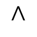</td>
  <td>E9B8</td>
  <td>PuncKey5</td>
 </tr>
 <tr><td></td>
  <td>E9B9</td>
  <td>PuncKey6</td>
 </tr>
 <tr><td></td>
  <td>E9BA</td>
  <td>PuncKey9</td>
 </tr>
 <tr><td></td>
  <td>E9BB</td>
  <td>PuncKey7</td>
 </tr>
 <tr><td>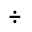</td>
  <td>E9BC</td>
  <td>PuncKey8</td>
 </tr>
 <tr><td></td>
  <td>E9CA</td>
  <td>Frigid</td>
 </tr>
 <tr><td></td>
  <td>E9D9</td>
  <td>Diagnostic</td>
 </tr>
 <tr><td></td>
  <td>E9F3</td>
  <td>Process</td>
 </tr>
 <tr><td></td>
  <td>EA14</td>
  <td>DisconnectDisplay</td>
 </tr>
 <tr><td></td>
  <td>EA1F</td>
  <td>Info2</td>
 </tr>
 <tr><td></td>
  <td>EA21</td>
  <td>ActionCenterAsterisk</td>
 </tr>
 <tr><td></td>
  <td>EA24</td>
  <td>Beta</td>
 </tr>
 <tr><td></td>
  <td>EA35</td>
  <td>SaveCopy</td>
 </tr>
 <tr><td></td>
  <td>EA37</td>
  <td>List</td>
 </tr>
 <tr><td></td>
  <td>EA38</td>
  <td>Asterisk</td>
 </tr>
 <tr><td></td>
  <td>EA39</td>
  <td>ErrorBadge</td>
 </tr>
 <tr><td></td>
  <td>EA3A</td>
  <td>CircleRing</td>
 </tr>
 <tr><td></td>
  <td>EA3B</td>
  <td>CircleFill</td>
 </tr>
 <tr><td></td>
  <td>EA40</td>
  <td>AllAppsMirrored</td>
 </tr>
 <tr><td></td>
  <td>EA41</td>
  <td>BookmarksMirrored</td>
 </tr>
 <tr><td></td>
  <td>EA42</td>
  <td>BulletedListMirrored</td>
 </tr>
 <tr><td></td>
  <td>EA43</td>
  <td>CallForwardInternationalMirrored</td>
 </tr>
 <tr><td></td>
  <td>EA44</td>
  <td>CallForwardRoamingMirrored</td>
 </tr>
 <tr><td></td>
  <td>EA47</td>
  <td>ChromeBackMirrored</td>
 </tr>
 <tr><td></td>
  <td>EA48</td>
  <td>ClearSelectionMirrored</td>
 </tr>
 <tr><td></td>
  <td>EA49</td>
  <td>ClosePaneMirrored</td>
 </tr>
 <tr><td></td>
  <td>EA4A</td>
  <td>ContactInfoMirrored</td>
 </tr>
 <tr><td></td>
  <td>EA4B</td>
  <td>DockRightMirrored</td>
 </tr>
 <tr><td></td>
  <td>EA4C</td>
  <td>DockLeftMirrored</td>
 </tr>
 <tr><td></td>
  <td>EA4E</td>
  <td>ExpandTileMirrored</td>
 </tr>
 <tr><td></td>
  <td>EA4F</td>
  <td>GoMirrored</td>
 </tr>
 <tr><td></td>
  <td>EA50</td>
  <td>GripperResizeMirrored</td>
 </tr>
 <tr><td></td>
  <td>EA51</td>
  <td>HelpMirrored</td>
 </tr>
 <tr><td></td>
  <td>EA52</td>
  <td>ImportMirrored</td>
 </tr>
 <tr><td></td>
  <td>EA53</td>
  <td>ImportAllMirrored</td>
 </tr>
 <tr><td></td>
  <td>EA54</td>
  <td>LeaveChatMirrored</td>
 </tr>
 <tr><td></td>
  <td>EA55</td>
  <td>ListMirrored</td>
 </tr>
 <tr><td></td>
  <td>EA56</td>
  <td>MailForwardMirrored</td>
 </tr>
 <tr><td></td>
  <td>EA57</td>
  <td>MailReplyMirrored</td>
 </tr>
 <tr><td></td>
  <td>EA58</td>
  <td>MailReplyAllMirrored</td>
 </tr>
 <tr><td></td>
  <td>EA5B</td>
  <td>OpenPaneMirrored</td>
 </tr>
 <tr><td></td>
  <td>EA5C</td>
  <td>OpenWithMirrored</td>
 </tr>
 <tr><td></td>
  <td>EA5E</td>
  <td>ParkingLocationMirrored</td>
 </tr>
 <tr><td></td>
  <td>EA5F</td>
  <td>ResizeMouseMediumMirrored</td>
 </tr>
 <tr><td></td>
  <td>EA60</td>
  <td>ResizeMouseSmallMirrored</td>
 </tr>
 <tr><td></td>
  <td>EA61</td>
  <td>ResizeMouseTallMirrored</td>
 </tr>
 <tr><td></td>
  <td>EA62</td>
  <td>ResizeTouchNarrowerMirrored</td>
 </tr>
 <tr><td></td>
  <td>EA63</td>
  <td>SendMirrored</td>
 </tr>
 <tr><td></td>
  <td>EA64</td>
  <td>SendFillMirrored</td>
 </tr>
 <tr><td></td>
  <td>EA65</td>
  <td>ShowResultsMirrored</td>
 </tr>
 <tr><td></td>
  <td>EA69</td>
  <td>Media</td>
 </tr>
 <tr><td></td>
  <td>EA6A</td>
  <td>SyncError</td>
 </tr>
 <tr><td></td>
  <td>EA6C</td>
  <td>Devices3</td>
 </tr>
 <tr><td></td>
  <td>EA80</td>
  <td>Lightbulb</td>
 </tr>
 <tr><td></td>
  <td>EA81</td>
  <td>StatusCircle</td>
 </tr>
 <tr><td></td>
  <td>EA82</td>
  <td>StatusTriangle</td>
 </tr>
 <tr><td></td>
  <td>EA83</td>
  <td>StatusError</td>
 </tr>
 <tr><td></td>
  <td>EA84</td>
  <td>StatusWarning</td>
 </tr>
 <tr><td></td>
  <td>EA86</td>
  <td>Puzzle</td>
 </tr>
 <tr><td></td>
  <td>EA89</td>
  <td>CalendarSolid</td>
 </tr>
 <tr><td></td>
  <td>EA8A</td>
  <td>HomeSolid</td>
 </tr>
 <tr><td></td>
  <td>EA8B</td>
  <td>ParkingLocationSolid</td>
 </tr>
 <tr><td></td>
  <td>EA8C</td>
  <td>ContactSolid</td>
 </tr>
 <tr><td></td>
  <td>EA8D</td>
  <td>ConstructionSolid</td>
 </tr>
 <tr><td></td>
  <td>EA8E</td>
  <td>AccidentSolid</td>
 </tr>
 <tr><td></td>
  <td>EA8F</td>
  <td>Ringer</td>
 </tr>
 <tr><td></td>
  <td>EA91</td>
  <td>ThoughtBubble</td>
 </tr>
 <tr><td></td>
  <td>EA92</td>
  <td>HeartBroken</td>
 </tr>
 <tr><td></td>
  <td>EA93</td>
  <td>BatteryCharging10</td>
 </tr>
 <tr><td></td>
  <td>EA94</td>
  <td>BatterySaver9</td>
 </tr>
 <tr><td></td>
  <td>EA95</td>
  <td>BatterySaver10</td>
 </tr>
 <tr><td></td>
  <td>EA97</td>
  <td>CallForwardingMirrored</td>
 </tr>
 <tr><td></td>
  <td>EA98</td>
  <td>MultiSelectMirrored</td>
 </tr>
 <tr><td></td>
  <td>EA99</td>
  <td>Broom</td>
 </tr>
 <tr><td></td>
  <td>EADF</td>
  <td>Trackers</td>
 </tr>
 <tr><td></td>
  <td>EB05</td>
  <td>PieSingle</td>
 </tr>
 <tr><td></td>
  <td>EB0F</td>
  <td>StockDown</td>
 </tr>
 <tr><td></td>
  <td>EB11</td>
  <td>StockUp</td>
 </tr>
 <tr><td></td>
  <td>EB42</td>
  <td>Drop</td>
 </tr>
 <tr><td></td>
  <td>EB47</td>
  <td>BusSolid</td>
 </tr>
 <tr><td></td>
  <td>EB48</td>
  <td>FerrySolid</td>
 </tr>
 <tr><td></td>
  <td>EB49</td>
  <td>StartPointSolid</td>
 </tr>
 <tr><td></td>
  <td>EB4A</td>
  <td>StopPointSolid</td>
 </tr>
 <tr><td></td>
  <td>EB4B</td>
  <td>EndPointSolid</td>
 </tr>
 <tr><td></td>
  <td>EB4C</td>
  <td>AirplaneSolid</td>
 </tr>
 <tr><td></td>
  <td>EB4D</td>
  <td>TrainSolid</td>
 </tr>
 <tr><td></td>
  <td>EB4E</td>
  <td>WorkSolid</td>
 </tr>
 <tr><td></td>
  <td>EB4F</td>
  <td>ReminderFill</td>
 </tr>
 <tr><td></td>
  <td>EB50</td>
  <td>Reminder</td>
 </tr>
 <tr><td></td>
  <td>EB51</td>
  <td>Heart</td>
 </tr>
 <tr><td></td>
  <td>EB52</td>
  <td>HeartFill</td>
 </tr>
 <tr><td></td>
  <td>EB55</td>
  <td>EthernetError</td>
 </tr>
 <tr><td></td>
  <td>EB56</td>
  <td>EthernetWarning</td>
 </tr>
 <tr><td></td>
  <td>EB57</td>
  <td>StatusConnecting1</td>
 </tr>
 <tr><td></td>
  <td>EB58</td>
  <td>StatusConnecting2</td>
 </tr>
 <tr><td></td>
  <td>EB59</td>
  <td>StatusUnsecure</td>
 </tr>
 <tr><td></td>
  <td>EB5A</td>
  <td>WifiError0</td>
 </tr>
 <tr><td></td>
  <td>EB5B</td>
  <td>WifiError1</td>
 </tr>
 <tr><td></td>
  <td>EB5C</td>
  <td>WifiError2</td>
 </tr>
 <tr><td></td>
  <td>EB5D</td>
  <td>WifiError3</td>
 </tr>
 <tr><td></td>
  <td>EB5E</td>
  <td>WifiError4</td>
 </tr>
 <tr><td></td>
  <td>EB5F</td>
  <td>WifiWarning0</td>
 </tr>
 <tr><td></td>
  <td>EB60</td>
  <td>WifiWarning1</td>
 </tr>
 <tr><td></td>
  <td>EB61</td>
  <td>WifiWarning2</td>
 </tr>
 <tr><td></td>
  <td>EB62</td>
  <td>WifiWarning3</td>
 </tr>
 <tr><td></td>
  <td>EB63</td>
  <td>WifiWarning4</td>
 </tr>
 <tr><td></td>
  <td>EB66</td>
  <td>Devices4</td>
 </tr>
 <tr><td></td>
  <td>EB67</td>
  <td>NUIIris</td>
 </tr>
 <tr><td></td>
  <td>EB68</td>
  <td>NUIFace</td>
 </tr>
 <tr><td></td>
  <td>EB7E</td>
  <td>EditMirrored</td>
 </tr>
 <tr><td></td>
  <td>EB82</td>
  <td>NUIFPStartSlideHand</td>
 </tr>
 <tr><td></td>
  <td>EB83</td>
  <td>NUIFPStartSlideAction</td>
 </tr>
 <tr><td></td>
  <td>EB84</td>
  <td>NUIFPContinueSlideHand</td>
 </tr>
 <tr><td></td>
  <td>EB85</td>
  <td>NUIFPContinueSlideAction</td>
 </tr>
 <tr><td></td>
  <td>EB86</td>
  <td>NUIFPRollRightHand</td>
 </tr>
 <tr><td></td>
  <td>EB87</td>
  <td>NUIFPRollRightHandAction</td>
 </tr>
 <tr><td></td>
  <td>EB88</td>
  <td>NUIFPRollLeftHand</td>
 </tr>
 <tr><td></td>
  <td>EB89</td>
  <td>NUIFPRollLeftAction</td>
 </tr>
 <tr><td></td>
  <td>EB8A</td>
  <td>NUIFPPressHand</td>
 </tr>
 <tr><td></td>
  <td>EB8B</td>
  <td>NUIFPPressAction</td>
 </tr>
 <tr><td></td>
  <td>EB8C</td>
  <td>NUIFPPressRepeatHand</td>
 </tr>
 <tr><td></td>
  <td>EB8D</td>
  <td>NUIFPPressRepeatAction</td>
 </tr>
 <tr><td></td>
  <td>EB90</td>
  <td>StatusErrorFull</td>
 </tr>
 <tr><td></td>
  <td>EB91</td>
  <td>MultitaskExpanded</td>
 </tr>
 <tr><td></td>
  <td>EB95</td>
  <td>Certificate</td>
 </tr>
 <tr><td></td>
  <td>EB96</td>
  <td>BackSpaceQWERTYLg</td>
 </tr>
 <tr><td></td>
  <td>EB97</td>
  <td>ReturnKeyLg</td>
 </tr>
 <tr><td></td>
  <td>EB9D</td>
  <td>FastForward</td>
 </tr>
 <tr><td></td>
  <td>EB9E</td>
  <td>Rewind</td>
 </tr>
 <tr><td></td>
  <td>EB9F</td>
  <td>Photo2</td>
 </tr>
 <tr><td></td>
  <td>EBA0</td>
  <td>&nbsp;MobBattery0</td>
 </tr>
 <tr><td></td>
  <td>EBA1</td>
  <td>&nbsp;MobBattery1</td>
 </tr>
 <tr><td></td>
  <td>EBA2</td>
  <td>&nbsp;MobBattery2</td>
 </tr>
 <tr><td></td>
  <td>EBA3</td>
  <td>&nbsp;MobBattery3</td>
 </tr>
 <tr><td></td>
  <td>EBA4</td>
  <td>&nbsp;MobBattery4</td>
 </tr>
 <tr><td></td>
  <td>EBA5</td>
  <td>&nbsp;MobBattery5</td>
 </tr>
 <tr><td></td>
  <td>EBA6</td>
  <td>&nbsp;MobBattery6</td>
 </tr>
 <tr><td></td>
  <td>EBA7</td>
  <td>&nbsp;MobBattery7</td>
 </tr>
 <tr><td></td>
  <td>EBA8</td>
  <td>&nbsp;MobBattery8</td>
 </tr>
 <tr><td></td>
  <td>EBA9</td>
  <td>&nbsp;MobBattery9</td>
 </tr>
 <tr><td></td>
  <td>EBAA</td>
  <td>MobBattery10</td>
 </tr>
 <tr><td></td>
  <td>EBAB</td>
  <td>&nbsp;MobBatteryCharging0</td>
 </tr>
 <tr><td></td>
  <td>EBAC</td>
  <td>&nbsp;MobBatteryCharging1</td>
 </tr>
 <tr><td></td>
  <td>EBAD</td>
  <td>&nbsp;MobBatteryCharging2</td>
 </tr>
 <tr><td></td>
  <td>EBAE</td>
  <td>&nbsp;MobBatteryCharging3</td>
 </tr>
 <tr><td></td>
  <td>EBAF</td>
  <td>&nbsp;MobBatteryCharging4</td>
 </tr>
 <tr><td></td>
  <td>EBB0</td>
  <td>&nbsp;MobBatteryCharging5</td>
 </tr>
 <tr><td></td>
  <td>EBB1</td>
  <td>&nbsp;MobBatteryCharging6</td>
 </tr>
 <tr><td></td>
  <td>EBB2</td>
  <td>&nbsp;MobBatteryCharging7</td>
 </tr>
 <tr><td></td>
  <td>EBB3</td>
  <td>&nbsp;MobBatteryCharging8</td>
 </tr>
 <tr><td></td>
  <td>EBB4</td>
  <td>&nbsp;MobBatteryCharging9</td>
 </tr>
 <tr><td></td>
  <td>EBB5</td>
  <td>&nbsp;MobBatteryCharging10</td>
 </tr>
 <tr><td></td>
  <td>EBB6</td>
  <td>&nbsp;MobBatterySaver0</td>
 </tr>
 <tr><td></td>
  <td>EBB7</td>
  <td>&nbsp;MobBatterySaver1</td>
 </tr>
 <tr><td></td>
  <td>EBB8</td>
  <td>&nbsp;MobBatterySaver2</td>
 </tr>
 <tr><td></td>
  <td>EBB9</td>
  <td>&nbsp;MobBatterySaver3</td>
 </tr>
 <tr><td></td>
  <td>EBBA</td>
  <td>&nbsp;MobBatterySaver4</td>
 </tr>
 <tr><td></td>
  <td>EBBB</td>
  <td>&nbsp;MobBatterySaver5</td>
 </tr>
 <tr><td></td>
  <td>EBBC</td>
  <td>&nbsp;MobBatterySaver6</td>
 </tr>
 <tr><td></td>
  <td>EBBD</td>
  <td>&nbsp;MobBatterySaver7</td>
 </tr>
 <tr><td></td>
  <td>EBBE</td>
  <td>&nbsp;MobBatterySaver8</td>
 </tr>
 <tr><td></td>
  <td>EBBF</td>
  <td>&nbsp;MobBatterySaver9</td>
 </tr>
 <tr><td></td>
  <td>EBC0</td>
  <td>&nbsp;MobBatterySaver10</td>
 </tr>
 <tr><td></td>
  <td>EBC3</td>
  <td>DictionaryCloud</td>
 </tr>
 <tr><td></td>
  <td>EBC4</td>
  <td>ResetDrive</td>
 </tr>
 <tr><td></td>
  <td>EBC5</td>
  <td>VolumeBars</td>
 </tr>
 <tr><td></td>
  <td>EBC6</td>
  <td>Project</td>
 </tr>
 <tr><td></td>
  <td>EBD2</td>
  <td>AdjustHologram</td>
 </tr>
 <tr><td></td>
  <td>EBD4</td>
  <td>WifiCallBars</td>
 </tr>
 <tr><td></td>
  <td>EBD5</td>
  <td>WifiCall0</td>
 </tr>
 <tr><td></td>
  <td>EBD6</td>
  <td>WifiCall1</td>
 </tr>
 <tr><td></td>
  <td>EBD7</td>
  <td>WifiCall2</td>
 </tr>
 <tr><td></td>
  <td>EBD8</td>
  <td>WifiCall3</td>
 </tr>
 <tr><td></td>
  <td>EBD9</td>
  <td>WifiCall4</td>
 </tr>
 <tr><td></td>
  <td>EBDE</td>
  <td>DeviceDiscovery</td>
 </tr>
 <tr><td></td>
  <td>EBE6</td>
  <td>WindDirection</td>
 </tr>
 <tr><td></td>
  <td>EBE7</td>
  <td>RightArrowKeyTime0</td>
 </tr>
 <tr><td></td>
  <td>EBFC</td>
  <td>TabletMode</td>
 </tr>
 <tr><td></td>
  <td>EBFD</td>
  <td>StatusCircleLeft</td>
 </tr>
 <tr><td></td>
  <td>EBFE</td>
  <td>StatusTriangleLeft</td>
 </tr>
 <tr><td></td>
  <td>EBFF</td>
  <td>StatusErrorLeft</td>
 </tr>
 <tr><td></td>
  <td>EC00</td>
  <td>StatusWarningLeft</td>
 </tr>
 <tr><td></td>
  <td>EC02</td>
  <td>MobBatteryUnknown</td>
 </tr>
 <tr><td></td>
  <td>EC05</td>
  <td>NetworkTower</td>
 </tr>
 <tr><td></td>
  <td>EC06</td>
  <td>CityNext</td>
 </tr>
 <tr><td></td>
  <td>EC07</td>
  <td>CityNext2</td>
 </tr>
 <tr><td></td>
  <td>EC08</td>
  <td>Courthouse</td>
 </tr>
 <tr><td></td>
  <td>EC09</td>
  <td>Groceries</td>
 </tr>
 <tr><td></td>
  <td>EC0A</td>
  <td>Sustainable</td>
 </tr>
 <tr><td></td>
  <td>EC0B</td>
  <td>BuildingEnergy</td>
 </tr>
 <tr><td></td>
  <td>EC11</td>
  <td>ToggleFilled</td>
 </tr>
 <tr><td></td>
  <td>EC12</td>
  <td>ToggleBorder</td>
 </tr>
 <tr><td></td>
  <td>EC13</td>
  <td>SliderThumb</td>
 </tr>
 <tr><td></td>
  <td>EC14</td>
  <td>ToggleThumb</td>
 </tr>
 <tr><td></td>
  <td>EC15</td>
  <td>MiracastLogoSmall</td>
 </tr>
 <tr><td></td>
  <td>EC16</td>
  <td>MiracastLogoLarge</td>
 </tr>
 <tr><td></td>
  <td>EC19</td>
  <td>PLAP</td>
 </tr>
 <tr><td></td>
  <td>EC1B</td>
  <td>Badge</td>
 </tr>
 <tr><td></td>
  <td>EC1E</td>
  <td>SignalRoaming</td>
 </tr>
 <tr><td></td>
  <td>EC20</td>
  <td>MobileLocked</td>
 </tr>
 <tr><td></td>
  <td>EC24</td>
  <td>InsiderHubApp</td>
 </tr>
 <tr><td></td>
  <td>EC25</td>
  <td>PersonalFolder</td>
 </tr>
 <tr><td></td>
  <td>EC26</td>
  <td>HomeGroup</td>
 </tr>
 <tr><td></td>
  <td>EC27</td>
  <td>MyNetwork</td>
 </tr>
 <tr><td></td>
  <td>EC31</td>
  <td>KeyboardFull</td>
 </tr>
 <tr><td></td>
  <td>EC37</td>
  <td>MobSignal1</td>
 </tr>
 <tr><td></td>
  <td>EC38</td>
  <td>MobSignal2</td>
 </tr>
 <tr><td></td>
  <td>EC39</td>
  <td>MobSignal3</td>
 </tr>
 <tr><td></td>
  <td>EC3A</td>
  <td>MobSignal4</td>
 </tr>
 <tr><td></td>
  <td>EC3B</td>
  <td>MobSignal5</td>
 </tr>
 <tr><td></td>
  <td>EC3C</td>
  <td>MobWifi1</td>
 </tr>
 <tr><td></td>
  <td>EC3D</td>
  <td>MobWifi2</td>
 </tr>
 <tr><td></td>
  <td>EC3E</td>
  <td>MobWifi3</td>
 </tr>
 <tr><td></td>
  <td>EC3F</td>
  <td>MobWifi4</td>
 </tr>
 <tr><td></td>
  <td>EC40</td>
  <td>MobAirplane</td>
 </tr>
 <tr><td></td>
  <td>EC41</td>
  <td>MobBluetooth</td>
 </tr>
 <tr><td></td>
  <td>EC42</td>
  <td>MobActionCenter</td>
 </tr>
 <tr><td></td>
  <td>EC43</td>
  <td>MobLocation</td>
 </tr>
 <tr><td></td>
  <td>EC44</td>
  <td>MobWifiHotspot</td>
 </tr>
 <tr><td></td>
  <td>EC45</td>
  <td>LanguageJpn</td>
 </tr>
 <tr><td></td>
  <td>EC46</td>
  <td>MobQuietHours</td>
 </tr>
 <tr><td></td>
  <td>EC47</td>
  <td>MobDrivingMode</td>
 </tr>
 <tr><td></td>
  <td>EC48</td>
  <td>SpeedOff</td>
 </tr>
 <tr><td></td>
  <td>EC49</td>
  <td>SpeedMedium</td>
 </tr>
 <tr><td></td>
  <td>EC4A</td>
  <td>SpeedHigh</td>
 </tr>
 <tr><td></td>
  <td>EC4E</td>
  <td>ThisPC</td>
 </tr>
 <tr><td></td>
  <td>EC4F</td>
  <td>MusicNote</td>
 </tr>
 <tr><td></td>
  <td>EC50</td>
  <td>FileExplorer</td>
 </tr>
 <tr><td></td>
  <td>EC51</td>
  <td>FileExplorerApp</td>
 </tr>
 <tr><td></td>
  <td>EC52</td>
  <td>LeftArrowKeyTime0</td>
 </tr>
 <tr><td></td>
  <td>EC54</td>
  <td>MicOff</td>
 </tr>
 <tr><td></td>
  <td>EC55</td>
  <td>MicSleep</td>
 </tr>
 <tr><td></td>
  <td>EC56</td>
  <td>MicError</td>
 </tr>
 <tr><td></td>
  <td>EC57</td>
  <td>PlaybackRate1x</td>
 </tr>
 <tr><td></td>
  <td>EC58</td>
  <td>PlaybackRateOther</td>
 </tr>
 <tr><td></td>
  <td>EC59</td>
  <td>CashDrawer</td>
 </tr>
 <tr><td></td>
  <td>EC5A</td>
  <td>BarcodeScanner</td>
 </tr>
 <tr><td></td>
  <td>EC5B</td>
  <td>ReceiptPrinter</td>
 </tr>
 <tr><td></td>
  <td>EC5C</td>
  <td>MagStripeReader</td>
 </tr>
 <tr><td></td>
  <td>EC61</td>
  <td>CompletedSolid</td>
 </tr>
 <tr><td></td>
  <td>EC64</td>
  <td>CompanionApp</td>
 </tr>
 <tr><td></td>
  <td>EC6D</td>
  <td>SwipeRevealArt</td>
 </tr>
 <tr><td></td>
  <td>EC71</td>
  <td>MicOn</td>
 </tr>
 <tr><td></td>
  <td>EC72</td>
  <td>MicClipping</td>
 </tr>
 <tr><td></td>
  <td>EC74</td>
  <td>TabletSelected</td>
 </tr>
 <tr><td></td>
  <td>EC75</td>
  <td>MobileSelected</td>
 </tr>
 <tr><td></td>
  <td>EC76</td>
  <td>LaptopSelected</td>
 </tr>
 <tr><td></td>
  <td>EC77</td>
  <td>TVMonitorSelected</td>
 </tr>
 <tr><td></td>
  <td>EC7A</td>
  <td>DeveloperTools</td>
 </tr>
 <tr><td></td>
  <td>EC7E</td>
  <td>MobCallForwarding</td>
 </tr>
 <tr><td></td>
  <td>EC7F</td>
  <td>MobCallForwardingMirrored</td>
 </tr>
 <tr><td></td>
  <td>EC80</td>
  <td>BodyCam</td>
 </tr>
 <tr><td></td>
  <td>EC81</td>
  <td>PoliceCar</td>
 </tr>
 <tr><td></td>
  <td>EC87</td>
  <td>Draw</td>
 </tr>
 <tr><td></td>
  <td>EC88</td>
  <td>DrawSolid</td>
 </tr>
 <tr><td></td>
  <td>EC8A</td>
  <td>LowerBrightness</td>
 </tr>
 <tr><td></td>
  <td>EC8F</td>
  <td>ScrollUpDown</td>
 </tr>
 <tr><td></td>
  <td>EC92</td>
  <td>DateTime</td>
 </tr>
 <tr><td></td>
  <td>ECA5</td>
  <td>Tiles</td>
 </tr>
 <tr><td></td>
  <td>ECA7</td>
  <td>PartyLeader</td>
 </tr>
 <tr><td></td>
  <td>ECAA</td>
  <td>AppIconDefault</td>
 </tr>
 <tr><td></td>
  <td>ECC4</td>
  <td>AddSurfaceHub</td>
 </tr>
 <tr><td></td>
  <td>ECC5</td>
  <td>DevUpdate</td>
 </tr>
 <tr><td></td>
  <td>ECC6</td>
  <td>Unit</td>
 </tr>
 <tr><td></td>
  <td>ECC8</td>
  <td>AddTo</td>
 </tr>
 <tr><td></td>
  <td>ECC9</td>
  <td>RemoveFrom</td>
 </tr>
 <tr><td></td>
  <td>ECCA</td>
  <td>RadioBtnOff</td>
 </tr>
 <tr><td></td>
  <td>ECCB</td>
  <td>RadioBtnOn</td>
 </tr>
 <tr><td></td>
  <td>ECCC</td>
  <td>RadioBullet2</td>
 </tr>
 <tr><td></td>
  <td>ECCD</td>
  <td>ExploreContent</td>
 </tr>
 <tr><td></td>
  <td>ECE7</td>
  <td>ScrollMode</td>
 </tr>
 <tr><td></td>
  <td>ECE8</td>
  <td>ZoomMode</td>
 </tr>
 <tr><td></td>
  <td>ECE9</td>
  <td>PanMode</td>
 </tr>
 <tr><td></td>
  <td>ECF0</td>
  <td>WiredUSB&nbsp;</td>
 </tr>
 <tr><td></td>
  <td>ECF1</td>
  <td>WirelessUSB</td>
 </tr>
 <tr><td></td>
  <td>ECF3</td>
  <td>USBSafeConnect</td>
 </tr>
 <tr><td></td>
  <td>ED0C</td>
  <td>ActionCenterNotificationMirrored</td>
 </tr>
 <tr><td></td>
  <td>ED0D</td>
  <td>ActionCenterMirrored</td>
 </tr>
 <tr><td></td>
  <td>ED10</td>
  <td>ResetDevice</td>
 </tr>
 <tr><td></td>
  <td>ED15</td>
  <td>Feedback</td>
 </tr>
 <tr><td></td>
  <td>ED1E</td>
  <td>Subtitles</td>
 </tr>
 <tr><td></td>
  <td>ED1F</td>
  <td>SubtitlesAudio</td>
 </tr>
 <tr><td></td>
  <td>ED28</td>
  <td>CalendarMirrored</td>
 </tr>
 <tr><td></td>
  <td>ED2A</td>
  <td>eSIM</td>
 </tr>
 <tr><td></td>
  <td>ED2B</td>
  <td>eSIMNoProfile</td>
 </tr>
 <tr><td></td>
  <td>ED2C</td>
  <td>eSIMLocked</td>
 </tr>
 <tr><td></td>
  <td>ED2D</td>
  <td>eSIMBusy</td>
 </tr>
 <tr><td></td>
  <td>ED2E</td>
  <td>SignalError</td>
 </tr>
 <tr><td></td>
  <td>ED2F</td>
  <td>StreamingEnterprise</td>
 </tr>
 <tr><td></td>
  <td>ED30</td>
  <td>Headphone0</td>
 </tr>
 <tr><td></td>
  <td>ED31</td>
  <td>Headphone1</td>
 </tr>
 <tr><td></td>
  <td>ED32</td>
  <td>Headphone2</td>
 </tr>
 <tr><td></td>
  <td>ED33</td>
  <td>Headphone3</td>
 </tr>
 <tr><td></td>
  <td>ED39</td>
  <td>KeyboardBrightness</td>
 </tr>
 <tr><td></td>
  <td>ED3A</td>
  <td>KeyboardLowerBrightness</td>
 </tr>
 <tr><td></td>
  <td>ED3C</td>
  <td>SkipBack10</td>
 </tr>
 <tr><td></td>
  <td>ED3D</td>
  <td>SkipForward30</td>
 </tr>
 <tr><td></td>
  <td>ED41</td>
  <td>TreeFolderFolder</td>
 </tr>
 <tr><td></td>
  <td>ED42</td>
  <td>TreeFolderFolderFill</td>
 </tr>
 <tr><td></td>
  <td>ED43</td>
  <td>TreeFolderFolderOpen</td>
 </tr>
 <tr><td></td>
  <td>ED44</td>
  <td>TreeFolderFolderOpenFill</td>
 </tr>
 <tr><td></td>
  <td>ED47</td>
  <td>MultimediaDMP</td>
 </tr>
 <tr><td></td>
  <td>ED4C</td>
  <td>KeyboardOneHanded</td>
 </tr>
 <tr><td></td>
  <td>ED4D</td>
  <td>Narrator</td>
 </tr>
 <tr><td></td>
  <td>ED53</td>
  <td>EmojiTabPeople</td>
 </tr>
 <tr><td></td>
  <td>ED54</td>
  <td>EmojiTabSmilesAnimals</td>
 </tr>
 <tr><td></td>
  <td>ED55</td>
  <td>EmojiTabCelebrationObjects</td>
 </tr>
 <tr><td></td>
  <td>ED56</td>
  <td>EmojiTabFoodPlants</td>
 </tr>
 <tr><td></td>
  <td>ED57</td>
  <td>EmojiTabTransitPlaces</td>
 </tr>
 <tr><td></td>
  <td>ED58</td>
  <td>EmojiTabSymbols</td>
 </tr>
 <tr><td></td>
  <td>ED59</td>
  <td>EmojiTabTextSmiles</td>
 </tr>
 <tr><td></td>
  <td>ED5A</td>
  <td>EmojiTabFavorites</td>
 </tr>
 <tr><td></td>
  <td>ED5B</td>
  <td>EmojiSwatch</td>
 </tr>
 <tr><td></td>
  <td>ED5C</td>
  <td>ConnectApp</td>
 </tr>
 <tr><td></td>
  <td>ED5D</td>
  <td>CompanionDeviceFramework</td>
 </tr>
 <tr><td></td>
  <td>ED5E</td>
  <td>Ruler</td>
 </tr>
 <tr><td></td>
  <td>ED5F</td>
  <td>FingerInking</td>
 </tr>
 <tr><td></td>
  <td>ED60</td>
  <td>StrokeErase</td>
 </tr>
 <tr><td></td>
  <td>ED61</td>
  <td>PointErase</td>
 </tr>
 <tr><td></td>
  <td>ED62</td>
  <td>ClearAllInk</td>
 </tr>
 <tr><td></td>
  <td>ED63</td>
  <td>Pencil</td>
 </tr>
 <tr><td></td>
  <td>ED64</td>
  <td>Marker</td>
 </tr>
 <tr><td></td>
  <td>ED65</td>
  <td>InkingCaret</td>
 </tr>
 <tr><td></td>
  <td>ED66</td>
  <td>InkingColorOutline</td>
 </tr>
 <tr><td></td>
  <td>ED67</td>
  <td>InkingColorFill</td>
 </tr>
 <tr><td></td>
  <td>EDA2</td>
  <td>HardDrive</td>
 </tr>
 <tr><td></td>
  <td>EDA3</td>
  <td>NetworkAdapter</td>
 </tr>
 <tr><td></td>
  <td>EDA4</td>
  <td>Touchscreen</td>
 </tr>
 <tr><td></td>
  <td>EDA5</td>
  <td>NetworkPrinter</td>
 </tr>
 <tr><td></td>
  <td>EDA6</td>
  <td>CloudPrinter</td>
 </tr>
 <tr><td></td>
  <td>EDA7</td>
  <td>KeyboardShortcut</td>
 </tr>
 <tr><td></td>
  <td>EDA8</td>
  <td>BrushSize</td>
 </tr>
 <tr><td></td>
  <td>EDA9</td>
  <td>NarratorForward</td>
 </tr>
 <tr><td></td>
  <td>EDAA</td>
  <td>NarratorForwardMirrored</td>
 </tr>
 <tr><td></td>
  <td>EDAB</td>
  <td>SyncBadge12</td>
 </tr>
 <tr><td></td>
  <td>EDAC</td>
  <td>RingerBadge12</td>
 </tr>
 <tr><td></td>
  <td>EDAD</td>
  <td>AsteriskBadge12</td>
 </tr>
 <tr><td></td>
  <td>EDAE</td>
  <td>ErrorBadge12</td>
 </tr>
 <tr><td></td>
  <td>EDAF</td>
  <td>CircleRingBadge12</td>
 </tr>
 <tr><td></td>
  <td>EDB0</td>
  <td>CircleFillBadge12</td>
 </tr>
 <tr><td></td>
  <td>EDB1</td>
  <td>ImportantBadge12</td>
 </tr>
 <tr><td></td>
  <td>EDB3</td>
  <td>MailBadge12</td>
 </tr>
 <tr><td></td>
  <td>EDB4</td>
  <td>PauseBadge12</td>
 </tr>
 <tr><td></td>
  <td>EDB5</td>
  <td>PlayBadge12</td>
 </tr>
 <tr><td></td>
  <td>EDC6</td>
  <td>PenWorkspace</td>
 </tr>
 <tr><td></td>
  <td>EDE1</td>
  <td>Export</td>
 </tr>
 <tr><td></td>
  <td>EDE2</td>
  <td>ExportMirrored</td>
 </tr>
 <tr><td></td>
  <td>EDFB</td>
  <td>CaligraphyPen</td>
 </tr>
 <tr><td></td>
  <td>EE35</td>
  <td>ReplyMirrored</td>
 </tr>
 <tr><td></td>
  <td>EE3F</td>
  <td>LockscreenDesktop</td>
 </tr>
 <tr><td></td>
  <td>EE40</td>
  <td>Multitask16</td>
 </tr>
 <tr><td></td>
  <td>EE4A</td>
  <td>Play36</td>
 </tr>
 <tr><td></td>
  <td>EE56</td>
  <td>PenPalette</td>
 </tr>
 <tr><td></td>
  <td>EE57</td>
  <td>GuestUser</td>
 </tr>
 <tr><td></td>
  <td>EE63</td>
  <td>SettingsBattery</td>
 </tr>
 <tr><td></td>
  <td>EE64</td>
  <td>TaskbarPhone</td>
 </tr>
 <tr><td></td>
  <td>EE65</td>
  <td>LockScreenGlance</td>
 </tr>
 <tr><td></td>
  <td>EE71</td>
  <td>ImageExport</td>
 </tr>
 <tr><td></td>
  <td>EE77</td>
  <td>WifiEthernet</td>
 </tr>
 <tr><td></td>
  <td>EE79</td>
  <td>ActionCenterQuiet</td>
 </tr>
 <tr><td></td>
  <td>EE7A</td>
  <td>ActionCenterQuietNotification</td>
 </tr>
 <tr><td></td>
  <td>EE92</td>
  <td>TrackersMirrored</td>
 </tr>
 <tr><td></td>
  <td>EE93</td>
  <td>DateTimeMirrored</td>
 </tr>
 <tr><td></td>
  <td>EE94</td>
  <td>Wheel</td>
 </tr>
 <tr><td></td>
  <td>EF15</td>
  <td>PenWorkspaceMirrored</td>
 </tr>
 <tr><td></td>
  <td>EF16</td>
  <td>PenPaletteMirrored</td>
 </tr>
 <tr><td></td>
  <td>EF17</td>
  <td>StrokeEraseMirrored</td>
 </tr>
 <tr><td></td>
  <td>EF18</td>
  <td>PointEraseMirrored</td>
 </tr>
 <tr><td></td>
  <td>EF19</td>
  <td>ClearAllInkMirrored</td>
 </tr>
 <tr><td></td>
  <td>EF1F</td>
  <td>BackgroundToggle</td>
 </tr>
 <tr><td></td>
  <td>EF20</td>
  <td>Marquee</td>
 </tr>
<tr><td></td><td>F003</td><td>Relationship</td></tr>
<tr><td></td><td>F080</td><td>DefaultAPN</td></tr>
<tr><td></td><td>F081</td><td>UserAPN </td></tr>
<tr><td></td><td>F085</td><td>DoublePinyin</td></tr>
<tr><td></td><td>F08C</td><td>BlueLight</td></tr>
<tr><td></td><td>F093</td><td>ButtonA</td></tr>
<tr><td></td><td>F094</td><td>ButtonB</td></tr>
<tr><td></td><td>F095</td><td>ButtonY</td></tr>
<tr><td></td><td>F096</td><td>ButtonX</td></tr>
<tr><td></td><td>F0AD</td><td>ArrowUp8</td></tr>
<tr><td></td><td>F0AE</td><td>ArrowDown8</td></tr>
<tr><td></td><td>F0AF</td><td>ArrowRight8</td></tr>
<tr><td></td><td>F0B0</td><td>ArrowLeft8</td></tr>
<tr><td></td><td>F0B2</td><td>QuarentinedItems</td></tr>
<tr><td></td><td>F0B3</td><td>QuarentinedItemsMirrored</td></tr>
<tr><td></td><td>F0B4</td><td>Protractor</td></tr>
<tr><td></td><td>F0B5</td><td>ChecklistMirrored</td></tr>
<tr><td></td><td>F0B6</td><td>StatusCircle7</td></tr>
<tr><td></td><td>F0B7</td><td>StatusCheckmark7</td></tr>
<tr><td></td><td>F0B8</td><td>StatusErrorCircle7</td></tr>
<tr><td></td><td>F0B9</td><td>Connected</td></tr>
<tr><td></td><td>F0C6</td><td>PencilFill</td></tr>
<tr><td></td><td>F0C7</td><td>CalligraphyFill</td></tr>
<tr><td></td><td>F0CA</td><td>QuarterStarLeft</td></tr>
<tr><td></td><td>F0CB</td><td>QuarterStarRight</td></tr>
<tr><td></td><td>F0CC</td><td>ThreeQuarterStarLeft</td></tr>
<tr><td></td><td>F0CD</td><td>ThreeQuarterStarRight</td></tr>
<tr><td></td><td>F0CE</td><td>QuietHoursBadge12</td></tr>
<tr><td></td><td>F0D2</td><td>BackMirrored</td></tr>
<tr><td></td><td>F0D3</td><td>ForwardMirrored</td></tr>
<tr><td></td><td>F0D5</td><td>ChromeBackContrast</td></tr>
<tr><td></td><td>F0D6</td><td>ChromeBackContrastMirrored</td></tr>
<tr><td></td><td>F0D7</td><td>ChromeBackToWindowContrast</td></tr>
<tr><td></td><td>F0D8</td><td>ChromeFullScreenContrast</td></tr>
<tr><td></td><td>F0E2</td><td>GridView</td></tr>
<tr><td></td><td>F0E3</td><td>ClipboardList</td></tr>
<tr><td></td><td>F0E4</td><td>ClipboardListMirrored</td></tr>
<tr><td></td><td>F0E5</td><td>OutlineQuarterStarLeft</td></tr>
<tr><td></td><td>F0E6</td><td>OutlineQuarterStarRight</td></tr>
<tr><td></td><td>F0E7</td><td>OutlineHalfStarLeft</td></tr>
<tr><td></td><td>F0E8</td><td>OutlineHalfStarRight</td></tr>
<tr><td></td><td>F0E9</td><td>OutlineThreeQuarterStarLeft</td></tr>
<tr><td></td><td>F0EA</td><td>OutlineThreeQuarterStarRight</td></tr>
<tr><td></td><td>F0EB</td><td>SpatialVolume0</td></tr>
<tr><td></td><td>F0EC</td><td>SpatialVolume1</td></tr>
<tr><td></td><td>F0ED</td><td>SpatialVolume2</td></tr>
<tr><td></td><td>F0EE</td><td>SpatialVolume3</td></tr>
<tr><td></td><td>F0F7</td><td>OutlineStarLeftHalf</td></tr>
<tr><td></td><td>F0F8</td><td>OutlineStarRightHalf</td></tr>
<tr><td></td><td>F0F9</td><td>ChromeAnnotateContrast</td></tr>
<tr><td></td><td>F0FB</td><td>DefenderBadge12</td></tr>
<tr><td></td><td>F103</td><td>DetachablePC</td></tr>
<tr><td></td><td>F108</td><td>LeftStick</td></tr>
<tr><td></td><td>F109</td><td>RightStick</td></tr>
<tr><td></td><td>F10A</td><td>TriggerLeft</td></tr>
<tr><td></td><td>F10B</td><td>TriggerRight</td></tr>
<tr><td></td><td>F10C</td><td>BumperLeft</td></tr>
<tr><td></td><td>F10D</td><td>BumperRight</td></tr>
<tr><td></td><td>F10E</td><td>Dpad</td></tr>
<tr><td></td><td>F110</td><td>EnglishPunctuation</td></tr>
<tr><td></td><td>F111</td><td>ChinesePunctuation</td></tr>
<tr><td></td><td>F119</td><td>HMD</td></tr>
<tr><td></td><td>F126</td><td>PaginationDotOutline10</td></tr>
<tr><td></td><td>F127</td><td>PaginationDotSolid10</td></tr>
<tr><td></td><td>F128</td><td>StrokeErase2</td></tr>
<tr><td></td><td>F129</td><td>SmallErase</td></tr>
<tr><td></td><td>F12A</td><td>LargeErase</td></tr>
<tr><td></td><td>F12B</td><td>FolderHorizontal</td></tr>
<tr><td></td><td>F12E</td><td>MicrophoneListening</td></tr>
<tr><td></td><td>F12F</td><td>StatusExclamationCircle7 </td></tr>
<tr><td></td><td>F136</td><td>StatusCircleOuter</td></tr>
<tr><td></td><td>F137</td><td>StatusCircleInner</td></tr>
<tr><td></td><td>F138</td><td>StatusCircleRing</td></tr>
<tr><td></td><td>F139</td><td>StatusTriangleOuter</td></tr>
<tr><td></td><td>F13A</td><td>StatusTriangleInner</td></tr>
<tr><td></td><td>F13B</td><td>StatusTriangleExclamation</td></tr>
<tr><td></td><td>F13C</td><td>StatusCircleExclamation</td></tr>
<tr><td></td><td>F13D</td><td>StatusCircleErrorX</td></tr>
<tr><td></td><td>F13E</td><td>StatusCircleCheckmark</td></tr>
<tr><td></td><td>F13F</td><td>StatusCircleInfo</td></tr>
<tr><td></td><td>F140</td><td>StatusCircleBlock</td></tr>
<tr><td></td><td>F141</td><td>StatusCircleBlock2</td></tr>
<tr><td></td><td>F142</td><td>StatusCircleQuestionMark</td></tr>
<tr><td></td><td>F143</td><td>StatusCircleSync</td></tr>
<tr><td></td><td>F146</td><td>Dial1</td></tr>
<tr><td></td><td>F147</td><td>Dial2</td></tr>
<tr><td></td><td>F148</td><td>Dial3</td></tr>
<tr><td></td><td>F149</td><td>Dial4</td></tr>
<tr><td></td><td>F14A</td><td>Dial5</td></tr>
<tr><td></td><td>F14B</td><td>Dial6</td></tr>
<tr><td></td><td>F14C</td><td>Dial7</td></tr>
<tr><td></td><td>F14D</td><td>Dial8</td></tr>
<tr><td></td><td>F14E</td><td>Dial9</td></tr>
<tr><td></td><td>F14F</td><td>Dial10</td></tr>
<tr><td></td><td>F150</td><td>Dial11</td></tr>
<tr><td></td><td>F151</td><td>Dial12</td></tr>
<tr><td></td><td>F152</td><td>Dial13</td></tr>
<tr><td></td><td>F153</td><td>Dial14</td></tr>
<tr><td></td><td>F154</td><td>Dial15</td></tr>
<tr><td></td><td>F155</td><td>Dial16</td></tr>
<tr><td></td><td>F156</td><td>DialShape1</td></tr>
<tr><td></td><td>F157</td><td>DialShape2</td></tr>
<tr><td></td><td>F158</td><td>DialShape3</td></tr>
<tr><td></td><td>F159</td><td>DialShape4</td></tr>
<tr><td></td><td>F161</td><td>TollSolid</td></tr>
<tr><td></td><td>F163</td><td>TrafficCongestionSolid</td></tr>
<tr><td></td><td>F164</td><td>ExploreContentSingle</td></tr>
<tr><td></td><td>F165</td><td>CollapseContent</td></tr>
<tr><td></td><td>F166</td><td>CollapseContentSingle</td></tr>
<tr><td></td><td>F167</td><td>InfoSolid</td></tr>
<tr><td></td><td>F168</td><td>GroupList</td></tr>
<tr><td></td><td>F169</td><td>CaretBottomRightSolidCenter8</td></tr>
<tr><td></td><td>F16A</td><td>ProgressRingDots</td></tr>
<tr><td></td><td>F16B</td><td>Checkbox14</td></tr>
<tr><td></td><td>F16C</td><td>CheckboxComposite14</td></tr>
<tr><td></td><td>F16D</td><td>CheckboxIndeterminateCombo14</td></tr>
<tr><td></td><td>F16E</td><td>CheckboxIndeterminateCombo</td></tr>
<tr><td></td><td>F175</td><td>StatusPause7</td></tr>
<tr><td></td><td>F17F</td><td>CharacterAppearance</td></tr>
<tr><td></td><td>F180</td><td>Lexicon </td></tr>
<tr><td></td><td>F182</td><td>ScreenTime</td></tr>
<tr><td></td><td>F191</td><td>HeadlessDevice</td></tr>
<tr><td></td><td>F193</td><td>NetworkSharing</td></tr>
<tr><td></td><td>F1AD</td><td>WindowsInsider</td></tr>
<tr><td></td><td>F1CB</td><td>ChromeSwitch</td></tr>
<tr><td></td><td>F1CC</td><td>ChromeSwitchContast</td></tr>
<tr><td></td><td>F1D8</td><td>StatusCheckmark</td></tr>
<tr><td></td><td>F1D9</td><td>StatusCheckmarkLeft</td></tr>
<tr><td></td><td>F20C</td><td>KeyboardLeftAligned</td></tr>
<tr><td></td><td>F20D</td><td>KeyboardRightAligned</td></tr>
<tr><td></td><td>F210</td><td>KeyboardSettings</td></tr>
<tr><td></td><td>F22C</td><td>IOT</td></tr>
<tr><td></td><td>F259</td><td>ExploitProtectionSettings</td></tr>
<tr><td></td><td>F260</td><td>KeyboardNarrow</td></tr>
<tr><td></td><td>F261</td><td>Keyboard12Key</td></tr>
<tr><td></td><td>F26B</td><td>KeyboardDock</td></tr>
<tr><td></td><td>F26C</td><td>KeyboardUndock</td></tr>
<tr><td></td><td>F26D</td><td>KeyboardLeftDock</td></tr>
<tr><td></td><td>F26E</td><td>KeyboardRightDock</td></tr>
<tr><td></td><td>F270</td><td>Ear</td></tr>
<tr><td></td><td>F271</td><td>PointerHand</td></tr>
<tr><td></td><td>F272</td><td>Bullseye</td></tr>
<tr><td></td><td>F32A</td><td>PassiveAuthentication</td></tr>
<tr><td></td><td>F384</td><td>NetworkOffline</td></tr>
<tr><td></td><td>F385</td><td>NetworkConnected</td></tr>
<tr><td></td><td>F386</td><td>NetworkConnectedCheckmark</td></tr>


</table>


## Related articles

* [Guidelines for fonts](../style/fonts.md)
* [Symbol enumeration](https://docs.microsoft.com/en-us/uwp/api/Windows.UI.Xaml.Controls.Symbol)
* [FontIcon class](https://docs.microsoft.com/uwp/api/windows.ui.xaml.controls.fonticon)


