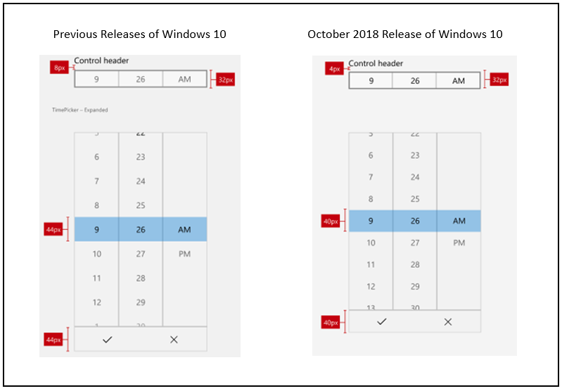

---
title: Spacing and Sizes
description: The new Fluent Standard and Compact control styles ensure a comfortable user experience regardless of device and input method.
keywords: UWP, Windows 10, controls, size, density, standard, compact
ms.date: 04/19/2019
ms.topic: article
ms.localizationpriority: medium
ms.custom: 19H1
---

# Control size and density

Use a combination of control size and density to optimize your Windows application and provide a user experience that is most appropriate for your app's functionality and interaction requirements.

By default, UWP apps are rendered with a low-density (or `Standard`) layout. However, beginning with WinUI 2.1, a high-density (or `Compact`) layout option, for information rich UI and similar specialized scenarios, is also supported. This can be specified through a basic style resource (see examples below).

While functionality and behavior has not changed and remains consistent across the two size and density options, the default body font size has been updated to 14px for all controls to support these two density options. This font size works across regions and devices and ensures your application remains balanced and comfortable for users.

## Examples

<table>
<th align="left">XAML Controls Gallery<th>
<tr>
<td></img></td>
<td>
    <p>If you have the <strong style="font-weight: semi-bold">XAML Controls Gallery</strong> app installed, click here to <a href="xamlcontrolsgallery:/item/Compact Sizing">open the app and see compact sizing in action</a>.</p>
    <ul>
    <li><a href="https://www.microsoft.com/store/productId/9MSVH128X2ZT">Get the XAML Controls Gallery app (Microsoft Store)</a></li>
    <li><a href="https://github.com/Microsoft/Xaml-Controls-Gallery">Get the source code (GitHub)</a></li>
    </ul>
</td>
</tr>
</table>

## Fluent Standard sizing

*Fluent Standard sizing* was created to provide a balance between information density and user comfort. Effectively, all items on the screen align to a 40x40 effective pixels (epx) target, which lets UI elements align to a grid and scale appropriately based on system level scaling.

**Standard sizing is designed to accommodate both touch and pointer input.**

> [!NOTE]
>For more info on effective pixels and scaling, see [Introduction to Windows app design](../basics/design-and-ui-intro.md#effective-pixels-and-scaling)
>
> For more info on system level scaling, see [Alignment, margin, padding](../layout/alignment-margin-padding.md).

For the Windows 10 October 2018 Update (version 1809), the standard, default size for all UWP controls was decreased to increase usability across all usage scenarios.

The following image shows some of the control layout changes that were introduced with the Windows 10 October 2018 Update. Specifically, the margin between a header and the top of a control was decreased from 8epx to 4epx, and the 44epx grid was changed to a 40epx grid.



*Standard control layout example*

This next image shows the changes made to control sizes for the Windows 10 October 2018 Update. Specifically, alignment to the 40epx grid.


## Fluent Compact sizing

Compact sizing enables dense, information-rich groups of controls and can help with the following:

- Browsing  large amounts of content.
- Maximizing visible content on a page.
- Navigating and interacting with controls and content

**Compact sizing is designed primarily to accommodate pointer input.**

### Examples

Compact sizing is implemented through a special resource dictionary that can be specified in your application at either the page level or on a specific layout. The resource dictionary is available in the [WinUI](/uwp/toolkits/winui/) Nuget package.

The following examples show how the the `Compact` style can be applied for the page and an individual Grid control.

#### Page level

```xaml
<Page.Resources>
    <ResourceDictionary Source="ms-appx:///Microsoft.UI.Xaml/DensityStyles/Compact.xaml" />
</Page.Resources>
```

#### Grid level

```xaml
<Grid>
    <Grid.Resources>
        <ResourceDictionary Source="ms-appx:///Microsoft.UI.Xaml/DensityStyles/Compact.xaml" />
    </Grid.Resources>
</Grid>
```

## Get the sample code

- [XAML Controls Gallery sample](https://github.com/Microsoft/Xaml-Controls-Gallery) - See all the XAML controls in an interactive format.

## Related articles

- [Guidelines for touch targets](../input/guidelines-for-targeting.md)
- [ResourceDictionary and XAML resource references](../controls-and-patterns/resourcedictionary-and-xaml-resource-references.md)
- [Resource Dictionary](/uwp/api/windows.ui.xaml.resourcedictionary)
- [XAML Styles](../controls-and-patterns/xaml-styles.md)