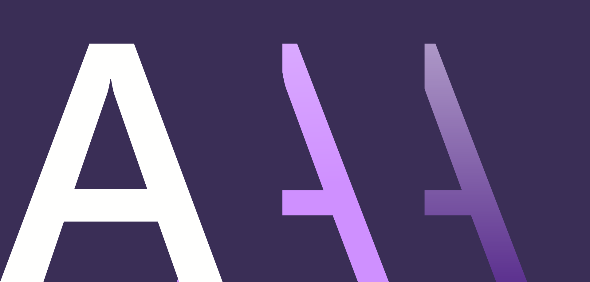
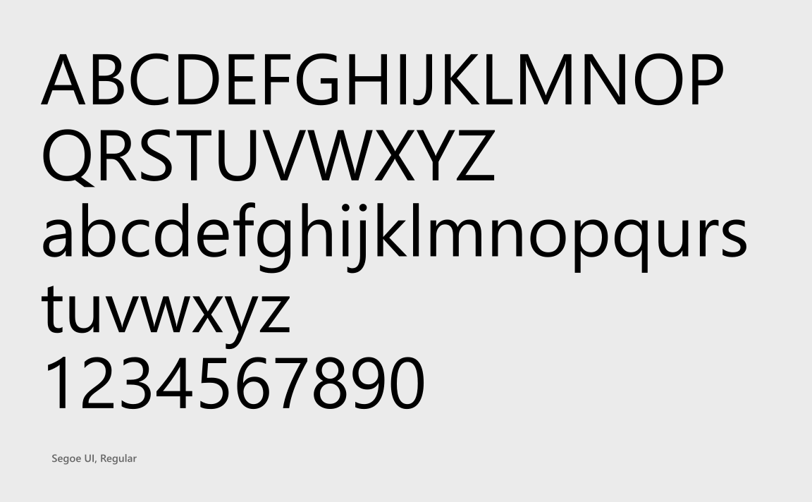
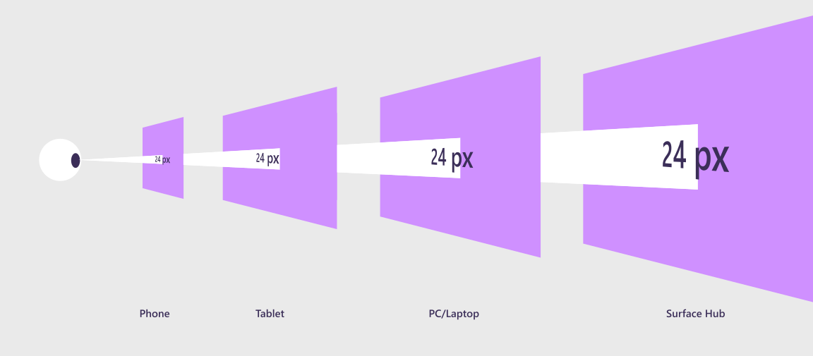
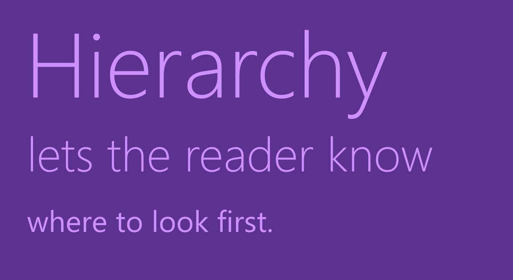
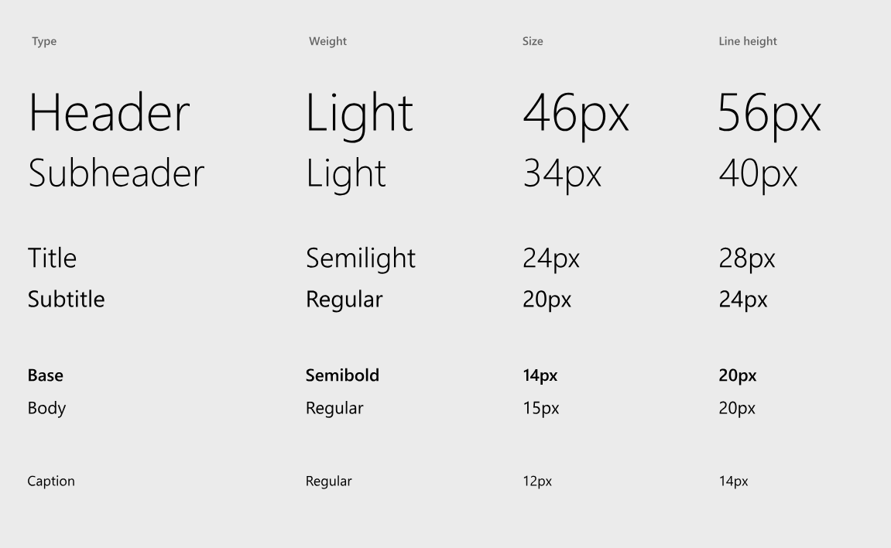
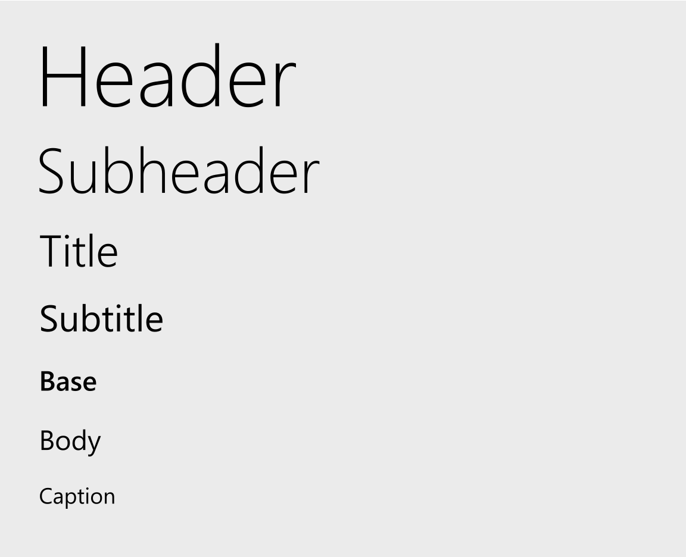

# Typography in Windows Apps



As the visual representation of language, typography’s main task is to communicate information. Its style should never get in the way of that goal. In this article, we'll discuss how to style typography in your Windows app to help users understand content easily and efficiently.

## Font

You should use one font throughout your app's UI, and we recommend sticking with the default font for Windows apps, **Segoe UI**. It's designed to maintain optimal legibility across sizes and pixel densities and offers a clean, light, and open aesthetic that complements the content of the system.



To display non-English languages or to select a different font for your app, please see [Languages](#languages) and [Fonts](#fonts) for our recommended fonts for Windows apps.

:::row:::
    :::column:::

Pick one font for your UI.
    :::column-end:::
    :::column:::

Don't mix multiple fonts.
    :::column-end:::
:::row-end:::

## Size and scaling

Font sizes in UWP apps automatically scale on all devices. The scaling algorithm ensures that a 24 px font on Surface Hub 10 feet away is just as legible as a 24 px font on 5" phone that's a few inches away.



Because of how the scaling system works, you're designing in effective pixels, not actual physical pixels, and you shouldn't have to alter font sizes for different screens sizes or resolutions.

:::row:::
    :::column:::

Follow the Windows [type ramp](#type-ramp) sizing.
    :::column-end:::
    :::column:::

Use a font size smaller than 12 px.
    :::column-end:::
:::row-end:::

## Hierarchy

:::row:::
    :::column:::
Users rely on visual hierarchy when scanning a page: headers summarize content, and body text provides more detail. To create a clear visual hierarchy in your app, follow the Windows type ramp.
    :::column-end:::
    :::column:::

    :::column-end:::
:::row-end:::

### Type ramp

The Windows type ramp establishes crucial relationships between the type styles on a page, helping users read content easily. All sizes are in effective pixels and are optimized for UWP apps running on all devices.



### Using the type ramp

:::row:::
    :::column:::
You can access levels of the type ramp as XAML [static resources](../controls-and-patterns/xaml-theme-resources.md#the-xaml-type-ramp). The styles follow the `*TextBlockStyle` naming convention.
    :::column-end:::
    :::column:::

    :::column-end:::
:::row-end:::

```XAML
<TextBlock Text="Header" Style="{StaticResource HeaderTextBlockStyle}"/>
<TextBlock Text="SubHeader" Style="{StaticResource SubheaderTextBlockStyle}"/>
<TextBlock Text="Title" Style="{StaticResource TitleTextBlockStyle}"/>
<TextBlock Text="SubTitle" Style="{StaticResource SubtitleTextBlockStyle}"/>
<TextBlock Text="Base" Style="{StaticResource BaseTextBlockStyle}"/>
<TextBlock Text="Body" Style="{StaticResource BodyTextBlockStyle}"/>
<TextBlock Text="Caption" Style="{StaticResource CaptionTextBlockStyle}"/>
```

:::row:::
    :::column:::

Use "Body" for most text.

Use "Base" for titles when space is constrained.
    :::column-end:::
    :::column:::

Use "Caption" for primary action or any long strings.

Use "Header" or "Subheader" if text needs to wrap.
    :::column-end:::
:::row-end:::

## Alignment

The default [TextAlignment](/uwp/api/windows.ui.xaml.textalignment) is Left, and in most instances, flush-left and ragged right provides consistent anchoring of the content and a uniform layout. For RTL languages, see [Adjusting layout and fonts to support globalization](../globalizing/adjust-layout-and-fonts--and-support-rtl.md).


```xaml
<TextBlock TextAlignment="Left">
```

## Character count

:::row:::
    :::column:::

Keep to 50–60 letters per line for ease of reading.
    :::column-end:::
    :::column:::

Less than 20 characters or more than 60 characters per line is difficult to read.
    :::column-end:::
:::row-end:::

## Clipping and ellipses

When the amount of text extends beyond the space available, we recommend clipping text, which is the default behavior of most [UWP text controls](../controls-and-patterns/text-controls.md).


```xaml
<TextBlock TextWrapping="WrapWholeWords" TextTrimming="Clip"/>
```

:::row:::
    :::column:::

Clip text, and wrap if multiple lines are enabled.
    :::column-end:::
    :::column:::

Use ellipses to avoid visual clutter.
    :::column-end:::
:::row-end:::

**Note**: If containers are not well-defined (for example, no differentiating background color), or when there is a link to see more text, then use ellipses.

## Languages 

Segoe UI is our font for English, European languages, Greek, Hebrew, Armenian, Georgian, and Arabic.​ For other languages, see the following recommendations.

### Globalizing/localizing fonts

Use the [LanguageFont font-mapping APIs](/uwp/api/Windows.Globalization.Fonts.LanguageFont) for programmatic access to the recommended font family, size, weight, and style for a particular language. The LanguageFont object provides access to the correct font info for various categories of content including UI headers, notifications, body text, and user-editable document body fonts. For more info, see [Adjusting layout and fonts to support globalization](../globalizing/adjust-layout-and-fonts--and-support-rtl.md).

### Fonts for non-Latin languages

<table>
<thead>
<tr class="header">
<th align="left">Font-family</th>
<th align="left">Styles</th>
<th align="left">Notes</th>
</tr>
</thead>
<tbody>
<tr class="odd">
<td style="font-family: Embrima;">Ebrima</td>
<td align="left">Regular, Bold</td>
<td align="left">User-interface font for African scripts (Ethiopic, N'Ko, Osmanya, Tifinagh, Vai).</td>
</tr>
<tr class="even">
<td style="font-family: Gadugi;">Gadugi</td>
<td align="left">Regular, Bold</td>
<td align="left">User-interface font for North American scripts (Canadian Syllabics, Cherokee).</td>
</tr>
<tr class="odd">
<td align="left" style="font-family: Leelawadee UI;">Leelawadee UI</td>
<td align="left">Regular, Semilight, Bold</td>
<td align="left">User-interface font for Southeast Asian scripts (Buginese, Lao, Khmer, Thai).</td>
</tr>
<tr class="odd">
<td align="left" style="font-family: Malgun Gothic;">Malgun Gothic</td>
<td align="left">Regular</td>
<td align="left">User-interface font for Korean.</td>
</tr>
<tr class="even">
<td align="left" style="font-family: Microsoft JhengHei UI;">Microsoft JhengHei UI</td>
<td align="left">Regular, Bold, Light</td>
<td align="left">User-interface font for Traditional Chinese.</td>
</tr>
<tr class="odd">
<td align="left" style="font-family: Microsoft YaHei UI;">Microsoft YaHei UI</td>
<td align="left">Regular, Bold, Light</td>
<td align="left">User-interface font for Simplified Chinese.</td>
</tr>
<tr class="odd">
<td align="left" style="font-family: Myanmar Text;">Myanmar Text</td>
<td align="left">Regular</td>
<td align="left">Fallback font for Myanmar script.</td>
</tr>
<tr class="even">
<td align="left" style="font-family: Nirmala UI;">Nirmala UI</td>
<td align="left">Regular, Semilight, Bold</td>
<td align="left">User-interface font for South Asian scripts (Bangla, Devanagari, Gujarati, Gurmukhi, Kannada, Malayalam, Odia, Ol Chiki, Sinhala, Sora Sompeng, Tamil, Telugu)</td>
</tr>
<tr class="odd">
<td align="left" style="font-family: SimSun;">SimSun</td>
<td align="left">Regular</td>
<td align="left">A legacy Chinese UI font. </td>
</tr>
<tr class="even">
<td align="left" style="font-family: Yu Gothic UI;">Yu Gothic UI</td>
<td align="left">Light, Semilight, Regular, Semibold, Bold</td>
<td align="left">User-interface font for Japanese.</td>
</tr>
</tbody>
</table>

## Fonts

### Sans-serif fonts

Sans-serif fonts are a great choice for headings and UI elements. 

<table>
<colgroup>
<col width="33%" />
<col width="33%" />
<col width="33%" />
</colgroup>
<thead>
<tr class="header">
<th align="left">Font-family</th>
<th align="left">Styles</th>
<th align="left">Notes</th>
</tr>
</thead>
<tbody>
<tr class="odd">
<td align="left" style="font-family: Arial;">Arial</td>
<td align="left">Regular, Italic, Bold, Bold Italic, Black</td>
<td align="left">Supports European and Middle Eastern scripts (Latin, Greek, Cyrillic, Arabic, Armenian, and Hebrew) Black weight supports European scripts only.</td>
</tr>
<tr class="even">
<td align="left" style="font-family: Calibri;">Calibri</td>
<td align="left">Regular, Italic, Bold, Bold Italic, Light, Light Italic</td>
<td align="left">Supports European and Middle Eastern scripts (Latin, Greek, Cyrillic, Arabic and Hebrew). Arabic available in the uprights only.</td>
</tr>
<td style="font-family: Consolas;">Consolas</td>
<td>Regular, Italic, Bold, Bold Italic</td>
<td>Fixed width font that supports European scripts (Latin, Greek and Cyrillic).</td>
</tr>

<tr>
<td style="font-family: Segoe UI;">Segoe UI</td>
<td>Regular, Italic, Light Italic, Black Italic, Bold, Bold Italic, Light, Semilight, Semibold, Black</td>
<td>User-interface font for European and Middle East scripts (Arabic, Armenian, Cyrillic, Georgian, Greek, Hebrew, Latin), and also Lisu script.</td>
</tr>

<tr class="even">
<td style="font-family: Selawik;">Selawik</td>
<td align="left">Regular, Semilight, Light, Bold, Semibold</td>
<td align="left">An open-source font that's metrically compatible with Segoe UI, intended for apps on other platforms that don’t want to bundle Segoe UI. <a href="https://github.com/Microsoft/Selawik">Get Selawik on GitHub.</a></td>
</tr>

</tbody>
</table>

### Serif fonts

Serif fonts are good for presenting large amounts of text. 

<table>
<thead>
<tr class="header">
<th align="left">Font-family</th>
<th align="left">Styles</th>
<th align="left">Notes</th>
</tr>
</thead>
<tbody>
<tr class="odd">
<td style="font-family: Cambria;">Cambria</td>
<td align="left">Regular</td>
<td align="left">Serif font that supports European scripts (Latin, Greek, Cyrillic).</td>
</tr>
<tr class="even">
<td style="font-family: Courier New;">Courier New</td>
<td align="left">Regular, Italic, Bold, Bold Italic</td>
<td align="left">Serif fixed width font supports European and Middle Eastern scripts (Latin, Greek, Cyrillic, Arabic, Armenian, and Hebrew).</td>
</tr>
<tr class="odd">
<td style="font-family: Georgia;">Georgia</td>
<td align="left">Regular, Italic, Bold, Bold Italic</td>
<td align="left">Supports European scripts (Latin, Greek and Cyrillic).</td>
</tr>

<tr class="even">
<td style="font-family: Times New Roman;">Times New Roman</td>
<td align="left">Regular, Italic, Bold, Bold Italic</td>
<td align="left">Legacy font that supports European scripts (Latin, Greek, Cyrillic, Arabic, Armenian, Hebrew).</td>
</tr>

</tbody>
</table>

### Symbols and icons

<table>
<thead>
<tr class="header">
<th align="left">Font-family</th>
<th align="left">Styles</th>
<th align="left">Notes</th>
</tr>
</thead>
<tbody>
<tr class="odd">
<td align="left">Segoe MDL2 Assets</td>
<td align="left">Regular</td>
<td align="left">User-interface font for app icons. For more info, see the <a href="segoe-ui-symbol-font.md">Segoe MDL2 assets article</a>.</td>
</tr>
<tr class="even">
<td align="left">Segoe UI Emoji</td>
<td align="left">Regular</td>
<td align="left"></td>
</tr>
<tr class="even">
<td align="left">Segoe UI Symbol</td>
<td align="left">Regular</td>
<td align="left">Fallback font for symbols</td>
</tr>
</tbody>
</table>

## Related articles

* [Text controls](../controls-and-patterns/text-controls.md)
* [XAML theme resources](../controls-and-patterns/xaml-theme-resources.md#the-xaml-type-ramp)
* [XAML styles](../controls-and-patterns/xaml-styles.md)
* [Microsoft Typography](/typography/)