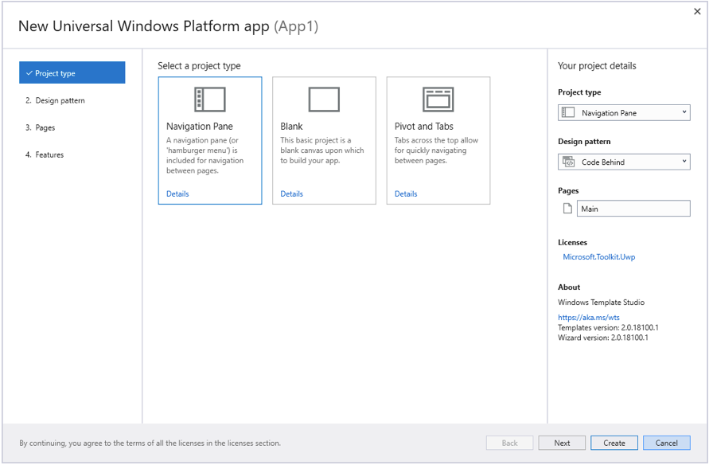

# Windows Template Studio

Windows Template Studio (WTS) is a Visual Studio 2017 and Visual Studio 2019 Extension that accelerates the creation of new Windows apps using a wizard-based experience. The resulting project is well-formed, readable code that incorporates the latest Windows 10 features while implementing proven patterns and best practices. Sprinkled throughout the generated code we have links Docs, Stack Overflow and blogs to provide useful insights. WTS supports creating apps in C# or Visual Basic.

For more information, please visit the [project repo on GitHub](https://github.com/microsoft/windowsTemplateStudio).

