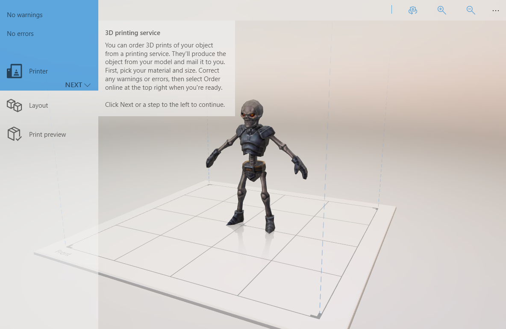

---
author: PatrickFarley
ms.assetid: 551d4e70-312d-4b40-8d3e-336ce934e0ad
title: 3D Printing
description: This section describes how to utilize 3D printing functionality in your Universal Windows app.
ms.author: pafarley
ms.date: 02/08/2017
ms.topic: article
ms.prod: windows
ms.technology: uwp
keywords: windows 10, uwp
---
# 3D Printing

\[ Updated for UWP apps on Windows 10. For Windows 8.x articles, see the [archive](http://go.microsoft.com/fwlink/p/?linkid=619132) \]

This section describes how to utilize the [3D print API](https://msdn.microsoft.com/library/windows/apps/windows.graphics.printing3d.aspx) to add 3D printing functionality to your Universal Windows app.  

<!--  -->

For more information on 3D printing with Windows 10, including resources for hardware partners, community discussion forums, and general info on 3D print capabilities, see the [3D printing with Windows 10](https://developer.microsoft.com/windows/hardware/3d-print-support-windows-10) site on the Hardware Dev Center.

| Topic | Description | 
|-------|-------------|
| [3D print from your app](3d-print-from-app.md) | Learn how to add 3D printing functionality to your Universal Windows app. This topic covers how to launch the 3D print dialog after ensuring your 3D model is printable and in the correct format. |
| [Generate a 3MF package](generate-3mf.md) | Describes the structure of the 3D Manufacturing Format file type and how it can be created and manipulated with the Windows.Graphics.Printing3D API. |

## Related topics

* [3D printing with Windows 10 (Hardware Dev Center)](https://developer.microsoft.com/windows/hardware/3d-print-support-windows-10)
* [UWP 3D print sample](https://github.com/Microsoft/Windows-universal-samples/tree/master/Samples/3DPrinting)
* [UWP 3D printing from Unity sample](https://github.com/Microsoft/Windows-universal-samples/tree/master/Samples/3DPrintingFromUnity)

 

