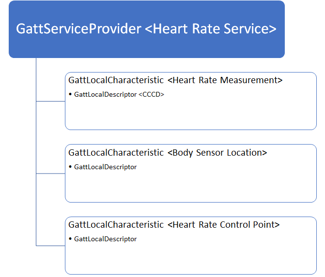

# Bluetooth Low Energy
Bluetooth Low Energy (LE) is a specification that defines protocols for discovery and communication between power-efficient devices. Discovery of devices is done through the Generic Access Profile (GAP) protocol. After discovery, device-to-device communication is done through the Generic Attribute (GATT) protocol. This topic provides a quick overview of Bluetooth LE in UWP apps. To see more detail about Bluetooth LE, see the [Bluetooth Core Specification](https://www.bluetooth.com/specifications/bluetooth-core-specification/) version 4.0, where Bluetooth LE was introduced. 

*GATT and GAP roles were introduced in Windows 10 version 1703*

GATT and GAP protocols can be implemented in your UWP app by using the following namespaces.
- [Windows.Devices.Bluetooth.GenericAttributeProfile](/uwp/api/windows.devices.bluetooth.genericattributeprofile)
- [Windows.Devices.Bluetooth.Advertisement](/uwp/api/windows.devices.bluetooth.advertisement)

## Central and Peripheral
The two primary roles of discovery are called Central and Peripheral. In general, Windows operates in Central mode and connects to various Peripheral devices. 

## Attributes
A common acronym you will see in the Windows Bluetooth APIs is Generic Attribute (GATT). The GATT Profile defines the structure of data and modes of operation by which two Bluetooth LE devices communicate. The attribute is the main building block of GATT. The main types of attributes are services, characteristics and descriptors. These attributes perform differently between clients and servers, so it is more useful to discuss their interaction in the relevant sections. 

*The heart rate service is expressed in GATT Server API form*

## Client and Server
After a connection has been established, the device that contains the data (usually a small IoT sensor or wearable) is known as the Server. The device that uses that data to perform a function is known as the Client. For example, a Windows PC (Client) reads data from a heart rate monitor (Server) to track that a user is working out optimally. For more information, see the [GATT Client](gatt-client.md) and [GATT Server](gatt-server.md) topics.

## Watchers and Publishers (Beacons)
In addition to the Central and Peripheral roles, there are Observer and Broadcaster roles. Broadcasters are commonly referred to as Beacons, they don't communicate over GATT because they use the limited space provided in the Advertisement packet for communication. Similarly, an Observer does not have to establish a connection to receive data, it scans for nearby advertisements. To configure Windows to observe nearby advertisements, use the [BluetoothLEAdvertisementWatcher](/uwp/api/windows.devices.bluetooth.advertisement.bluetoothleadvertisementwatcher) class. In order to broadcast beacon payloads, use the [BluetoothLEAdvertisementPublisher](/uwp/api/windows.devices.bluetooth.advertisement.bluetoothleadvertisementpublisher) class. For more information, see the [Advertisement](ble-beacon.md) topic.

## See Also
- [Windows.Devices.Bluetooth.GenericAttributeProfile](/uwp/api/windows.devices.bluetooth.genericattributeprofile)
- [Windows.Devices.Bluetooth.Advertisement](/uwp/api/windows.devices.bluetooth.advertisement)
- [Bluetooth Core Specification](https://www.bluetooth.com/specifications/bluetooth-core-specification)