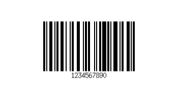
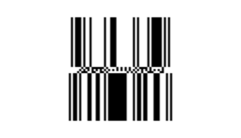
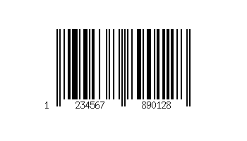
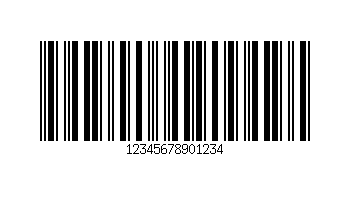
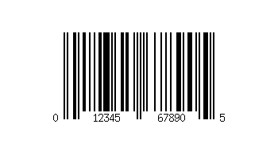

# Symbologies

This topic provides sample barcodes for each of the symbologies supported by the software barcode decoder that ships with Windows 10, including: UPC/EAN, Code 39, Code 128, Interleaved 2 of 5, Databar Omnidirectional, Databar Stacked, QR Code and GS1DWCode.

Windows 10 uses a standard lens camera combined with a software decoder to generate a barcode scanner. This article refers to the symbologies supported by the software decoder. Additional symbologies might be supported by dedicated barcode scanner devices that have built-in hardware decoders, please contact your barcode scanner manufacturer for details. The symbologies listed are supported in all editions of Windows 10 build 17134 or later, unless otherwise specified.

Use [GetSupportedSymbologiesAsync](/uwp/api/windows.devices.pointofservice.barcodescanner.getsupportedsymbologiesasync) to determine the specific symbologies supported by a barcode scanner.

> [!NOTE]
> The software decoder built into Windows 10 is provided by [*Digimarc Corporation*](https://www.digimarc.com/).

## 1D Symbologies

### Code 39

### Code 128

### Databar Omnidirectional
 
### Databar Stacked

### EAN-8

### EAN-13

### Interleaved 2 of 5

### UPC-A

### UPC-E

## 2D Symbologies
### QR Code

## Digital Watermark
### GS1-DWCode

Scan the image of a package below with your camera barcode scanner application to see GS1DWCode in action.  The image is encoded with UPCA 856107006854.  Please visit http://www.digimarc.com for more information about GS1DWCode capabilities.

## See also

### Samples

- [Barcode scanner sample](https://github.com/microsoft/Windows-universal-samples/tree/master/Samples/BarcodeScanner)
