# Sensor orientation


**Important APIs**

-   [**Windows.Devices.Sensors**](https://msdn.microsoft.com/library/windows/apps/BR206408)
-   [**Windows.Devices.Sensors.Custom**](https://msdn.microsoft.com/library/windows/apps/Dn895032)

Sensor data from the [**Accelerometer**](https://msdn.microsoft.com/library/windows/apps/BR225687), [**Gyrometer**](https://msdn.microsoft.com/library/windows/apps/BR225718), [**Compass**](https://msdn.microsoft.com/library/windows/apps/BR225705), [**Inclinometer**](https://msdn.microsoft.com/library/windows/apps/BR225766), and [**OrientationSensor**](https://msdn.microsoft.com/library/windows/apps/BR206371) classes is defined by their reference axes. These axes are defined by the device's reference frame and rotate with the device as the user turns it. If your app supports automatic rotation and reorients itself to accommodate the device as the user rotates it, you must adjust your sensor data for the rotation before using it.

## Display orientation vs device orientation

In order to understand the reference axes for sensors, you need to distinguish display orientation from device orientation. Display orientation is the direction text and images are displayed on the screen whereas device orientation is the physical positioning of the device. In the following picture, both the device and display orientation are in **Landscape** (note that the sensor axes shown are only applicable to landscape-first devices).

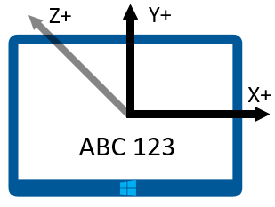

The following picture shows both the display and device orientation in **LandscapeFlipped**.

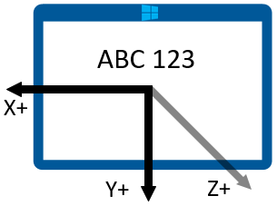

The next picture shows the display orientation in Landscape while the device orientation is LandscapeFlipped.

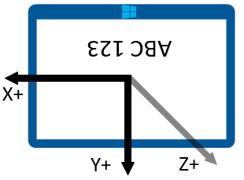

You can query the orientation values through the [**DisplayInformation**](https://msdn.microsoft.com/library/windows/apps/Dn264258) class by using the [**GetForCurrentView**](https://msdn.microsoft.com/library/windows/apps/windows.graphics.display.displayinformation.getforcurrentview.aspx) method with the [**CurrentOrientation**](https://msdn.microsoft.com/library/windows/apps/windows.graphics.display.displayinformation.currentorientation.aspx) property. Then you can create logic by comparing against the [**DisplayOrientations**](https://msdn.microsoft.com/library/windows/apps/BR226142) enumeration. Remember that for every orientation you support, you have to support a conversion of the reference axes to that orientation.

## Landscape-first vs portrait-first devices

Manufacturers produce both landscape-first and portrait-first devices. The reference frame varies between landscape-first devices (like desktops and laptops) and portrait-first devices (like phones and some tablets). The following table shows the sensor axes for both landscape-first and portrait-first devices.

| Orientation | Landscape-first | Portrait-first |
|-------------|-----------------|----------------|
| **Landscape** | 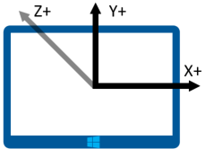 | 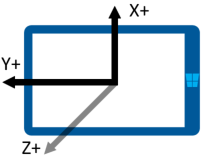 |
| **Portrait** | 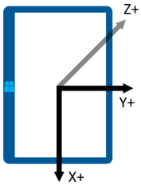 | 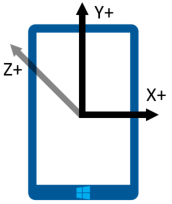 |
| **LandscapeFlipped** | 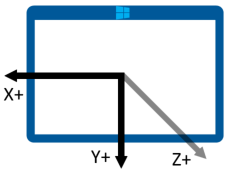 |  | 
| **PortraitFlipped** | 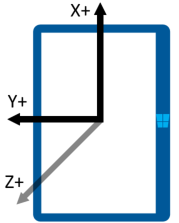| 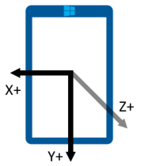 |

## Devices broadcasting display and headless devices

Some devices have the ability to broadcast the display to another device. For example, you could take a tablet and broadcast the display to a projector that will be in landscape orientation. In this scenario, it is important to keep in mind that the device orientation is based on the original device, not the one presenting the display. So an accelerometer would report data for the tablet.

Furthermore, some devices do not have a display. With these devices, the default orientation for these devices is portrait.

## Display orientation and compass heading


Compass heading depends upon the reference axes and so it changes with the device orientation. You compensate based on the this table (assume the user is facing north).

| Display orientation | Reference axis for compass heading | API compass heading when facing north (landscape-first) | API compass heading when facing north (portrait-first) |Compass heading compensation (landscape-first) | Compass heading compensation (portrait-first) |
|---------------------|------------------------------------|---------------------------------------------------------|--------------------------------------------------------|------------------------------------------------|-----------------------------------------------|
| Landscape           | -Z | 0   | 270 | Heading               | (Heading + 90) % 360  |
| Portrait            |  Y | 90  | 0   | (Heading + 270) % 360 |  Heading              |
| LandscapeFlipped    |  Z | 180 | 90  | (Heading + 180) % 360 | (Heading + 270) % 360 |
| PortraitFlipped     |  Y | 270 | 180 | (Heading + 90) % 360  | (Heading + 180) % 360 |

Modify the compass heading as shown in the table in order to correctly display the heading. The following code snippet demonstrates how to do this.

```csharp
private void ReadingChanged(object sender, CompassReadingChangedEventArgs e)
{
    double heading = e.Reading.HeadingMagneticNorth;        
    double displayOffset;
    
    // Calculate the compass heading offset based on
    // the current display orientation.
    DisplayInformation displayInfo = DisplayInformation.GetForCurrentView();
    
    switch (displayInfo.CurrentOrientation) 
    { 
        case DisplayOrientations.Landscape: 
            displayOffset = 0; 
            break;
        case DisplayOrientations.Portrait: 
            displayOffset = 270; 
            break; 
        case DisplayOrientations.LandscapeFlipped: 
            displayOffset = 180; 
            break; 
        case DisplayOrientations.PortraitFlipped: 
            displayOffset = 90; 
            break; 
     } 
    

    double displayCompensatedHeading = (heading + displayOffset) % 360;
    
    // Update the UI...
}
```

## Display orientation with the accelerometer and gyrometer

This table converts accelerometer and gyrometer data for display orientation.

| Reference axes        |  X |  Y | Z |
|-----------------------|----|----|---|
| **Landscape**         |  X |  Y | Z |
| **Portrait**          |  Y | -X | Z |
| **LandscapeFlipped**  | -X | -Y | Z |
| **PortraitFlipped**   | -Y |  X | Z |

The following code example applies these conversions to the gyrometer.

```csharp
private void ReadingChanged(object sender, GyrometerReadingChangedEventArgs e)
{
    double x_Axis;
    double y_Axis;
    double z_Axis;

    GyrometerReading reading = e.Reading;  
    
    // Calculate the gyrometer axes based on
    // the current display orientation.
    DisplayInformation displayInfo = DisplayInformation.GetForCurrentView();
    switch (displayInfo.CurrentOrientation) 
    { 
        case DisplayOrientations.Landscape: 
            x_Axis = reading.AngularVelocityX;
            y_Axis = reading.AngularVelocityY;
            z_Axis = reading.AngularVelocityZ;
            break;
        case DisplayOrientations.Portrait: 
            x_Axis = reading.AngularVelocityY;
            y_Axis = -1 * reading.AngularVelocityX;
            z_Axis = reading.AngularVelocityZ;
            break; 
        case DisplayOrientations.LandscapeFlipped: 
            x_Axis = -1 * reading.AngularVelocityX;
            y_Axis = -1 * reading.AngularVelocityY;
            z_Axis = reading.AngularVelocityZ;
            break; 
        case DisplayOrientations.PortraitFlipped: 
            x_Axis = -1 * reading.AngularVelocityY;
            y_Axis = reading.AngularVelocityX;
            z_Axis = reading.AngularVelocityZ;
            break; 
     } 
    
    
    // Update the UI...
}
```

## Display orientation and device orientation

The [**OrientationSensor**](https://msdn.microsoft.com/library/windows/apps/BR206371) data must be changed in a different way. Think of these different orientations as rotations counterclockwise to the Z axis, so we need to reverse the rotation to get back the user’s orientation. For quaternion data, we can use Euler’s formula to define a rotation with a reference quaternion, and we can also use a reference rotation matrix.

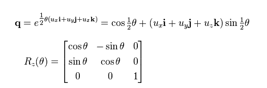

To get the relative orientation you want, multiply the reference object against the absolute object. Note that this math is not commutative.

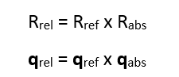

In the preceding expression, the absolute object is returned by the sensor data.


| Display orientation  | Counterclockwise rotation around Z | Reference quaternion (reverse rotation) | Reference rotation matrix (reverse rotation) | 
|----------------------|------------------------------------|-----------------------------------------|----------------------------------------------|
| **Landscape**        | 0                                  | 1 + 0i + 0j + 0k                        | \[1 0 0<br/> 0 1 0<br/> 0 0 1\]               |
| **Portrait**         | 90                                 | cos(-45⁰) + (i + j + k)*sin(-45⁰)       | \[0 1 0<br/>-1 0 0<br/>0 0 1]              |
| **LandscapeFlipped** | 180                                | 0 - i - j - k                           | \[1 0 0<br/> 0 1 0<br/> 0 0 1]               |
| **PortraitFlipped**  | 270                                | cos(-135⁰) + (i + j + k)*sin(-135⁰)     | \[0 -1 0<br/> 1  0 0<br/> 0  0 1]             |

