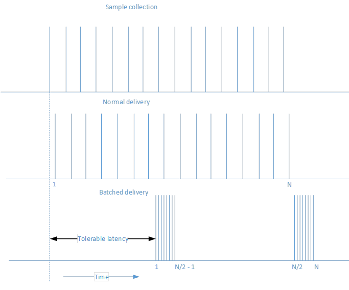
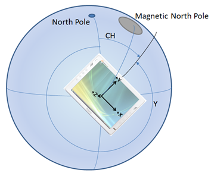
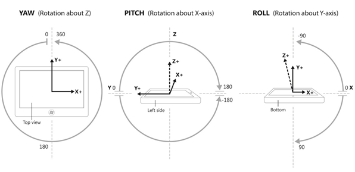
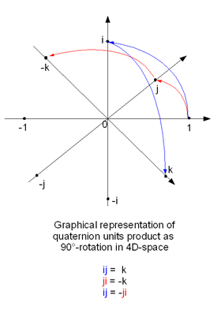

# Sensors

Sensors let your app know the relationship between a device and the physical world around it. Sensors can tell your app the direction, orientation, and movement of the device. These sensors can help make your game, augmented reality app, or utility app more useful and interactive by providing a unique form of input, such as using the motion of the device to arrange the characters on the screen or to simulate being in a cockpit and using the device as the steering wheel.

As a general rule, decide from the outset whether your app will depend exclusively on sensors or if sensors will just offer an additional control mechanism. For example, a driving game using a device as a virtual steering wheel could alternatively be controlled through an on-screen GUI – this way, the app works regardless of the sensors available on the system. On the other hand, a marble tilt maze could be coded to only work on systems that have the appropriate sensors. You must make the strategic choice of whether to fully rely on sensors. Note that a mouse/touch control scheme trades immersion for greater control.

| Topic                                                       | Description  |
|-------------------------------------------------------------|--------------|
| [Calibrate sensors](calibrate-sensors.md)                   | Sensors in a device based on the magnetometer – the compass, inclinometer and orientation sensor - can become in need of calibration due to environmental factors. The [<strong>MagnetometerAccuracy</strong>](/uwp/api/Windows.Devices.Sensors.MagnetometerAccuracy) enumeration can help determine a course of action when your device is in need of calibration. |
| [Sensor orientation](sensor-orientation.md)                 | Sensor data from the [<strong>OrientationSensor</strong>](/uwp/api/Windows.Devices.Sensors.OrientationSensor) classes is defined by their reference axes. These axes are defined by the device's landscape orientation and rotate with the device as the user turns it. |
| [Use the accelerometer](use-the-accelerometer.md)           | Learn how to use the accelerometer to respond to user movement. |
| [Use the compass](use-the-compass.md)                       | Learn how to use the compass to determine the current heading. |
| [Use the gyrometer](use-the-gyrometer.md)                   | Learn how to use the gyrometer to detect changes in user movement. | 
| [Use the inclinometer](use-the-inclinometer.md)             | Learn how to use the inclinometer to determine pitch, roll, and yaw. |
| [Use the light sensor](use-the-light-sensor.md)             | Learn how to use the ambient light sensor to detect changes in lighting. |
| [Use the orientation sensor](use-the-orientation-sensor.md) | Learn how to use the orientation sensors to determine the device orientation.|

## Sensor batching

Some sensors support the concept of batching. This will vary depending on the individual sensor available. When a sensor implements batching, it collects several points of data over a specified time interval and then transfers all of that data at one time. This is different from normal behavior where a sensor reports its findings as soon as it performs a reading. Consider the following diagram which shows how data is collected and then delivered, first with normal delivery and then with batched delivery.

The primary advantage for sensor batching is prolonging battery life. When the data is not sent immediately, that saves on processor power and prevents the data from needing to be immediately processed. Parts of the system can sleep until they are needed, which generates a significant power savings.

You can influence how often the sensor sends batches by adjusting the latency. For example, the [**Accelerometer**](/uwp/api/Windows.Devices.Sensors.Accelerometer) sensor has the [**ReportLatency**](/uwp/api/windows.devices.sensors.accelerometer.reportlatency) property. When this property is set for an application, the sensor will send data after the specified amount of time. You can control how much data is accumulated over a given latency by setting the [**ReportInterval**](/uwp/api/windows.devices.sensors.accelerometer.reportinterval) property.

There are a couple of caveats to keep in mind with respect to setting the latency. The first caveat is that each sensor has a [**MaxBatchSize**](/uwp/api/windows.devices.sensors.accelerometer.maxbatchsize) that it can support based on the sensor itself. This is the number of events that the sensor can cache before it is forced to send them. If you multiply **MaxBatchSize** by [**ReportInterval**](/uwp/api/windows.devices.sensors.accelerometer.reportinterval), that determines the maximum [**ReportLatency**](/uwp/api/windows.devices.sensors.accelerometer.reportlatency) value. If you specify a higher value than this, the maximum latency will be used so that you do not lose data. In addition, multiple applications can each set a desired latency. In order to meet the needs of all applications, the shortest latency period will be used. Because of these facts, the latency you set in your application may not match the observed latency.

If a sensor is using batch reporting, calling [**GetCurrentReading**](/uwp/api/windows.devices.sensors.accelerometer.getcurrentreading) will clear the current batch of data and start a new latency period.

## Accelerometer

The [**Accelerometer**](/uwp/api/Windows.Devices.Sensors.Accelerometer) sensor measures G-force values along the X, Y, and Z axes of the device and is great for simple motion-based applications. Note that G-force values include acceleration due to gravity. If the device has the [**SimpleOrientation**](/uwp/api/Windows.Devices.Sensors.SimpleOrientation) of **FaceUp** on a table, then the accelerometer would read -1 G on the Z axis. Thus, accelerometers do not necessarily measure just coordinate acceleration – the rate of change of velocity. When using an accelerometer, make sure to differentiate between the gravitational vector from gravity and the linear acceleration vector from motion. Note that the gravitational vector should normalize to 1 for a stationary device.

The following diagrams illustrate:

-   V1 = Vector 1 = Force due to gravity
-   V2 = Vector 2 = -Z axis of device chassis (points out of back of screen)
-   Θi = Tilt angle (inclination) = angle between –Z axis of device chassis and gravity vector

Apps that might use the accelerometer sensor include a game where a marble on the screen rolls in the direction you tilt the device (gravitational vector). This type of functionality closely mirrors that of the [**Inclinometer**](/uwp/api/Windows.Devices.Sensors.Inclinometer) and could also be done with that sensor by using a combination of pitch and roll. Using the accelerometer’s gravity vector simplifies this somewhat by providing an easily mathematically manipulated vector for device tilt. Another example would be an app that makes a whip’s cracking sound when the user flicks the device through the air (linear acceleration vector).

For an example implementation, see the [accelerometer sample](https://github.com/Microsoft/Windows-universal-samples/tree/master/Samples/Accelerometer).

## Activity sensor

The [**Activity**](/uwp/api/Windows.Devices.Sensors.ActivitySensor) sensor determines the current status of the device attached to the sensor. This sensor is frequently used in fitness applications to keep track of when a user carrying a device is running or walking. See [**ActivityType**](/uwp/api/Windows.Devices.Sensors.ActivityType) for a list of possible activities that can be detected by this sensor API.

For an example implementation, see the [activity sensor sample](https://github.com/Microsoft/Windows-universal-samples/tree/master/Samples/ActivitySensor).

## Altimeter

The [**Altimeter**](/uwp/api/Windows.Devices.Sensors.Altimeter) sensor returns a value that indicates the altitude of the sensor. This enables you to keep track of a change in altitude in terms of meters from sea level. One example of an app that might use this would be a running app that keeps track of the elevation changes during a run to calculate the calories burned. In this case, this sensor data could be combined with the [**Activity**](/uwp/api/Windows.Devices.Sensors.ActivitySensor) sensor to provide more accurate tracking information.

For an example implementation, see the [altimeter sample](https://github.com/Microsoft/Windows-universal-samples/tree/master/Samples/Altimeter).

## Barometer

The [**Barometer**](/uwp/api/Windows.Devices.Sensors.Barometer) sensor enables an application to get barometric readings. A weather application could use this information to provide the current atmospheric pressure. This could be used to provide more detailed information and predict potential weather changes.

For an example implementation, see the [barometer sample](https://github.com/Microsoft/Windows-universal-samples/tree/master/Samples/Barometer).

## Compass

The [**Compass**](/uwp/api/Windows.Devices.Sensors.Compass) sensor returns a 2D heading with respect to magnetic north based on the horizontal plane of the earth. The compass sensor should not be used in determining specific device orientation or for representing anything in 3D space. Geographical features can cause natural declination in the heading, so some systems support both [**HeadingMagneticNorth**](/uwp/api/windows.devices.sensors.compassreading.headingmagneticnorth) and [**HeadingTrueNorth**](/uwp/api/windows.devices.sensors.compassreading.headingtruenorth). Think about which one your app prefers, but remember that not all systems will report a true north value. The gyrometer and magnetometer (a device measuring magnetic strength magnitude) sensors combine their data to produce the compass heading, which has the net effect of stabilizing the data (magnetic field strength is very unstable due to electrical system components).

Apps that want to display a compass rose or navigate a map would typically use the compass sensor.

For an example implementation, see the [compass sample](https://github.com/Microsoft/Windows-universal-samples/tree/master/Samples/Compass).

## Gyrometer

The [**Gyrometer**](/uwp/api/Windows.Devices.Sensors.Gyrometer) sensor measures angular velocities along the X, Y, and Z axes. These are very useful in simple motion-based apps that do not concern themselves with device orientation but care about the device rotating at different speeds. Gyrometers can suffer from noise in the data or a constant bias along one or more of the axes. You should query the accelerometer to verify whether the device is moving in order to determine if the gyrometer suffers from a bias, and then compensate accordingly in your app.

An example of an app that could use the gyrometer sensor is a game that spins a roulette wheel based on a quick rotational jerk of the device.

For an example implementation, see the [gyrometer sample](https://github.com/Microsoft/Windows-universal-samples/tree/master/Samples/Gyrometer).

## Inclinometer

The [**Inclinometer**](/uwp/api/Windows.Devices.Sensors.Inclinometer) sensor specifies the yaw, pitch, and roll values of a device and work best with apps that care about how the device is situated in space. Pitch and roll are derived by taking the accelerometer’s gravity vector and by integrating the data from the gyrometer. Yaw is established from magnetometer and gyrometer (similar to compass heading) data. Inclinometers offer advanced orientation data in an easily digestible and understandable way. Use inclinometers when you need device orientation but do not need to manipulate the sensor data.

Apps that change their view to match the orientation of the device can use the inclinometer sensor. Also, an app that displays an airplane that matches the yaw, pitch, and roll of the device would also use the inclinometer readings.

For an example implementation, see the inclinometer sample [https://github.com/Microsoft/Windows-universal-samples/tree/master/Samples/Inclinometer](https://github.com/Microsoft/Windows-universal-samples/tree/master/Samples/Inclinometer).

## Light sensor

The [**Light**](/uwp/api/Windows.Devices.Sensors.LightSensor) sensor is capable of determining the ambient light surrounding the sensor. This enables an app to determine when the light setting surrounding a device has changed. For example, a user with a slate device might walk from indoors to outdoors on a sunny day. A smart application could use this value to increase the contrast between the background and the font being rendered. That would make the content still readable in the brighter, outdoor setting.

For an example implementation, see the [light sensor sample](https://github.com/Microsoft/Windows-universal-samples/tree/master/Samples/LightSensor).

## Orientation sensor

Device orientation is expressed through both quaternion and a rotation matrix. The [**OrientationSensor**](/uwp/api/Windows.Devices.Sensors.OrientationSensor) offers a high degree of precision in determining how the device is situated in space with respect to absolute heading. The **OrientationSensor** data is derived from the accelerometer, gyrometer, and magnetometer. As such, both the inclinometer and compass sensors can be derived from the quaternion values. Quaternions and rotation matrices lend themselves well to advanced mathematical manipulation and are often used in graphical programming. Apps using complex manipulation should favor the orientation sensor as many transforms are based off of quaternions and rotation matrices.

The orientation sensor is often used in advanced augmented reality apps that paint an overlay on your surroundings based on the direction the back of the device is pointing.

For an example implementation, see the [orientation sensor sample](https://github.com/Microsoft/Windows-universal-samples/tree/master/Samples/OrientationSensor).

## Pedometer

The [**Pedometer**](/uwp/api/Windows.Devices.Sensors.Pedometer) sensor keeps track of the number of steps taken by the user carrying the connected device. The sensor is configured to keep track of the number of steps over a given time period. Several fitness applications like to keep track of the number of steps taken in order to help the user set and reach various goals. This information can then be collected and stored to show progress over time.

For an example implemenation, see the [pedometer sample](https://github.com/Microsoft/Windows-universal-samples/tree/master/Samples/Pedometer).

## Proximity sensor

The [**Proximity**](/uwp/api/Windows.Devices.Sensors.ProximitySensor) sensor can be used to indicate whether or not objects are detected by the sensor. In addition to determining whether or not an object is within range of the device, the proximity sensor also can determine the distance to the detected object. One example where this could be used is with an application that wants to emerge from a sleep state when a user comes within a specified range. The device could be in a low-powered sleep state until the proximity sensor detects an object, and then could enter a more active state.

For an example implementation, see the [proximity sensor sample](https://github.com/Microsoft/Windows-universal-samples/tree/master/Samples/ProximitySensor).

## Simple orientation

The [**SimpleOrientationSensor**](/uwp/api/windows.devices.sensors.simpleorientationsensor) detects the current quadrant orientation of the specified device or it’s face-up or face-down. It has six possible [**SimpleOrientation**](/uwp/api/Windows.Devices.Sensors.SimpleOrientation) states (**NotRotated**, **Rotated90**, **Rotated180**, **Rotated270**, **FaceUp**, **FaceDown**).

A reader app that changes its display based on the device being held parallel or perpendicular to the ground would use the values from the SimpleOrientationSensor to determine how the device is being held.

For an example implementation, see the [simple orientation sensor sample](https://github.com/Microsoft/Windows-universal-samples/tree/master/Samples/SimpleOrientationSensor).