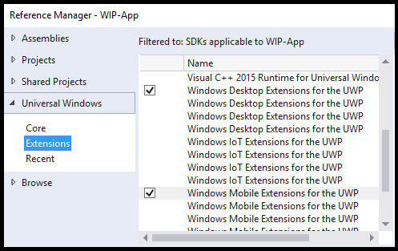

# Windows Information Protection (WIP) developer guide

An *enlightened* app differentiates between corporate and personal data and knows which to protect based on Windows Information Protection (WIP) policies defined by the administrator.

In this guide, we'll show you how to build one. When you're done, policy administrators will be able to trust your app to consume their organization's data. And employees will love that you've kept their personal data intact on their device even if they un-enroll from the organization's mobile device management (MDM) or leave the organization entirely.

__Note__ This guide helps you enlighten a UWP app. If you want to enlighten a C++ Windows desktop app, see [Windows Information Protection (WIP) developer guide (C++)](/previous-versions/windows/desktop/EDP/wip-developer-guide).

You can read more about WIP and enlightened apps here: [Windows Information Protection (WIP)](wip-hub.md).

You can find a complete sample [here](https://github.com/Microsoft/Windows-universal-samples/tree/master/Samples/EnterpriseDataProtection).

If you're ready to go through each task, let's start.

## First, gather what you need

You'll need these:

* A test Virtual Machine (VM) that runs Windows 10, version 1607 or higher. You'll debug your app against this test VM.

* A development computer that runs Windows 10, version 1607 or higher. This could be your test VM if you have Visual Studio installed on it.

## Setup your development environment

You'll do these things:

* [Install the WIP Setup Developer Assistant onto your test VM](#install-assistant)

* [Create a protection policy by using the WIP Setup Developer Assistant](#create-protection-policy)

* [Setup a Visual Studio project](#setup-vs-project)

* [Setup remote debugging](#setup-remote-debugging)

* [Add namespaces to your code files](#add-namespaces)

<a id="install-assistant" />

### Install the WIP Setup Developer Assistant onto your test VM

 Use this tool to setup a Windows Information Protection policy on your test VM.

 Download the tool here: [WIP Setup Developer Assistant](https://www.microsoft.com/store/p/wip-setup-developer-assistant/9nblggh526jf).

<a id="create-protection-policy" />

### Create a protection policy

Define your policy by adding information to each section in the WIP setup developer assistant. Choose the help icon next to any setting to learn more about how to use it.

For more general guidance about how to use this tool, see the Version notes section on the app download page.

<a id="setup-vs-project" />

### Setup a Visual Studio project

1. On your development computer, open your project.

2. Add a reference to the desktop and mobile extensions for Universal Windows Platform (UWP).

    

3. Add this capability to your package manifest file:

    ```xml
       <rescap:Capability Name="enterpriseDataPolicy"/>
    ```
   >*Optional Reading*: The "rescap" prefix means *Restricted Capability*. See [Special and restricted capabilities](../packaging/app-capability-declarations.md).

4. Add this namespace to your package manifest file:

    ```xml
      xmlns:rescap="http://schemas.microsoft.com/appx/manifest/foundation/windows10/restrictedcapabilities"
    ```
5. Add the namespace prefix to the ``<ignorableNamespaces>`` element of your package manifest file.

    ```xml
        <IgnorableNamespaces="uap mp rescap">
    ```

    This way, if your app runs on a version of the Windows operating system that doesn't support restricted capabilities, Windows will ignore the ``enterpriseDataPolicy`` capability.

<a id="setup-remote-debugging" />

### Setup remote debugging

Install Visual Studio Remote Tools on your test VM only if you are developing your app on a computer other than your VM. Then, on your development computer start the remote debugger and see if your app runs on the test VM.

See [Remote PC instructions](../debug-test-perf/deploying-and-debugging-uwp-apps.md).

<a id="add-namespaces" />

### Add these namespaces to your code files

Add these using statements to the top of your code files(The snippets in this guide use them):

```csharp
using System;
using System.Collections.Generic;
using System.Linq;
using System.Text;
using System.Threading.Tasks;
using Windows.Security.EnterpriseData;
using Windows.Web.Http;
using Windows.Storage.Streams;
using Windows.ApplicationModel.DataTransfer;
using Windows.UI.Xaml.Controls;
using Windows.UI.Xaml;
using Windows.ApplicationModel.Activation;
using Windows.Web.Http.Filters;
using Windows.Storage;
using Windows.Data.Xml.Dom;
using Windows.Foundation.Metadata;
using Windows.Web.Http.Headers;
```

## Determine whether to use WIP APIs in your app

Ensure that the operating system that runs your app supports WIP and that WIP is enabled on the device.

```csharp
bool use_WIP_APIs = false;

if ((ApiInformation.IsApiContractPresent
    ("Windows.Security.EnterpriseData.EnterpriseDataContract", 3)
    && ProtectionPolicyManager.IsProtectionEnabled))
{
    use_WIP_APIs = true;
}
else
{
    use_WIP_APIs = false;
}
```
Don't call WIP APIs if the operating system doesn't support WIP or WIP is not enabled on the device.

## Read enterprise data

To read protected files, network endpoints, clipboard data and data that you accept from a Share contract, your app will have to request access.

Windows Information Protection gives your app permission if your app is on the protection policy's allowed list.

**In this section:**

* [Read data from a file](#read-file)
* [Read data from a network endpoint](#read-network)
* [Read data from the clipboard](#read-clipboard)
* [Read data from a Share contract](#read-share)

<a id="read-file" />

### Read data from a file

**Step 1: Get the file handle**

```csharp
    Windows.Storage.StorageFolder storageFolder =
        Windows.Storage.ApplicationData.Current.LocalFolder;

    Windows.Storage.StorageFile file =
        await storageFolder.GetFileAsync(fileName);
```

**Step 2: Determine whether your app can open the file**

Call [FileProtectionManager.GetProtectionInfoAsync](/uwp/api/windows.security.enterprisedata.fileprotectionmanager.getprotectioninfoasync) to determine whether your app can open the file.

```csharp
FileProtectionInfo protectionInfo = await FileProtectionManager.GetProtectionInfoAsync(file);

if ((protectionInfo.Status != FileProtectionStatus.Protected &&
    protectionInfo.Status != FileProtectionStatus.Unprotected))
{
    return false;
}
else if (protectionInfo.Status == FileProtectionStatus.Revoked)
{
    // Code goes here to handle this situation. Perhaps, show UI
    // saying that the user's data has been revoked.
}
```

A [FileProtectionStatus](/uwp/api/windows.security.enterprisedata.fileprotectionstatus) value of **Protected** means that the file is protected and your app can open it because your app is on the policy's allowed list.

A [FileProtectionStatus](/uwp/api/windows.security.enterprisedata.fileprotectionstatus) value of **UnProtected** means that the file is not protected and your app can open the file even your app is not on the policy's allowed list.

> **APIs** <br>
[FileProtectionManager.GetProtectionInfoAsync](/uwp/api/windows.security.enterprisedata.fileprotectionmanager.getprotectioninfoasync)<br>
[FileProtectionInfo](/uwp/api/windows.security.enterprisedata.fileprotectioninfo)<br>
[FileProtectionStatus](/uwp/api/windows.security.enterprisedata.fileprotectionstatus)<br>
[ProtectionPolicyManager.IsIdentityManaged](/uwp/api/windows.security.enterprisedata.protectionpolicymanager.isidentitymanaged)

**Step 3: Read the file into a stream or buffer**

*Read the file into a stream*

```csharp
var stream = await file.OpenAsync(Windows.Storage.FileAccessMode.ReadWrite);
```

*Read the file into a buffer*

```csharp
var buffer = await Windows.Storage.FileIO.ReadBufferAsync(file);
```
<a id="read-network" />

### Read data from a network endpoint

Create a protected thread context to read from an enterprise endpoint.

**Step 1: Get the identity of the network endpoint**

```csharp
Uri resourceURI = new Uri("http://contoso.com/stockData.xml");

Windows.Networking.HostName hostName =
    new Windows.Networking.HostName(resourceURI.Host);

string identity = await ProtectionPolicyManager.
    GetPrimaryManagedIdentityForNetworkEndpointAsync(hostName);
```

If the endpoint isn't managed by policy, you'll get back an empty string.

> **APIs** <br>
[ProtectionPolicyManager.GetPrimaryManagedIdentityForNetworkEndpointAsync](/uwp/api/windows.security.enterprisedata.protectionpolicymanager.getprimarymanagedidentityfornetworkendpointasync)


**Step 2: Create a protected thread context**

If the endpoint is managed by policy, create a protected thread context. This tags any network connections that you make on the same thread to the identity.

It also gives you access to enterprise network resources that are managed by that policy.

```csharp
if (!string.IsNullOrEmpty(identity))
{
    using (ThreadNetworkContext threadNetworkContext =
            ProtectionPolicyManager.CreateCurrentThreadNetworkContext(identity))
    {
        return await GetDataFromNetworkRedirectHelperMethod(resourceURI);
    }
}
else
{
    return await GetDataFromNetworkRedirectHelperMethod(resourceURI);
}
```
This example encloses socket calls in a ``using`` block. If you don't do this, make sure that you close the thread context after you've retrieved your resource. See [ThreadNetworkContext.Close](/uwp/api/windows.security.enterprisedata.threadnetworkcontext.close).

Don't create any personal files on that protected thread because those files will be automatically encrypted.

The [**ProtectionPolicyManager.CreateCurrentThreadNetworkContext**](/uwp/api/windows.security.enterprisedata.protectionpolicymanager.createcurrentthreadnetworkcontext) method returns a [**ThreadNetworkContext**](/uwp/api/windows.security.enterprisedata.threadnetworkcontext) object whether or not the endpoint is being managed by policy. If your app handles both personal and enterprise resources, call [**ProtectionPolicyManager.CreateCurrentThreadNetworkContext**](/uwp/api/windows.security.enterprisedata.protectionpolicymanager.createcurrentthreadnetworkcontext) for all identities.  After you get the resource, dispose the ThreadNetworkContext to clear any identity tag from the current thread.

> **APIs** <br>
[ProtectionPolicyManager.GetForCurrentView](/uwp/api/windows.security.enterprisedata.protectionpolicymanager.getforcurrentview)<br>
[ProtectionPolicyManager.Identity](/uwp/api/windows.security.enterprisedata.protectionpolicymanager)<br>
[ProtectionPolicyManager.CreateCurrentThreadNetworkContext](/uwp/api/windows.security.enterprisedata.protectionpolicymanager.createcurrentthreadnetworkcontext)

**Step 3: Read the resource into a buffer**

```csharp
private static async Task<IBuffer> GetDataFromNetworkHelperMethod(Uri resourceURI)
{
    HttpClient client;

    client = new HttpClient();

    try { return await client.GetBufferAsync(resourceURI); }

    catch (Exception) { return null; }
}
```

**(Optional) Use a header token instead of creating a protected thread context**

```csharp
public static async Task<IBuffer> GetDataFromNetworkbyUsingHeader(Uri resourceURI)
{
    HttpClient client;

    Windows.Networking.HostName hostName =
        new Windows.Networking.HostName(resourceURI.Host);

    string identity = await ProtectionPolicyManager.
        GetPrimaryManagedIdentityForNetworkEndpointAsync(hostName);

    if (!string.IsNullOrEmpty(identity))
    {
        client = new HttpClient();

        HttpRequestHeaderCollection headerCollection = client.DefaultRequestHeaders;

        headerCollection.Add("X-MS-Windows-HttpClient-EnterpriseId", identity);

        return await GetDataFromNetworkbyUsingHeaderHelperMethod(client, resourceURI);
    }
    else
    {
        client = new HttpClient();
        return await GetDataFromNetworkbyUsingHeaderHelperMethod(client, resourceURI);
    }

}

private static async Task<IBuffer> GetDataFromNetworkbyUsingHeaderHelperMethod(HttpClient client, Uri resourceURI)
{

    try { return await client.GetBufferAsync(resourceURI); }

    catch (Exception) { return null; }
}
```

**Handle page redirects**

Sometimes a web server will redirect traffic to a more current version of a resource.

To handle this, make requests until the response status of your request has a value of **OK**.

Then use the URI of that response to get the identity of the endpoint. Here's one way to do this:

```csharp
private static async Task<IBuffer> GetDataFromNetworkRedirectHelperMethod(Uri resourceURI)
{
    HttpClient client = null;

    HttpBaseProtocolFilter filter = new HttpBaseProtocolFilter();
    filter.AllowAutoRedirect = false;

    client = new HttpClient(filter);

    HttpResponseMessage response = null;

        HttpRequestMessage message = new HttpRequestMessage(HttpMethod.Get, resourceURI);
        response = await client.SendRequestAsync(message);

    if (response.StatusCode == HttpStatusCode.MultipleChoices ||
        response.StatusCode == HttpStatusCode.MovedPermanently ||
        response.StatusCode == HttpStatusCode.Found ||
        response.StatusCode == HttpStatusCode.SeeOther ||
        response.StatusCode == HttpStatusCode.NotModified ||
        response.StatusCode == HttpStatusCode.UseProxy ||
        response.StatusCode == HttpStatusCode.TemporaryRedirect ||
        response.StatusCode == HttpStatusCode.PermanentRedirect)
    {
        message = new HttpRequestMessage(HttpMethod.Get, message.RequestUri);
        response = await client.SendRequestAsync(message);

        try { return await response.Content.ReadAsBufferAsync(); }

        catch (Exception) { return null; }
    }
    else
    {
        try { return await response.Content.ReadAsBufferAsync(); }

        catch (Exception) { return null; }
    }
}

```

> **APIs** <br>
[ProtectionPolicyManager.GetPrimaryManagedIdentityForNetworkEndpointAsync](/uwp/api/windows.security.enterprisedata.protectionpolicymanager.getprimarymanagedidentityfornetworkendpointasync)<br>
[ProtectionPolicyManager.CreateCurrentThreadNetworkContext](/uwp/api/windows.security.enterprisedata.protectionpolicymanager.createcurrentthreadnetworkcontext)<br>
[ProtectionPolicyManager.GetForCurrentView](/uwp/api/windows.security.enterprisedata.protectionpolicymanager.getforcurrentview)<br>
[ProtectionPolicyManager.Identity](/uwp/api/windows.security.enterprisedata.protectionpolicymanager)

<a id="read-clipboard" />

### Read data from the clipboard

**Get permission to use data from the clipboard**

To get data from the clipboard, ask Windows for permission. Use [**DataPackageView.RequestAccessAsync**](/uwp/api/windows.applicationmodel.datatransfer.datapackageview.requestaccessasync) to do that.

```csharp
public static async Task PasteText(TextBox textBox)
{
    DataPackageView dataPackageView = Clipboard.GetContent();

    if (dataPackageView.Contains(StandardDataFormats.Text))
    {
        ProtectionPolicyEvaluationResult result = await dataPackageView.RequestAccessAsync();

        if (result == ProtectionPolicyEvaluationResult..Allowed)
        {
            string contentsOfClipboard = await dataPackageView.GetTextAsync();
            textBox.Text = contentsOfClipboard;
        }
    }
}
```

> **APIs** <br>
[DataPackageView.RequestAccessAsync](/uwp/api/windows.applicationmodel.datatransfer.datapackageview.requestaccessasync)

**Hide or disable features that use clipboard data**

Determine whether current view has permission to get data that is on the clipboard.

If it doesn't, you can disable or hide controls that let users paste information from the clipboard or preview its contents.

```csharp
private bool IsClipboardAllowedAsync()
{
    ProtectionPolicyEvaluationResult protectionPolicyEvaluationResult = ProtectionPolicyEvaluationResult.Blocked;

    DataPackageView dataPackageView = Clipboard.GetContent();

    if (dataPackageView.Contains(StandardDataFormats.Text))

        protectionPolicyEvaluationResult =
            ProtectionPolicyManager.CheckAccess(dataPackageView.Properties.EnterpriseId,
                ProtectionPolicyManager.GetForCurrentView().Identity);

    return (protectionPolicyEvaluationResult == ProtectionPolicyEvaluationResult.Allowed |
        protectionPolicyEvaluationResult == ProtectionPolicyEvaluationResult.ConsentRequired);
}
```

> **APIs** <br>
[ProtectionPolicyEvaluationResult](/uwp/api/windows.security.enterprisedata.protectionpolicyevaluationresult)<br>
[ProtectionPolicyManager.GetForCurrentView](/uwp/api/windows.security.enterprisedata.protectionpolicymanager.getforcurrentview)<br>
[ProtectionPolicyManager.Identity](/uwp/api/windows.security.enterprisedata.protectionpolicymanager)

**Prevent users from being prompted with a consent dialog box**

A new document isn't *personal* or *enterprise*. It's just new. If a user pastes enterprise data into it, Windows enforces policy and the user is prompted with a consent dialog. This code prevents that from happening. This task is not about helping to protect data. It's more about keeping users from receiving the consent dialog box in cases where your app creates a brand new item.

```csharp
private async void PasteText(bool isNewEmptyDocument)
{
    DataPackageView dataPackageView = Clipboard.GetContent();

    if (dataPackageView.Contains(StandardDataFormats.Text))
    {
        if (!string.IsNullOrEmpty(dataPackageView.Properties.EnterpriseId))
        {
            if (isNewEmptyDocument)
            {
                ProtectionPolicyManager.TryApplyProcessUIPolicy(dataPackageView.Properties.EnterpriseId);
                string contentsOfClipboard = contentsOfClipboard = await dataPackageView.GetTextAsync();
                // add this string to the new item or document here.          

            }
            else
            {
                ProtectionPolicyEvaluationResult result = await dataPackageView.RequestAccessAsync();

                if (result == ProtectionPolicyEvaluationResult.Allowed)
                {
                    string contentsOfClipboard = contentsOfClipboard = await dataPackageView.GetTextAsync();
                    // add this string to the new item or document here.
                }
            }
        }
    }
}
```

> **APIs** <br>
[DataPackageView.RequestAccessAsync](/uwp/api/windows.applicationmodel.datatransfer.datapackageview.requestaccessasync)<br>
[ProtectionPolicyEvaluationResult](/uwp/api/windows.security.enterprisedata.protectionpolicyevaluationresult)<br>
[ProtectionPolicyManager.TryApplyProcessUIPolicy](/uwp/api/windows.security.enterprisedata.protectionpolicymanager.tryapplyprocessuipolicy)

<a id="read-share" />

### Read data from a Share contract

When employees choose your app to share their information, your app will open a new item that contains that content.

As we mentioned earlier, a new item isn't *personal* or *enterprise*. It's just new. If your code adds enterprise content to the item, Windows enforces policy and the user is prompted with a consent dialog. This code prevents that from happening.

```csharp
protected override async void OnShareTargetActivated(ShareTargetActivatedEventArgs args)
{
    bool isNewEmptyDocument = true;
    string identity = "corp.microsoft.com";

    ShareOperation shareOperation = args.ShareOperation;
    if (shareOperation.Data.Contains(StandardDataFormats.Text))
    {
        if (!string.IsNullOrEmpty(shareOperation.Data.Properties.EnterpriseId))
        {
            if (isNewEmptyDocument)
                // If this is a new and empty document, and we're allowed to access
                // the data, then we can avoid popping the consent dialog
                ProtectionPolicyManager.TryApplyProcessUIPolicy(shareOperation.Data.Properties.EnterpriseId);
            else
            {
                // In this case, we can't optimize the workflow, so we just
                // request consent from the user in this case.

                ProtectionPolicyEvaluationResult protectionPolicyEvaluationResult = await shareOperation.Data.RequestAccessAsync();

                if (protectionPolicyEvaluationResult == ProtectionPolicyEvaluationResult.Allowed)
                {
                    string text = await shareOperation.Data.GetTextAsync();

                    // Do something with that text.
                }
            }
        }
        else
        {
            // If the data has no enterprise identity, then we already have access.
            string text = await shareOperation.Data.GetTextAsync();

            // Do something with that text.
        }

    }

}
```

> **APIs** <br>
[ProtectionPolicyManager.RequestAccessAsync](/uwp/api/windows.security.enterprisedata.protectionpolicymanager.requestaccessasync)<br>
[ProtectionPolicyEvaluationResult](/uwp/api/windows.security.enterprisedata.protectionpolicyevaluationresult)<br>
[ProtectionPolicyManager.TryApplyProcessUIPolicy](/uwp/api/windows.security.enterprisedata.protectionpolicymanager.tryapplyprocessuipolicy)

## Protect enterprise data

Protect enterprise data that leaves your app. Data leaves your app when you show it in a page, save it to a file or network endpoint, or through a share contract.

**In this section:**

* [Protect data that appears in pages](#protect-pages)
* [Protect data to a file as a background process](#protect-background)
* [Protect part of a file](#protect-part-file)
* [Read the protected part of a file](#read-protected)
* [Protect data to a folder](#protect-folder)
* [Protect data to a network end point](#protect-network)
* [Protect data that your app shares through a share contract](#protect-share)
* [Protect files that you copy to another location](#protect-other-location)
* [Protect enterprise data when the screen of the device is locked](#protect-locked)

<a id="protect-pages" />

### Protect data that appears in pages

When you show data in a page, let Windows know what type of data it is (personal or enterprise). To do that, *tag* the current app view or tag the entire app process.

When you tag the view or the process, Windows enforces policy on it. This helps prevent data leaks that result from actions that your app doesn't control. For example, on a computer, a user could use CTRL-V to copy enterprise information from a view and then paste that information to another app. Windows protects against that. Windows also helps to enforce share contracts.

**Tag the current app view**

Do this if your app has multiple views where some views consume enterprise data and some consume personal data.

```csharp

// tag as enterprise data. "identity" the string that contains the enterprise ID.
// You'd get that from a file, network endpoint, or clipboard data package.
ProtectionPolicyManager.GetForCurrentView().Identity = identity;

// tag as personal data.
ProtectionPolicyManager.GetForCurrentView().Identity = String.Empty;
```

> **APIs** <br>
[ProtectionPolicyManager.GetForCurrentView](/uwp/api/windows.security.enterprisedata.protectionpolicymanager.getforcurrentview)<br>
[ProtectionPolicyManager.Identity](/uwp/api/windows.security.enterprisedata.protectionpolicymanager)

**Tag the process**

Do this if all views in your app will work with only one type of data (personal or enterprise).

This prevents you from having to manage independently tagged views.

```csharp


// tag as enterprise data. "identity" the string that contains the enterprise ID.
// You'd get that from a file, network endpoint, or clipboard data package.
bool result =
            ProtectionPolicyManager.TryApplyProcessUIPolicy(identity);

// tag as personal data.
ProtectionPolicyManager.ClearProcessUIPolicy();
```

> **APIs** <br>
[ProtectionPolicyManager.TryApplyProcessUIPolicy](/uwp/api/windows.security.enterprisedata.protectionpolicymanager.tryapplyprocessuipolicy)

<a id="protect-file" />

### Protect data to a file

Create a protected file and then write to it.

**Step 1: Determine if your app can create an enterprise file**

Your app can create an enterprise file if the identity string is managed by policy and your app is on the Allowed list of that policy.

```csharp
  if (!ProtectionPolicyManager.IsIdentityManaged(identity)) return false;
```

> **APIs** <br>
[ProtectionPolicyManager.IsIdentityManaged](/uwp/api/windows.security.enterprisedata.protectionpolicymanager.isidentitymanaged)


**Step 2: Create the file and protect it to the identity**

```csharp
StorageFolder storageFolder = ApplicationData.Current.LocalFolder;
StorageFile storageFile = await storageFolder.CreateFileAsync("sample.txt",
    CreationCollisionOption.ReplaceExisting);

FileProtectionInfo fileProtectionInfo =
    await FileProtectionManager.ProtectAsync(storageFile, identity);
```

> **APIs** <br>
[FileProtectionManager.ProtectAsync](/uwp/api/windows.security.enterprisedata.fileprotectionmanager.protectasync)

**Step 3: Write that stream or buffer to the file**

*Write a stream*

```csharp
    if (fileProtectionInfo.Status == FileProtectionStatus.Protected)
    {
        var stream = await storageFile.OpenAsync(FileAccessMode.ReadWrite);

        using (var outputStream = stream.GetOutputStreamAt(0))
        {
            using (var dataWriter = new DataWriter(outputStream))
            {
                dataWriter.WriteString(enterpriseData);
            }
        }

    }
```

*Write a buffer*

```csharp
     if (fileProtectionInfo.Status == FileProtectionStatus.Protected)
     {
         var buffer = Windows.Security.Cryptography.CryptographicBuffer.ConvertStringToBinary(
             enterpriseData, Windows.Security.Cryptography.BinaryStringEncoding.Utf8);

         await FileIO.WriteBufferAsync(storageFile, buffer);

      }
```

> **APIs** <br>
[FileProtectionInfo](/uwp/api/windows.security.enterprisedata.fileprotectioninfo)<br>
[FileProtectionStatus](/uwp/api/windows.security.enterprisedata.fileprotectionstatus)<br>

<a id="protect-background" />

### Protect data to a file as a background process

This code can run while the screen of the device is locked. If the administrator configured a secure "Data protection under lock" (DPL) policy, Windows removes the encryption keys required to access protected resources from device memory. This prevents data leaks if the device is lost. This same feature also removes keys associated with protected files when their handles are closed.

You'll have to use an approach that keeps the file handle open when you create a file.  

**Step 1: Determine if you can create an enterprise file**

You can create an enterprise file if the identity that you're using is managed by policy and your app is on the allowed list of that policy.

```csharp
if (!ProtectionPolicyManager.IsIdentityManaged(identity)) return false;
```

> **APIs** <br>
[ProtectionPolicyManager.IsIdentityManaged](/uwp/api/windows.security.enterprisedata.protectionpolicymanager.isidentitymanaged)

**Step 2: Create a file and protect it to the identity**

The [**FileProtectionManager.CreateProtectedAndOpenAsync**](/uwp/api/windows.security.enterprisedata.fileprotectionmanager.createprotectedandopenasync) creates a protected file and keeps the file handle open while you write to it.

```csharp
StorageFolder storageFolder = ApplicationData.Current.LocalFolder;

ProtectedFileCreateResult protectedFileCreateResult =
    await FileProtectionManager.CreateProtectedAndOpenAsync(storageFolder,
        "sample.txt", identity, CreationCollisionOption.ReplaceExisting);
```

> **APIs** <br>
[FileProtectionManager.CreateProtectedAndOpenAsync](/uwp/api/windows.security.enterprisedata.fileprotectionmanager.createprotectedandopenasync)

**Step 3: Write a stream or buffer to the file**

This example writes a stream to a file.

```csharp
if (protectedFileCreateResult.ProtectionInfo.Status == FileProtectionStatus.Protected)
{
    IOutputStream outputStream =
        protectedFileCreateResult.Stream.GetOutputStreamAt(0);

    using (DataWriter writer = new DataWriter(outputStream))
    {
        writer.WriteString(enterpriseData);
        await writer.StoreAsync();
        await writer.FlushAsync();
    }

    outputStream.Dispose();
}
else if (protectedFileCreateResult.ProtectionInfo.Status == FileProtectionStatus.AccessSuspended)
{
    // Perform any special processing for the access suspended case.
}

```

> **APIs** <br>
[ProtectedFileCreateResult.ProtectionInfo](/uwp/api/windows.security.enterprisedata.protectedfilecreateresult.protectioninfo)<br>
[FileProtectionStatus](/uwp/api/windows.security.enterprisedata.fileprotectionstatus)<br>
[ProtectedFileCreateResult.Stream](/uwp/api/windows.security.enterprisedata.protectedfilecreateresult.stream)<br>

<a id="protect-part-file" />

### Protect part of a file

In most cases, it's cleaner to store enterprise and personal data separately but you can store them to the same file if you want. For example, Microsoft Outlook can store enterprise mails alongside of personal mails in a single archive file.

Encrypt the enterprise data but not the entire file. That way, users can continue using that file even if they un-enroll from MDM or their enterprise data access rights are revoked. Also, your app should keep track of what data it encrypts so that it knows what data to protect when it reads the file back into memory.

**Step 1: Add enterprise data to an encrypted stream or buffer**

```csharp
string enterpriseDataString = "<employees><employee><name>Bill</name><social>xxx-xxx-xxxx</social></employee></employees>";

var enterpriseData= Windows.Security.Cryptography.CryptographicBuffer.ConvertStringToBinary(
        enterpriseDataString, Windows.Security.Cryptography.BinaryStringEncoding.Utf8);

BufferProtectUnprotectResult result =
   await DataProtectionManager.ProtectAsync(enterpriseData, identity);

enterpriseData= result.Buffer;
```

> **APIs** <br>
[DataProtectionManager.ProtectAsync](/uwp/api/windows.security.enterprisedata.dataprotectionmanager.protectasync)<br>
[BufferProtectUnprotectResult.buffer](/uwp/api/windows.security.enterprisedata.bufferprotectunprotectresult.buffer)


**Step 2: Add personal data to an unencrypted stream or buffer**

```csharp
string personalDataString = "<recipies><recipe><name>BillsCupCakes</name><cooktime>30</cooktime></recipe></recipies>";

var personalData = Windows.Security.Cryptography.CryptographicBuffer.ConvertStringToBinary(
    personalDataString, Windows.Security.Cryptography.BinaryStringEncoding.Utf8);
```

**Step 3: Write both streams or buffers to a file**

```csharp
StorageFolder storageFolder = ApplicationData.Current.LocalFolder;

StorageFile storageFile = await storageFolder.CreateFileAsync("data.xml",
    CreationCollisionOption.ReplaceExisting);

 // Write both buffers to the file and save the file.

var stream = await storageFile.OpenAsync(FileAccessMode.ReadWrite);

using (var outputStream = stream.GetOutputStreamAt(0))
{
    using (var dataWriter = new DataWriter(outputStream))
    {
        dataWriter.WriteBuffer(enterpriseData);
        dataWriter.WriteBuffer(personalData);

        await dataWriter.StoreAsync();
        await outputStream.FlushAsync();
    }
}
```

**Step 4: Keep track of the location of your enterprise data in the file**

It's the responsibility of your app to keep track of the data in that file that is enterprise owned.

You can store that information in a property associated with the file, in a database, or in some header text in the file.

This example, saves that information to a separate XML file.

```csharp
StorageFile metaDataFile = await storageFolder.CreateFileAsync("metadata.xml",
   CreationCollisionOption.ReplaceExisting);

await Windows.Storage.FileIO.WriteTextAsync
    (metaDataFile, "<EnterpriseDataMarker start='0' end='" + enterpriseData.Length.ToString() +
    "'></EnterpriseDataMarker>");
```
<a id="read-protected" />

### Read the protected part of a file

Here's how you'd read the enterprise data out of that file.

**Step 1: Get the position of your enterprise data in the file**

```csharp
Windows.Storage.StorageFolder storageFolder =
    Windows.Storage.ApplicationData.Current.LocalFolder;

 Windows.Storage.StorageFile metaDataFile =
   await storageFolder.GetFileAsync("metadata.xml");

string metaData = await Windows.Storage.FileIO.ReadTextAsync(metaDataFile);

XmlDocument doc = new XmlDocument();

doc.LoadXml(metaData);

uint startPosition =
    Convert.ToUInt16((doc.FirstChild.Attributes.GetNamedItem("start")).InnerText);

uint endPosition =
    Convert.ToUInt16((doc.FirstChild.Attributes.GetNamedItem("end")).InnerText);
```

**Step 2: Open the data file and make sure that it's not protected**

```csharp
Windows.Storage.StorageFile dataFile =
    await storageFolder.GetFileAsync("data.xml");

FileProtectionInfo protectionInfo =
    await FileProtectionManager.GetProtectionInfoAsync(dataFile);

if (protectionInfo.Status == FileProtectionStatus.Protected)
    return false;
```

> **APIs** <br>
[FileProtectionManager.GetProtectionInfoAsync](/uwp/api/windows.security.enterprisedata.fileprotectionmanager.getprotectioninfoasync)<br>
[FileProtectionInfo](/uwp/api/windows.security.enterprisedata.fileprotectioninfo)<br>
[FileProtectionStatus](/uwp/api/windows.security.enterprisedata.fileprotectionstatus)<br>

**Step 3: Read the enterprise data from the file**

```csharp
var stream = await dataFile.OpenAsync(Windows.Storage.FileAccessMode.ReadWrite);

stream.Seek(startPosition);

Windows.Storage.Streams.Buffer tempBuffer = new Windows.Storage.Streams.Buffer(50000);

IBuffer enterpriseData = await stream.ReadAsync(tempBuffer, endPosition, InputStreamOptions.None);
```

**Step 4: Decrypt the buffer that contains enterprise data**

```csharp
DataProtectionInfo dataProtectionInfo =
   await DataProtectionManager.GetProtectionInfoAsync(enterpriseData);

if (dataProtectionInfo.Status == DataProtectionStatus.Protected)
{
    BufferProtectUnprotectResult result = await DataProtectionManager.UnprotectAsync(enterpriseData);
    enterpriseData = result.Buffer;
}
else if (dataProtectionInfo.Status == DataProtectionStatus.Revoked)
{
    // Code goes here to handle this situation. Perhaps, show UI
    // saying that the user's data has been revoked.
}

```

> **APIs** <br>
[DataProtectionInfo](/uwp/api/windows.security.enterprisedata.dataprotectioninfo)<br>
[DataProtectionManager.GetProtectionInfoAsync](/uwp/api/windows.security.enterprisedata.dataprotectionmanager.getstreamprotectioninfoasync)<br>

<a id="protect-folder" />

### Protect data to a folder

You can create a folder and protect it. That way any items that you add to that folder are automatically protected.

```csharp
private async Task<bool> CreateANewFolderAndProtectItAsync(string folderName, string identity)
{
    if (!ProtectionPolicyManager.IsIdentityManaged(identity)) return false;

    StorageFolder storageFolder = ApplicationData.Current.LocalFolder;
    StorageFolder newStorageFolder =
        await storageFolder.CreateFolderAsync(folderName);

    FileProtectionInfo fileProtectionInfo =
        await FileProtectionManager.ProtectAsync(newStorageFolder, identity);

    if (fileProtectionInfo.Status != FileProtectionStatus.Protected)
    {
        // Protection failed.
        return false;
    }
    return true;
}
```

Make sure that the folder is empty before you protect it. You can't protect a folder that already contains items.

> **APIs** <br>
[ProtectionPolicyManager.IsIdentityManaged](/uwp/api/windows.security.enterprisedata.protectionpolicymanager.isidentitymanaged)<br>
[FileProtectionManager.ProtectAsync](/uwp/api/windows.security.enterprisedata.fileprotectionmanager.protectasync)<br>
[FileProtectionInfo.Identity](/uwp/api/windows.security.enterprisedata.fileprotectioninfo.identity)<br>
[FileProtectionInfo.Status](/uwp/api/windows.security.enterprisedata.fileprotectioninfo.status)

<a id="protect-network" />

### Protect data to a network end point

Create a protected thread context to send that data to an enterprise endpoint.  

**Step 1: Get the identity of the network endpoint**

```csharp
Windows.Networking.HostName hostName =
    new Windows.Networking.HostName(resourceURI.Host);

string identity = await ProtectionPolicyManager.
    GetPrimaryManagedIdentityForNetworkEndpointAsync(hostName);
```

> **APIs** <br>
[ProtectionPolicyManager.GetPrimaryManagedIdentityForNetworkEndpointAsync](/uwp/api/windows.security.enterprisedata.protectionpolicymanager.getprimarymanagedidentityfornetworkendpointasync)

**Step 2: Create a protected thread context and send data to the network endpoint**

```csharp
HttpClient client = null;

if (!string.IsNullOrEmpty(m_EnterpriseId))
{
    ProtectionPolicyManager.GetForCurrentView().Identity = identity;

    using (ThreadNetworkContext threadNetworkContext =
            ProtectionPolicyManager.CreateCurrentThreadNetworkContext(identity))
    {
        client = new HttpClient();
        HttpRequestMessage message = new HttpRequestMessage(HttpMethod.Put, resourceURI);
        message.Content = new HttpStreamContent(dataToWrite);

        HttpResponseMessage response = await client.SendRequestAsync(message);

        if (response.StatusCode == HttpStatusCode.Ok)
            return true;
        else
            return false;
    }
}
else
{
    return false;
}
```

> **APIs** <br>
[ProtectionPolicyManager.GetForCurrentView](/uwp/api/windows.security.enterprisedata.protectionpolicymanager.getforcurrentview)<br>
[ProtectionPolicyManager.Identity](/uwp/api/windows.security.enterprisedata.protectionpolicymanager)<br>
[ProtectionPolicyManager.CreateCurrentThreadNetworkContext](/uwp/api/windows.security.enterprisedata.protectionpolicymanager.createcurrentthreadnetworkcontext)

<a id="protect-share" />

### Protect data that your app shares through a share contract

If you want users to share content from your app, you'll have to implement a share contract and handle the [**DataTransferManager.DataRequested**](/uwp/api/windows.applicationmodel.datatransfer.datatransfermanager.datarequested) event.

In your event handler, set the enterprise identity context in the data package.

```csharp
private void OnShareSourceOperation(object sender, RoutedEventArgs e)
{
    // Register the current page as a share source (or you could do this earlier in your app).
    DataTransferManager.GetForCurrentView().DataRequested += OnDataRequested;
    DataTransferManager.ShowShareUI();
}

private void OnDataRequested(DataTransferManager sender, DataRequestedEventArgs args)
{
    if (!string.IsNullOrEmpty(this.shareSourceContent))
    {
        var protectionPolicyManager = ProtectionPolicyManager.GetForCurrentView();
        DataPackage requestData = args.Request.Data;
        requestData.Properties.Title = this.shareSourceTitle;
        requestData.Properties.EnterpriseId = protectionPolicyManager.Identity;
        requestData.SetText(this.shareSourceContent);
    }
}
```

> **APIs** <br>
[ProtectionPolicyManager.GetForCurrentView](/uwp/api/windows.security.enterprisedata.protectionpolicymanager.getforcurrentview)<br>
[ProtectionPolicyManager.Identity](/uwp/api/windows.security.enterprisedata.protectionpolicymanager)

<a id="protect-other-location" />

### Protect files that you copy to another location

```csharp
private async void CopyProtectionFromOneFileToAnother
    (StorageFile sourceStorageFile, StorageFile targetStorageFile)
{
    bool copyResult = await
        FileProtectionManager.CopyProtectionAsync(sourceStorageFile, targetStorageFile);

    if (!copyResult)
    {
        // Copying failed. To diagnose, you could check the file's status.
        // (call FileProtectionManager.GetProtectionInfoAsync and
        // check FileProtectionInfo.Status).
    }
}
```

> **APIs** <br>
[FileProtectionManager.CopyProtectionAsync](/uwp/api/windows.security.enterprisedata.fileprotectionmanager.copyprotectionasync)<br>

<a id="protect-locked" />

### Protect enterprise data when the screen of the device is locked

Remove all sensitive data in memory when the device is locked. When the user unlocks the device, your app can safely add that data back.

Handle the [**ProtectionPolicyManager.ProtectedAccessSuspending**](/uwp/api/windows.security.enterprisedata.protectionpolicymanager.protectedaccesssuspending) event so that your app knows when the screen is locked. This event is raised only if the administrator configures a secure data protection under lock policy. Windows temporarily removes the data protection keys that are provisioned on the device. Windows removes these keys to ensure that there is no unauthorized access to encrypted data while the device is locked and possibly not in possession of its owner.  

Handle the [**ProtectionPolicyManager.ProtectedAccessResumed**](/uwp/api/windows.security.enterprisedata.protectionpolicymanager.protectedaccessresumed) event so that your app knows when the screen is unlocked. This event is raised regardless of whether the administrator configures a secure data protection under lock policy.

#### Remove sensitive data in memory when the screen is locked

Protect sensitive data, and close any file streams that your app has opened on protected files to help ensure that the system doesn't cache any sensitive data in memory.

This example saves content from a textblock to an encrypted buffer and removes the content from that textblock.

```csharp
private async void ProtectionPolicyManager_ProtectedAccessSuspending(object sender, ProtectedAccessSuspendingEventArgs e)
{
    Deferral deferral = e.GetDeferral();

    if (ProtectionPolicyManager.GetForCurrentView().Identity != String.Empty)
    {
        IBuffer documentBodyBuffer = CryptographicBuffer.ConvertStringToBinary
           (documentTextBlock.Text, BinaryStringEncoding.Utf8);

        BufferProtectUnprotectResult result = await DataProtectionManager.ProtectAsync
            (documentBodyBuffer, ProtectionPolicyManager.GetForCurrentView().Identity);

        if (result.ProtectionInfo.Status == DataProtectionStatus.Protected)
        {
            this.protectedDocumentBuffer = result.Buffer;
            documentTextBlock.Text = null;
        }
    }

    // Close any open streams that you are actively working with
    // to make sure that we have no unprotected content in memory.

    // Optionally, code goes here to use e.Deadline to determine whether we have more
    // than 15 seconds left before the suspension deadline. If we do then process any
    // messages queued up for sending while we are still able to access them.

    deferral.Complete();
}
```

> **APIs** <br>
[ProtectionPolicyManager.ProtectedAccessSuspending](/uwp/api/windows.security.enterprisedata.protectionpolicymanager.protectedaccesssuspending)<br>
[ProtectionPolicyManager.GetForCurrentView](/uwp/api/windows.security.enterprisedata.protectionpolicymanager.getforcurrentview)<br>
[ProtectionPolicyManager.Identity](/uwp/api/windows.security.enterprisedata.protectionpolicymanager)</br>
[DataProtectionManager.ProtectAsync](/uwp/api/windows.security.enterprisedata.dataprotectionmanager.protectasync)<br>
[BufferProtectUnprotectResult.buffer](/uwp/api/windows.security.enterprisedata.bufferprotectunprotectresult.buffer)<br>
[ProtectedAccessSuspendingEventArgs.GetDeferral](/uwp/api/windows.security.enterprisedata.protectedaccesssuspendingeventargs.getdeferral)<br>
[Deferral.Complete](/uwp/api/windows.foundation.deferral.complete)<br>

#### Add back sensitive data when the device is unlocked

[**ProtectionPolicyManager.ProtectedAccessResumed**](/uwp/api/windows.security.enterprisedata.protectionpolicymanager.protectedaccessresumed) is raised when the device is unlocked and the keys are available on the device again.

[**ProtectedAccessResumedEventArgs.Identities**](/uwp/api/windows.security.enterprisedata.protectedaccessresumedeventargs.identities) is an empty collection if the administrator hasn't configured a secure data protection under lock policy.

This example does the reverse of the previous example. It decrypts the buffer, adds information from that buffer back to the textbox and then disposes of the buffer.

```csharp
private async void ProtectionPolicyManager_ProtectedAccessResumed(object sender, ProtectedAccessResumedEventArgs e)
{
    if (ProtectionPolicyManager.GetForCurrentView().Identity != String.Empty)
    {
        BufferProtectUnprotectResult result = await DataProtectionManager.UnprotectAsync
            (this.protectedDocumentBuffer);

        if (result.ProtectionInfo.Status == DataProtectionStatus.Unprotected)
        {
            // Restore the unprotected version.
            documentTextBlock.Text = CryptographicBuffer.ConvertBinaryToString
                (BinaryStringEncoding.Utf8, result.Buffer);
            this.protectedDocumentBuffer = null;
        }
    }

}
```

> **APIs** <br>
[ProtectionPolicyManager.ProtectedAccessResumed](/uwp/api/windows.security.enterprisedata.protectionpolicymanager.protectedaccessresumed)<br>
[ProtectionPolicyManager.GetForCurrentView](/uwp/api/windows.security.enterprisedata.protectionpolicymanager.getforcurrentview)<br>
[ProtectionPolicyManager.Identity](/uwp/api/windows.security.enterprisedata.protectionpolicymanager)</br>
[DataProtectionManager.UnprotectAsync](/uwp/api/windows.security.enterprisedata.dataprotectionmanager.unprotectasync)<br>
[BufferProtectUnprotectResult.Status](/uwp/api/windows.security.enterprisedata.bufferprotectunprotectresult)<br>

## Handle enterprise data when protected content is revoked

If you want your app to be notified when the device is un-enrolled from MDM or when the policy administrator explicitly revokes access to enterprise data, handle the [**ProtectionPolicyManager_ProtectedContentRevoked**](/uwp/api/windows.security.enterprisedata.protectionpolicymanager.protectedcontentrevoked) event.

This example determines if the data in an enterprise mailbox for an email app has been revoked.

```csharp
private string mailIdentity = "contoso.com";

void MailAppSetup()
{
    ProtectionPolicyManager.ProtectedContentRevoked += ProtectionPolicyManager_ProtectedContentRevoked;
    // Code goes here to set up mailbox for 'mailIdentity'.
}

private void ProtectionPolicyManager_ProtectedContentRevoked(object sender, ProtectedContentRevokedEventArgs e)
{
    if (!new System.Collections.Generic.List<string>(e.Identities).Contains
        (this.mailIdentity))
    {
        // This event is not for our identity.
        return;
    }

    // Code goes here to delete any metadata associated with 'mailIdentity'.
}
```

> **APIs** <br>
[ProtectionPolicyManager_ProtectedContentRevoked](/uwp/api/windows.security.enterprisedata.protectionpolicymanager.protectedcontentrevoked)<br>

## Related topics

[Windows Information Protection (WIP) sample](https://github.com/Microsoft/Windows-universal-samples/tree/master/Samples/EnterpriseDataProtection)