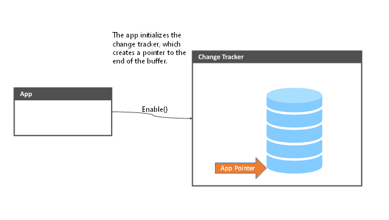

# Track file system changes in the background

**Important APIs**

-   [**StorageLibraryChangeTracker**](/uwp/api/Windows.Storage.StorageLibraryChangeTracker)
-   [**StorageLibraryChangeReader**](/uwp/api/windows.storage.storagelibrarychangereader)
-   [**StorageLibraryChangedTrigger**](/uwp/api/Windows.ApplicationModel.Background.StorageLibraryContentChangedTrigger)
-   [**StorageLibrary**](/uwp/api/windows.storage.storagelibrary)

The [**StorageLibraryChangeTracker**](/uwp/api/Windows.Storage.StorageLibraryChangeTracker) class allows apps to track changes in files and folders as users move them around the system. Using the **StorageLibraryChangeTracker** class, an app can track:

- File operations including add, delete, modify.
- Folder operations such as renames and deletes.
- Files and folders moving on the drive.

Use this guide to learn the programing model for working with the change tracker, view some sample code, and understand the different types of file operations that are tracked by **StorageLibraryChangeTracker**.

**StorageLibraryChangeTracker** works for user libraries, or for any folder on the local machine. This includes secondary drives or removable drives but does not include NAS drives or network drives.

## Using the change tracker

The change tracker is implemented on system as a circular buffer storing the last *N* file system operations. Apps are able to read the changes off of the buffer and then process them into their own experiences. Once the app is finished with the changes it marks the changes as processed and will never see them again.

To use the change tracker on a folder, follow these steps:

1. Enable change tracking for the folder.
2. Wait for changes.
3. Read changes.
4. Accept changes.

The next sections walk through each of the steps with some code examples. The complete code sample is provided at the end of the article.

### Enable the change tracker

The first thing that the app needs to do is to tell the system that it is interested in change tracking a given library. It does this by calling the [**Enable**](/uwp/api/windows.storage.storagelibrarychangetracker.enable) method on the change tracker for the library of interest.

```csharp
StorageLibrary videosLib = await StorageLibrary.GetLibraryAsync(KnownLibraryId.Videos);
StorageLibraryChangeTracker videoTracker = videosLib.ChangeTracker;
videoTracker.Enable();
```

A few important notes:

- Make sure your app has permission to the correct library in the manifest before creating the [**StorageLibrary**](/uwp/api/windows.storage.storagelibrary) object. See [File Access Permissions](./file-access-permissions.md) for more details.
- [**Enable**](/uwp/api/windows.storage.storagelibrarychangetracker.enable) is thread safe, will not reset your pointer, and can be called as many times as you like (more on this later).



### Wait for changes

After the change tracker is initialized, it will begin to record all of the operations that occur within a library, even while the app isn’t running. Apps can register to be activated any time there is a change by registering for the [**StorageLibraryChangedTrigger**](/uwp/api/Windows.ApplicationModel.Background.StorageLibraryContentChangedTrigger) event.


### Read the changes

The app can then poll for changes from the change tracker and receive a list of the changes since the last time it checked. The code below shows how to get a list of changes from the change tracker.

```csharp
StorageLibrary videosLibrary = await StorageLibrary.GetLibraryAsync(KnownLibraryId.Videos);
videosLibrary.ChangeTracker.Enable();
StorageLibraryChangeReader videoChangeReader = videosLibrary.ChangeTracker.GetChangeReader();
IReadOnlyList changeSet = await changeReader.ReadBatchAsync();
```

The app is then responsible for processing the changes into its own experience or database as needed.


> [!TIP]
> The second call to enable is to defend against a race condition if the user adds another folder to the library while your app is reading changes. Without the extra call to **Enable** the code will fail with ecSearchFolderScopeViolation (0x80070490) if the user is changing the folders in their library

### Accept the changes

After the app is done processing the changes, it should tell the system to never show those changes again by calling the [**AcceptChangesAsync**](/uwp/api/windows.storage.storagelibrarychangereader.acceptchangesasync) method.

```csharp
await changeReader.AcceptChangesAsync();
```


The app will now only receive new changes when reading the change tracker in the future.

- If changes have happened between calling [**ReadBatchAsync**](/uwp/api/windows.storage.storagelibrarychangereader.readbatchasync) and [AcceptChangesAsync](/uwp/api/windows.storage.storagelibrarychangereader.acceptchangesasync), the pointer will be only be advanced to the most recent change the app has seen. Those other changes will still be available the next time it calls **ReadBatchAsync**.
- Not accepting the changes will cause the system to return the same set of changes the next time the app calls **ReadBatchAsync**.

## Important things to remember

When using the change tracker, there are a few things that you should keep in mind to make sure that everything is working correctly.

### Buffer overruns

Although we try to reserve enough space in the change tracker to hold all the operations happening on the system until your app can read them, it is very easy to imagine a scenario where the app doesn’t read the changes before the circular buffer overwrites itself. Especially if the user is restoring data from a backup or syncing a large collection of pictures from their camera phone.

In this case, **ReadBatchAsync** will return the error code [**StorageLibraryChangeType.ChangeTrackingLost**](/uwp/api/windows.storage.storagelibrarychangetype). If your app receives this error code, it means a couple things:

* The buffer has overwritten itself since the last time you looked at it. The best course of action is to recrawl the library, because any information from the tracker will be incomplete.
* The change tracker will not return any more changes until you call [**Reset**](/uwp/api/windows.storage.storagelibrarychangetracker.reset). After the app calls reset, the pointer will be moved to the most recent change and tracking will resume normally.

It should be rare to get these cases, but in scenarios where the user is moving a large number of files around on their disk we don’t want the change tracker to balloon and take up too much storage. This should allow apps to react to massive file system operations while not damaging the customer experience in Windows.

### Changes to a StorageLibrary

The [**StorageLibrary**](/uwp/api/windows.storage.storagelibrary) class exists as a virtual group of root folders that contain other folders. To reconcile this with a file system change tracker, we made the following choices:

- Any changes to descendent of the root library folders will be represented in the change tracker. The root library folders can be found using the [**Folders**](/uwp/api/windows.storage.storagelibrary.folders) property.
- Adding or removing root folders from a **StorageLibrary** (through [**RequestAddFolderAsync**](/uwp/api/windows.storage.storagelibrary.requestaddfolderasync) and [**RequestRemoveFolderAsync**](/uwp/api/windows.storage.storagelibrary.requestremovefolderasync)) will not create an entry in the change tracker. These changes can be tracked through the [**DefinitionChanged**](/uwp/api/windows.storage.storagelibrary.definitionchanged) event or by enumerating the root folders in the library using the [**Folders**](/uwp/api/windows.storage.storagelibrary.folders) property.
- If a folder with content already in it is added to the library, there will not be a change notification or change tracker entries generated. Any subsequent changes to the descendants of that folder will generate notifications and change tracker entries.

### Calling the Enable method

Apps should call [**Enable**](/uwp/api/windows.storage.storagelibrarychangetracker.enable) as soon as they start tracking the file system and before every enumeration of the changes. This will ensure that all changes will be captured by the change tracker.  

## Putting it together

Here is all the code that is used to register for the changes from the video library and start pulling the changes from the change tracker.

```csharp
private async void EnableChangeTracker()
{
    StorageLibrary videosLib = await StorageLibrary.GetLibraryAsync(KnownLibraryId.Videos);
    StorageLibraryChangeTracker videoTracker = videosLib.ChangeTracker;
    videoTracker.Enable();
}

private async void GetChanges()
{
    StorageLibrary videosLibrary = await StorageLibrary.GetLibraryAsync(KnownLibraryId.Videos);
    videosLibrary.ChangeTracker.Enable();
    StorageLibraryChangeReader videoChangeReader = videosLibrary.ChangeTracker.GetChangeReader();
    IReadOnlyList changeSet = await changeReader.ReadBatchAsync();


    //Below this line is for the blog post. Above the line is for the magazine
    foreach (StorageLibraryChange change in changeSet)
    {
        if (change.ChangeType == StorageLibraryChangeType.ChangeTrackingLost)
        {
            //We are in trouble. Nothing else is going to be valid.
            log("Resetting the change tracker");
            videosLibrary.ChangeTracker.Reset();
            return;
        }
        if (change.IsOfType(StorageItemTypes.Folder))
        {
            await HandleFileChange(change);
        }
        else if (change.IsOfType(StorageItemTypes.File))
        {
            await HandleFolderChange(change);
        }
        else if (change.IsOfType(StorageItemTypes.None))
        {
            if (change.ChangeType == StorageLibraryChangeType.Deleted)
            {
                RemoveItemFromDB(change.Path);
            }
        }
    }
    await changeReader.AcceptChangesAsync();
}
```