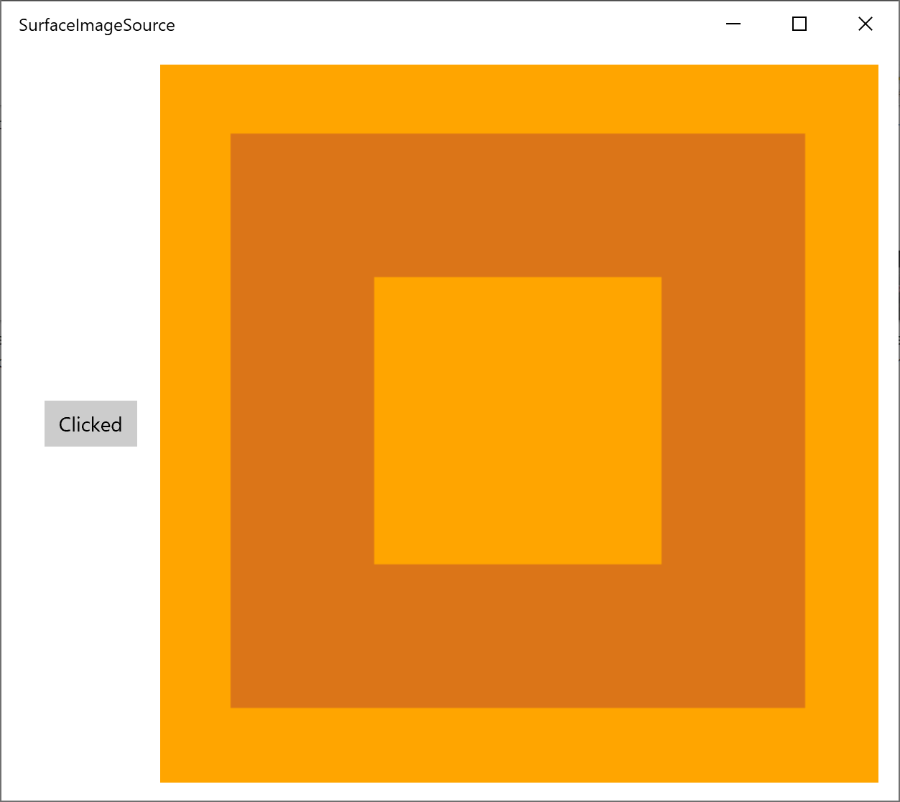
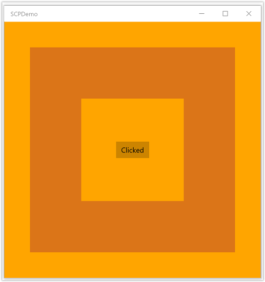

# DirectX and XAML interop

You can use Extensible Application Markup Language (XAML) together with Microsoft DirectX together in your Universal Windows Platform (UWP) game or app. The combination of XAML and DirectX lets you build flexible user interface frameworks that interoperate with your DirectX-rendered content; which is particularly useful for graphics-intensive apps. This topic explains the structure of a UWP app that uses DirectX, and identifies the important types to use when building your UWP app to work with DirectX.

If your app mainly focuses on 2D rendering, then you might want to use the [Win2D](https://github.com/microsoft/win2d) Windows Runtime library. That library is maintained by Microsoft, and is built on top of the core [Direct2D](/windows/win32/direct2d/direct2d-portal) technology. Win2D greatly simplifies the usage pattern to implement 2D graphics, and includes helpful abstractions for some of the techniques described in this document. See the project page for more details. This document covers guidance for app developers who choose *not* to use Win2D.

> [!NOTE]
> DirectX APIs are not defined as Windows Runtime types, but you can use [C++/WinRT](../cpp-and-winrt-apis/index.md) to develop XAML UWP apps that interoperate with DirectX. If you factor the code that calls DirectX into its own C++/WinRT [Windows Runtime component](../winrt-components/create-a-windows-runtime-component-in-cppwinrt.md) (WRC), then you can use that WRC in a UWP app (even a C# one) that then combines XAML and DirectX.

## XAML and DirectX

DirectX provides two powerful libraries for 2D and 3D graphics, respectively&mdash;Direct2D and Direct3D. Although XAML provides support for basic 2D primitives and effects, many modeling and gaming apps need more complex graphics support. For these, you can use Direct2D and Direct3D to render the more complex graphics, and use XAML for more traditional user interface (UI) elements.

If you're implementing custom XAML and DirectX interop, then you need to know these two concepts.

* Shared surfaces are sized regions of the display, defined by XAML, that you can use DirectX to draw into indirectly by using [**Windows::UI::Xaml::Media::ImageSource**](/uwp/api/windows.ui.xaml.media.imagesource) types. For shared surfaces, you don't control the precise timing of when new content appears on-screen. Rather, updates to the shared surface are sync'd to the XAML framework's updates.
* A [swap chain](/windows/win32/direct3d9/what-is-a-swap-chain-) represents a collection of buffers that are used to display graphics with minimal latency. Typically, a swap chain is updated at 60 frames per second separately from the UI thread. However, a swap chain uses more memory and CPU resources in order to support rapid updates, and is relatively difficult to use, since you have to manage multiple threads.

Consider what you're using DirectX for. Will you use it to composite or animate a single control that fits within the dimensions of the display window? Will it contain output that needs to be rendered and controlled in real-time, as in a game? If so, then you'll probably need to implement a swap chain. Otherwise, you should be fine using a shared surface.

Once you've determined how you intend to use DirectX, you use one of the following Windows Runtime types to incorporate DirectX rendering into your UWP app.

* If you want to compose a static image, or draw a complex image at event-driven intervals, then draw to a shared surface with [**Windows::UI::Xaml::Media::Imaging::SurfaceImageSource**](/uwp/api/Windows.UI.Xaml.Media.Imaging.SurfaceImageSource). That type handles a sized DirectX drawing surface. Typically, you use this type when composing an image or texture as a bitmap for display in a document or UI element. It doesn't work well for real-time interactivity, such as a high-performance game. That's because updates to a **SurfaceImageSource** object are synced to XAML user interface updates, and that can introduce latency into the visual feedback you provide to the user, such as a fluctuating frame rate, or a perceived poor response to real-time input. Updates are still quick enough for dynamic controls or data simulations, though.
* If the image is larger than the provided screen real estate, and can be panned or zoomed by the user, then use [**Windows::UI::Xaml::Media::Imaging::VirtualSurfaceImageSource**](/uwp/api/Windows.UI.Xaml.Media.Imaging.VirtualSurfaceImageSource). That type handles a sized DirectX drawing surface that is larger than the screen. Like [**SurfaceImageSource**](/uwp/api/Windows.UI.Xaml.Media.Imaging.SurfaceImageSource), you use this when composing a complex image or control dynamically. And, also like **SurfaceImageSource**, it doesn't work well for high-performance games. Some examples of XAML elements that could use a **VirtualSurfaceImageSource** are map controls, or a large, image-dense document viewer.
* If you're using DirectX to present graphics updated in real-time, or in a situation where the updates must come on regular low-latency intervals, then use the [**SwapChainPanel**](/uwp/api/Windows.UI.Xaml.Controls.SwapChainPanel) class, so that you can refresh the graphics without syncing to the XAML framework refresh timer. With **SwapChainPanel** you can access the graphics device's swap chain ([**IDXGISwapChain1**](/windows/win32/api/dxgi1_2/nn-dxgi1_2-idxgiswapchain1)) directly, and layer XAML on top of the render target. **SwapChainPanel** works great for games and full-screen DirectX apps that require a XAML-based user interface. You must know DirectX well to use this approach, including the [Microsoft DirectX Graphics Infrastructure](/windows/win32/direct3ddxgi/d3d10-graphics-programming-guide-dxgi) (DXGI), Direct2D, and Direct3D technologies. For more info, see [Programming Guide for Direct3D 11](/windows/win32/direct3d11/dx-graphics-overviews).

## SurfaceImageSource

[**SurfaceImageSource**](/uwp/api/Windows.UI.Xaml.Media.Imaging.SurfaceImageSource) provides you with a DirectX shared surface to draw into; it then composes the bits into app content.

> [!TIP]
> The [Line spacing (DirectWrite)](/samples/microsoft/windows-universal-samples/dwritelinespacingmodes/) and [Downloadable fonts (DirectWrite)](/samples/microsoft/windows-universal-samples/dwritetextlayoutcloudfont/) sample applications demonstrate **SurfaceImageSource**.

At a very high level, here's the process for creating and updating a **SurfaceImageSource**.

* Create a Direct 3D device, a Direct 2D device, and a Direct 2D device context.
* Create a **SurfaceImageSource**, and set the Direct 2D (or Direct 3D) device on that.
* Begin drawing on the **SurfaceImageSource** in order to obtain a DXGI surface.
* Draw to the DXGI surface with Direct2D (or Direct3D).
* End drawing on the **SurfaceImageSource** when you're done.
* Set the **SurfaceImageSource** on a XAML **Image** or **ImageBrush** in order to display it in your XAML UI.

And here's a deeper dive into those steps, with source code examples.

1. You can follow along with the code shown and described below by creating a new project in Microsoft Visual Studio. Create a **Blank App (C++/WinRT)** project. Target the latest generally-available (that is, not preview) version of the Windows SDK.

2. Open `pch.h`, and *add* the following includes below the ones already there.

    ```cppwinrt
    // pch.h
    ...
    #include <d3d11_4.h>
    #include <d2d1_1.h>
    #include <windows.ui.xaml.media.dxinterop.h>
    #include <winrt/Windows.UI.Xaml.Media.Imaging.h>
    ```

3. Add the `using` directive shown below to the top of `MainPage.cpp`, below the ones already there. Also in `MainPage.cpp`, replace the existing implementation of **MainPage::ClickHandler** with the listing shown below. The code creates a Direct 3D device, a Direct 2D device, and a Direct 2D device context. To do that, it calls [**D3D11CreateDevice**](/windows/win32/api/d3d11/nf-d3d11-d3d11createdevice), [**D2D1CreateDevice**](/windows/win32/api/d2d1_1/nf-d2d1_1-d2d1createdevice), and [**ID2D1Device::CreateDeviceContext**](/windows/win32/api/d2d1_1/nf-d2d1_1-id2d1device-createdevicecontext).

    ```cppwinrt
    // MainPage.cpp | paste this below the existing using directives
    using namespace Windows::UI::Xaml::Media::Imaging;
    ```    

    ```cppwinrt
    // MainPage.cpp | paste this to replace the existing MainPage::ClickHandler
    void MainPage::ClickHandler(IInspectable const&, RoutedEventArgs const&)
    {
        myButton().Content(box_value(L"Clicked"));

        uint32_t creationFlags = D3D11_CREATE_DEVICE_BGRA_SUPPORT;

        D3D_FEATURE_LEVEL featureLevels[] =
        {
            D3D_FEATURE_LEVEL_11_1,
            D3D_FEATURE_LEVEL_11_0,
            D3D_FEATURE_LEVEL_10_1,
            D3D_FEATURE_LEVEL_10_0,
            D3D_FEATURE_LEVEL_9_3,
            D3D_FEATURE_LEVEL_9_2,
            D3D_FEATURE_LEVEL_9_1
        };

        // Create the Direct3D device.
        winrt::com_ptr<::ID3D11Device> d3dDevice;
        D3D_FEATURE_LEVEL supportedFeatureLevel;
        winrt::check_hresult(::D3D11CreateDevice(
            nullptr,
            D3D_DRIVER_TYPE_HARDWARE,
            0,
            creationFlags,
            featureLevels,
            ARRAYSIZE(featureLevels),
            D3D11_SDK_VERSION,
            d3dDevice.put(),
            &supportedFeatureLevel,
            nullptr)
        );

        // Get the DXGI device.
        winrt::com_ptr<::IDXGIDevice> dxgiDevice{
            d3dDevice.as<::IDXGIDevice>() };

        // Create the Direct2D device and a corresponding context.
        winrt::com_ptr<::ID2D1Device> d2dDevice;
        ::D2D1CreateDevice(dxgiDevice.get(), nullptr, d2dDevice.put());

        winrt::com_ptr<::ID2D1DeviceContext> d2dDeviceContext;
        winrt::check_hresult(
            d2dDevice->CreateDeviceContext(
                D2D1_DEVICE_CONTEXT_OPTIONS_NONE,
                d2dDeviceContext.put()
            )
        );
    }
    ```

4. Next, add code to create a [**SurfaceImageSource**](/uwp/api/Windows.UI.Xaml.Media.Imaging.SurfaceImageSource), and set the Direct 2D (or Direct 3D) device on that by calling [**ISurfaceImageSourceNativeWithD2D::SetDevice**](/windows/win32/api/windows.ui.xaml.media.dxinterop/nf-windows-ui-xaml-media-dxinterop-isurfaceimagesourcenativewithd2d-setdevice).

    > [!NOTE]
    > If you'll be drawing to your **SurfaceImageSource** from a background thread, then you'll also need to ensure that the DXGI device has multi-threaded access enabled (as shown in the code below). For performance reasons you should do that *only* if you'll be drawing from a background thread.

    Define the size of the shared surface by passing the height and width to the [**SurfaceImageSource**](/uwp/api/Windows.UI.Xaml.Media.Imaging.SurfaceImageSource) constructor. You can also indicate whether the surface needs alpha (opacity) support.

    To set the device, and run the draw operations, we'll need a pointer to [**ISurfaceImageSourceNativeWithD2D**](/windows/win32/api/windows.ui.xaml.media.dxinterop/nn-windows-ui-xaml-media-dxinterop-isurfaceimagesourcenativewithd2d). To obtain one, query the **SurfaceImageSource** object for its underlying **ISurfaceImageSourceNativeWithD2D** interface.

    ```cppwinrt
    // MainPage.cpp | paste this at the end of MainPage::ClickHandler
    SurfaceImageSource surfaceImageSource(500, 500);

    winrt::com_ptr<::ISurfaceImageSourceNativeWithD2D> sisNativeWithD2D{
        surfaceImageSource.as<::ISurfaceImageSourceNativeWithD2D>() };

    // Associate the Direct2D device with the SurfaceImageSource.
    sisNativeWithD2D->SetDevice(d2dDevice.get());

    // To enable multi-threaded access (optional)
    winrt::com_ptr<::ID3D11Multithread> d3dMultiThread{
        d3dDevice.as<::ID3D11Multithread>() };
    d3dMultiThread->SetMultithreadProtected(true);
    ```

5. Call [**ISurfaceImageSourceNativeWithD2D::BeginDraw**](/windows/win32/api/windows.ui.xaml.media.dxinterop/nf-windows-ui-xaml-media-dxinterop-isurfaceimagesourcenativewithd2d-begindraw) to retrieve a DXGI surface (an [**IDXGISurface**](/windows/win32/api/dxgi/nn-dxgi-idxgisurface) interface). You can call **ISurfaceImageSourceNativeWithD2D::BeginDraw** (and the later drawing commands) from a background thread if you've enabled multi-threaded access. In this step you also create a bitmap from the DXGI surface, and set that into the Direct 2D device context.

    In the *offset* parameter, **ISurfaceImageSourceNativeWithD2D::BeginDraw** returns the point offset (an x,y value) of the updated target rectangle. You can use that offset to determine where to draw your updated content with the **ID2D1DeviceContext**.

    ```cppwinrt
    // MainPage.cpp | paste this at the end of MainPage::ClickHandler
    winrt::com_ptr<::IDXGISurface> dxgiSurface;

    RECT updateRect{ 0, 0, 500, 500 };
    POINT offset{ 0, 0 };
    HRESULT beginDrawHR = sisNativeWithD2D->BeginDraw(
        updateRect,
        __uuidof(::IDXGISurface),
        dxgiSurface.put_void(),
        &offset);

    // Create render target.
    winrt::com_ptr<::ID2D1Bitmap1> bitmap;
    winrt::check_hresult(
        d2dDeviceContext->CreateBitmapFromDxgiSurface(
            dxgiSurface.get(),
            nullptr,
            bitmap.put()
        )
    );

    // Set context's render target.
    d2dDeviceContext->SetTarget(bitmap.get());
    ```

6. Use the Direct 2D device context to draw the contents of the **SurfaceImageSource**. Only the area specified for update in the previous step in the *updateRect* parameter is drawn.

    ```cppwinrt
    // MainPage.cpp | paste this at the end of MainPage::ClickHandler
    if (beginDrawHR == DXGI_ERROR_DEVICE_REMOVED ||
        beginDrawHR == DXGI_ERROR_DEVICE_RESET ||
        beginDrawHR == D2DERR_RECREATE_TARGET)
    {
        // The Direct3D and Direct2D devices were lost and need to be re-created.
        // Recovery steps are:
        // 1) Re-create the Direct3D and Direct2D devices
        // 2) Call ISurfaceImageSourceNativeWithD2D::SetDevice with the new Direct2D
        //    device
        // 3) Redraw the contents of the SurfaceImageSource
    }
    else if (beginDrawHR == E_SURFACE_CONTENTS_LOST)
    {
        // The devices were not lost but the entire contents of the surface
        // were. Recovery steps are:
        // 1) Call ISurfaceImageSourceNativeWithD2D::SetDevice with the Direct2D 
        //    device again
        // 2) Redraw the entire contents of the SurfaceImageSource
    }
    else
    {
        // Draw using Direct2D context.
        d2dDeviceContext->BeginDraw();

        d2dDeviceContext->Clear(D2D1::ColorF(D2D1::ColorF::Orange));

        winrt::com_ptr<::ID2D1SolidColorBrush> brush;
        winrt::check_hresult(d2dDeviceContext->CreateSolidColorBrush(
            D2D1::ColorF(D2D1::ColorF::Chocolate),
            D2D1::BrushProperties(0.8f),
            brush.put()));

        D2D1_SIZE_F const size{ 500, 500 };
        D2D1_RECT_F const rect{ 100.0f, 100.0f, size.width - 100.0f, size.height - 100.0f };
        d2dDeviceContext->DrawRectangle(rect, brush.get(), 100.0f);

        d2dDeviceContext->EndDraw();
    }
    ```

7. Call [**ISurfaceImageSourceNativeWithD2D::EndDraw**](/windows/win32/api/windows.ui.xaml.media.dxinterop/nf-windows-ui-xaml-media-dxinterop-isurfaceimagesourcenativewithd2d-enddraw) to complete the bitmap (you must call **ISurfaceImageSourceNativeWithD2D::EndDraw** only from the UI thread). Then set the **SurfaceImageSource** on a XAML [**Image**](/uwp/api/windows.ui.xaml.controls.image) (or [**ImageBrush**](/uwp/api/windows.ui.xaml.media.imagebrush)) in order to display it in your XAML UI.

    ```cppwinrt
    // MainPage.cpp | paste this at the end of MainPage::ClickHandler
    sisNativeWithD2D->EndDraw();

    // The SurfaceImageSource object's underlying 
    // ISurfaceImageSourceNativeWithD2D object will contain the completed bitmap.

    theImage().Source(surfaceImageSource);
    ```

    > [!NOTE]
    > Calling [**SurfaceImageSource::SetSource**](/uwp/api/windows.ui.xaml.media.imaging.bitmapsource.setsource) (inherited from **IBitmapSource::SetSource**) currently throws an exception. Don't call it from your [**SurfaceImageSource**](/uwp/api/Windows.UI.Xaml.Media.Imaging.SurfaceImageSource) object.

    > [!NOTE]
    > Avoid drawing to **SurfaceImageSource** while your [**Window**](/uwp/api/Windows.UI.Xaml.Window) is hidden or inactive, otherwise **ISurfaceImageSourceNativeWithD2D** APIs will fail. Handle events around window visibility and application suspension to accomplish that.

8. Finally, add the following **Image** element inside the existing XAML markup in `MainPage.xaml`.

    ```xaml
    <!-- MainPage.xaml -->
    ...
    <Image x:Name="theImage" Width="500" Height="500" />
    ...
    ```

9. You can now build and run the app. Click the button to see the contents of the **SurfaceImageSource** displayed in the **Image**.

    

## VirtualSurfaceImageSource

[**VirtualSurfaceImageSource**](/uwp/api/Windows.UI.Xaml.Media.Imaging.VirtualSurfaceImageSource) extends [**SurfaceImageSource**](/uwp/api/Windows.UI.Xaml.Media.Imaging.SurfaceImageSource), and it's for scenarios where the content is potentially too large to fit on the screen all at once (and/or too large to fit in video memory as a single texture), and so the content must be virtualized in order to render optimally. For example, mapping apps, or large document canvases.

> [!TIP]
> The [Complex inking sample](/samples/microsoft/windows-universal-samples/complexink/) application demonstrates **VirtualSurfaceImageSource**.

**VirtualSurfaceImageSource** differs from [**SurfaceImageSource**](/uwp/api/Windows.UI.Xaml.Media.Imaging.SurfaceImageSource) in that it uses a callback&mdash;[**IVirtualSurfaceImageSourceCallbacksNative::UpdatesNeeded**](/windows/win32/api/windows.ui.xaml.media.dxinterop/nf-windows-ui-xaml-media-dxinterop-ivirtualsurfaceupdatescallbacknative-updatesneeded)&mdash;which you implement to update regions of the surface as they become visible on the screen. You don't need to clear regions that are hidden, because the XAML framework takes care of that for you.

It's a good idea to become familiar with **SurfaceImageSource** (see the [SurfaceImageSource](#surfaceimagesource) section above) before tackling **VirtualSurfaceImageSource**. But at a very high level, here's the process for creating and updating a **VirtualSurfaceImageSource**.

* Implement the **IVirtualSurfaceImageSourceCallbackNative** interface.
* Create a Direct 3D device, a Direct 2D device, and a Direct 2D device context.
* Create a **VirtualSurfaceImageSource**, and set the Direct 2D (or Direct 3D) device on that.
* Call **RegisterForUpdatesNeeded** on the **VirtualSurfaceImageSource**.
* In your **UpdatesNeeded** callback, call **GetUpdateRectCount** and **GetUpdateRects**.
* Render the update rectangles (using **BeginDraw**/**EndDraw** just like for **SurfaceImageSource**).
* Set the **SurfaceImageSource** on a XAML **Image** or **ImageBrush** in order to display it in your XAML UI.

And here's a deeper dive into those steps, with source code examples.

1. You can follow along with the code shown and described below by creating a new project in Microsoft Visual Studio. Create a **Blank App (C++/WinRT)** project, and name it *VSISDemo* (it's important to give the project this name if you'll be copy-pasting in the code listings given below). Target the latest generally-available (that is, not preview) version of the Windows SDK.

2. Open `pch.h`, and *add* the following includes below the ones already there.

    ```cppwinrt
    // pch.h
    ...
    #include <d3d11_4.h>
    #include <d2d1_1.h>
    #include <windows.ui.xaml.media.dxinterop.h>
    #include <winrt/Windows.UI.Xaml.Media.Imaging.h>
    ```

3. In this step, you'll provide an implementation of the [**IVirtualSurfaceUpdatesCallbackNative**](/windows/win32/api/windows.ui.xaml.media.dxinterop/nn-windows-ui-xaml-media-dxinterop-ivirtualsurfaceupdatescallbacknative) interface. Add a new **Header File (.h)** item to the project, and name it *CallbackImplementation.h*. Replace the contents of that file with the listing below. The code is explained after the listing.

    ```cppwinrt
    #include "pch.h"

    namespace winrt::VSISDemo::implementation
    {
        struct CallbackImplementation : winrt::implements<CallbackImplementation, ::IVirtualSurfaceUpdatesCallbackNative>
        {
            CallbackImplementation(
                winrt::com_ptr<::ISurfaceImageSourceNativeWithD2D> sisNativeWithD2D,
                winrt::com_ptr<::IVirtualSurfaceImageSourceNative> const& vsisNative,
                winrt::com_ptr<::ID2D1DeviceContext> const& d2dDeviceContext) :
                m_sisNativeWithD2D(sisNativeWithD2D),
                m_vsisNative(vsisNative),
                m_d2dDeviceContext(d2dDeviceContext)
            {}

            IFACEMETHOD(UpdatesNeeded)()
            {
                HRESULT hr = S_OK;

                ULONG drawingBoundsCount = 0;
                m_vsisNative->GetUpdateRectCount(&drawingBoundsCount);

                std::unique_ptr<RECT[]> drawingBounds(
                    new RECT[drawingBoundsCount]);

                m_vsisNative->GetUpdateRects(
                    drawingBounds.get(),
                    drawingBoundsCount);

                for (ULONG i = 0; i < drawingBoundsCount; ++i)
                {
                    winrt::com_ptr<::IDXGISurface> dxgiSurface;

                    POINT offset{ 0, 0 };
                    HRESULT beginDrawHR = m_sisNativeWithD2D->BeginDraw(
                        drawingBounds[i],
                        __uuidof(::IDXGISurface),
                        dxgiSurface.put_void(),
                        &offset);

                    // Create render target.
                    winrt::com_ptr<::ID2D1Bitmap1> bitmap;
                    winrt::check_hresult(
                        m_d2dDeviceContext->CreateBitmapFromDxgiSurface(
                            dxgiSurface.get(),
                            nullptr,
                            bitmap.put()
                        )
                    );

                    // Set context's render target.
                    m_d2dDeviceContext->SetTarget(bitmap.get());

                    if (beginDrawHR == DXGI_ERROR_DEVICE_REMOVED ||
                        beginDrawHR == DXGI_ERROR_DEVICE_RESET ||
                        beginDrawHR == D2DERR_RECREATE_TARGET)
                    {
                        // The Direct3D and Direct2D devices were lost and need to be re-created.
                        // Recovery steps are:
                        // 1) Re-create the Direct3D and Direct2D devices
                        // 2) Call ISurfaceImageSourceNativeWithD2D::SetDevice with the new Direct2D
                        //    device
                        // 3) Redraw the contents of the SurfaceImageSource
                    }
                    else if (beginDrawHR == E_SURFACE_CONTENTS_LOST)
                    {
                        // The devices were not lost but the entire contents of the surface
                        // were. Recovery steps are:
                        // 1) Call ISurfaceImageSourceNativeWithD2D::SetDevice with the Direct2D 
                        //    device again
                        // 2) Redraw the entire contents of the SurfaceImageSource
                    }
                    else
                    {
                        // Draw using Direct2D context.
                        m_d2dDeviceContext->BeginDraw();

                        m_d2dDeviceContext->Clear(D2D1::ColorF(D2D1::ColorF::Orange));

                        winrt::com_ptr<::ID2D1SolidColorBrush> brush;
                        winrt::check_hresult(m_d2dDeviceContext->CreateSolidColorBrush(
                            D2D1::ColorF(D2D1::ColorF::Chocolate),
                            D2D1::BrushProperties(0.8f),
                            brush.put()));

                        D2D1_SIZE_F const size{ drawingBounds[i].right - drawingBounds[i].left, drawingBounds[i].bottom - drawingBounds[i].top };
                        D2D1_RECT_F const rect{ 100.0f, 100.0f, size.width - 100.0f, size.height - 100.0f };
                        m_d2dDeviceContext->DrawRectangle(rect, brush.get(), 100.0f);

                        m_d2dDeviceContext->EndDraw();
                    }

                    m_sisNativeWithD2D->EndDraw();
                }

                return hr;
            }

        private:
            winrt::com_ptr<::ISurfaceImageSourceNativeWithD2D> m_sisNativeWithD2D{ nullptr };
            winrt::com_ptr<::IVirtualSurfaceImageSourceNative> m_vsisNative{ nullptr };
            winrt::com_ptr<::ID2D1DeviceContext> m_d2dDeviceContext{ nullptr };
        };
    }
    ```

    Whenever a region of the **VirtualSurfaceImageSource** needs to be updated, the framework calls your implementation of [**IVirtualSurfaceUpdatesCallbackNative::UpdatesNeeded**](/windows/win32/api/windows.ui.xaml.media.dxinterop/nf-windows-ui-xaml-media-dxinterop-ivirtualsurfaceimagesourcenative-registerforupdatesneeded) (shown above).

    That can happen either when the framework determines that the region needs to be drawn (when the user pans or zooms the view of the surface, for example), or after your app has called [**IVirtualSurfaceImageSourceNative::Invalidate**](/windows/win32/api/windows.ui.xaml.media.dxinterop/nf-windows-ui-xaml-media-dxinterop-ivirtualsurfaceimagesourcenative-invalidate) on that region.

    In your implementation of [**IVirtualSurfaceImageSourceNative::UpdatesNeeded**](/windows/win32/api/windows.ui.xaml.media.dxinterop/nf-windows-ui-xaml-media-dxinterop-ivirtualsurfaceupdatescallbacknative-updatesneeded), use the [**IVirtualSurfaceImageSourceNative::GetUpdateRectCount**](/windows/win32/api/windows.ui.xaml.media.dxinterop/nf-windows-ui-xaml-media-dxinterop-ivirtualsurfaceimagesourcenative-getupdaterectcount) and [**IVirtualSurfaceImageSourceNative::GetUpdateRects**](/windows/win32/api/windows.ui.xaml.media.dxinterop/nf-windows-ui-xaml-media-dxinterop-ivirtualsurfaceimagesourcenative-getupdaterects) methods to determine which region(s) of the surface must be drawn.

    For each region that must be updated, draw the specific content to that region, but constrain your drawing to the bounded regions for better performance. The specifics of calling the **ISurfaceImageSourceNativeWithD2D** methods are the same as for **SurfaceImageSource** (see the [SurfaceImageSource](#surfaceimagesource) section above).

    > [!NOTE]
    > Avoid drawing to **VirtualSurfaceImageSource** while your [**Window**](/uwp/api/Windows.UI.Xaml.Window) is hidden or inactive, otherwise **ISurfaceImageSourceNativeWithD2D** APIs will fail. Handle events around window visibility and application suspension to accomplish that.

4. In the **MainPage** class, we'll add a member of type **CallbackImplementation**. We'll also create a Direct 3D device, a Direct 2D device, and a Direct 2D device context. To do that, we'll call [**D3D11CreateDevice**](/windows/win32/api/d3d11/nf-d3d11-d3d11createdevice), [**D2D1CreateDevice**](/windows/win32/api/d2d1_1/nf-d2d1_1-d2d1createdevice), and [**ID2D1Device::CreateDeviceContext**](/windows/win32/api/d2d1_1/nf-d2d1_1-id2d1device-createdevicecontext).

    Replace the contents of `MainPage.idl`, `MainPage.h`, and `MainPage.cpp` with the contents of the listings below.

    ```cppwinrt
    // MainPage.idl
    namespace VSISDemo
    {
        [default_interface]
        runtimeclass MainPage : Windows.UI.Xaml.Controls.Page
        {
            MainPage();
        }
    }
    ```

    ```cppwinrt
    // MainPage.h
    #pragma once

    #include "MainPage.g.h"
    #include "CallbackImplementation.h"

    namespace winrt::VSISDemo::implementation
    {
        struct MainPage : MainPageT<MainPage>
        {
            MainPage();
            void ClickHandler(Windows::Foundation::IInspectable const& sender, Windows::UI::Xaml::RoutedEventArgs const& args);

        private:
            winrt::com_ptr<::IVirtualSurfaceUpdatesCallbackNative> m_cbi{ nullptr };
        };
    }

    namespace winrt::VSISDemo::factory_implementation
    {
        struct MainPage : MainPageT<MainPage, implementation::MainPage>
        {
        };
    }
    ```

    ```cppwinrt
    // MainPage.cpp
    #include "pch.h"
    #include "MainPage.h"
    #include "MainPage.g.cpp"

    using namespace winrt;
    using namespace Windows::UI::Xaml;
    using namespace Windows::UI::Xaml::Media::Imaging;

    namespace winrt::VSISDemo::implementation
    {
        MainPage::MainPage()
        {
            InitializeComponent();
        }

        void MainPage::ClickHandler(IInspectable const&, RoutedEventArgs const&)
        {
            myButton().Content(box_value(L"Clicked"));

            uint32_t creationFlags = D3D11_CREATE_DEVICE_BGRA_SUPPORT;

            D3D_FEATURE_LEVEL featureLevels[] =
            {
                D3D_FEATURE_LEVEL_11_1,
                D3D_FEATURE_LEVEL_11_0,
                D3D_FEATURE_LEVEL_10_1,
                D3D_FEATURE_LEVEL_10_0,
                D3D_FEATURE_LEVEL_9_3,
                D3D_FEATURE_LEVEL_9_2,
                D3D_FEATURE_LEVEL_9_1
            };

            // Create the Direct3D device.
            winrt::com_ptr<::ID3D11Device> d3dDevice;
            D3D_FEATURE_LEVEL supportedFeatureLevel;
            winrt::check_hresult(::D3D11CreateDevice(
                nullptr,
                D3D_DRIVER_TYPE_HARDWARE,
                0,
                creationFlags,
                featureLevels,
                ARRAYSIZE(featureLevels),
                D3D11_SDK_VERSION,
                d3dDevice.put(),
                &supportedFeatureLevel,
                nullptr)
            );

            // Get the Direct3D device.
            winrt::com_ptr<::IDXGIDevice> dxgiDevice{
                d3dDevice.as<::IDXGIDevice>() };

            // Create the Direct2D device and a corresponding context.
            winrt::com_ptr<::ID2D1Device> d2dDevice;
            ::D2D1CreateDevice(dxgiDevice.get(), nullptr, d2dDevice.put());

            winrt::com_ptr<::ID2D1DeviceContext> d2dDeviceContext;
            winrt::check_hresult(
                d2dDevice->CreateDeviceContext(
                    D2D1_DEVICE_CONTEXT_OPTIONS_NONE,
                    d2dDeviceContext.put()
                )
            );
        }
    }
    ```

5. Next, add code to create a [**VirtualSurfaceImageSource**](/uwp/api/Windows.UI.Xaml.Media.Imaging.SurfaceImageSource) with the size that you want, and set the Direct 2D (or Direct 3D) device on that by calling [**ISurfaceImageSourceNativeWithD2D::SetDevice**](/windows/win32/api/windows.ui.xaml.media.dxinterop/nf-windows-ui-xaml-media-dxinterop-isurfaceimagesourcenativewithd2d-setdevice).

    > [!NOTE]
    > If you'll be drawing to your **VirtualSurfaceImageSource** from a background thread, then you'll also need to ensure that the DXGI device has multi-threaded access enabled (as shown in the code below). For performance reasons you should do that *only* if you'll be drawing from a background thread.

    To set the device, and run the draw operations, we'll need a pointer to [**ISurfaceImageSourceNativeWithD2D**](/windows/win32/api/windows.ui.xaml.media.dxinterop/nn-windows-ui-xaml-media-dxinterop-isurfaceimagesourcenativewithd2d). To obtain one, query the **VirtualSurfaceImageSource** object for its underlying **ISurfaceImageSourceNativeWithD2D** interface.

    Also query for [**IVirtualSurfaceImageSourceNative**](/windows/win32/api/windows.ui.xaml.media.dxinterop/nn-windows-ui-xaml-media-dxinterop-ivirtualsurfaceimagesourcenative), and call [**IVirtualSurfaceImageSourceNative::RegisterForUpdatesNeeded**](/windows/win32/api/windows.ui.xaml.media.dxinterop/nf-windows-ui-xaml-media-dxinterop-ivirtualsurfaceimagesourcenative-registerforupdatesneeded), providing your implementation of [**IVirtualSurfaceUpdatesCallbackNative**](/windows/win32/api/windows.ui.xaml.media.dxinterop/nn-windows-ui-xaml-media-dxinterop-ivirtualsurfaceupdatescallbacknative).

    Then set the **SurfaceImageSource** on a XAML [**Image**](/uwp/api/windows.ui.xaml.controls.image) (or [**ImageBrush**](/uwp/api/windows.ui.xaml.media.imagebrush)) in order to display it in your XAML UI.

    ```cppwinrt
    // MainPage.cpp | paste this at the end of MainPage::ClickHandler
    VirtualSurfaceImageSource virtualSurfaceImageSource(2000, 2000);

    winrt::com_ptr<::ISurfaceImageSourceNativeWithD2D> sisNativeWithD2D{
        virtualSurfaceImageSource.as<::ISurfaceImageSourceNativeWithD2D>() };

    // Associate the Direct2D device with the SurfaceImageSource.
    sisNativeWithD2D->SetDevice(d2dDevice.get());

    // To enable multi-threaded access (optional)
    winrt::com_ptr<::ID3D11Multithread> d3dMultiThread{
        d3dDevice.as<::ID3D11Multithread>() };
    d3dMultiThread->SetMultithreadProtected(true);

    winrt::com_ptr<::IVirtualSurfaceImageSourceNative> vsisNative{
        virtualSurfaceImageSource.as<::IVirtualSurfaceImageSourceNative>() };

    m_cbi = winrt::make<CallbackImplementation>(sisNativeWithD2D, vsisNative, d2dDeviceContext);
    vsisNative->RegisterForUpdatesNeeded(m_cbi.as<::IVirtualSurfaceUpdatesCallbackNative>().get());

    // The SurfaceImageSource object's underlying 
    // ISurfaceImageSourceNativeWithD2D object will contain the completed bitmap.

    theImage().Source(virtualSurfaceImageSource);
    ```

6. Finally, add the following **Image** element inside the existing XAML markup in `MainPage.xaml`.

    ```xaml
    <!-- MainPage.xaml -->
    ...
    <Image x:Name="theImage" Width="500" Height="500" />
    ...
    ```

7. You can now build and run the app. Click the button to see the contents of the **VirtualSurfaceImageSource** displayed in the **Image**.

## SwapChainPanel and gaming

[**SwapChainPanel**](/uwp/api/Windows.UI.Xaml.Controls.SwapChainPanel) is the Windows Runtime type designed to support high-performance graphics and gaming, where you manage the swap chain directly. In this case, you create your own DirectX swap chain and manage the presentation of your rendered content. Another feature of the **SwapChainPanel** is that you can overlay other XAML elements in front of it.

> [!TIP]
> The following sample applications demonstrate **SurfaceImageSource**: [Direct2D advanced color image rendering](/samples/microsoft/windows-universal-samples/d2dadvancedcolorimages/), [Direct2D photo adjustment](/samples/microsoft/windows-universal-samples/d2dphotoadjustment/), [Direct2D SVG image rendering](/samples/microsoft/windows-universal-samples/d2dsvgimage/), [Low latency input](/samples/microsoft/windows-universal-samples/lowlatencyinput/), [DirectX and XAML game](/samples/microsoft/windows-universal-samples/simple3dgamexaml/), and [XAML SwapChainPanel DirectX interop (Windows 8.1)](https://github.com/microsoftarchive/msdn-code-gallery-microsoft/tree/master/Official%20Windows%20Platform%20Sample/XAML%20SwapChainPanel%20DirectX%20interop%20sample).

To ensure good performance, there are certain limitations to the **SwapChainPanel** type.

* There should be no more than 4 **SwapChainPanel** instances per app.
* You should set the DirectX swap chain's height and width (in [**DXGI_SWAP_CHAIN_DESC1**](/windows/win32/api/dxgi1_2/ns-dxgi1_2-dxgi_swap_chain_desc1)) to the current dimensions of the swap chain element. If you don't, then the display content will be scaled to fit (using **DXGI\_SCALING\_STRETCH**).
* You must set the DirectX swap chain's scaling mode (in [**DXGI_SWAP_CHAIN_DESC1**](/windows/win32/api/dxgi1_2/ns-dxgi1_2-dxgi_swap_chain_desc1)) to **DXGI\_SCALING\_STRETCH**.
* You must create the DirectX swap chain by calling [**IDXGIFactory2::CreateSwapChainForComposition**](/windows/win32/api/dxgi1_2/nf-dxgi1_2-idxgifactory2-createswapchainforcomposition).

You update the [**SwapChainPanel**](/uwp/api/Windows.UI.Xaml.Controls.SwapChainPanel) based on the needs of your app, and not sync'd with the updates of the XAML framework. If you need to synchronize the updates of the **SwapChainPanel** to those of the XAML framework, then register for the [**Windows::UI::Xaml::Media::CompositionTarget::Rendering**](/uwp/api/windows.ui.xaml.media.compositiontarget.rendering) event. Otherwise, you must consider any cross-thread issues if you try to update the XAML elements from a different thread than the one updating the **SwapChainPanel**.

If you need to receive low-latency pointer input to your **SwapChainPanel**, then use [**SwapChainPanel::CreateCoreIndependentInputSource**](/uwp/api/windows.ui.xaml.controls.swapchainpanel.createcoreindependentinputsource). That method returns a [**CoreIndependentInputSource**](/uwp/api/windows.ui.core.coreindependentinputsource) object that can be used to receive input events at minimal latency on a background thread. Note that once this method is called, normal XAML pointer input events will not be raised for the **SwapChainPanel**, since all input will be redirected to the background thread.

Here's the process for creating and updating a [**SwapChainPanel**](/uwp/api/Windows.UI.Xaml.Controls.SwapChainPanel) object.

1. You can follow along with the code shown and described below by creating a new project in Microsoft Visual Studio. Create a **Blank App (C++/WinRT)** project, and name it *SCPDemo* (it's important to give the project this name if you'll be copy-pasting in the code listings given below). Target the latest generally-available (that is, not preview) version of the Windows SDK.

2. Open `pch.h`, and *add* the following includes below the ones already there.

    ```cppwinrt
    // pch.h
    ...
    #include <d3d11_4.h>
    #include <d2d1_1.h>
    #include <windows.ui.xaml.media.dxinterop.h>
    ```

3. In the **MainPage** class, we'll first create a Direct 3D device, a Direct 2D device, and a Direct 2D device context. To do that, we'll call [**D3D11CreateDevice**](/windows/win32/api/d3d11/nf-d3d11-d3d11createdevice), [**D2D1CreateDevice**](/windows/win32/api/d2d1_1/nf-d2d1_1-d2d1createdevice), and [**ID2D1Device::CreateDeviceContext**](/windows/win32/api/d2d1_1/nf-d2d1_1-id2d1device-createdevicecontext).

    Replace the contents of `MainPage.idl`, `MainPage.h`, and `MainPage.cpp` with the contents of the listings below.

    ```cppwinrt
    // MainPage.idl
    namespace SCPDemo
    {
        [default_interface]
        runtimeclass MainPage : Windows.UI.Xaml.Controls.Page
        {
            MainPage();
        }
    }
    ```

    ```cppwinrt
    // MainPage.h
    #pragma once

    #include "MainPage.g.h"

    namespace winrt::SCPDemo::implementation
    {
        struct MainPage : MainPageT<MainPage>
        {
            MainPage();
            void ClickHandler(Windows::Foundation::IInspectable const& sender, Windows::UI::Xaml::RoutedEventArgs const& args);
        };
    }

    namespace winrt::SCPDemo::factory_implementation
    {
        struct MainPage : MainPageT<MainPage, implementation::MainPage>
        {
        };
    }
    ```

    ```cppwinrt
    // MainPage.cpp
    #include "pch.h"
    #include "MainPage.h"
    #include "MainPage.g.cpp"

    using namespace winrt;
    using namespace Windows::UI::Xaml;

    namespace winrt::SCPDemo::implementation
    {
        MainPage::MainPage()
        {
            InitializeComponent();
        }

        void MainPage::ClickHandler(IInspectable const&, RoutedEventArgs const&)
        {
            myButton().Content(box_value(L"Clicked"));

            uint32_t creationFlags = D3D11_CREATE_DEVICE_BGRA_SUPPORT;

            D3D_FEATURE_LEVEL featureLevels[] =
            {
                D3D_FEATURE_LEVEL_11_1,
                D3D_FEATURE_LEVEL_11_0,
                D3D_FEATURE_LEVEL_10_1,
                D3D_FEATURE_LEVEL_10_0,
                D3D_FEATURE_LEVEL_9_3,
                D3D_FEATURE_LEVEL_9_2,
                D3D_FEATURE_LEVEL_9_1
            };

            // Create the Direct3D device.
            winrt::com_ptr<::ID3D11Device> d3dDevice;
            D3D_FEATURE_LEVEL supportedFeatureLevel;
            winrt::check_hresult(::D3D11CreateDevice(
                nullptr,
                D3D_DRIVER_TYPE_HARDWARE,
                0,
                creationFlags,
                featureLevels,
                ARRAYSIZE(featureLevels),
                D3D11_SDK_VERSION,
                d3dDevice.put(),
                &supportedFeatureLevel,
                nullptr)
            );

            // Get the Direct3D device.
            winrt::com_ptr<::IDXGIDevice> dxgiDevice{
                d3dDevice.as<::IDXGIDevice>() };

            // Create the Direct2D device and a corresponding context.
            winrt::com_ptr<::ID2D1Device> d2dDevice;
            ::D2D1CreateDevice(dxgiDevice.get(), nullptr, d2dDevice.put());

            winrt::com_ptr<::ID2D1DeviceContext> d2dDeviceContext;
            winrt::check_hresult(
                d2dDevice->CreateDeviceContext(
                    D2D1_DEVICE_CONTEXT_OPTIONS_NONE,
                    d2dDeviceContext.put()
                )
            );
        }
    }
    ```

4. Wrap your XAML markup in a **SwapChainPanel** element with an `x:Name`. The wrapped XAML elements will render in front of the **SwapChainPanel**.

    ```xaml
    <!-- MainPage.xaml -->
	<SwapChainPanel x:Name="swapChainPanel">
		<StackPanel Orientation="Horizontal" HorizontalAlignment="Center" VerticalAlignment="Center">
			<Button x:Name="myButton" Click="ClickHandler">Click Me</Button>
		</StackPanel>
	</SwapChainPanel>
    ```

    You can then access that **SwapChainPanel** object via the accessor function with the same name, as we'll see.

5. Next, call call [**IDXGIFactory2::CreateSwapChainForComposition**](/windows/win32/api/dxgi1_2/nf-dxgi1_2-idxgifactory2-createswapchainforcomposition) to create a swap chain.

    ```cppwinrt
    // MainPage.cpp | paste this at the end of MainPage::ClickHandler
    // Get the DXGI adapter.
    winrt::com_ptr< ::IDXGIAdapter > dxgiAdapter;
    dxgiDevice->GetAdapter(dxgiAdapter.put());

    // Get the DXGI factory.
    winrt::com_ptr< ::IDXGIFactory2 > dxgiFactory;
    dxgiFactory.capture(dxgiAdapter, &IDXGIAdapter::GetParent);

    DXGI_SWAP_CHAIN_DESC1 swapChainDesc { 0 };
    swapChainDesc.Width = 500;
    swapChainDesc.Height = 500;
    swapChainDesc.Format = DXGI_FORMAT_B8G8R8A8_UNORM; // This is the most common swapchain format.
    swapChainDesc.Stereo = false;
    swapChainDesc.SampleDesc.Count = 1; // Don't use multi-sampling.
    swapChainDesc.SampleDesc.Quality = 0;
    swapChainDesc.BufferUsage = DXGI_USAGE_RENDER_TARGET_OUTPUT;
    swapChainDesc.BufferCount = 2;
    swapChainDesc.Scaling = DXGI_SCALING_STRETCH;
    swapChainDesc.SwapEffect = DXGI_SWAP_EFFECT_FLIP_SEQUENTIAL; // We recommend using this swap effect for all applications.
    swapChainDesc.Flags = 0;

    // Create a swap chain by calling IDXGIFactory2::CreateSwapChainForComposition.
    winrt::com_ptr< ::IDXGISwapChain1 > swapChain;
    dxgiFactory->CreateSwapChainForComposition(
        d3dDevice.get(),
        &swapChainDesc,
        nullptr,
        swapChain.put());
    ```

6. Get an [**ISwapChainPanelNative**](/windows/win32/api/windows.ui.xaml.media.dxinterop/nn-windows-ui-xaml-media-dxinterop-iswapchainpanelnative) from the **SwapChainPanel** that you named *swapChainPanel*. The call [**ISwapChainPanelNative::SetSwapChain**](/windows/win32/api/windows.ui.xaml.media.dxinterop/nf-windows-ui-xaml-media-dxinterop-iswapchainpanelnative-setswapchain) to set the swap chain on the **SwapChainPanel**.

    ```cppwinrt
    // MainPage.cpp | paste this at the end of MainPage::ClickHandler
    // Get native interface for SwapChainPanel
    auto panelNative{ swapChainPanel().as<ISwapChainPanelNative>() };

    winrt::check_hresult(
        panelNative->SetSwapChain(swapChain.get())
    );
    ```

7. Lastly, draw to the DirectX swap chain, and then present it to display the contents.

    ```cppwinrt
    // Create a Direct2D target bitmap associated with the
    // swap chain back buffer, and set it as the current target.
    D2D1_BITMAP_PROPERTIES1 bitmapProperties =
        D2D1::BitmapProperties1(
            D2D1_BITMAP_OPTIONS_TARGET | D2D1_BITMAP_OPTIONS_CANNOT_DRAW,
            D2D1::PixelFormat(DXGI_FORMAT_B8G8R8A8_UNORM, D2D1_ALPHA_MODE_PREMULTIPLIED),
            96.f,
            96.f
        );
        
    winrt::com_ptr<::IDXGISurface> dxgiBackBuffer;
    swapChain->GetBuffer(0, __uuidof(dxgiBackBuffer), dxgiBackBuffer.put_void());

    winrt::com_ptr< ::ID2D1Bitmap1 > targetBitmap;
    winrt::check_hresult(
        d2dDeviceContext->CreateBitmapFromDxgiSurface(
            dxgiBackBuffer.get(),
            &bitmapProperties,
            targetBitmap.put()
        )
    );

    d2dDeviceContext->SetTarget(targetBitmap.get());

    // Draw using Direct2D context.
    d2dDeviceContext->BeginDraw();

    d2dDeviceContext->Clear(D2D1::ColorF(D2D1::ColorF::Orange));

    winrt::com_ptr<::ID2D1SolidColorBrush> brush;
    winrt::check_hresult(d2dDeviceContext->CreateSolidColorBrush(
        D2D1::ColorF(D2D1::ColorF::Chocolate),
        D2D1::BrushProperties(0.8f),
        brush.put()));

    D2D1_SIZE_F const size{ 500, 500 };
    D2D1_RECT_F const rect{ 100.0f, 100.0f, size.width - 100.0f, size.height - 100.0f };
    d2dDeviceContext->DrawRectangle(rect, brush.get(), 100.0f);

    d2dDeviceContext->EndDraw();

    swapChain->Present(1, 0);
    ```

    The XAML elements are refreshed when the Windows Runtime layout/render logic signals an update.

8. You can now build and run the app. Click the button to see the contents of the **SwapChainPanel** displayed behind the other XAML elements.

    

> [!NOTE]
> In general, your DirectX app should create swap chains in landscape orientation, and equal to the display window size (which is usually the native screen resolution in most Microsoft Store games). That ensures that your app uses the optimal swap chain implementation when it doesn't have any visible XAML overlay. If the app is rotated to portrait mode, then your app should call [**IDXGISwapChain1::SetRotation**](/windows/win32/api/dxgi1_2/nf-dxgi1_2-idxgiswapchain1-setrotation) on the existing swap chain, apply a transform to the content if needed, and then call [**SetSwapChain**](/windows/win32/api/windows.ui.xaml.media.dxinterop/nf-windows-ui-xaml-media-dxinterop-iswapchainpanelnative-setswapchain) again on the same swap chain. Similarly, your app should call **SetSwapChain** again on the same swap chain whenever the swap chain is resized by calling [**IDXGISwapChain::ResizeBuffers**](/windows/win32/api/dxgi/nf-dxgi-idxgiswapchain-resizebuffers).

## Related topics

* [Win2D](https://microsoft.github.io/Win2D/html/Introduction.htm)
* [SurfaceImageSource](/uwp/api/Windows.UI.Xaml.Media.Imaging.SurfaceImageSource)
* [VirtualSurfaceImageSource](/uwp/api/Windows.UI.Xaml.Media.Imaging.VirtualSurfaceImageSource)
* [SwapChainPanel](/uwp/api/Windows.UI.Xaml.Controls.SwapChainPanel)
* [ISwapChainPanelNative](/windows/win32/api/windows.ui.xaml.media.dxinterop/nn-windows-ui-xaml-media-dxinterop-iswapchainpanelnative)
* [Programming Guide for Direct3D 11](/windows/win32/direct3d11/dx-graphics-overviews)