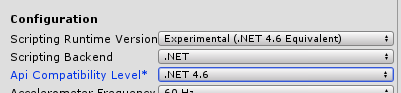

# Missing .NET APIs in Unity and UWP

When building a UWP game using .NET, you may find that some APIs that you might use in the Unity editor or for a standalone PC game are not present for UWP. That's because .NET for UWP apps includes a subset of the types provided in the full .NET Framework for each namespace.

Additionally, some game engines use different flavors of .NET that aren't fully compatible with .NET for UWP, such as Unity's Mono. So when you're writing your game, everything might work fine in the editor, but when you go to build for UWP, you might get errors like this: **The type or namespace 'Formatters' does not exist in the namespace 'System.Runtime.Serialization' (are you missing an assembly reference?)**

Fortunately, Unity provides some of these missing APIs as extension methods and replacement types, which are described in [Universal Windows Platform: Missing .NET Types on .NET Scripting Backend](https://docs.unity3d.com/Manual/windowsstore-missingtypes.html). However, if the functionality you need is not here, [.NET for Windows 8.x apps overview](/previous-versions/windows/apps/br230302(v=vs.140)) discusses ways you can convert your code to use WinRT or .NET for Windows Runtime APIs. (It discusses Windows 8, but is applicable to Windows 10 UWP apps as well.)

## .NET Standard

To understand why some APIs might not be working, it's important to understand the different .NET flavors and how UWP implements .NET. The [.NET Standard](/dotnet/standard/net-standard) is a formal specification of .NET APIs that is meant to be cross-platform, and unify the different .NET flavors. Each implementation of .NET supports a certain version of the .NET Standard. You can see a table of standards and implementations at [.NET implementation support](/dotnet/standard/net-standard#net-implementation-support).

Each version of the UWP SDK conforms to a different level of .NET Standard. For example, the 16299 SDK (the Fall Creators Update) supports .NET Standard 2.0.

If you want to know if a certain .NET API is supported in the UWP version that you're targeting, you can check the [.NET Standard API Reference](/dotnet/api/index?view=netstandard-2.0) and select the version of the .NET Standard that's supported by that version of UWP.

## Scripting backend configuration

The first thing you should do if you're having trouble building for UWP is check the **Player Settings** (**File > Build Settings**, select **Universal Windows Platform**, and then **Player Settings**). Under **Other Settings > Configuration**, the first three dropdowns (**Scripting Runtime Version**, **Scripting Backend**, and **Api Compatibility Level**) are all important settings to consider.

The **Scripting Runtime Version** is what the Unity scripting backend uses which allows you to get the (roughly) equivalent version of .NET Framework support that you choose. However, keep in mind that not all APIs in that version of the .NET Framework will be supported, only those in the version of .NET Standard that your UWP is targeting.

Often with new .NET releases, more APIs are added to .NET Standard which might allow you to use the same code across standalone and UWP. For example, the [System.Runtime.Serialization.Json](/dotnet/api/system.runtime.serialization.json) namespace was introduced in .NET Standard 2.0. If you set the **Scripting Runtime Version** to **.NET 3.5 Equivalent** (which targets an earlier version of the .NET Standard), you will get an error when trying to use the API; switch it to **.NET 4.6 Equivalent** (which supports .NET Standard 2.0), and the API will work.

The **Scripting Backend** can be **.NET** or **IL2CPP**. For this topic, we assume you have chosen **.NET**, since that's where the problems discussed here arise. See [Scripting Backends](https://docs.unity3d.com/Manual/windowsstore-scriptingbackends.html) for more information.

Finally, you should set the **Api Compatibility Level** to the version of .NET that you want your game to run on. This should match the **Scripting Runtime Version**.

In general, for **Scripting Runtime Version** and **Api Compatibility Level**, you should select the latest version available so as to have more compatibility with the .NET Framework, and thus allow you to use more .NET APIs.



## Platform-dependent compilation

If you're building your Unity game for multiple platforms, including UWP, you'll want to use platform-dependent compilation to make sure that code intended for UWP is only run when the game is built as a UWP. This way, you can use the full .NET Framework for standalone desktop and other platforms, and WinRT APIs for UWP, without getting build errors.

Use the following directives to only compile code when running as a UWP app:

```csharp
#if NETFX_CORE
    // Your UWP code here
#else
    // Your standard code here
#endif
```

> [!NOTE]
> `NETFX_CORE` is only meant to check if you're compiling C# code against the .NET scripting backend. If you're using a different scripting backend, such as IL2CPP, use [`ENABLE_WINMD_SUPPORT`](https://docs.unity3d.com/Manual/windowsstore-code-snippets.html) instead.

For the full list of platform-dependent compilation directives, see [Platform dependent compilation](https://docs.unity3d.com/Manual/PlatformDependentCompilation.html).

## Common issues and workarounds

The following scenarios describe common issues that might arise where .NET APIs are missing from the UWP subset, and ways to get around them.

### Data serialization using BinaryFormatter

It is common for games to serialize save data so that players can't easily manipulate it. However, [BinaryFormatter](/dotnet/api/system.runtime.serialization.formatters.binary.binaryformatter), which serializes an object into binary, is not available in earlier versions of the .NET Standard (prior to 2.0). Consider using [XmlSerializer](/dotnet/api/system.xml.serialization.xmlserializer) or [DataContractJsonSerializer](/dotnet/api/system.runtime.serialization.json.datacontractjsonserializer) instead.

```csharp
private void Save()
{
    SaveData data = new SaveData(); // User-defined object to serialize

    DataContractJsonSerializer serializer = 
      new DataContractJsonSerializer(typeof(SaveData));

    FileStream stream = 
      new FileStream(Application.persistentDataPath, FileMode.CreateNew);

    serializer.WriteObject(stream, data);
    stream.Dispose();
}
```

### I/O operations

Some types in the [System.IO](/dotnet/api/system.io) namespace, such as [FileStream](/dotnet/api/system.io.filestream), are not available in earlier versions of the .NET Standard. However, Unity does provide the [Directory](/dotnet/api/system.io.directory), [File](/dotnet/api/system.io.file), and **FileStream** types so you can use them in your game.

Alternatively, you can use the [Windows.Storage](/uwp/api/Windows.Storage) APIs, which are only available to UWP apps. However, these APIs restrict the app to writing to their specific storage, and do not give it free access to the entire file system. See [Files, folders, and libraries](../files/index.md) for more information.

One important note is that the [Close](/dotnet/api/system.io.stream.close) method is only available in .NET Standard 2.0 and later (though Unity provides an extension method). Use [Dispose](/dotnet/api/system.io.stream.dispose) instead.

### Threading

Some types in the [System.Threading](/dotnet/api/system.threading) namespaces, such as [ThreadPool](/dotnet/api/system.threading.threadpool), are not available in earlier versions of the .NET Standard. In these cases, you can use the [Windows.System.Threading](/uwp/api/windows.system.threading) namespace instead.

Here's how you could handle threading in a Unity game, using platform-dependent compilation to prepare for both UWP and non-UWP platforms:

```csharp
private void UsingThreads()
{
#if NETFX_CORE
    Windows.System.Threading.ThreadPool.RunAsync(workItem => SomeMethod());
#else
    System.Threading.ThreadPool.QueueUserWorkItem(workItem => SomeMethod());
#endif
}
```

### Security

Some of the **System.Security.*** namespaces, such as [System.Security.Cryptography.X509Certificates](/dotnet/api/system.security.cryptography.x509certificates?view=netstandard-2.0), are not available when you build a Unity game for UWP. In these cases, use the **Windows.Security.*** APIs, which cover much of the same functionality.

The following example simply gets the certificates from a certificate store with the given name:

```cs
private async void GetCertificatesAsync(string certStoreName)
    {
#if NETFX_CORE
        IReadOnlyList<Certificate> certs = await CertificateStores.FindAllAsync();
        IEnumerable<Certificate> myCerts = 
            certs.Where((certificate) => certificate.StoreName == certStoreName);
#else
        X509Store store = new X509Store(certStoreName, StoreLocation.CurrentUser);
        store.Open(OpenFlags.OpenExistingOnly);
        X509Certificate2Collection certs = store.Certificates;
#endif
    }
```

See [Security](../security/index.md) for more information about using the WinRT security APIs.

### Networking

Some of the **System&period;Net.*** namespaces, such as [System.Net.Mail](/dotnet/api/system.net.mail?view=netstandard-2.0), are also not available when building a Unity game for UWP. For most of these APIs, use the corresponding **Windows.Networking.*** and **Windows.Web.*** WinRT APIs to get similar functionality. See [Networking and web services](../networking/index.md) for more information.

In the case of **System.Net.Mail**, use the [Windows.ApplicationModel.Email](/uwp/api/windows.applicationmodel.email) namespace. See [Send email](../contacts-and-calendar/sending-email.md) for more information.

## See also

* [Universal Windows Platform: Missing .NET Types on .NET Scripting Backend](https://docs.unity3d.com/Manual/windowsstore-missingtypes.html)
* [.NET for UWP apps overview](/previous-versions/windows/apps/br230302(v=vs.140))
* [Unity UWP porting guides](https://unity3d.com/partners/microsoft/porting-guides)