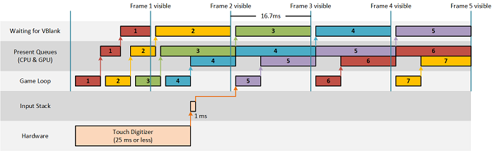
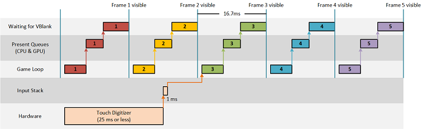

#  Optimize input latency for Universal Windows Platform (UWP) DirectX games


Input latency can significantly impact the experience of a game, and optimizing it can make a game feel more polished. Additionally, proper input event optimization can improve battery life. Learn how to choose the right CoreDispatcher input event processing options to make sure your game handles input as smoothly as possible.

## Input latency


Input latency is the time it takes for the system to respond to user input. The response is often a change in what's displayed on the screen, or what's heard through audio feedback.

Every input event, whether it comes from a touch pointer, mouse pointer, or keyboard, generates a message to be processed by an event handler. Modern touch digitizers and gaming peripherals report input events at a minimum of 100 Hz per pointer, which means that apps can receive 100 events or more per second per pointer (or keystroke). This rate of updates is amplified if multiple pointers are happening concurrently, or a higher precision input device is used (for example, a gaming mouse). The event message queue can fill up very quickly.

It's important to understand the input latency demands of your game so that events are processed in a way that is best for the scenario. There is no one solution for all games.

## Power efficiency


In the context of input latency, "power efficiency" refers to how much a game uses the GPU. A game that uses less GPU resources is more power efficient and allows for longer battery life. This also holds true for the CPU.

If a game can draw the whole screen at less than 60 frames per second (currently, the maximum rendering speed on most displays) without degrading the user's experience, it will be more power efficient by drawing less often. Some games only update the screen in response to user input, so those games should not draw the same content repeatedly at 60 frames per second.

## Choosing what to optimize for


When designing a DirectX app, you need to make some choices. Does the app need to render 60 frames per second to present smooth animation, or does it only need to render in response to input? Does it need to have the lowest possible input latency, or can it tolerate a little bit of delay? Will my users expect my app to be judicious about battery usage?

The answers to these questions will likely align your app with one of the following scenarios:

1.  Render on demand. Games in this category only need to update the screen in response to specific types of input. Power efficiency is excellent because the app doesn’t render identical frames repeatedly, and input latency is low because the app spends most of its time waiting for input. Board games and news readers are examples of apps that might fall into this category.
2.  Render on demand with transient animations. This scenario is similar to the first scenario except that certain types of input will start an animation that isn’t dependent on subsequent input from the user. Power efficiency is good because the game doesn’t render identical frames repeatedly, and input latency is low while the game is not animating. Interactive children’s games and board games that animate each move are examples of apps that might fall into this category.
3.  Render 60 frames per second. In this scenario, the game is constantly updating the screen. Power efficiency is poor because it renders the maximum number of frames the display can present. Input latency is high because DirectX blocks the thread while content is being presented. Doing so prevents the thread from sending more frames to the display than it can show to the user. First person shooters, real-time strategy games, and physics-based games are examples of apps that might fall into this category.
4.  Render 60 frames per second and achieve the lowest possible input latency. Similar to scenario 3, the app is constantly updating the screen, so power efficiency will be poor. The difference is that the game responds to input on a separate thread, so that input processing isn’t blocked by presenting graphics to the display. Online multiplayer games, fighting games, or rhythm/timing games might fall into this category because they support move inputs within extremely tight event windows.

## Implementation


Most DirectX games are driven by what is known as the game loop. The basic algorithm is to perform these steps until the user quits the game or app:

1.  Process input
2.  Update the game state
3.  Draw the game content

When the content of a DirectX game is rendered and ready to be presented to the screen, the game loop waits until the GPU is ready to receive a new frame before waking up to process input again.

We’ll show the implementation of the game loop for each of the scenarios mentioned earlier by iterating on a simple jigsaw puzzle game. The decision points, benefits, and tradeoffs discussed with each implementation can serve as a guide to help you optimize your apps for low latency input and power efficiency.

## Scenario 1: Render on demand


The first iteration of the jigsaw puzzle game only updates the screen when a user moves a puzzle piece. A user can either drag a puzzle piece into place or snap it into place by selecting it and then touching the correct destination. In the second case, the puzzle piece will jump to the destination with no animation or effects.

The code has a single-threaded game loop within the [**IFrameworkView::Run**](/uwp/api/windows.applicationmodel.core.iframeworkview.run) method that uses **CoreProcessEventsOption::ProcessOneAndAllPending**. Using this option dispatches all currently available events in the queue. If no events are pending, the game loop waits until one appears.

``` syntax
void App::Run()
{
    
    while (!m_windowClosed)
    {
        // Wait for system events or input from the user.
        // ProcessOneAndAllPending will block the thread until events appear and are processed.
        CoreWindow::GetForCurrentThread()->Dispatcher->ProcessEvents(CoreProcessEventsOption::ProcessOneAndAllPending);

        // If any of the events processed resulted in a need to redraw the window contents, then we will re-render the
        // scene and present it to the display.
        if (m_updateWindow || m_state->StateChanged())
        {
            m_main->Render();
            m_deviceResources->Present();

            m_updateWindow = false;
            m_state->Validate();
        }
    }
}
```

## Scenario 2: Render on demand with transient animations


In the second iteration, the game is modified so that when a user selects a puzzle piece and then touches the correct destination for that piece, it animates across the screen until it reaches its destination.

As before, the code has a single-threaded game loop that uses **ProcessOneAndAllPending** to dispatch input events in the queue. The difference now is that during an animation, the loop changes to use **CoreProcessEventsOption::ProcessAllIfPresent** so that it doesn’t wait for new input events. If no events are pending, [**ProcessEvents**](/uwp/api/windows.ui.core.coredispatcher.processevents) returns immediately and allows the app to present the next frame in the animation. When the animation is complete, the loop switches back to **ProcessOneAndAllPending** to limit screen updates.

``` syntax
void App::Run()
{

    while (!m_windowClosed)
    {
        // 2. Switch to a continuous rendering loop during the animation.
        if (m_state->Animating())
        {
            // Process any system events or input from the user that is currently queued.
            // ProcessAllIfPresent will not block the thread to wait for events. This is the desired behavior when
            // you are trying to present a smooth animation to the user.
            CoreWindow::GetForCurrentThread()->Dispatcher->ProcessEvents(CoreProcessEventsOption::ProcessAllIfPresent);

            m_state->Update();
            m_main->Render();
            m_deviceResources->Present();
        }
        else
        {
            // Wait for system events or input from the user.
            // ProcessOneAndAllPending will block the thread until events appear and are processed.
            CoreWindow::GetForCurrentThread()->Dispatcher->ProcessEvents(CoreProcessEventsOption::ProcessOneAndAllPending);

            // If any of the events processed resulted in a need to redraw the window contents, then we will re-render the
            // scene and present it to the display.
            if (m_updateWindow || m_state->StateChanged())
            {
                m_main->Render();
                m_deviceResources->Present();

                m_updateWindow = false;
                m_state->Validate();
            }
        }
    }
}
```

To support the transition between **ProcessOneAndAllPending** and **ProcessAllIfPresent**, the app must track state to know if it’s animating. In the jigsaw puzzle app, you do this by adding a new method that can be called during the game loop on the GameState class. The animation branch of the game loop drives updates in the state of the animation by calling GameState’s new Update method.

## Scenario 3: Render 60 frames per second


In the third iteration, the app displays a timer that shows the user how long they’ve been working on the puzzle. Because it displays the elapsed time up to the millisecond, it must render 60 frames per second to keep the display up to date.

As in scenarios 1 and 2, the app has a single-threaded game loop. The difference with this scenario is that because it’s always rendering, it no longer needs to track changes in the game state as was done in the first two scenarios. As a result, it can default to use **ProcessAllIfPresent** for processing events. If no events are pending, **ProcessEvents** returns immediately and proceeds to render the next frame.

``` syntax
void App::Run()
{

    while (!m_windowClosed)
    {
        if (m_windowVisible)
        {
            // 3. Continuously render frames and process system events and input as they appear in the queue.
            // ProcessAllIfPresent will not block the thread to wait for events. This is the desired behavior when
            // trying to present smooth animations to the user.
            CoreWindow::GetForCurrentThread()->Dispatcher->ProcessEvents(CoreProcessEventsOption::ProcessAllIfPresent);

            m_state->Update();
            m_main->Render();
            m_deviceResources->Present();
        }
        else
        {
            // 3. If the window isn't visible, there is no need to continuously render.
            // Process events as they appear until the window becomes visible again.
            CoreWindow::GetForCurrentThread()->Dispatcher->ProcessEvents(CoreProcessEventsOption::ProcessOneAndAllPending);
        }
    }
}
```

This approach is the easiest way to write a game because there’s no need to track additional state to determine when to render. It achieves the fastest rendering possible along with reasonable input responsiveness on a timer interval.

However, this ease of development comes with a price. Rendering at 60 frames per second uses more power than rendering on demand. It’s best to use **ProcessAllIfPresent** when the game is changing what is displayed every frame. It also increases input latency by as much as 16.7 ms because the app is now blocking the game loop on the display’s sync interval instead of on **ProcessEvents**. Some input events might be dropped because the queue is only processed once per frame (60 Hz).

## Scenario 4: Render 60 frames per second and achieve the lowest possible input latency


Some games may be able to ignore or compensate for the increase in input latency seen in scenario 3. However, if low input latency is critical to the game’s experience and sense of player feedback, games that render 60 frames per second need to process input on a separate thread.

The fourth iteration of the jigsaw puzzle game builds on scenario 3 by splitting the input processing and graphics rendering from the game loop into separate threads. Having separate threads for each ensures that input is never delayed by graphics output; however, the code becomes more complex as a result. In scenario 4, the input thread calls [**ProcessEvents**](/uwp/api/windows.ui.core.coredispatcher.processevents) with [**CoreProcessEventsOption::ProcessUntilQuit**](/uwp/api/Windows.UI.Core.CoreProcessEventsOption), which waits for new events and dispatches all available events. It continues this behavior until the window is closed or the game calls [**CoreWindow::Close**](/uwp/api/windows.ui.core.corewindow.close).

``` syntax
void App::Run()
{
    // 4. Start a thread dedicated to rendering and dedicate the UI thread to input processing.
    m_main->StartRenderThread();

    // ProcessUntilQuit will block the thread and process events as they appear until the App terminates.
    CoreWindow::GetForCurrentThread()->Dispatcher->ProcessEvents(CoreProcessEventsOption::ProcessUntilQuit);
}

void JigsawPuzzleMain::StartRenderThread()
{
    // If the render thread is already running, then do not start another one.
    if (IsRendering())
    {
        return;
    }

    // Create a task that will be run on a background thread.
    auto workItemHandler = ref new WorkItemHandler([this](IAsyncAction^ action)
    {
        // Notify the swap chain that this app intends to render each frame faster
        // than the display's vertical refresh rate (typically 60 Hz). Apps that cannot
        // deliver frames this quickly should set this to 2.
        m_deviceResources->SetMaximumFrameLatency(1);

        // Calculate the updated frame and render once per vertical blanking interval.
        while (action->Status == AsyncStatus::Started)
        {
            // Execute any work items that have been queued by the input thread.
            ProcessPendingWork();

            // Take a snapshot of the current game state. This allows the renderers to work with a
            // set of values that won't be changed while the input thread continues to process events.
            m_state->SnapState();

            m_sceneRenderer->Render();
            m_deviceResources->Present();
        }

        // Ensure that all pending work items have been processed before terminating the thread.
        ProcessPendingWork();
    });

    // Run the task on a dedicated high priority background thread.
    m_renderLoopWorker = ThreadPool::RunAsync(workItemHandler, WorkItemPriority::High, WorkItemOptions::TimeSliced);
}
```

The **DirectX 11 and XAML App (Universal Windows)** template in Microsoft Visual Studio 2015 splits the game loop into multiple threads in a similar fashion. It uses the [**Windows::UI::Core::CoreIndependentInputSource**](/uwp/api/Windows.UI.Core.CoreIndependentInputSource) object to start a thread dedicated to handling input and also creates a rendering thread independent of the XAML UI thread. For more details on these templates, read [Create a Universal Windows Platform and DirectX game project from a template](user-interface.md).

## Additional ways to reduce input latency


### Use waitable swap chains

DirectX games respond to user input by updating what the user sees on-screen. On a 60 Hz display, the screen refreshes every 16.7 ms (1 second/60 frames). Figure 1 shows the approximate life cycle and response to an input event relative to the 16.7 ms refresh signal (VBlank) for an app that renders 60 frames per second:

Figure 1



In Windows 8.1, DXGI introduced the **DXGI\_SWAP\_CHAIN\_FLAG\_FRAME\_LATENCY\_WAITABLE\_OBJECT** flag for the swap chain, which allows apps to easily reduce this latency without requiring them to implement heuristics to keep the Present queue empty. Swap chains created with this flag are referred to as waitable swap chains. Figure 2 shows the approximate life cycle and response to an input event when using waitable swap chains:

Figure 2



What we see from these diagrams is that games can potentially reduce input latency by two full frames if they are capable of rendering and presenting each frame within the 16.7 ms budget defined by the display’s refresh rate. The jigsaw puzzle sample uses waitable swap chains and controls the Present queue limit by calling:` m_deviceResources->SetMaximumFrameLatency(1);`

 

 