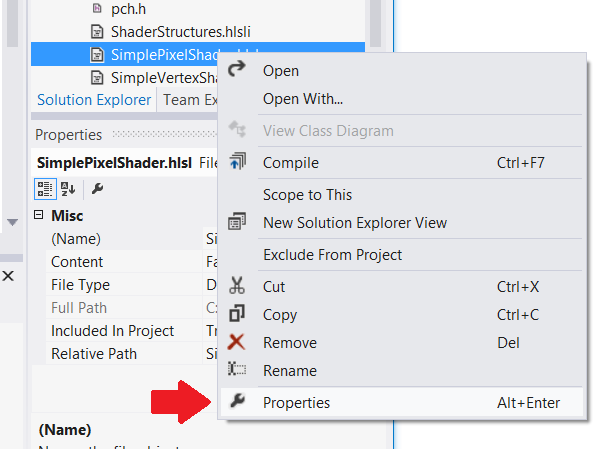

# Convert the rendering framework


**Summary**

-   [Part 1: Initialize Direct3D 11](simple-port-from-direct3d-9-to-11-1-part-1--initializing-direct3d.md)
-   Part 2: Convert the rendering framework
-   [Part 3: Port the game loop](simple-port-from-direct3d-9-to-11-1-part-3--viewport-and-game-loop.md)


Shows how to convert a simple rendering framework from Direct3D 9 to Direct3D 11, including how to port geometry buffers, how to compile and load HLSL shader programs, and how to implement the rendering chain in Direct3D 11. Part 2 of the [Port a simple Direct3D 9 app to DirectX 11 and Universal Windows Platform (UWP)](walkthrough--simple-port-from-direct3d-9-to-11-1.md) walkthrough.

## Convert effects to HLSL shaders


The following example is a simple D3DX technique, written for the legacy Effects API, for hardware vertex transformation and pass-through color data.

Direct3D 9 shader code

```cpp
// Global variables
matrix g_mWorld;        // world matrix for object
matrix g_View;          // view matrix
matrix g_Projection;    // projection matrix

// Shader pipeline structures
struct VS_OUTPUT
{
    float4 Position   : POSITION;   // vertex position
    float4 Color      : COLOR0;     // vertex diffuse color
};

struct PS_OUTPUT
{
    float4 RGBColor : COLOR0;  // Pixel color    
};

// Vertex shader
VS_OUTPUT RenderSceneVS(float3 vPos : POSITION, 
                        float3 vColor : COLOR0)
{
    VS_OUTPUT Output;
    
    float4 pos = float4(vPos, 1.0f);

    // Transform the position from object space to homogeneous projection space
    pos = mul(pos, g_mWorld);
    pos = mul(pos, g_View);
    pos = mul(pos, g_Projection);

    Output.Position = pos;
    
    // Just pass through the color data
    Output.Color = float4(vColor, 1.0f);
    
    return Output;
}

// Pixel shader
PS_OUTPUT RenderScenePS(VS_OUTPUT In) 
{ 
    PS_OUTPUT Output;

    Output.RGBColor = In.Color;

    return Output;
}

// Technique
technique RenderSceneSimple
{
    pass P0
    {          
        VertexShader = compile vs_2_0 RenderSceneVS();
        PixelShader  = compile ps_2_0 RenderScenePS(); 
    }
}
```

In Direct3D 11, we can still use our HLSL shaders. We put each shader in its own HLSL file so that Visual Studio compiles them into separate files and later, we'll load them as separate Direct3D resources. We set the target level to [Shader Model 4 Level 9\_1 (/4\_0\_level\_9\_1)](/windows/desktop/direct3d11/overviews-direct3d-11-devices-downlevel-intro) because these shaders are written for DirectX 9.1 GPUs.

When we defined the input layout, we made sure it represented the same data structure we use to store per-vertex data in system memory and in GPU memory. Similarly, the output of a vertex shader should match the structure used as input to the pixel shader. The rules are not the same as passing data from one function to another in C++; you can omit unused variables at the end of the structure. But the order can't be rearranged and you can't skip content in the middle of the data structure.

> **Note**  
The rules in Direct3D 9 for binding vertex shaders to pixel shaders were more relaxed than the rules in Direct3D 11. The Direct3D 9 arrangement was flexible, but inefficient.

 

It's possible that your HLSL files uses older syntax for shader semantics - for example, COLOR instead of SV\_TARGET. If so you'll need to enable HLSL compatibility mode (/Gec compiler option) or update the shader [semantics](/windows/desktop/direct3dhlsl/dx-graphics-hlsl-semantics) to the current syntax. The vertex shader in this example has been updated with current syntax.

Here's our hardware transformation vertex shader, this time defined in its own file.

> **Note**  Vertex shaders are required to output the SV\_POSITION system value semantic. This semantic resolves the vertex position data to coordinate values where x is between -1 and 1, y is between -1 and 1, z is divided by the original homogeneous coordinate w value (z/w), and w is 1 divided by the original w value (1/w).

 

HLSL vertex shader (feature level 9.1)

```cpp
cbuffer ModelViewProjectionConstantBuffer : register(b0)
{
    matrix mWorld;       // world matrix for object
    matrix View;        // view matrix
    matrix Projection;  // projection matrix
};

struct VS_INPUT
{
    float3 vPos   : POSITION;
    float3 vColor : COLOR0;
};

struct VS_OUTPUT
{
    float4 Position : SV_POSITION; // Vertex shaders must output SV_POSITION
    float4 Color    : COLOR0;
};

VS_OUTPUT main(VS_INPUT input) // main is the default function name
{
    VS_OUTPUT Output;

    float4 pos = float4(input.vPos, 1.0f);

    // Transform the position from object space to homogeneous projection space
    pos = mul(pos, mWorld);
    pos = mul(pos, View);
    pos = mul(pos, Projection);
    Output.Position = pos;

    // Just pass through the color data
    Output.Color = float4(input.vColor, 1.0f);

    return Output;
}
```

This is all we need for our pass-through pixel shader. Even though we call it a pass-through, it's actually getting perspective-correct interpolated color data for each pixel. Note that the SV\_TARGET system value semantic is applied to the color value output by our pixel shader as required by the API.

> **Note**  Shader level 9\_x pixel shaders cannot read from the SV\_POSITION system value semantic. Model 4.0 (and higher) pixel shaders can use SV\_POSITION to retrieve the pixel location on the screen, where x is between 0 and the render target width and y is between 0 and the render target height (each offset by 0.5).

 

Most pixel shaders are much more complex than a pass through; note that higher Direct3D feature levels allow a much greater number of calculations per shader program.

HLSL pixel shader (feature level 9.1)

```cpp
struct PS_INPUT
{
    float4 Position : SV_POSITION;  // interpolated vertex position (system value)
    float4 Color    : COLOR0;       // interpolated diffuse color
};

struct PS_OUTPUT
{
    float4 RGBColor : SV_TARGET;  // pixel color (your PS computes this system value)
};

PS_OUTPUT main(PS_INPUT In)
{
    PS_OUTPUT Output;

    Output.RGBColor = In.Color;

    return Output;
}
```

## Compile and load shaders


Direct3D 9 games often used the Effects library as a convenient way to implement programmable pipelines. Effects could be compiled at run-time using the [**D3DXCreateEffectFromFile function**](/windows/desktop/direct3d9/d3dxcreateeffectfromfile) method.

Loading an effect in Direct3D 9

```cpp
// Turn off preshader optimization to keep calculations on the GPU
DWORD dwShaderFlags = D3DXSHADER_NO_PRESHADER;

// Only enable debug info when compiling for a debug target
#if defined (DEBUG) || defined (_DEBUG)
dwShaderFlags |= D3DXSHADER_DEBUG;
#endif

D3DXCreateEffectFromFile(
    m_pd3dDevice,
    L"CubeShaders.fx",
    NULL,
    NULL,
    dwShaderFlags,
    NULL,
    &m_pEffect,
    NULL
    );
```

Direct3D 11 works with shader programs as binary resources. Shaders are compiled when the project is built and then treated as resources. So our example will load the shader bytecode into system memory, use the Direct3D device interface to create a Direct3D resource for each shader, and point to the Direct3D shader resources when we set up each frame.

Loading a shader resource in Direct3D 11

```cpp
// BasicReaderWriter is a tested file loader used in SDK samples.
BasicReaderWriter^ readerWriter = ref new BasicReaderWriter();


// Load vertex shader:
Platform::Array<byte>^ vertexShaderData =
    readerWriter->ReadData("CubeVertexShader.cso");

// This call allocates a device resource, validates the vertex shader 
// with the device feature level, and stores the vertex shader bits in 
// graphics memory.
m_d3dDevice->CreateVertexShader(
    vertexShaderData->Data,
    vertexShaderData->Length,
    nullptr,
    &m_vertexShader
    );
```

To include the shader bytecode in your compiled app package, just add the HLSL file to the Visual Studio project. Visual Studio will use the [Effect-Compiler Tool](/windows/desktop/direct3dtools/fxc) (FXC) to compile HLSL files into compiled shader objects (.CSO files) and include them in the app package.

> **Note**   Be sure to set the correct target feature level for the HLSL compiler: right-click the HLSL source file in Visual Studio, select Properties, and change the **Shader Model** setting under **HLSL Compiler -&gt; General**. Direct3D checks this property against the hardware capabilities when your app creates the Direct3D shader resource.

 



This is a good place to create the input layout, which corresponds to the vertex stream declaration in Direct3D 9. The per-vertex data structure needs to match what the vertex shader uses; in Direct3D 11 we have more control over the input layout; we can define the array size and bit length of floating-point vectors and specify semantics for the vertex shader. We create a [**D3D11\_INPUT\_ELEMENT\_DESC**](/windows/desktop/api/d3d11/ns-d3d11-d3d11_input_element_desc) structure and use it to inform Direct3D what the per-vertex data will look like. We waited until after we loaded the vertex shader to define the input layout because the API validates the input layout against the vertex shader resource. If the input layout isn't compatible then Direct3D throws an exception.

Per-vertex data has to be stored in compatible types in system memory. DirectXMath data types can help; for example, DXGI\_FORMAT\_R32G32B32\_FLOAT corresponds to [**XMFLOAT3**](/windows/desktop/api/directxmath/ns-directxmath-xmfloat3).

> **Note**   Constant buffers use a fixed input layout that aligns to four floating-point numbers at a time. [**XMFLOAT4**](/windows/desktop/api/directxmath/ns-directxmath-xmfloat4) (and its derivatives) are recommended for constant buffer data.

 

Setting the input layout in Direct3D 11

```cpp
// Create input layout:
const D3D11_INPUT_ELEMENT_DESC vertexDesc[] = 
{
    { "POSITION", 0, DXGI_FORMAT_R32G32B32_FLOAT,
        0, 0,  D3D11_INPUT_PER_VERTEX_DATA, 0 },

    { "COLOR",    0, DXGI_FORMAT_R32G32B32_FLOAT, 
        0, 12, D3D11_INPUT_PER_VERTEX_DATA, 0 },
};
```

## Create geometry resources


In Direct3D 9 we stored geometry resources by creating buffers on the Direct3D device, locking the memory, and copying data from CPU memory to GPU memory.

Direct3D 9

```cpp
// Create vertex buffer:
VOID* pVertices;

// In Direct3D 9 we create the buffer, lock it, and copy the data from 
// system memory to graphics memory.
m_pd3dDevice->CreateVertexBuffer(
    sizeof(CubeVertices),
    0,
    D3DFVF_XYZ | D3DFVF_DIFFUSE,
    D3DPOOL_MANAGED,
    &pVertexBuffer,
    NULL);

pVertexBuffer->Lock(
    0,
    sizeof(CubeVertices),
    &pVertices,
    0);

memcpy(pVertices, CubeVertices, sizeof(CubeVertices));
pVertexBuffer->Unlock();
```

DirectX 11 follows a simpler process. The API automatically copies the data from system memory to the GPU. We can use COM smart pointers to help make programming easier.

DirectX 11

```cpp
D3D11_SUBRESOURCE_DATA vertexBufferData = {0};
vertexBufferData.pSysMem = CubeVertices;
vertexBufferData.SysMemPitch = 0;
vertexBufferData.SysMemSlicePitch = 0;
CD3D11_BUFFER_DESC vertexBufferDesc(
    sizeof(CubeVertices),
    D3D11_BIND_VERTEX_BUFFER);
  
// This call allocates a device resource for the vertex buffer and copies
// in the data.
m_d3dDevice->CreateBuffer(
    &vertexBufferDesc,
    &vertexBufferData,
    &m_vertexBuffer
    );
```

## Implement the rendering chain


Direct3D 9 games often used an effect-based rendering chain. This type of rendering chain sets up the effect object, provides it with the resources it needs, and lets it render each pass.

Direct3D 9 rendering chain

```cpp
// Clear the render target and the z-buffer.
m_pd3dDevice->Clear(
    0, NULL,
    D3DCLEAR_TARGET | D3DCLEAR_ZBUFFER,
    D3DCOLOR_ARGB(0, 45, 50, 170),
    1.0f, 0
    );

// Set the effect technique
m_pEffect->SetTechnique("RenderSceneSimple");

// Rotate the cube 1 degree per frame.
D3DXMATRIX world;
D3DXMatrixRotationY(&world, D3DXToRadian(m_frameCount++));


// Set the matrices up using traditional functions.
m_pEffect->SetMatrix("g_mWorld", &world);
m_pEffect->SetMatrix("g_View", &m_view);
m_pEffect->SetMatrix("g_Projection", &m_projection);

// Render the scene using the Effects library.
if(SUCCEEDED(m_pd3dDevice->BeginScene()))
{
    // Begin rendering effect passes.
    UINT passes = 0;
    m_pEffect->Begin(&passes, 0);
    
    for (UINT i = 0; i < passes; i++)
    {
        m_pEffect->BeginPass(i);
        
        // Send vertex data to the pipeline.
        m_pd3dDevice->SetFVF(D3DFVF_XYZ | D3DFVF_DIFFUSE);
        m_pd3dDevice->SetStreamSource(
            0, pVertexBuffer,
            0, sizeof(VertexPositionColor)
            );
        m_pd3dDevice->SetIndices(pIndexBuffer);
        
        // Draw the cube.
        m_pd3dDevice->DrawIndexedPrimitive(
            D3DPT_TRIANGLELIST,
            0, 0, 8, 0, 12
            );
        m_pEffect->EndPass();
    }
    m_pEffect->End();
    
    // End drawing.
    m_pd3dDevice->EndScene();
}

// Present frame:
// Show the frame on the primary surface.
m_pd3dDevice->Present(NULL, NULL, NULL, NULL);
```

The DirectX 11 rendering chain will still do the same tasks, but the rendering passes need to be implemented differently. Instead of putting the specifics in FX files and letting the rendering techniques be more-or-less opaque to our C++ code, we'll set up all our rendering in C++.

Here's how our rendering chain will look. We need to supply the input layout we created after loading the vertex shader, supply each of the shader objects, and specify the constant buffers for each shader to use. This example doesn't include multiple rendering passes, but if it did we'd do a similar rendering chain for each pass, changing the setup as needed.

Direct3D 11 rendering chain

```cpp
// Clear the back buffer.
const float midnightBlue[] = { 0.098f, 0.098f, 0.439f, 1.000f };
m_d3dContext->ClearRenderTargetView(
    m_renderTargetView.Get(),
    midnightBlue
    );

// Set the render target. This starts the drawing operation.
m_d3dContext->OMSetRenderTargets(
    1,  // number of render target views for this drawing operation.
    m_renderTargetView.GetAddressOf(),
    nullptr
    );


// Rotate the cube 1 degree per frame.
XMStoreFloat4x4(
    &m_constantBufferData.model, 
    XMMatrixTranspose(XMMatrixRotationY(m_frameCount++ * XM_PI / 180.f))
    );

// Copy the updated constant buffer from system memory to video memory.
m_d3dContext->UpdateSubresource(
    m_constantBuffer.Get(),
    0,      // update the 0th subresource
    NULL,   // use the whole destination
    &m_constantBufferData,
    0,      // default pitch
    0       // default pitch
    );


// Send vertex data to the Input Assembler stage.
UINT stride = sizeof(VertexPositionColor);
UINT offset = 0;

m_d3dContext->IASetVertexBuffers(
    0,  // start with the first vertex buffer
    1,  // one vertex buffer
    m_vertexBuffer.GetAddressOf(),
    &stride,
    &offset
    );

m_d3dContext->IASetIndexBuffer(
    m_indexBuffer.Get(),
    DXGI_FORMAT_R16_UINT,
    0   // no offset
    );

m_d3dContext->IASetPrimitiveTopology(D3D11_PRIMITIVE_TOPOLOGY_TRIANGLELIST);
m_d3dContext->IASetInputLayout(m_inputLayout.Get());


// Set the vertex shader.
m_d3dContext->VSSetShader(
    m_vertexShader.Get(),
    nullptr,
    0
    );

// Set the vertex shader constant buffer data.
m_d3dContext->VSSetConstantBuffers(
    0,  // register 0
    1,  // one constant buffer
    m_constantBuffer.GetAddressOf()
    );


// Set the pixel shader.
m_d3dContext->PSSetShader(
    m_pixelShader.Get(),
    nullptr,
    0
    );


// Draw the cube.
m_d3dContext->DrawIndexed(
    m_indexCount,
    0,  // start with index 0
    0   // start with vertex 0
    );
```

The swap chain is part of graphics infrastructure, so we use our DXGI swap chain to present the completed frame. DXGI blocks the call until the next vsync; then it returns, and our game loop can continue to the next iteration.

Presenting a frame to the screen using DirectX 11

```cpp
m_swapChain->Present(1, 0);
```

The rendering chain we just created will be called from a game loop implemented in the [**IFrameworkView::Run**](/uwp/api/windows.applicationmodel.core.iframeworkview.run) method. This is shown in [Part 3: Viewport and game loop](simple-port-from-direct3d-9-to-11-1-part-3--viewport-and-game-loop.md).

 

 