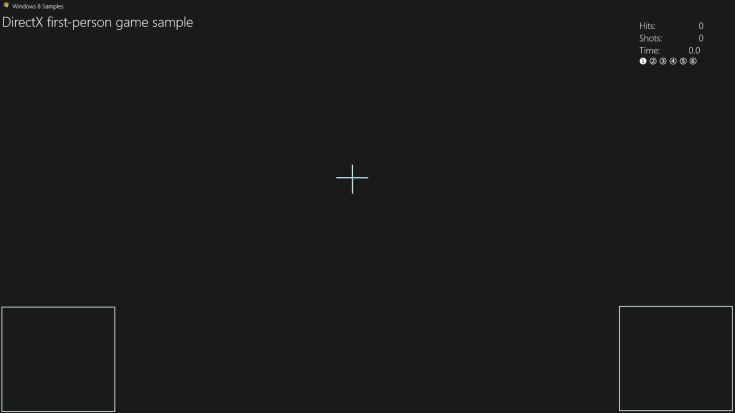
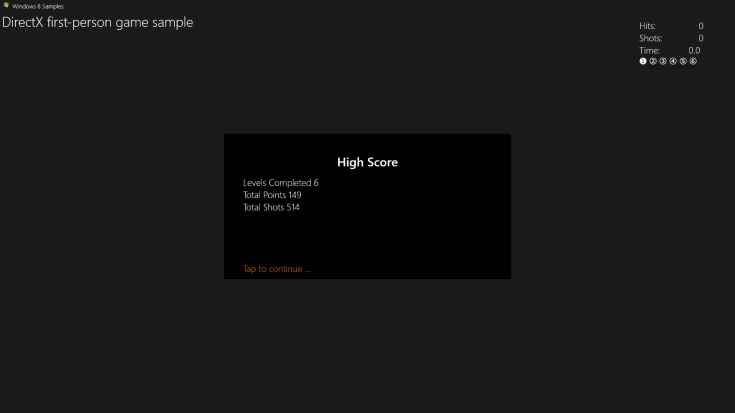
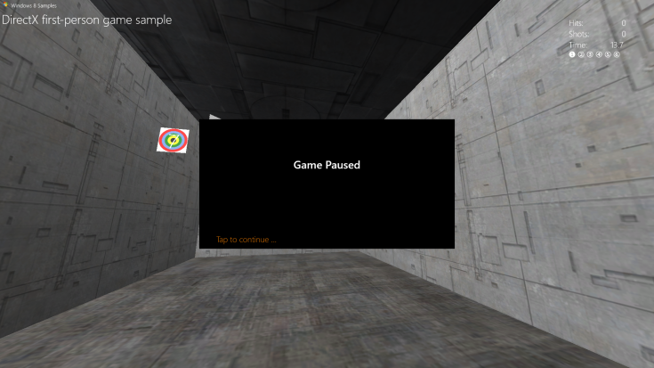
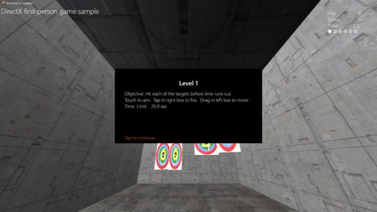
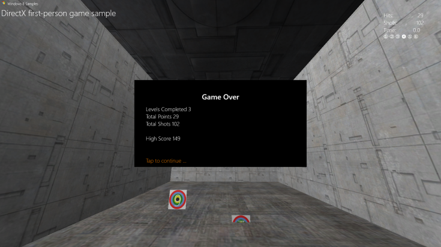

# Add a user interface


\[ Updated for UWP apps on Windows 10. For Windows 8.x articles, see the [archive](http://go.microsoft.com/fwlink/p/?linkid=619132) \]

You've seen how the sample game implements the main game object as well as the basic rendering framework. Now, let's look at how the sample game provides feedback about game state to the player. Here, you learn how you can add simple menu options and heads-up display components on top of the 3-D graphics pipeline output.

## Objective


-   To add basic user interface graphics and behaviors to a Universal Windows Platform (UWP) DirectX game.

## The user interface overlay


While there are many ways to display text and user interface elements in a DirectX game, we are going to focus on one, [Direct2D](https://msdn.microsoft.com/library/windows/apps/dd370990.aspx) (with [DirectWrite](https://msdn.microsoft.com/library/windows/desktop/dd368038) for the text elements).

First, let's be clear about what Direct2D is not. It's not specifically designed for user interfaces or layouts, like HTML or XAML. It doesn't provide user interface components, like list boxes or buttons; and it doesn't provide layout components like divs, tables, or grids.

Direct2D is a set of 2-D drawing APIs used to draw pixel-based primitives and effects. When starting out with Direct2D, keep it simple. Complex layouts and interface behaviors need time and planning. If your game requires a complex user interface to play, like those found in simulation and strategy games, consider XAML instead.

(For info about developing a user interface with XAML in a UWP DirectX game, see [Extending the game sample](tutorial-resources.md).)

In this game sample, we have two major UI components: the heads-up display for the score and in-game controls; and an overlay used to display game state text and options (such as pause info and level start options).

### Using Direct2D for a heads-up display

This is the in-game heads-up display for the game sample without the game visuals. It's simple and uncluttered, allowing the player to focus on navigating the 3-D world and shooting the targets. A good interface or heads-up display must never obfuscate the ability of the player to process and react to the events in the game.



As you can see, the overlay consists of basic primitives: two intersecting line segments for the cross hairs, and two rectangles for the [move-look controller](tutorial--adding-controls.md). In the upper-right corner, DirectWrite text informs the player of the current number of successful hits, the number of shots the player has made, the time remaining in the level, and the current level number. The in-game heads-up display state of the overlay is drawn in the **Render** method of the **GameHud** class, and is coded like this:

```cpp
void GameHud::Render(
    _In_ Simple3DGame^ game,
    _In_ ID2D1DeviceContext* d2dContext,
    _In_ Windows::Foundation::Rect windowBounds
    )
{
    if (m_showTitle)
    {
        d2dContext->DrawBitmap(
            m_logoBitmap.Get(),
            D2D1::RectF(
                GameConstants::Margin,
                GameConstants::Margin,
                m_logoSize.width + GameConstants::Margin,
                m_logoSize.height + GameConstants::Margin
                )
            );
        d2dContext->DrawTextLayout(
            Point2F(m_logoSize.width + 2.0f * GameConstants::Margin, GameConstants::Margin),
            m_titleHeaderLayout.Get(),
            m_textBrush.Get()
            );
        d2dContext->DrawTextLayout(
            Point2F(GameConstants::Margin, m_titleBodyVerticalOffset),
            m_titleBodyLayout.Get(),
            m_textBrush.Get()
            );
    }

    if (game != nullptr)
    {
        // This section is only used after the game state has been initialized.
        static const int bufferLength = 256;
        static char16 wsbuffer[bufferLength];
        int length = swprintf_s(
            wsbuffer,
            bufferLength,
            L"Hits:\t%10d\nShots:\t%10d\nTime:\t%8.1f",
            game->TotalHits(),
            game->TotalShots(),
            game->TimeRemaining()
            );

        d2dContext->DrawText(
            wsbuffer,
            length,
            m_textFormatBody.Get(),
            D2D1::RectF(
                windowBounds.Width - GameConstants::HudRightOffset,
                GameConstants::HudTopOffset,
                windowBounds.Width,
                GameConstants::HudTopOffset + (GameConstants::HudBodyPointSize + GameConstants::Margin) * 3
                ),
            m_textBrush.Get()
            );

        // Using the unicode characters starting at 0x2780 ( ➀ ) for the consecutive levels of the game.
        // For completed levels, start with 0x278A ( ➊ ) (This is 0x2780 + 10).
        uint32 levelCharacter[6];
        for (uint32 i = 0; i < 6; i++)
        {
            levelCharacter[i] = 0x2780 + i + ((static_cast<uint32>(game->LevelCompleted()) == i) ? 10 : 0);
        }
        length = swprintf_s(
            wsbuffer,
            bufferLength,
            L"%lc %lc %lc %lc %lc %lc",
            levelCharacter[0],
            levelCharacter[1],
            levelCharacter[2],
            levelCharacter[3],
            levelCharacter[4],
            levelCharacter[5]
            );
        d2dContext->DrawText(
            wsbuffer,
            length,
            m_textFormatBodySymbol.Get(),
            D2D1::RectF(
                windowBounds.Width - GameConstants::HudRightOffset,
                GameConstants::HudTopOffset + (GameConstants::HudBodyPointSize + GameConstants::Margin) * 3 + GameConstants::Margin,
                windowBounds.Width,
                GameConstants::HudTopOffset + (GameConstants::HudBodyPointSize+ GameConstants::Margin) * 4
                ),
            m_textBrush.Get()
            );

        if (game->IsActivePlay())
        {
            // Draw a rectangle for the touch input for the move control.
            d2dContext->DrawRectangle(
                D2D1::RectF(
                    0.0f,
                    windowBounds.Height - GameConstants::TouchRectangleSize,
                    GameConstants::TouchRectangleSize,
                    windowBounds.Height
                    ),
                m_textBrush.Get()
                );
            // Draw a rectangle for the touch input for the fire control.
            d2dContext->DrawRectangle(
                D2D1::RectF(
                    windowBounds.Width - GameConstants::TouchRectangleSize,
                    windowBounds.Height - GameConstants::TouchRectangleSize,
                    windowBounds.Width,
                    windowBounds.Height
                    ),
                m_textBrush.Get()
                );

            // Draw the cross hairs.
            d2dContext->DrawLine(
                D2D1::Point2F(windowBounds.Width / 2.0f - GameConstants::CrossHairHalfSize, windowBounds.Height / 2.0f),
                D2D1::Point2F(windowBounds.Width / 2.0f + GameConstants::CrossHairHalfSize, windowBounds.Height / 2.0f),
                m_textBrush.Get(),
                3.0f
                );
            d2dContext->DrawLine(
                D2D1::Point2F(windowBounds.Width / 2.0f, windowBounds.Height / 2.0f - GameConstants::CrossHairHalfSize),
                D2D1::Point2F(windowBounds.Width / 2.0f, windowBounds.Height / 2.0f + GameConstants::CrossHairHalfSize),
                m_textBrush.Get(),
                3.0f
                );
        }
    }
}
```

In this code, the Direct2D render target established for the overlay is updated to reflect the changes in the number of hits, the time remaining, and the level number. The rectangles are drawn with calls to [**DrawRect**](https://msdn.microsoft.com/library/windows/desktop/dd371902), and the cross hairs are drawn with a pair of calls to [**DrawLine**](https://msdn.microsoft.com/library/windows/desktop/dd371895).

> **Note**   You probably noticed the call to **GameHud::Render** takes a [**Windows::Foundation::Rect**](https://msdn.microsoft.com/library/windows/apps/br225994) parameter, which contains the size of the main window rectangle. This demonstrates an essential part of UI programming: obtaining the size of window in a measurement called DIPs (device independent pixels), where a DIP is defined as 1/96 of an inch. Direct2D scales the drawing units to actual pixels when the drawing occurs, and it does so by using the Windows dots per inch (DPI) setting. Similarly, when you draw text using DirectWrite, you specify DIPs rather than points for the size of the font. DIPs are expressed as floating point numbers.

 

### Displaying game state information with an overlay

Besides the heads-up display, the game sample has an overlay that represents five game states, and all of which feature a large black rectangle primitive with text for the player to read. (Be aware that the move-look controller rectangles are not drawn, because they are not active in these states.) These overlay states are:

-   The game start overlay. We show this when the player starts the game. It contains the high score across game sessions.

    

-   The pause state.

    

-   The level start state. We show this when the player starts a new level.

    

-   The game over state. We show this when the player fails a level.

    

-   The game stat display state. We show this when the player wins. It contains the final score the player has achieved.

    

Let's look at how we initialize and draw the overlay for these five states.

### Initializing and drawing the overlay

The five explicit states have some things in common: one, they all use a black rectangle in the center of the screen as their background; two, the displayed text is either title text or body text; and three, the text uses the Segoe UI font and is drawn on top of the back rectangle. As a result, the resources they need and the methods that implement them are very similar.

The game sample has four methods( **GameInfoOverlay::Initialize**, **GameInfoOverlay::SetDpi**, **GameInfoOverlay::RecreateDirectXResources**, and **GameInfoOverlay::RecreateDpiDependentResources**) that it uses to initialize, set the dots per inch, recreate the DirectWrite resources (the text elements), and construct this overlay for display, respectively. This is the code for these four methods:

```cpp
void GameInfoOverlay::Initialize(
    _In_ ID2D1Device*         d2dDevice,
    _In_ ID2D1DeviceContext*  d2dContext,
    _In_ IDWriteFactory*      dwriteFactory,
    _In_ float                dpi)
{
    m_initialized = true;

    m_dwriteFactory = dwriteFactory;
    m_dpi = dpi;
    m_d2dDevice = d2dDevice;
    m_d2dContext = d2dContext;

    ComPtr<ID2D1Factory> factory;
    d2dDevice->GetFactory(&factory);

    DX::ThrowIfFailed(
        factory.As(&m_d2dFactory)
        );

    RecreateDirectXResources();
}
```

```cpp
void GameInfoOverlay::SetDpi(float dpi)
{
    if (m_initialized)
    {
        if (dpi != m_dpi)
        {
            m_dpi = dpi;
            RecreateDpiDependentResources();
        }
    }
}
```

```cpp
void GameInfoOverlay::RecreateDirectXResources()
{
    if (!m_initialized)
    {
        return;
    }

    // Create D2D Resources.
    DX::ThrowIfFailed(
        m_dwriteFactory->CreateTextFormat(
            L"Segoe UI",
            nullptr,
            DWRITE_FONT_WEIGHT_MEDIUM,
            DWRITE_FONT_STYLE_NORMAL,
            DWRITE_FONT_STRETCH_NORMAL,
            32,         // font size
            L"en-us",   // locale
            &m_textFormatTitle
            )
        );

    DX::ThrowIfFailed(
        m_dwriteFactory->CreateTextFormat(
            L"Segoe UI",
            nullptr,
            DWRITE_FONT_WEIGHT_LIGHT,
            DWRITE_FONT_STYLE_NORMAL,
            DWRITE_FONT_STRETCH_NORMAL,
            24,         // font size
            L"en-us",   // locale
            &m_textFormatBody
            )
        );

    DX::ThrowIfFailed(
        m_textFormatTitle->SetTextAlignment(DWRITE_TEXT_ALIGNMENT_CENTER)
        );
    DX::ThrowIfFailed(
        m_textFormatTitle->SetParagraphAlignment(DWRITE_PARAGRAPH_ALIGNMENT_NEAR)
        );
    DX::ThrowIfFailed(
        m_textFormatBody->SetTextAlignment(DWRITE_TEXT_ALIGNMENT_LEADING)
        );
    DX::ThrowIfFailed(
        m_textFormatBody->SetParagraphAlignment(DWRITE_PARAGRAPH_ALIGNMENT_NEAR)
        );

    DX::ThrowIfFailed(
        m_d2dContext->CreateSolidColorBrush(
            D2D1::ColorF(D2D1::ColorF::White),
            &m_textBrush
            )
        );
    DX::ThrowIfFailed(
        m_d2dContext->CreateSolidColorBrush(
            D2D1::ColorF(D2D1::ColorF::Black),
            &m_backgroundBrush
            )
        );
     DX::ThrowIfFailed(
        m_d2dContext->CreateSolidColorBrush(
            D2D1::ColorF(0xdb7100, 1.0f),
            &m_actionBrush
            )
        );

     RecreateDpiDependentResources();
}
```

```cpp
void GameInfoOverlay::RecreateDpiDependentResources()
{
    m_levelBitmap = nullptr;

    // Create a D2D bitmap to be used for Game Info Overlay when waiting to
    // start a level or to display game statistics.
    D2D1_BITMAP_PROPERTIES1 properties;
    properties.pixelFormat.format = DXGI_FORMAT_B8G8R8A8_UNORM;
    properties.pixelFormat.alphaMode = D2D1_ALPHA_MODE_PREMULTIPLIED;
    properties.dpiX = m_dpi;
    properties.dpiY = m_dpi;
    properties.bitmapOptions = D2D1_BITMAP_OPTIONS_TARGET;
    properties.colorContext = nullptr;
    DX::ThrowIfFailed(
        m_d2dContext->CreateBitmap(
            D2D1::SizeU(
                static_cast<UINT32>(GameInfoOverlayConstant::Width * m_dpi / 96.0f),
                static_cast<UINT32>(GameInfoOverlayConstant::Height * m_dpi / 96.0f)
                ),
            nullptr,
            0,
            &properties,
            &m_levelBitmap
            )
        );
    m_d2dContext->SetTarget(m_levelBitmap.Get());
    m_d2dContext->BeginDraw();
    m_d2dContext->SetTransform(D2D1::Matrix3x2F::Identity());
    m_d2dContext->Clear(D2D1::ColorF(D2D1::ColorF::Black));
    HRESULT hr = m_d2dContext->EndDraw();
    if (hr != D2DERR_RECREATE_TARGET)
    {
        // The D2DERR_RECREATE_TARGET indicates there has been a problem with the underlying
        // D3D device.  All subsequent rendering will be ignored until the device is recreated.
        // This error will be propagated and the appropriate D3D error will be returned from the
        // swapchain->Present(...) call.   At that point, the sample will recreate the device
        // and all associated resources.  As a result, the D2DERR_RECREATE_TARGET doesn't
        // need to be handled here.
        DX::ThrowIfFailed(hr);
    }
}

```

The **Initialize** method obtains a factory from the [**ID2D1Device**](https://msdn.microsoft.com/library/windows/desktop/hh404478) object passed to it, which it uses to create an [**ID2D1DeviceContext**](https://msdn.microsoft.com/library/windows/desktop/hh404479) that the overlay object itself can draw into, and sets the **m\_dWriteFactory** field to the provided [**IDWriteFactory**](https://msdn.microsoft.com/library/windows/desktop/dd368183) reference. It also sets the DPI for the context. Then, it calls **RecreateDeviceResources** to assemble and draw the overlay.

**RecreateDeviceResources** uses the DirectWrite factory object to create formatters (brushes) for the title and body text strings that will be displayed on the overlay. It creates a white brush to draw the text, a black brush to draw the background, and an orange brush to draw action messages. Then, it calls **RecreateDpiDependentResources** to prepare a bitmap to draw the text on by calling [**ID2D1DeviceContext::CreateBitmap**](https://msdn.microsoft.com/library/windows/desktop/hh404480). Lastly, **RecreateDpiDependentResources** sets the render target for the Direct2D device context to the bitmap and clears it, which then sets each pixel in the bitmap to the color black.

Now, all the overlay needs is some text to display!

### Representing game state in the overlay

Each of the five overlay states in the game sample has a corresponding method on the **GameInfoOverlay** object. These methods draw a variation of the overlay to communicate explicit info to the player about the game itself. This communication is, of course, represented as two strings: a title string, and a body string. Because the sample already configured the resources and layout for this info in the **RecreateDeviceResources** method, it only needs to provide the overlay state-specific strings.

Now, in the definition of the **GameInfoOverlay** class, the sample declared three rectangular areas that correspond to specific regions of the overlay, as shown here:

```cpp
static const D2D1_RECT_F titleRectangle = D2D1::RectF(50.0f, 50.0f, GameInfoOverlayConstant::Width - 50.0f, 100.0f);
static const D2D1_RECT_F bodyRectangle = D2D1::RectF(50.0f, 110.0f, GameInfoOverlayConstant::Width - 50.0f, GameInfoOverlayConstant::Height - 50.0f);
static const D2D1_RECT_F actionRectangle = D2D1::RectF(50.0f, GameInfoOverlayConstant::Height - 45.0f, GameInfoOverlayConstant::Width - 50.0f, GameInfoOverlayConstant::Height - 5.0f);
```

These areas each have a specific purpose:

-   **titleRectangle** is where the title text is drawn.
-   **bodyRectangle** is where the body text is drawn.
-   **actionRectangle** is where the text that informs the player to take a specific action is drawn. (It's in the bottom left of the overlay bitmap.)

With these areas in mind, let's look at one of the state-specific methods, **GameInfoOverlay::SetGameStats**, and see how the overlay is drawn.

```cpp
void GameInfoOverlay::SetGameStats(int maxLevel, int hitCount, int shotCount)
{
    int length;
    Platform::String^ string;

    m_d2dContext->SetTarget(m_levelBitmap.Get());
    m_d2dContext->BeginDraw();
    m_d2dContext->SetTransform(D2D1::Matrix3x2F::Identity());
    m_d2dContext->FillRectangle(&titleRectangle, m_backgroundBrush.Get());
    m_d2dContext->FillRectangle(&bodyRectangle, m_backgroundBrush.Get());
    string = "High Score";

    m_d2dContext->DrawText(
        string->Data(),
        string->Length(),
        m_textFormatTitle.Get(),
        titleRectangle,
        m_textBrush.Get()
        );
    length = swprintf_s(
        wsbuffer,
        bufferLength,
        L"Levels Completed %d\nTotal Points %d\nTotal Shots %d",
        maxLevel,
        hitCount,
        shotCount
        );
    string = ref new Platform::String(wsbuffer, length);
    m_d2dContext->DrawText(
        string->Data(),
        string->Length(),
        m_textFormatBody.Get(),
        bodyRectangle,
        m_textBrush.Get()
        );
    HRESULT hr = m_d2dContext->EndDraw();
    if (hr != D2DERR_RECREATE_TARGET)
    {
        // The D2DERR_RECREATE_TARGET indicates there has been a problem with the underlying
        // D3D device.  All subsequent rendering will be ignored until the device is recreated.
        // This error will be propagated and the appropriate D3D error will be returned from the
        // swapchain->Present(...) call.   At that point, the sample will recreate the device
        // and all associated resources.  As a result, the D2DERR_RECREATE_TARGET doesn't
        // need to be handled here.
        DX::ThrowIfFailed(hr);
    }
}
```

Using the Direct2D device context that the **GameInfoOverlay** object initialized and configured using **Initialize** and **RecreateDirectXResources**, this method fills the title and body rectangles with black using the background brush. It draws the text for the "High Score" string to the title rectangle and a string containing the updates game state information to the body rectangle using the white text brush.

The action rectangle is updated by a subsequent call to **GameInfoOverlay::SetAction** from a method on the **DirectXApp** object, which provides the game state info needed by **SetAction** to determine the right message to the player (such as "Tap to continue").

The overlay for any given state is chosen in the **SetGameInfoOverlay** method on **DirectXApp**, like this:

```cpp
void DirectXApp::SetGameInfoOverlay(GameInfoOverlayState state)
{
    m_gameInfoOverlayState = state;
    switch (state)
    {
    case GameInfoOverlayState::Loading:
        m_renderer->InfoOverlay()->SetGameLoading(m_loadingCount);
        break;

    case GameInfoOverlayState::GameStats:
        m_renderer->InfoOverlay()->SetGameStats(
            m_game->HighScore().levelCompleted + 1,
            m_game->HighScore().totalHits,
            m_game->HighScore().totalShots
            );
        break;

    case GameInfoOverlayState::LevelStart:
        m_renderer->InfoOverlay()->SetLevelStart(
            m_game->LevelCompleted() + 1,
            m_game->CurrentLevel()->Objective(),
            m_game->CurrentLevel()->TimeLimit(),
            m_game->BonusTime()
            );
        break;

    case GameInfoOverlayState::GameOverCompleted:
        m_renderer->InfoOverlay()->SetGameOver(
            true,
            m_game->LevelCompleted() + 1,
            m_game->TotalHits(),
            m_game->TotalShots(),
            m_game->HighScore().totalHits
            );
        break;

    case GameInfoOverlayState::GameOverExpired:
        m_renderer->InfoOverlay()->SetGameOver(
            false,
            m_game->LevelCompleted(),
            m_game->TotalHits(),
            m_game->TotalShots(),
            m_game->HighScore().totalHits
            );
        break;

    case GameInfoOverlayState::Pause:
        m_renderer->InfoOverlay()->SetPause();
        break;
    }
}
```

And now the game sample has a way to communicate text info to the player based on game state.

### Next steps

In the next topic, [Adding controls](tutorial--adding-controls.md), we look at how the player interacts with the game sample, and how input changes game state.

### Complete sample code for this section

GameHud.h

```cpp
//// THIS CODE AND INFORMATION IS PROVIDED "AS IS" WITHOUT WARRANTY OF
//// ANY KIND, EITHER EXPRESSED OR IMPLIED, INCLUDING BUT NOT LIMITED TO
//// THE IMPLIED WARRANTIES OF MERCHANTABILITY AND/OR FITNESS FOR A
//// PARTICULAR PURPOSE.
////
//// Copyright (c) Microsoft Corporation. All rights reserved

#pragma once

#include "Simple3DGame.h"
#include "DirectXSample.h"

ref class Simple3DGame;

ref class GameHud
{
internal:
    GameHud(
        _In_ Platform::String^ titleHeader,
        _In_ Platform::String^ titleBody
        );

    void CreateDeviceIndependentResources(
        _In_ IDWriteFactory* dwriteFactory,
        _In_ IWICImagingFactory* wicFactory
        );

    void CreateDeviceResources(_In_ ID2D1DeviceContext* d2dContext);
    void UpdateForWindowSizeChange(_In_ Windows::Foundation::Rect windowBounds);
    void Render(
        _In_ Simple3DGame^ game,
        _In_ ID2D1DeviceContext* d2dContext,
        _In_ Windows::Foundation::Rect windowBounds
        );

private:
    Microsoft::WRL::ComPtr<IDWriteFactory>              m_dwriteFactory;
    Microsoft::WRL::ComPtr<IWICImagingFactory>          m_wicFactory;

    Microsoft::WRL::ComPtr<ID2D1SolidColorBrush>        m_textBrush;
    Microsoft::WRL::ComPtr<IDWriteTextFormat>           m_textFormatBody;
    Microsoft::WRL::ComPtr<IDWriteTextFormat>           m_textFormatBodySymbol;

    Microsoft::WRL::ComPtr<IDWriteTextFormat>           m_textFormatTitleHeader;
    Microsoft::WRL::ComPtr<IDWriteTextFormat>           m_textFormatTitleBody;
    Microsoft::WRL::ComPtr<ID2D1Bitmap>                 m_logoBitmap;
    Microsoft::WRL::ComPtr<IDWriteTextLayout>           m_titleHeaderLayout;
    Microsoft::WRL::ComPtr<IDWriteTextLayout>           m_titleBodyLayout;

    bool                                                m_showTitle;
    Platform::String^                                   m_titleHeader;
    Platform::String^                                   m_titleBody;

    float                                               m_titleBodyVerticalOffset;
    D2D1_SIZE_F                                         m_logoSize;
    D2D1_SIZE_F                                         m_maxTitleSize;
};
```

GameHud.cpp

```cpp
//// THIS CODE AND INFORMATION IS PROVIDED "AS IS" WITHOUT WARRANTY OF
//// ANY KIND, EITHER EXPRESSED OR IMPLIED, INCLUDING BUT NOT LIMITED TO
//// THE IMPLIED WARRANTIES OF MERCHANTABILITY AND/OR FITNESS FOR A
//// PARTICULAR PURPOSE.
////
//// Copyright (c) Microsoft Corporation. All rights reserved

#include "pch.h"
#include "GameHud.h"
#include "GameConstants.h"

using namespace Microsoft::WRL;
using namespace Windows::UI::Core;
using namespace Windows::ApplicationModel;
using namespace Windows::Foundation;
using namespace Windows::Storage;
using namespace Windows::UI::ViewManagement;
using namespace Windows::Graphics::Display;
using namespace D2D1;

//----------------------------------------------------------------------

GameHud::GameHud(
    _In_ Platform::String^ titleHeader,
    _In_ Platform::String^ titleBody
    )
{
    m_titleHeader = titleHeader;
    m_titleBody = titleBody;

    m_showTitle = true;
    m_titleBodyVerticalOffset = GameConstants::Margin;
    m_logoSize = D2D1::SizeF(0.0f, 0.0f);
}

//----------------------------------------------------------------------

void GameHud::CreateDeviceIndependentResources(
    _In_ IDWriteFactory* dwriteFactory,
    _In_ IWICImagingFactory* wicFactory
    )
{
    m_dwriteFactory = dwriteFactory;
    m_wicFactory = wicFactory;

    DX::ThrowIfFailed(
        m_dwriteFactory->CreateTextFormat(
            L"Segoe UI",
            nullptr,
            DWRITE_FONT_WEIGHT_LIGHT,
            DWRITE_FONT_STYLE_NORMAL,
            DWRITE_FONT_STRETCH_NORMAL,
            GameConstants::HudBodyPointSize,
            L"en-us",
            &m_textFormatBody
            )
        );
    DX::ThrowIfFailed(
        m_dwriteFactory->CreateTextFormat(
            L"Segoe UI Symbol",
            nullptr,
            DWRITE_FONT_WEIGHT_LIGHT,
            DWRITE_FONT_STYLE_NORMAL,
            DWRITE_FONT_STRETCH_NORMAL,
            GameConstants::HudBodyPointSize,
            L"en-us",
            &m_textFormatBodySymbol
            )
        );
    DX::ThrowIfFailed(
        m_dwriteFactory->CreateTextFormat(
            L"Segoe UI Light",
            nullptr,
            DWRITE_FONT_WEIGHT_LIGHT,
            DWRITE_FONT_STYLE_NORMAL,
            DWRITE_FONT_STRETCH_NORMAL,
            GameConstants::HudTitleHeaderPointSize,
            L"en-us",
            &m_textFormatTitleHeader
            )
        );
    DX::ThrowIfFailed(
        m_dwriteFactory->CreateTextFormat(
            L"Segoe UI Light",
            nullptr,
            DWRITE_FONT_WEIGHT_LIGHT,
            DWRITE_FONT_STYLE_NORMAL,
            DWRITE_FONT_STRETCH_NORMAL,
            GameConstants::HudTitleBodyPointSize,
            L"en-us",
            &m_textFormatTitleBody
            )
        );

    DX::ThrowIfFailed(m_textFormatBody->SetTextAlignment(DWRITE_TEXT_ALIGNMENT_LEADING));
    DX::ThrowIfFailed(m_textFormatBody->SetParagraphAlignment(DWRITE_PARAGRAPH_ALIGNMENT_NEAR));
    DX::ThrowIfFailed(m_textFormatBodySymbol->SetTextAlignment(DWRITE_TEXT_ALIGNMENT_LEADING));
    DX::ThrowIfFailed(m_textFormatBodySymbol->SetParagraphAlignment(DWRITE_PARAGRAPH_ALIGNMENT_NEAR));
    DX::ThrowIfFailed(m_textFormatTitleHeader->SetTextAlignment(DWRITE_TEXT_ALIGNMENT_LEADING));
    DX::ThrowIfFailed(m_textFormatTitleHeader->SetParagraphAlignment(DWRITE_PARAGRAPH_ALIGNMENT_NEAR));
    DX::ThrowIfFailed(m_textFormatTitleBody->SetTextAlignment(DWRITE_TEXT_ALIGNMENT_LEADING));
    DX::ThrowIfFailed(m_textFormatTitleBody->SetParagraphAlignment(DWRITE_PARAGRAPH_ALIGNMENT_NEAR));
}

//----------------------------------------------------------------------

void GameHud::CreateDeviceResources(_In_ ID2D1DeviceContext* d2dContext)
{
    auto location = Package::Current->InstalledLocation;
    Platform::String^ path = Platform::String::Concat(location->Path, "\\");
    path = Platform::String::Concat(path, "windows-sdk.png");

    ComPtr<IWICBitmapDecoder> wicBitmapDecoder;
    DX::ThrowIfFailed(
        m_wicFactory->CreateDecoderFromFilename(
            path->Data(),
            nullptr,
            GENERIC_READ,
            WICDecodeMetadataCacheOnDemand,
            &wicBitmapDecoder
            )
        );

    ComPtr<IWICBitmapFrameDecode> wicBitmapFrame;
    DX::ThrowIfFailed(
        wicBitmapDecoder->GetFrame(0, &wicBitmapFrame)
        );

    ComPtr<IWICFormatConverter> wicFormatConverter;
    DX::ThrowIfFailed(
        m_wicFactory->CreateFormatConverter(&wicFormatConverter)
        );

    DX::ThrowIfFailed(
        wicFormatConverter->Initialize(
            wicBitmapFrame.Get(),
            GUID_WICPixelFormat32bppPBGRA,
            WICBitmapDitherTypeNone,
            nullptr,
            0.0,
            WICBitmapPaletteTypeCustom  // The BGRA format has no palette, so this value is ignored.
            )
        );

    double dpiX = 96.0f;
    double dpiY = 96.0f;
    DX::ThrowIfFailed(
        wicFormatConverter->GetResolution(&dpiX, &dpiY)
        );

    // Create D2D Resources.
    DX::ThrowIfFailed(
        d2dContext->CreateBitmapFromWicBitmap(
            wicFormatConverter.Get(),
            BitmapProperties(
                PixelFormat(DXGI_FORMAT_B8G8R8A8_UNORM, D2D1_ALPHA_MODE_PREMULTIPLIED),
                static_cast<float>(dpiX),
                static_cast<float>(dpiY)
                ),
            &m_logoBitmap
            )
        );

    m_logoSize = m_logoBitmap->GetSize();

    DX::ThrowIfFailed(
        d2dContext->CreateSolidColorBrush(
            D2D1::ColorF(D2D1::ColorF::White),
            &m_textBrush
            )
        );
}

//----------------------------------------------------------------------

void GameHud::UpdateForWindowSizeChange(_In_ Windows::Foundation::Rect windowBounds)
{
    m_maxTitleSize.width = windowBounds.Width - GameConstants::HudSafeWidth;
    m_maxTitleSize.height = windowBounds.Height;

    float headerWidth = m_maxTitleSize.width - (m_logoSize.width + 2 * GameConstants::Margin);

    if (headerWidth > 0)
    {
        // Only resize the text layout for the Title area when there is enough space.
        m_showTitle = true;

        DX::ThrowIfFailed(
            m_dwriteFactory->CreateTextLayout(
                m_titleHeader->Data(),
                m_titleHeader->Length(),
                m_textFormatTitleHeader.Get(),
                headerWidth,
                m_maxTitleSize.height,
                &m_titleHeaderLayout
                )
            );

        DWRITE_TEXT_METRICS metrics = {0};
        DX::ThrowIfFailed(
            m_titleHeaderLayout->GetMetrics(&metrics)
            );

        // Compute the vertical size of the laid out header and logo.  This could change
        // based on the window size and the layout of the text.  In some cases, the text
        // may wrap.
        m_titleBodyVerticalOffset = max(m_logoSize.height + GameConstants::Margin * 2, metrics.height + 2 * GameConstants::Margin);

        DX::ThrowIfFailed(
            m_dwriteFactory->CreateTextLayout(
                m_titleBody->Data(),
                m_titleBody->Length(),
                m_textFormatTitleBody.Get(),
                m_maxTitleSize.width,
                m_maxTitleSize.height - m_titleBodyVerticalOffset,
                &m_titleBodyLayout
                )
            );
    }
    else
    {
        // Not enough horizontal space for the titles, so just turn it off.
        m_showTitle = false;
    }
}

//----------------------------------------------------------------------

void GameHud::Render(
    _In_ Simple3DGame^ game,
    _In_ ID2D1DeviceContext* d2dContext,
    _In_ Windows::Foundation::Rect windowBounds
    )
{
    if (m_showTitle)
    {
        d2dContext->DrawBitmap(
            m_logoBitmap.Get(),
            D2D1::RectF(
                GameConstants::Margin,
                GameConstants::Margin,
                m_logoSize.width + GameConstants::Margin,
                m_logoSize.height + GameConstants::Margin
                )
            );
        d2dContext->DrawTextLayout(
            Point2F(m_logoSize.width + 2.0f * GameConstants::Margin, GameConstants::Margin),
            m_titleHeaderLayout.Get(),
            m_textBrush.Get()
            );
        d2dContext->DrawTextLayout(
            Point2F(GameConstants::Margin, m_titleBodyVerticalOffset),
            m_titleBodyLayout.Get(),
            m_textBrush.Get()
            );
    }

    if (game != nullptr)
    {
        // This section is only used after the game state has been initialized.
        static const int bufferLength = 256;
        static char16 wsbuffer[bufferLength];
        int length = swprintf_s(
            wsbuffer,
            bufferLength,
            L"Hits:\t%10d\nShots:\t%10d\nTime:\t%8.1f",
            game->TotalHits(),
            game->TotalShots(),
            game->TimeRemaining()
            );

        d2dContext->DrawText(
            wsbuffer,
            length,
            m_textFormatBody.Get(),
            D2D1::RectF(
                windowBounds.Width - GameConstants::HudRightOffset,
                GameConstants::HudTopOffset,
                windowBounds.Width,
                GameConstants::HudTopOffset + (GameConstants::HudBodyPointSize + GameConstants::Margin) * 3
                ),
            m_textBrush.Get()
            );

        // Using the unicode characters starting at 0x2780 ( ➀ ) for the consecutive levels of the game.
        // For completed levels start with 0x278A ( ➊ ) (This is 0x2780 + 10).
        uint32 levelCharacter[6];
        for (uint32 i = 0; i < 6; i++)
        {
            levelCharacter[i] = 0x2780 + i + ((static_cast<uint32>(game->LevelCompleted()) == i) ? 10 : 0);
        }
        length = swprintf_s(
            wsbuffer,
            bufferLength,
            L"%lc %lc %lc %lc %lc %lc",
            levelCharacter[0],
            levelCharacter[1],
            levelCharacter[2],
            levelCharacter[3],
            levelCharacter[4],
            levelCharacter[5]
            );
        d2dContext->DrawText(
            wsbuffer,
            length,
            m_textFormatBodySymbol.Get(),
            D2D1::RectF(
                windowBounds.Width - GameConstants::HudRightOffset,
                GameConstants::HudTopOffset + (GameConstants::HudBodyPointSize + GameConstants::Margin) * 3 + GameConstants::Margin,
                windowBounds.Width,
                GameConstants::HudTopOffset + (GameConstants::HudBodyPointSize+ GameConstants::Margin) * 4
                ),
            m_textBrush.Get()
            );

        if (game->IsActivePlay())
        {
            // Draw a rectangle for the touch input for the move control.
            d2dContext->DrawRectangle(
                D2D1::RectF(
                    0.0f,
                    windowBounds.Height - GameConstants::TouchRectangleSize,
                    GameConstants::TouchRectangleSize,
                    windowBounds.Height
                    ),
                m_textBrush.Get()
                );
            // Draw a rectangle for the touch input for the fire control.
            d2dContext->DrawRectangle(
                D2D1::RectF(
                    windowBounds.Width - GameConstants::TouchRectangleSize,
                    windowBounds.Height - GameConstants::TouchRectangleSize,
                    windowBounds.Width,
                    windowBounds.Height
                    ),
                m_textBrush.Get()
                );

            // Draw the cross hairs.
            d2dContext->DrawLine(
                D2D1::Point2F(windowBounds.Width / 2.0f - GameConstants::CrossHairHalfSize, windowBounds.Height / 2.0f),
                D2D1::Point2F(windowBounds.Width / 2.0f + GameConstants::CrossHairHalfSize, windowBounds.Height / 2.0f),
                m_textBrush.Get(),
                3.0f
                );
            d2dContext->DrawLine(
                D2D1::Point2F(windowBounds.Width / 2.0f, windowBounds.Height / 2.0f - GameConstants::CrossHairHalfSize),
                D2D1::Point2F(windowBounds.Width / 2.0f, windowBounds.Height / 2.0f + GameConstants::CrossHairHalfSize),
                m_textBrush.Get(),
                3.0f
                );
        }
    }
}
```

GameInfoOverlay.h

```cpp
//// THIS CODE AND INFORMATION IS PROVIDED "AS IS" WITHOUT WARRANTY OF
//// ANY KIND, EITHER EXPRESSED OR IMPLIED, INCLUDING BUT NOT LIMITED TO
//// THE IMPLIED WARRANTIES OF MERCHANTABILITY AND/OR FITNESS FOR A
//// PARTICULAR PURPOSE.
////
//// Copyright (c) Microsoft Corporation. All rights reserved

#pragma once

namespace GameInfoOverlayConstant
{
    static const float Width    = 750.0f;
    static const float Height   = 380.0f;
};

enum class GameInfoOverlayCommand
{
    None,
    TapToContinue,
    PleaseWait,
    PlayAgain,
};

ref class GameInfoOverlay
{
internal:
    GameInfoOverlay();

    void Initialize(
        _In_ ID2D1Device*         d2dDevice,
        _In_ ID2D1DeviceContext*  d2dContext,
        _In_ IDWriteFactory*      dwriteFactory,
        _In_ float                dpi
        );

    void RecreateDirectXResources();
    void SetDpi(float dpi);

    void SetGameLoading(uint32 dots);
    void SetGameStats(int maxLevel, int hitCount, int shotCount);
    void SetGameOver(bool win, int maxLevel, int hitCount, int shotCount, int highScore);
    void SetLevelStart(int level, Platform::String^ objective, float timeLimit, float bonusTime);
    void SetPause();
    void SetAction(GameInfoOverlayCommand action);
    void HideGameInfoOverlay() { m_visible = false; };
    void ShowGameInfoOverlay() { m_visible = true; };
    bool Visible() { return m_visible; };
    ID2D1Bitmap1* Bitmap() { return m_levelBitmap.Get(); }

private:
    void RecreateDpiDependentResources();

    bool                                            m_initialized;
    float                                           m_dpi;
    bool                                            m_visible;

    Microsoft::WRL::ComPtr<ID2D1Factory1>           m_d2dFactory;
    Microsoft::WRL::ComPtr<ID2D1Device>             m_d2dDevice;
    Microsoft::WRL::ComPtr<ID2D1DeviceContext>      m_d2dContext;
    Microsoft::WRL::ComPtr<IDWriteFactory>          m_dwriteFactory;

    Microsoft::WRL::ComPtr<ID2D1Bitmap1>            m_levelBitmap;
    Microsoft::WRL::ComPtr<IDWriteTextFormat>       m_textFormatTitle;
    Microsoft::WRL::ComPtr<IDWriteTextFormat>       m_textFormatBody;
    Microsoft::WRL::ComPtr<ID2D1SolidColorBrush>    m_textBrush;
    Microsoft::WRL::ComPtr<ID2D1SolidColorBrush>    m_backgroundBrush;
    Microsoft::WRL::ComPtr<ID2D1SolidColorBrush>    m_actionBrush;
};
```

GameInfoOverlay.cpp

```cpp
//// THIS CODE AND INFORMATION IS PROVIDED "AS IS" WITHOUT WARRANTY OF
//// ANY KIND, EITHER EXPRESSED OR IMPLIED, INCLUDING BUT NOT LIMITED TO
//// THE IMPLIED WARRANTIES OF MERCHANTABILITY AND/OR FITNESS FOR A
//// PARTICULAR PURPOSE.
////
//// Copyright (c) Microsoft Corporation. All rights reserved

#include "pch.h"
#include "GameInfoOverlay.h"
#include "DirectXSample.h"

using namespace Windows::UI::Core;
using namespace Windows::Foundation;
using namespace Microsoft::WRL;
using namespace Windows::UI::ViewManagement;
using namespace Windows::Graphics::Display;
using namespace D2D1;

static const D2D1_RECT_F titleRectangle = D2D1::RectF(50.0f, 50.0f, GameInfoOverlayConstant::Width - 50.0f, 100.0f);
static const D2D1_RECT_F bodyRectangle = D2D1::RectF(50.0f, 110.0f, GameInfoOverlayConstant::Width - 50.0f, GameInfoOverlayConstant::Height - 50.0f);
static const D2D1_RECT_F actionRectangle = D2D1::RectF(50.0f, GameInfoOverlayConstant::Height - 45.0f, GameInfoOverlayConstant::Width - 50.0f, GameInfoOverlayConstant::Height - 5.0f);
static const int bufferLength = 1000;
static char16 wsbuffer[bufferLength];

GameInfoOverlay::GameInfoOverlay():
    m_initialized(false),
    m_visible(false)
{
}
//----------------------------------------------------------------------
void GameInfoOverlay::Initialize(
    _In_ ID2D1Device*         d2dDevice,
    _In_ ID2D1DeviceContext*  d2dContext,
    _In_ IDWriteFactory*      dwriteFactory,
    _In_ float                dpi)
{
    m_initialized = true;

    m_dwriteFactory = dwriteFactory;
    m_dpi = dpi;
    m_d2dDevice = d2dDevice;
    m_d2dContext = d2dContext;

    ComPtr<ID2D1Factory> factory;
    d2dDevice->GetFactory(&factory);

    DX::ThrowIfFailed(
        factory.As(&m_d2dFactory)
        );

    RecreateDirectXResources();
}
//----------------------------------------------------------------------
void GameInfoOverlay::SetDpi(float dpi)
{
    if (m_initialized)
    {
        if (dpi != m_dpi)
        {
            m_dpi = dpi;
            RecreateDpiDependentResources();
        }
    }
}
//----------------------------------------------------------------------
void GameInfoOverlay::RecreateDirectXResources()
{
    if (!m_initialized)
    {
        return;
    }

    // Create D2D resources.
    DX::ThrowIfFailed(
        m_dwriteFactory->CreateTextFormat(
            L"Segoe UI",
            nullptr,
            DWRITE_FONT_WEIGHT_MEDIUM,
            DWRITE_FONT_STYLE_NORMAL,
            DWRITE_FONT_STRETCH_NORMAL,
            32,         // font size
            L"en-us",   // locale
            &m_textFormatTitle
            )
        );

    DX::ThrowIfFailed(
        m_dwriteFactory->CreateTextFormat(
            L"Segoe UI",
            nullptr,
            DWRITE_FONT_WEIGHT_LIGHT,
            DWRITE_FONT_STYLE_NORMAL,
            DWRITE_FONT_STRETCH_NORMAL,
            24,         // font size
            L"en-us",   // locale
            &m_textFormatBody
            )
        );

    DX::ThrowIfFailed(
        m_textFormatTitle->SetTextAlignment(DWRITE_TEXT_ALIGNMENT_CENTER)
        );
    DX::ThrowIfFailed(
        m_textFormatTitle->SetParagraphAlignment(DWRITE_PARAGRAPH_ALIGNMENT_NEAR)
        );
    DX::ThrowIfFailed(
        m_textFormatBody->SetTextAlignment(DWRITE_TEXT_ALIGNMENT_LEADING)
        );
    DX::ThrowIfFailed(
        m_textFormatBody->SetParagraphAlignment(DWRITE_PARAGRAPH_ALIGNMENT_NEAR)
        );

    DX::ThrowIfFailed(
        m_d2dContext->CreateSolidColorBrush(
            D2D1::ColorF(D2D1::ColorF::White),
            &m_textBrush
            )
        );
    DX::ThrowIfFailed(
        m_d2dContext->CreateSolidColorBrush(
            D2D1::ColorF(D2D1::ColorF::Black),
            &m_backgroundBrush
            )
        );
     DX::ThrowIfFailed(
        m_d2dContext->CreateSolidColorBrush(
            D2D1::ColorF(0xdb7100, 1.0f),
            &m_actionBrush
            )
        );

     RecreateDpiDependentResources();
}
//----------------------------------------------------------------------
void GameInfoOverlay::RecreateDpiDependentResources()
{
    m_levelBitmap = nullptr;

    // Create a D2D bitmap to be used for Game Info Overlay when waiting to
    // start a level or when displaying game statistics.
    D2D1_BITMAP_PROPERTIES1 properties;
    properties.pixelFormat.format = DXGI_FORMAT_B8G8R8A8_UNORM;
    properties.pixelFormat.alphaMode = D2D1_ALPHA_MODE_PREMULTIPLIED;
    properties.dpiX = m_dpi;
    properties.dpiY = m_dpi;
    properties.bitmapOptions = D2D1_BITMAP_OPTIONS_TARGET;
    properties.colorContext = nullptr;
    DX::ThrowIfFailed(
        m_d2dContext->CreateBitmap(
            D2D1::SizeU(
                static_cast<UINT32>(GameInfoOverlayConstant::Width * m_dpi / 96.0f),
                static_cast<UINT32>(GameInfoOverlayConstant::Height * m_dpi / 96.0f)
                ),
            nullptr,
            0,
            &properties,
            &m_levelBitmap
            )
        );
    m_d2dContext->SetTarget(m_levelBitmap.Get());
    m_d2dContext->BeginDraw();
    m_d2dContext->SetTransform(D2D1::Matrix3x2F::Identity());
    m_d2dContext->Clear(D2D1::ColorF(D2D1::ColorF::Black));
    HRESULT hr = m_d2dContext->EndDraw();
    if (hr != D2DERR_RECREATE_TARGET)
    {
        // The D2DERR_RECREATE_TARGET indicates there has been a problem with the underlying
        // D3D device.  All subsequent rendering will be ignored until the device is recreated.
        // This error will be propagated and the appropriate D3D error will be returned from the
        // swapchain->Present(...) call.   At that point, the sample will recreate the device
        // and all associated resources.  As a result, the D2DERR_RECREATE_TARGET doesn't
        // need to be handled here.
        DX::ThrowIfFailed(hr);
    }
}
//----------------------------------------------------------------------
void GameInfoOverlay::SetGameLoading(uint32 dots)
{
    int length;
    Platform::String^ string = "Loading Resources";

    m_d2dContext->SetTarget(m_levelBitmap.Get());
    m_d2dContext->BeginDraw();
    m_d2dContext->SetTransform(D2D1::Matrix3x2F::Identity());
    m_d2dContext->FillRectangle(&titleRectangle, m_backgroundBrush.Get());
    m_d2dContext->FillRectangle(&bodyRectangle, m_backgroundBrush.Get());
    m_d2dContext->FillRectangle(&actionRectangle, m_backgroundBrush.Get());

    m_d2dContext->DrawText(
        string->Data(),
        string->Length(),
        m_textFormatTitle.Get(),
        titleRectangle,
        m_textBrush.Get()
        );

    dots = dots % 10;
    for (length = 0; length < 25; length++)
    {
        wsbuffer[length] = L' ';
    }
    for (uint32 i = 0; i < dots; i++)
    {
        wsbuffer[length++] = 0x25CF;   // This is a Dot character in the font.
        wsbuffer[length++] = L' ';
        wsbuffer[length++] = L' ';
        wsbuffer[length++] = L' ';
    }

    m_d2dContext->DrawText(
        wsbuffer,
        length,
        m_textFormatBody.Get(),
        bodyRectangle,
        m_actionBrush.Get()
        );

    HRESULT hr = m_d2dContext->EndDraw();
    if (hr != D2DERR_RECREATE_TARGET)
    {
        // The D2DERR_RECREATE_TARGET indicates there has been a problem with the underlying
        // D3D device.  All subsequent rendering will be ignored until the device is recreated.
        // This error will be propagated and the appropriate D3D error will be returned from the
        // swapchain->Present(...) call.   At that point, the sample will recreate the device
        // and all associated resources.  As a result, the D2DERR_RECREATE_TARGET doesn't
        // need to be handled here.
        DX::ThrowIfFailed(hr);
    }
}
//----------------------------------------------------------------------
void GameInfoOverlay::SetGameStats(int maxLevel, int hitCount, int shotCount)
{
    int length;
    Platform::String^ string;

    m_d2dContext->SetTarget(m_levelBitmap.Get());
    m_d2dContext->BeginDraw();
    m_d2dContext->SetTransform(D2D1::Matrix3x2F::Identity());
    m_d2dContext->FillRectangle(&titleRectangle, m_backgroundBrush.Get());
    m_d2dContext->FillRectangle(&bodyRectangle, m_backgroundBrush.Get());
    string = "High Score";

    m_d2dContext->DrawText(
        string->Data(),
        string->Length(),
        m_textFormatTitle.Get(),
        titleRectangle,
        m_textBrush.Get()
        );
    length = swprintf_s(
        wsbuffer,
        bufferLength,
        L"Levels Completed %d\nTotal Points %d\nTotal Shots %d",
        maxLevel,
        hitCount,
        shotCount
        );
    string = ref new Platform::String(wsbuffer, length);
    m_d2dContext->DrawText(
        string->Data(),
        string->Length(),
        m_textFormatBody.Get(),
        bodyRectangle,
        m_textBrush.Get()
        );
    HRESULT hr = m_d2dContext->EndDraw();
    if (hr != D2DERR_RECREATE_TARGET)
    {
        // The D2DERR_RECREATE_TARGET indicates there has been a problem with the underlying
        // D3D device.  All subsequent rendering will be ignored until the device is recreated.
        // This error will be propagated and the appropriate D3D error will be returned from the
        // swapchain->Present(...) call.   At that point, the sample will recreate the device
        // and all associated resources.  As a result, the D2DERR_RECREATE_TARGET doesn't
        // need to be handled here.
        DX::ThrowIfFailed(hr);
    }
}
//----------------------------------------------------------------------
void GameInfoOverlay::SetGameOver(bool win, int maxLevel, int hitCount, int shotCount, int highScore)
{
    int length;
    Platform::String^ string;


    m_d2dContext->SetTarget(m_levelBitmap.Get());
    m_d2dContext->BeginDraw();
    m_d2dContext->SetTransform(D2D1::Matrix3x2F::Identity());
    m_d2dContext->FillRectangle(&titleRectangle, m_backgroundBrush.Get());
    m_d2dContext->FillRectangle(&bodyRectangle, m_backgroundBrush.Get());
    if (win)
    {
        string = "You WON!";
    }
    else
    {
        string = "Game Over";
    }
    m_d2dContext->DrawText(
        string->Data(),
        string->Length(),
        m_textFormatTitle.Get(),
        titleRectangle,
        m_textBrush.Get()
        );
    length = swprintf_s(
        wsbuffer,
        bufferLength,
        L"Levels Completed %d\nTotal Points %d\nTotal Shots %d\n\nHigh Score %d\n",
        maxLevel,
        hitCount,
        shotCount,
        highScore
        );
    m_d2dContext->DrawText(
        wsbuffer,
        length,
        m_textFormatBody.Get(),
        bodyRectangle,
        m_textBrush.Get()
        );
    HRESULT hr = m_d2dContext->EndDraw();
    if (hr != D2DERR_RECREATE_TARGET)
    {
        // The D2DERR_RECREATE_TARGET indicates there has been a problem with the underlying
        // D3D device.  All subsequent rendering will be ignored until the device is recreated.
        // This error will be propagated and the appropriate D3D error will be returned from the
        // swapchain->Present(...) call.   At that point, the sample will recreate the device
        // and all associated resources.  As a result, the D2DERR_RECREATE_TARGET doesn't
        // need to be handled here.
        DX::ThrowIfFailed(hr);
    }
}
//----------------------------------------------------------------------
void GameInfoOverlay::SetLevelStart(int level, Platform::String^ objective, float timeLimit, float bonusTime)
{
    int length;
    Platform::String^ string;

    m_d2dContext->SetTarget(m_levelBitmap.Get());
    m_d2dContext->BeginDraw();
    m_d2dContext->SetTransform(D2D1::Matrix3x2F::Identity());
    m_d2dContext->FillRectangle(&titleRectangle, m_backgroundBrush.Get());
    m_d2dContext->FillRectangle(&bodyRectangle, m_backgroundBrush.Get());
    length = swprintf_s(wsbuffer, bufferLength, L"Level %d", level);
    m_d2dContext->DrawText(
        wsbuffer,
        length,
        m_textFormatTitle.Get(),
        titleRectangle,
        m_textBrush.Get()
        );

    if (bonusTime > 0.0f)
    {
        length = swprintf_s(
            wsbuffer,
            bufferLength,
            L"Objective: %s\nTime  Limit: %6.1f sec\nBonus Time: %6.1f sec\n",
            objective->Data(),
            timeLimit,
            bonusTime
            );
    }
    else
    {
        length = swprintf_s(
            wsbuffer,
            bufferLength,
            L"Objective: %s\nTime  Limit: %6.1f sec\n",
            objective->Data(),
            timeLimit
            );
    }
    string = ref new Platform::String(wsbuffer, length);
    m_d2dContext->DrawText(
        string->Data(),
        string->Length(),
        m_textFormatBody.Get(),
        bodyRectangle,
        m_textBrush.Get()
        );
    HRESULT hr = m_d2dContext->EndDraw();
    if (hr != D2DERR_RECREATE_TARGET)
    {
        // The D2DERR_RECREATE_TARGET indicates there has been a problem with the underlying
        // D3D device.  All subsequent rendering will be ignored until the device is recreated.
        // This error will be propagated and the appropriate D3D error will be returned from the
        // swapchain->Present(...) call.   At that point, the sample will recreate the device
        // and all associated resources.  As a result, the D2DERR_RECREATE_TARGET doesn't
        // need to be handled here.
        DX::ThrowIfFailed(hr);
    }
}
//----------------------------------------------------------------------
void GameInfoOverlay::SetPause()
{
    Platform::String^ string;

    m_d2dContext->SetTarget(m_levelBitmap.Get());
    m_d2dContext->BeginDraw();
    m_d2dContext->SetTransform(D2D1::Matrix3x2F::Identity());
    m_d2dContext->FillRectangle(&titleRectangle, m_backgroundBrush.Get());
    m_d2dContext->FillRectangle(&bodyRectangle, m_backgroundBrush.Get());
    string = "Game Paused";

    m_d2dContext->DrawText(
        string->Data(),
        string->Length(),
        m_textFormatTitle.Get(),
        bodyRectangle,
        m_textBrush.Get()
        );
    HRESULT hr = m_d2dContext->EndDraw();
    if (hr != D2DERR_RECREATE_TARGET)
    {
        // The D2DERR_RECREATE_TARGET indicates there has been a problem with the underlying
        // D3D device.  All subsequent rendering will be ignored until the device is recreated.
        // This error will be propagated and the appropriate D3D error will be returned from the
        // swapchain->Present(...) call.   At that point, the sample will recreate the device
        // and all associated resources.  As a result, the D2DERR_RECREATE_TARGET doesn't
        // need to be handled here.
        DX::ThrowIfFailed(hr);
    }
}
//----------------------------------------------------------------------
void GameInfoOverlay::SetAction(GameInfoOverlayCommand action)
{
    Platform::String^ string;

    m_d2dContext->SetTarget(m_levelBitmap.Get());
    m_d2dContext->BeginDraw();
    m_d2dContext->SetTransform(D2D1::Matrix3x2F::Identity());
    m_d2dContext->FillRectangle(&actionRectangle, m_backgroundBrush.Get());

    switch (action)
    {
    case GameInfoOverlayCommand::PlayAgain:
        string = "Tap to play again ...";
        break;
    case GameInfoOverlayCommand::PleaseWait:
        string = "Level loading, please wait ...";
        break;
    case GameInfoOverlayCommand::TapToContinue:
        string = "Tap to continue ...";
        break;
    default:
        string = "";
        break;
    }
    if (action != GameInfoOverlayCommand::None)
    {
        m_d2dContext->DrawText(
            string->Data(),
            string->Length(),
            m_textFormatBody.Get(),
            actionRectangle,
            m_actionBrush.Get()
            );
    }
    HRESULT hr = m_d2dContext->EndDraw();
    if (hr != D2DERR_RECREATE_TARGET)
    {
        // The D2DERR_RECREATE_TARGET indicates there has been a problem with the underlying
        // D3D device.  All subsequent rendering will be ignored until the device is recreated.
        // This error will be propagated and the appropriate D3D error will be returned from the
        // swapchain->Present(...) call.   At that point, the sample will recreate the device
        // and all associated resources.  As a result, the D2DERR_RECREATE_TARGET doesn't
        // need to be handled here.
        DX::ThrowIfFailed(hr);
    }
}
```

## Related topics


[Create a simple UWP game with DirectX](tutorial--create-your-first-metro-style-directx-game.md)

 

 


