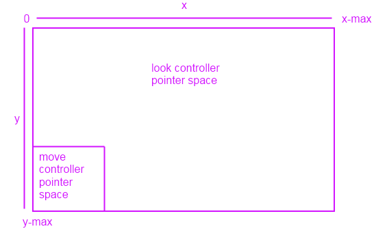

# <span id="dev_gaming.tutorial__adding_move-look_controls_to_your_directx_game"></span>Move-look controls for games


Learn how to add traditional mouse and keyboard move-look controls (also known as mouselook controls) to your DirectX game.

We also discuss move-look support for touch devices, with the move controller defined as the lower-left section of the screen that behaves like a directional input, and the look controller defined for the remainder of the screen, with the camera centering on the last place the player touched in that area.

If this is an unfamiliar control concept to you, think of it this way: the keyboard (or the touch-based directional input box) controls your legs in this 3D space, and behaves as if your legs were only capable of moving forward or backward, or strafing left and right. The mouse (or touch pointer) controls your head. You use your head to look in a direction -- left or right, up or down, or somewhere in that plane. If there is a target in your view, you would use the mouse to center your camera view on that target, and then press the forward key to move towards it, or back to move away from it. To circle the target, you would keep the camera view centered on the target, and move left or right at the same time. You can see how this is a very effective control method for navigating 3D environments!

These controls are commonly known as WASD controls in gaming, where the W, A, S, and D keys are used for x-z plane fixed camera movement, and the mouse is used to control camera rotation around the x and y axes.

## Objectives


-   Add basic move-look controls to your DirectX game for both mouse and keyboard, and touch screens.
-   Implement a first-person camera used to navigate a 3D environment.

## A note on touch control implementations


For touch controls, we implement two controllers: the move controller, which handles movement in the x-z plane relative to the camera's look point; and the look controller, which aims the camera's look point. Our move controller maps to the keyboard WASD buttons, and the look controller maps to the mouse. But for touch controls, we need to define a region of the screen that serves as the directional inputs, or the virtual WASD buttons, with the remainder of the screen serving as the input space for the look controls.

Our screen looks like this.



When you move the touch pointer (not the mouse!) in the lower left of the screen, any movement upwards will make the camera move forward. Any movement downwards will make the camera move backwards. The same holds for left and right movement inside the move controller's pointer space. Outside of that space, and it becomes a look controller -- you just touch or drag the camera to where you'd like it to face.

## Set up the basic input event infrastructure


First, we must create our control class that we use to handle input events from the mouse and keyboard, and update the camera perspective based on that input. Because we're implementing move-look controls, we call it **MoveLookController**.

```cpp
using namespace Windows::UI::Core;
using namespace Windows::System;
using namespace Windows::Foundation;
using namespace Windows::Devices::Input;
#include <DirectXMath.h>

// Methods to get input from the UI pointers
ref class MoveLookController
{
};  // class MoveLookController
```

Now, let's create a header that defines the state of the move-look controller and its first-person camera, plus the basic methods and event handlers that implement the controls and that update the state of the camera.

```cpp
#define ROTATION_GAIN 0.004f    // Sensitivity adjustment for the look controller
#define MOVEMENT_GAIN 0.1f      // Sensitivity adjustment for the move controller

ref class MoveLookController
{
private:
    // Properties of the controller object
    DirectX::XMFLOAT3 m_position;               // The position of the controller
    float m_pitch, m_yaw;           // Orientation euler angles in radians

    // Properties of the Move control
    bool m_moveInUse;               // Specifies whether the move control is in use
    uint32 m_movePointerID;         // Id of the pointer in this control
    DirectX::XMFLOAT2 m_moveFirstDown;          // Point where initial contact occurred
    DirectX::XMFLOAT2 m_movePointerPosition;   // Point where the move pointer is currently located
    DirectX::XMFLOAT3 m_moveCommand;            // The net command from the move control

    // Properties of the Look control
    bool m_lookInUse;               // Specifies whether the look control is in use
    uint32 m_lookPointerID;         // Id of the pointer in this control
    DirectX::XMFLOAT2 m_lookLastPoint;          // Last point (from last frame)
    DirectX::XMFLOAT2 m_lookLastDelta;          // For smoothing

    bool m_forward, m_back;         // States for movement
    bool m_left, m_right;
    bool m_up, m_down;


public:

    // Methods to get input from the UI pointers
    void OnPointerPressed(
        _In_ Windows::UI::Core::CoreWindow^ sender,
        _In_ Windows::UI::Core::PointerEventArgs^ args
        );

    void OnPointerMoved(
        _In_ Windows::UI::Core::CoreWindow^ sender,
        _In_ Windows::UI::Core::PointerEventArgs^ args
        );

    void OnPointerReleased(
        _In_ Windows::UI::Core::CoreWindow^ sender,
        _In_ Windows::UI::Core::PointerEventArgs^ args
        );

    void OnKeyDown(
        _In_ Windows::UI::Core::CoreWindow^ sender,
        _In_ Windows::UI::Core::KeyEventArgs^ args
        );

    void OnKeyUp(
        _In_ Windows::UI::Core::CoreWindow^ sender,
        _In_ Windows::UI::Core::KeyEventArgs^ args
        );

    // Set up the Controls that this controller supports
    void Initialize( _In_ Windows::UI::Core::CoreWindow^ window );

    void Update( Windows::UI::Core::CoreWindow ^window );
    
internal:
    // Accessor to set position of controller
    void SetPosition( _In_ DirectX::XMFLOAT3 pos );

    // Accessor to set position of controller
    void SetOrientation( _In_ float pitch, _In_ float yaw );

    // Returns the position of the controller object
    DirectX::XMFLOAT3 get_Position();

    // Returns the point  which the controller is facing
    DirectX::XMFLOAT3 get_LookPoint();


};  // class MoveLookController
```

Our code contains 4 groups of private fields. Let's review the purpose of each one.

First, we define some useful fields that hold our updated info about our camera view.

-   **m\_position** is the position of the camera (and therefore the viewplane) in the 3D scene, using scene coordinates.
-   **m\_pitch** is the pitch of the camera, or its up-down rotation around the viewplane's x-axis, in radians.
-   **m\_yaw** is the yaw of the camera, or its left-right rotation around the viewplane's y-axis, in radians.

Now, let's define the fields that we use to store info about the status and position of our controllers. First, we'll define the fields we need for our touch-based move controller. (There's nothing special needed for the keyboard implementation of the move controller. We just read keyboard events with specific handlers.)

-   **m\_moveInUse** indicates whether the move controller is in use.
-   **m\_movePointerID** is the unique ID for the current move pointer. We use it to differentiate between the look pointer and the move pointer when we check the pointer ID value.
-   **m\_moveFirstDown** is the point on the screen where the player first touched the move controller pointer area. We use this value later to set a dead zone to keep tiny movements from jittering the view.
-   **m\_movePointerPosition** is the point on the screen the player has currently moved the pointer to. We use it to determine what direction the player wanted to move by examining it relative to **m\_moveFirstDown**.
-   **m\_moveCommand** is the final computed command for the move controller: up (forward), down (back), left, or right.

Now, we define the fields we use for our look controller, both the mouse and touch implementations.

-   **m\_lookInUse** indicates whether the look control is in use.
-   **m\_lookPointerID** is the unique ID for the current look pointer. We use it to differentiate between the look pointer and the move pointer when we check the pointer ID value.
-   **m\_lookLastPoint** is the last point, in scene coordinates, that was captured in the previous frame.
-   **m\_lookLastDelta** is the computed difference between the current **m\_position** and **m\_lookLastPoint**.

Finally, we define 6 Boolean values for the 6 degrees of movement, which we use to indicate the current state of each directional move action (on or off):

-   **m\_forward**, **m\_back**, **m\_left**, **m\_right**, **m\_up** and **m\_down**.

We use the 6 event handlers to capture the input data we use to update the state of our controllers:

-   **OnPointerPressed**. The player pressed the left mouse button with the pointer in our game screen, or touched the screen.
-   **OnPointerMoved**. The player moved the mouse with the pointer in our game screen, or dragged the touch pointer on the screen.
-   **OnPointerReleased**. The player released the left mouse button with the pointer in our game screen, or stopped touching the screen.
-   **OnKeyDown**. The player pressed a key.
-   **OnKeyUp**. The player released a key.

And finally, we use these methods and properties to initialize, access, and update the controllers' state info.

-   **Initialize**. Our app calls this event handler to initialize the controls and attach them to the [**CoreWindow**](/uwp/api/Windows.UI.Core.CoreWindow) object that describes our display window.
-   **SetPosition**. Our app calls this method to set the (x, y, and z) coordinates of our controls in the scene space.
-   **SetOrientation**. Our app calls this method to set the pitch and yaw of the camera.
-   **get\_Position**. Our app accesses this property to get the current position of the camera in the scene space. You use this property as the method of communicating the current camera position to the app.
-   **get\_LookPoint**. Our app accesses this property to get the current point toward which the controller camera is facing.
-   **Update**. Reads the state of the move and look controllers and updates the camera position. You continually call this method from the app's main loop to refresh the camera controller data and the camera position in the scene space.

Now, you have here all the components you need to implement your move-look controls. So, let's connect these pieces together.

## Create the basic input events


The Windows Runtime event dispatcher provides 5 events we want instances of the **MoveLookController** class to handle:

-   [**PointerPressed**](/uwp/api/windows.ui.core.corewindow.pointerpressed)
-   [**PointerMoved**](/uwp/api/windows.ui.core.corewindow.pointermoved)
-   [**PointerReleased**](/uwp/api/windows.ui.core.corewindow.pointerreleased)
-   [**KeyUp**](/uwp/api/windows.ui.core.corewindow.keyup)
-   [**KeyDown**](/uwp/api/windows.ui.core.corewindow.keydown)

These events are implemented on the [**CoreWindow**](/uwp/api/Windows.UI.Core.CoreWindow) type. We assume that you have a **CoreWindow** object to work with. If you don't know how to obtain one, see [How to set up your Universal Windows Platform (UWP) C++ app to display a DirectX view](/previous-versions/windows/apps/hh465077(v=win.10)).

As these events fire while our app is running, the handlers update the controllers' state info defined in our private fields.

First, let's populate the mouse and touch pointer event handlers. In the first event handler, **OnPointerPressed()**, we get the x-y coordinates of the pointer from the [**CoreWindow**](/uwp/api/Windows.UI.Core.CoreWindow) that manages our display when the user clicks the mouse or touches the screen in the look controller region.

**OnPointerPressed**

```cpp
void MoveLookController::OnPointerPressed(
_In_ CoreWindow^ sender,
_In_ PointerEventArgs^ args)
{
    // Get the current pointer position.
    uint32 pointerID = args->CurrentPoint->PointerId;
    DirectX::XMFLOAT2 position = DirectX::XMFLOAT2( args->CurrentPoint->Position.X, args->CurrentPoint->Position.Y );

    auto device = args->CurrentPoint->PointerDevice;
    auto deviceType = device->PointerDeviceType;
    if ( deviceType == PointerDeviceType::Mouse )
    {
        // Action, Jump, or Fire
    }

    // Check  if this pointer is in the move control.
    // Change the values  to percentages of the preferred screen resolution.
    // You can set the x value to <preferred resolution> * <percentage of width>
    // for example, ( position.x < (screenResolution.x * 0.15) ).

    if (( position.x < 300 && position.y > 380 ) && ( deviceType != PointerDeviceType::Mouse ))
    {
        if ( !m_moveInUse ) // if no pointer is in this control yet
        {
            // Process a DPad touch down event.
            m_moveFirstDown = position;                 // Save the location of the initial contact.
            m_movePointerPosition = position;
            m_movePointerID = pointerID;                // Store the id of the pointer using this control.
            m_moveInUse = TRUE;
        }
    }
    else // This pointer must be in the look control.
    {
        if ( !m_lookInUse ) // If no pointer is in this control yet...
        {
            m_lookLastPoint = position;                         // save the point for later move
            m_lookPointerID = args->CurrentPoint->PointerId;  // store the id of pointer using this control
            m_lookLastDelta.x = m_lookLastDelta.y = 0;          // these are for smoothing
            m_lookInUse = TRUE;
        }
    }
}
```

This event handler checks whether the pointer is not the mouse (for the purposes of this sample, which supports both mouse and touch) and if it is in the move controller area. If both criteria are true, it checks whether the pointer was just pressed, specifically, whether this click is unrelated to a previous move or look input, by testing if **m\_moveInUse** is false. If so, the handler captures the point in the move controller area where the press happened and sets **m\_moveInUse** to true, so that when this handler is called again, it won't overwrite the start position of the move controller input interaction. It also updates the move controller pointer ID to the current pointer's ID.

If the pointer is the mouse or if the touch pointer isn't in the move controller area, it must be in the look controller area. It sets **m\_lookLastPoint** to the current position where the user pressed the mouse button or touched and pressed, resets the delta, and updates the look controller's pointer ID to the current pointer ID. It also sets the state of the look controller to active.

**OnPointerMoved**

```cpp
void MoveLookController::OnPointerMoved(
    _In_ CoreWindow ^sender,
    _In_ PointerEventArgs ^args)
{
    uint32 pointerID = args->CurrentPoint->PointerId;
    DirectX::XMFLOAT2 position = DirectX::XMFLOAT2(args->CurrentPoint->Position.X, args->CurrentPoint->Position.Y);

    // Decide which control this pointer is operating.
    if (pointerID == m_movePointerID)           // This is the move pointer.
    {
        // Move control
        m_movePointerPosition = position;       // Save the current position.

    }
    else if (pointerID == m_lookPointerID)      // This is the look pointer.
    {
        // Look control

        DirectX::XMFLOAT2 pointerDelta;
        pointerDelta.x = position.x - m_lookLastPoint.x;        // How far did pointer move
        pointerDelta.y = position.y - m_lookLastPoint.y;

        DirectX::XMFLOAT2 rotationDelta;
        rotationDelta.x = pointerDelta.x * ROTATION_GAIN;   // Scale for control sensitivity.
        rotationDelta.y = pointerDelta.y * ROTATION_GAIN;

        m_lookLastPoint = position;                     // Save for the next time through.

                                                        // Update our orientation based on the command.
        m_pitch -= rotationDelta.y;                     // Mouse y increases down, but pitch increases up.
        m_yaw -= rotationDelta.x;                       // Yaw is defined as CCW around the y-axis.

                                                        // Limit the pitch to straight up or straight down.
        m_pitch = (float)__max(-DirectX::XM_PI / 2.0f, m_pitch);
        m_pitch = (float)__min(+DirectX::XM_PI / 2.0f, m_pitch);
    }
}
```

The **OnPointerMoved** event handler fires whenever the pointer moves (in this case, if a touch screen pointer is being dragged, or if the mouse pointer is being moved while the left button is pressed). If the pointer ID is the same as the move controller pointer's ID, then it's the move pointer; otherwise, we check if it's the look controller that's the active pointer.

If it's the move controller, we just update the pointer position. We keep updating it as long the [**PointerMoved**](/uwp/api/windows.ui.core.corewindow.pointermoved) event keeps firing, because we want to compare the final position with the first one we captured with the **OnPointerPressed** event handler.

If it's the look controller, things are a little more complicated. We need to calculate a new look point and center the camera on it, so we calculate the delta between the last look point and the current screen position, and then we multiply versus our scale factor, which we can tweak to make the look movements smaller or larger relative to the distance of the screen movement. Using that value, we calculate the pitch and the yaw.

Finally, we need to deactivate the move or look controller behaviors when the player stops moving the mouse or touching the screen. We use **OnPointerReleased**, which we call when [**PointerReleased**](/uwp/api/windows.ui.core.corewindow.pointerreleased) is fired, to set **m\_moveInUse** or **m\_lookInUse** to FALSE and turn off the camera pan movement, and to zero out the pointer ID.

**OnPointerReleased**

```cpp
void MoveLookController::OnPointerReleased(
_In_ CoreWindow ^sender,
_In_ PointerEventArgs ^args)
{
    uint32 pointerID = args->CurrentPoint->PointerId;
    DirectX::XMFLOAT2 position = DirectX::XMFLOAT2( args->CurrentPoint->Position.X, args->CurrentPoint->Position.Y );


    if ( pointerID == m_movePointerID )    // This was the move pointer.
    {
        m_moveInUse = FALSE;
        m_movePointerID = 0;
    }
    else if (pointerID == m_lookPointerID ) // This was the look pointer.
    {
        m_lookInUse = FALSE;
        m_lookPointerID = 0;
    }
}
```

So far, we handled all the touch screen events. Now, let's handle the key input events for a keyboard-based move controller.

**OnKeyDown**

```cpp
void MoveLookController::OnKeyDown(
                                   __in CoreWindow^ sender,
                                   __in KeyEventArgs^ args )
{
    Windows::System::VirtualKey Key;
    Key = args->VirtualKey;

    // Figure out the command from the keyboard.
    if ( Key == VirtualKey::W )     // Forward
        m_forward = true;
    if ( Key == VirtualKey::S )     // Back
        m_back = true;
    if ( Key == VirtualKey::A )     // Left
        m_left = true;
    if ( Key == VirtualKey::D )     // Right
        m_right = true;
}
```

As long as one of these keys is pressed, this event handler sets the corresponding directional move state to true.

**OnKeyUp**

```cpp
void MoveLookController::OnKeyUp(
                                 __in CoreWindow^ sender,
                                 __in KeyEventArgs^ args)
{
    Windows::System::VirtualKey Key;
    Key = args->VirtualKey;

    // Figure out the command from the keyboard.
    if ( Key == VirtualKey::W )     // forward
        m_forward = false;
    if ( Key == VirtualKey::S )     // back
        m_back = false;
    if ( Key == VirtualKey::A )     // left
        m_left = false;
    if ( Key == VirtualKey::D )     // right
        m_right = false;
}
```

And when the key is released, this event handler sets it back to false. When we call **Update**, it checks these directional move states, and move the camera accordingly. This is a bit simpler than the touch implementation!

## Initialize the touch controls and the controller state


Let's hook up the events now, and initialize all the controller state fields.

**Initialize**

```cpp
void MoveLookController::Initialize( _In_ CoreWindow^ window )
{

    // Opt in to receive touch/mouse events.
    window->PointerPressed += 
    ref new TypedEventHandler<CoreWindow^, PointerEventArgs^>(this, &MoveLookController::OnPointerPressed);

    window->PointerMoved += 
    ref new TypedEventHandler<CoreWindow^, PointerEventArgs^>(this, &MoveLookController::OnPointerMoved);

    window->PointerReleased += 
    ref new TypedEventHandler<CoreWindow^, PointerEventArgs^>(this, &MoveLookController::OnPointerReleased);

    window->CharacterReceived +=
    ref new TypedEventHandler<CoreWindow^, CharacterReceivedEventArgs^>(this, &MoveLookController::OnCharacterReceived);

    window->KeyDown += 
    ref new TypedEventHandler<CoreWindow^, KeyEventArgs^>(this, &MoveLookController::OnKeyDown);

    window->KeyUp += 
    ref new TypedEventHandler<CoreWindow^, KeyEventArgs^>(this, &MoveLookController::OnKeyUp);

    // Initialize the state of the controller.
    m_moveInUse = FALSE;                // No pointer is in the Move control.
    m_movePointerID = 0;

    m_lookInUse = FALSE;                // No pointer is in the Look control.
    m_lookPointerID = 0;

    //  Need to init this as it is reset every frame.
    m_moveCommand = DirectX::XMFLOAT3( 0.0f, 0.0f, 0.0f );

    SetOrientation( 0, 0 );             // Look straight ahead when the app starts.

}
```

**Initialize** takes a reference to the app's [**CoreWindow**](/uwp/api/Windows.UI.Core.CoreWindow) instance as a parameter and registers the event handlers we developed to the appropriate events on that **CoreWindow**. It initializes the move and look pointer's IDs, sets the command vector for our touch screen move controller implementation to zero, and sets the camera looking straight ahead when the app starts.

## Getting and setting the position and orientation of the camera


Let's define some methods to get and set the position of the camera with respect to the viewport.

```cpp
void MoveLookController::SetPosition( _In_ DirectX::XMFLOAT3 pos )
{
    m_position = pos;
}

// Accessor to set the position of the controller.
void MoveLookController::SetOrientation( _In_ float pitch, _In_ float yaw )
{
    m_pitch = pitch;
    m_yaw = yaw;
}

// Returns the position of the controller object.
DirectX::XMFLOAT3 MoveLookController::get_Position()
{
    return m_position;
}

// Returns the point at which the camera controller is facing.
DirectX::XMFLOAT3 MoveLookController::get_LookPoint()
{
    float y = sinf(m_pitch);        // Vertical
    float r = cosf(m_pitch);        // In the plane
    float z = r*cosf(m_yaw);        // Fwd-back
    float x = r*sinf(m_yaw);        // Left-right
    DirectX::XMFLOAT3 result(x,y,z);
    result.x += m_position.x;
    result.y += m_position.y;
    result.z += m_position.z;

    // Return m_position + DirectX::XMFLOAT3(x, y, z);
    return result;
}
```

## Updating the controller state info


Now, we perform our calculations that convert the pointer coordinate info tracked in **m\_movePointerPosition** into new coordinate information respective of our world coordinate system. Our app calls this method every time we refresh the main app loop. So, it is here that we compute the new look point position info we want to pass to the app for updating the view matrix before projection into the viewport.

```cpp
void MoveLookController::Update(CoreWindow ^window)
{
    // Check for input from the Move control.
    if (m_moveInUse)
    {
        DirectX::XMFLOAT2 pointerDelta(m_movePointerPosition);
        pointerDelta.x -= m_moveFirstDown.x;
        pointerDelta.y -= m_moveFirstDown.y;

        // Figure out the command from the touch-based virtual joystick.
        if (pointerDelta.x > 16.0f)      // Leave 32 pixel-wide dead spot for being still.
            m_moveCommand.x = 1.0f;
        else
            if (pointerDelta.x < -16.0f)
            m_moveCommand.x = -1.0f;

        if (pointerDelta.y > 16.0f)      // Joystick y is up, so change sign.
            m_moveCommand.y = -1.0f;
        else
            if (pointerDelta.y < -16.0f)
            m_moveCommand.y = 1.0f;
    }

    // Poll our state bits that are set by the keyboard input events.
    if (m_forward)
        m_moveCommand.y += 1.0f;
    if (m_back)
        m_moveCommand.y -= 1.0f;

    if (m_left)
        m_moveCommand.x -= 1.0f;
    if (m_right)
        m_moveCommand.x += 1.0f;

    if (m_up)
        m_moveCommand.z += 1.0f;
    if (m_down)
        m_moveCommand.z -= 1.0f;

    // Make sure that 45 degree cases are not faster.
    DirectX::XMFLOAT3 command = m_moveCommand;
    DirectX::XMVECTOR vector;
    vector = DirectX::XMLoadFloat3(&command);

    if (fabsf(command.x) > 0.1f || fabsf(command.y) > 0.1f || fabsf(command.z) > 0.1f)
    {
        vector = DirectX::XMVector3Normalize(vector);
        DirectX::XMStoreFloat3(&command, vector);
    }
    

    // Rotate command to align with our direction (world coordinates).
    DirectX::XMFLOAT3 wCommand;
    wCommand.x = command.x*cosf(m_yaw) - command.y*sinf(m_yaw);
    wCommand.y = command.x*sinf(m_yaw) + command.y*cosf(m_yaw);
    wCommand.z = command.z;

    // Scale for sensitivity adjustment.
    wCommand.x = wCommand.x * MOVEMENT_GAIN;
    wCommand.y = wCommand.y * MOVEMENT_GAIN;
    wCommand.z = wCommand.z * MOVEMENT_GAIN;

    // Our velocity is based on the command.
    // Also note that y is the up-down axis. 
    DirectX::XMFLOAT3 Velocity;
    Velocity.x = -wCommand.x;
    Velocity.z = wCommand.y;
    Velocity.y = wCommand.z;

    // Integrate
    m_position.x += Velocity.x;
    m_position.y += Velocity.y;
    m_position.z += Velocity.z;

    // Clear movement input accumulator for use during the next frame.
    m_moveCommand = DirectX::XMFLOAT3(0.0f, 0.0f, 0.0f);

}
```

Because we don't want jittery movement when the player uses our touch-based move controller, we set a virtual dead zone around the pointer with a diameter of 32 pixels. We also add velocity, which is the command value plus a movement gain rate. (You can adjust this behavior to your liking, to slow down or speed up the rate of movement based on the distance the pointer moves in the move controller area.)

When we compute the velocity, we also translate the coordinates received from the move and look controllers into the movement of the actual look point we send to the method that computes our view matrix for the scene. First, we invert the x coordinate, because if we click-move or drag left or right with the look controller, the look point rotates in the opposite direction in the scene, as a camera might swing about its central axis. Then, we swap the y and z axes, because an up/down key press or touch drag motion (read as a y-axis behavior) on the move controller should translate into a camera action that moves the look point into or out of the screen (the z-axis).

The final position of the look point for the player is the last position plus the calculated velocity, and this is what is read by the renderer when it calls the **get\_Position** method (most likely during the setup for each frame). After that, we reset the move command to zero.

## Updating the view matrix with the new camera position


We can obtain a scene space coordinate that our camera is focused on, and which is updated whenever you tell your app to do so (every 60 seconds in the main app loop, for example). This pseudocode suggests the calling behavior you can implement:

```cpp
myMoveLookController->Update( m_window );   

// Update the view matrix based on the camera position.
myFirstPersonCamera->SetViewParameters(
                 myMoveLookController->get_Position(),       // Point we are at
                 myMoveLookController->get_LookPoint(),      // Point to look towards
                 DirectX::XMFLOAT3( 0, 1, 0 )                   // Up-vector
                 ); 
```

Congratulations! You've implemented basic move-look controls for both touch screens and keyboard/mouse input touch controls in your game!


 

 