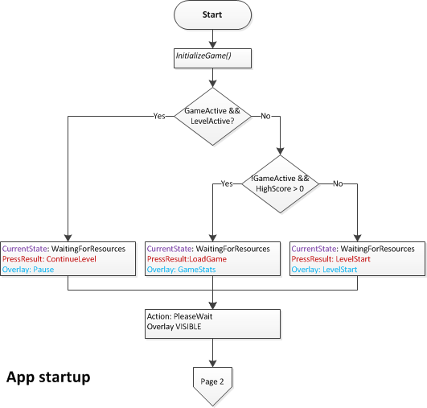
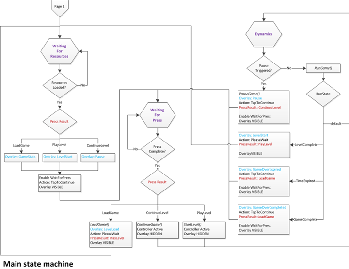

#  Define the game's Universal Windows Platform (UWP) app framework


\[ Updated for UWP apps on Windows 10. For Windows 8.x articles, see the [archive](http://go.microsoft.com/fwlink/p/?linkid=619132) \]

The first part of coding a Universal Windows Platform (UWP) with DirectX game is building the framework that lets the game object interact with Windows. This includes Windows Runtime properties like suspend/resume event handling, window focus, and snapping, plus as the events, interactions and transitions for the user interface. We go over how the sample game is structured, and how it defines the high-level state machine for the player and system interaction.

## Objective


-   To set up the framework for a UWP DirectX game, and implement the state machine that defines the overall game flow.

## Initializing and starting the view provider


In any UWP DirectX game, you must obtain a view provider that the app singleton, the Windows Runtime object that defines an instance of your running app, can use to access the graphics resources it needs. Through the Windows Runtime, your app has a direct connection with the graphics interface, but you need to specify the resources you need and how to handle them.

As we discussed in [Setting up the game project](tutorial--setting-up-the-games-infrastructure.md), Microsoft Visual Studio 2015 provides an implementation of a basic renderer for DirectX in the **Sample3DSceneRenderer.cpp** file that is available when you pick the **DirectX 11 App (Universal Windows)** template.

For more details about understanding and creating a view provider and renderer, see [How to set up your UWP with C++ and DirectX to display a DirectX view](https://msdn.microsoft.com/library/windows/apps/hh465077).

Suffice to say, you must provide the implementation for 5 methods that the app singleton calls:

-   [**Initialize**](https://msdn.microsoft.com/library/windows/apps/hh700495)
-   [**SetWindow**](https://msdn.microsoft.com/library/windows/apps/hh700509)
-   [**Load**](https://msdn.microsoft.com/library/windows/apps/hh700501)
-   [**Run**](https://msdn.microsoft.com/library/windows/apps/hh700505)
-   [**Uninitialize**](https://msdn.microsoft.com/library/windows/apps/hh700523)

In the DirectX11 App (Universal Windows) template, these 5 methods are defined on the **App** object in [App.h](#complete-sample-code-for-this-section). Let's take a look at the way they are implemented in this game.

The Initialize method of the view provider

```cpp
void App::Initialize(
    _In_ CoreApplicationView^ applicationView
    )
{
    applicationView->Activated +=
        ref new TypedEventHandler<CoreApplicationView^, IActivatedEventArgs^>(this, &App::OnActivated);

    CoreApplication::Suspending +=
        ref new EventHandler<SuspendingEventArgs^>(this, &App::OnSuspending);

    CoreApplication::Resuming +=
        ref new EventHandler<Platform::Object^>(this, &App::OnResuming);

    m_controller = ref new MoveLookController();
    m_renderer = ref new GameRenderer();
    m_game = ref new Simple3DGame();
}
```

The app singleton first calls **Initialize**. Therefore, it is crucial that this method handles the most fundamental behaviors of a UWP game, such as handling the activation of the main window and making sure that the game can handle a sudden suspend (and a possible later resume) event.

When the game app is initialized, it allocates specific memory for the controller to allow the player to begin providing input. It also creates new, uninitialized instances of the game's renderer and state machine. We discuss the details in [Defining the main game object](tutorial--defining-the-main-game-loop.md).

At this point, the game app can handle a suspend (or resume) message, and has memory allocated for the controller, the renderer, and the game itself. But there's no window to work with, and the game is uninitialized. There's a few more things that need to happen!

The SetWindow method of the view provider

```cpp
void App::SetWindow(
    _In_ CoreWindow^ window
    )
{
    window->PointerCursor = ref new CoreCursor(CoreCursorType::Arrow, 0);

    window->SizeChanged +=
        ref new TypedEventHandler<CoreWindow^, WindowSizeChangedEventArgs^>(this, &App::OnWindowSizeChanged);

    window->Closed +=
        ref new TypedEventHandler<CoreWindow^, CoreWindowEventArgs^>(this, &App::OnWindowClosed);

    window->VisibilityChanged +=
        ref new TypedEventHandler<CoreWindow^, VisibilityChangedEventArgs^>(this, &App::OnVisibilityChanged);

    DisplayProperties::LogicalDpiChanged +=
        ref new DisplayPropertiesEventHandler(this, &App::OnLogicalDpiChanged);

    m_controller->Initialize(window);

    m_controller->SetMoveRect(
        XMFLOAT2(0.0f, window->Bounds.Height - GameConstants::TouchRectangleSize),
        XMFLOAT2(GameConstants::TouchRectangleSize, window->Bounds.Height)
        );
    m_controller->SetFireRect(
        XMFLOAT2(window->Bounds.Width - GameConstants::TouchRectangleSize, window->Bounds.Height - GameConstants::TouchRectangleSize),
        XMFLOAT2(window->Bounds.Width, window->Bounds.Height)
        );

    m_renderer->Initialize(window, DisplayProperties::LogicalDpi);
    SetGameInfoOverlay(GameInfoOverlayState::Loading);
    ShowGameInfoOverlay();
}
```

Now, with a call to an implementation of [**SetWindow**](https://msdn.microsoft.com/library/windows/apps/hh700509), the app singleton provides a [**CoreWindow**](https://msdn.microsoft.com/library/windows/apps/br208225) object that represents the game's main window, and makes its resources and events available to the game. Because there's a window to work with, the game can now start adding in the basic user interface components and events: a pointer (used by both mouse and touch controls), and the basic events for window resizing, closing, and DPI changes (if the display device changes).

The game app also initializes the controller, because there's a window to interact with, and initializes the game object itself. It can read input from the controller (touch, mouse, or XBox 360 controller).

After the controller is initialized, the app defines two rectangular areas in the lower-left and lower-right corners of the screen for the move and camera touch controls, respectively. The player uses the lower-left rectangle, defined by the call to **SetMoveRect**, as a virtual control pad for moving the camera forward and backward, and side to side. The lower-right rectangle, defined by the **SetFireRect** method, is used as a virtual button to fire the ammo.

It's all starting to come together.

The Load method of the view provider

```cpp
void App::Load(
    Platform::String^ entryPoint
    )
{
    task<void>([this]()
    {
        m_game->Initialize(m_controller, m_renderer);

        return m_renderer->CreateGameDeviceResourcesAsync(m_game);

    }).then([this]()
    {
        // The finalize code needs to run in the same thread context
        // in which the m_renderer object was created because the D3D device context
        // can be accessed only on a single thread.
        m_renderer->FinalizeCreateGameDeviceResources();

        InitializeGameState();

        if (m_updateState == UpdateEngineState::WaitingForResources)
        {
            // In the middle of a game, so spin up the async task to load the level.
            create_task([this]()
            {
                return m_game->LoadLevelAsync();

            }).then([this]()
            {
                // The m_game object may need to deal with D3D device context work, so
                // the finalizer code needs to run in the same thread
                // context as the m_renderer object was created because the D3D 
                // device context can  be accessed only on a single thread.
                m_game->FinalizeLoadLevel();
                m_updateState = UpdateEngineState::ResourcesLoaded;

            }, task_continuation_context::use_current());
        }
    }, task_continuation_context::use_current());
}
```

After the main window is set, the app singleton calls **Load**. In the sample, this method uses a set of asynchronous tasks (the syntax for which is defined in the [Parallel Patterns Library](https://msdn.microsoft.com/library/windows/apps/dd492418.aspx)) to create the game objects, load graphics resources, and initialize the game’s state machine. By using the async task pattern, the Load method completes quickly and allows the app to start processing input. In this method, the app also displays a progress bar as the resource files load.

We break resource loading into two separate stages, because access to the Direct3D 11 device context is restricted to the thread the device context was created on, while access to the Direct3D 11 device for object creation is free-threaded. The **CreateGameDeviceResourcesAsync** task runs on a separate thread from the completion task (*FinalizeCreateGameDeviceResources*), which runs on the original thread. We use a similar pattern for loading level resources with **LoadLevelAsync** and **FinalizeLoadLevel**.

After we create the game’s objects and load the graphics resources, we initialize the game's state machine to the starting conditions (for example: setting the initial ammo count, level number, and object positions). If the game state indicates that the player is resuming a game, we load the current level (the level that player was on when the game was suspended).

In the **Load** method, we do any necessary preparations before the game begins, like setting any starting states or global values. If you want to pre-fetch game data or assets, this is a better place for it rather than in **SetWindow** or **Initialize**. Use async tasks in your game for any loading as Windows imposes restrictions on the time your game can take before it must start processing input. If loading takes awhile—if there are lots of resources — then provide your users with a regularly updated progress bar.

When developing your own game, design your startup code around these methods. Here's a simple list of basic suggestions for each method:

-   Use **Initialize** to allocate your main classes and connect up the basic event handlers.
-   Use **SetWindow** to create your main window and connect any window-specific events.
-   Use **Load** to handle any remaining setup, and to initiate the async creation of objects and loading of resources. If you need to create any temporary files or data, such as procedurally generated assets, do it here too.

So, the sample game creates an instance of the game's state machine and sets it to the starting configuration. It handles all the system and input events. It provides a window to display content in. The gameplay code is now ready to run.

The Run method of the view provider

```cpp
void App::Run()
{
    while (!m_windowClosed)
    {
        if (m_visible)
        {
            switch (m_updateState)
            {
            case UpdateEngineState::Deactivated:
            case UpdateEngineState::Snapped:
                if (!m_renderNeeded)
                {
                    // The app is not currently the active window, so just wait for events.
                    CoreWindow::GetForCurrentThread()->Dispatcher->ProcessEvents(CoreProcessEventsOption::ProcessOneAndAllPending);
                    break;
                }
                // Otherwise, fall through and do normal processing to get the rendering handled.
            default:
                CoreWindow::GetForCurrentThread()->Dispatcher->ProcessEvents(CoreProcessEventsOption::ProcessAllIfPresent);
                Update();
                m_renderer->Render();
                m_renderNeeded = false;
            }
        }
        else
        {
            CoreWindow::GetForCurrentThread()->Dispatcher->ProcessEvents(CoreProcessEventsOption::ProcessOneAndAllPending);
        }
    }
    m_game->OnSuspending();  // Exiting due to window close.  Make sure to save the state.
}
```

Here's where we get to the play part of the game app. Having run the 3 methods and set the stage, the game app runs the **Run** method, starting the fun!

In the game sample, we start a while loop that terminates when the player closes the game window. The sample code transitions to one of two states in the game engine state machine:

-   The game window gets deactivated (loses focus) or snapped. When this happens, the game suspends event processing and waits for the window to focus or unsnap.
-   Otherwise, the game updates its own state and renders the graphics for display.

When your game has focus, you must handle every event in the message queue as it arrives, and so you must call [**CoreWindowDispatch.ProcessEvents**](https://msdn.microsoft.com/library/windows/apps/br208215) with the **ProcessAllIfPresent** option. Other options can cause delays in processing message events, which makes your game feel unresponsive, or result in touch behaviors that feel sluggish and not "sticky".

Of course, when the app is not visible, suspended or snapped, we don't want it to consume any resources cycling to dispatch messages that will never arrive. So your game must use **ProcessOneAndAllPending**, which blocks until it gets an event, and then processes that event and any others that arrive in the process queue during the processing of the first. [**ProcessEvents**](https://msdn.microsoft.com/library/windows/apps/br208215) then immediately returns after the queue has been processed.

The game is running! The events that it uses to transition between game states are being dispatched and processed. The graphics are being updated as the game loop cycles. We hope the player is having fun. But eventually, the fun has to end...

...and we need to clean up the place. This is where **Uninitialize** comes in.

The Uninitialize method of the view provider

```cpp
void App::Uninitialize()
{
}
```

In the game sample, we let the app singleton for the game clean everything up after the game is terminated. In Windows 10, closing the app window doesn't kill the app's process, but instead writes the state of the app singleton to memory. If anything special must happen when the system must reclaim this memory, any special cleanup of resources, then put the code for that cleanup in this method.

We refer back to these 5 methods in this tutorial, so keep them in mind. Now, let's look at the game engine's overall structure and the state machines that define it.

## Initializing the game engine state


Because a user can resume a UWP game app from a suspended state at any time, the app can have any number of possible states.

The game sample can be in one of the three states when it starts:

-   The game loop was running and was in the middle of a level.
-   The game loop was not running because a game had just been completed. (The high score is set.)
-   No game has been started, or the game was between levels. (The high score is 0.)

Obviously, in your own game, you could have more or fewer states. Again, always be aware that your UWP game can be terminated at any time, and when it resumes, the player expects the game to behave as though they had never stopped playing.

In the game sample, the code flow looks like this.

```cpp
void App::InitializeGameState()
{
    //
    // Set up the initial state machine for handling game playing state.
    //
    if (m_game->GameActive() && m_game->LevelActive())
    {
        m_updateState = UpdateEngineState::WaitingForResources;
        // ...

    }
    else if (!m_game->GameActive() && (m_game->HighScore().totalHits > 0))
    {
        m_updateState = UpdateEngineState::WaitingForPress;
        // ...
    }
    else
    {
        m_updateState = UpdateEngineState::WaitingForResources;
        // ...
    }
    SetAction(GameInfoOverlayCommand::PleaseWait);
    ShowGameInfoOverlay();
}
```

Initialization is less about cold starting the app, and more about restarting the app after it has been terminated. The sample game always saves state, which gives the appearance that the app is always running. The suspended state is just that: the game play is suspended, but the resources of the game are still in memory. Likewise, the resume event indicates that the sample game is picking up where it was last suspended or terminated. When the sample game restarts after termination, it starts up normally and then determines the last known state so the player can immediately continue playing.

The flowchart lays out the initial states and transitions for the game sample's initialization process.



Depending on the state, different options are presented to the player. If the game resumes mid-level, it appears as paused, and the overlay presents a continue option. If the game resumed in a state where the game is completed, it displays the high scores and an option to play a new game. Lastly, if the game resumes before a level has started, the overlay presents a start option to the user.

The game sample doesn't distinguish between the game itself cold starting, that is a game that is launching for the first time without a suspend event, and the game resuming from a suspended state. This is proper design for any UWP app.

## Handling events


Our sample code registered a number of handlers for specific events in **Initialize**, **SetWindow**, and **Load**. You probably guessed that these were important events, because the code sample did this work well before it got into any game mechanics or graphics development. You're right! These events are fundamental to a proper UWP app experience, and because a UWP app can be activated, deactivated, resized, snapped, unsnapped, suspended, or resumed at any time, the game must register for those very events as soon as it can, and handle them in a way that keeps the experience smooth and predictable for the player.

Here's the event handlers in the sample, and the events they handle. You can find the full code for these event handlers in [Complete code for this section](#complete-sample-code-for-this-section).

<table>
<colgroup>
<col width="50%" />
<col width="50%" />
</colgroup>
<thead>
<tr class="header">
<th align="left">Event handler</th>
<th align="left">Description</th>
</tr>
</thead>
<tbody>
<tr class="odd">
<td align="left">OnActivated</td>
<td align="left">Handles [<strong>CoreApplicationView::Activated</strong>](https://msdn.microsoft.com/library/windows/apps/br225018). The game app has been brought to the foreground, so the main window is activated.</td>
</tr>
<tr class="even">
<td align="left">OnLogicalDpiChanged</td>
<td align="left">Handles [<strong>DisplayProperties::LogicalDpiChanged</strong>](https://msdn.microsoft.com/library/windows/apps/br226150). The DPI for the main game window has changed, and the game app adjusts its resources accordingly.
<div class="alert">
<strong>Note</strong>  [<strong>CoreWindow</strong>](https://msdn.microsoft.com/library/windows/desktop/hh404559) coordinates are in DIPs (Device Independent Pixels), as in [Direct2D](https://msdn.microsoft.com/library/windows/desktop/dd370987). As a result, you must notify Direct2D of the change in DPI to display any 2D assets or primitives correctly.
</div>
<div>
 
</div></td>
</tr>
<tr class="odd">
<td align="left">OnResuming</td>
<td align="left">Handles [<strong>CoreApplication::Resuming</strong>](https://msdn.microsoft.com/library/windows/apps/br205859). The game app restores the game from a suspended state.</td>
</tr>
<tr class="even">
<td align="left">OnSuspending</td>
<td align="left">Handles [<strong>CoreApplication::Suspending</strong>](https://msdn.microsoft.com/library/windows/apps/br205860). The game app saves its state to disk. It has 5 seconds to save state to storage.</td>
</tr>
<tr class="odd">
<td align="left">OnVisibilityChanged</td>
<td align="left">Handles [<strong>CoreWindow::VisibilityChanged</strong>](https://msdn.microsoft.com/library/windows/apps/hh701591). The game app has changed visibility, and has either become visible or been made invisible by another app becoming visible.</td>
</tr>
<tr class="even">
<td align="left">OnWindowActivationChanged</td>
<td align="left">Handles [<strong>CoreWindow::Activated</strong>](https://msdn.microsoft.com/library/windows/apps/br208255). The game app's main window has been deactivated or activated, so it must remove focus and pause the game, or regain focus. In both cases, the overlay indicates that the game is paused.</td>
</tr>
<tr class="odd">
<td align="left">OnWindowClosed</td>
<td align="left">Handles [<strong>CoreWindow::Closed</strong>](https://msdn.microsoft.com/library/windows/apps/br208261). The game app closes the main window and suspends the game.</td>
</tr>
<tr class="even">
<td align="left">OnWindowSizeChanged</td>
<td align="left">Handles [<strong>CoreWindow::SizeChanged</strong>](https://msdn.microsoft.com/library/windows/apps/br208283). The game app reallocates the graphics resources and overlay to accommodate the size change, and then updates the render target.</td>
</tr>
</tbody>
</table>

 

Your own game must handle these events, because they are part of UWP app design.

## Updating the game engine


Within the game loop in **Run**, the sample has implemented a basic state machine for handling all the major actions the player can take. The highest level of this state machine deals with loading a game, playing a specific level, or continuing a level after the game has been paused (by the system or the player).

In the game sample, there are 3 major states (UpdateEngineState) the game can be in:

-   **Waiting for resources**. The game loop is cycling, unable to transition until resources (specifically graphics resources) are available. When the async tasks for loading resources completes, it updates the state to **ResourcesLoaded**. This usually happens between levels when the level needs to load new resources from disk. In the game sample, we simulate this behavior because the sample doesn't need any additional per-level resources at that time.
-   **Waiting for press**. The game loop is cycling, waiting for specific user input. This input is a player action to load a game, start a level, or continue a level. The sample code refers to these sub-states as PressResultState enumeration values.
-   **Dynamics**. The game loop is running with the user playing. While the user is playing, the game checks for 3 conditions that it can transition on: the expiration of the set time for a level, the completion of a level by the player, or the completion of all levels by the player.

Here's the code structure. The complete code is in [Complete code for this section](#complete-sample-code-for-this-section).

The structure of the state machine used to update the game engine

```cpp
void App::Update()
{
    m_controller->Update();

    switch (m_updateState)
    {
    case UpdateEngineState::WaitingForResources:
        // Waiting for initial load.  Display an update once per 60 updates.
        loadCount++;
        if ((loadCount % 60) == 0)
        {
            m_loadingCount++;
            SetGameInfoOverlay(m_gameInfoOverlayState);
        }
        break;

    case UpdateEngineState::ResourcesLoaded:
        switch (m_pressResult)
        {
        case PressResultState::LoadGame:
            // ...
            break;

        case PressResultState::PlayLevel:
            // ...
            break;

        case PressResultState::ContinueLevel:
            // ...
            break;
        }
        // ...
        break;

    case UpdateEngineState::WaitingForPress:
        if (m_controller->IsPressComplete() || m_pressComplete)
        {
            m_pressComplete = false;

            switch (m_pressResult)
            {
            case PressResultState::LoadGame:
                // ...
                break;

            case PressResultState::PlayLevel:
                // ...
                break;

            case PressResultState::ContinueLevel:
                // ...
                break;
            }
        }
        break;

    case UpdateEngineState::Dynamics:
        if (m_controller->IsPauseRequested() || m_pauseRequested)
        {
            // ...
        }
        else 
        {
            GameState runState = m_game->RunGame();
            switch (runState)
            {
            case GameState::TimeExpired:
                // ...
                break;

            case GameState::LevelComplete:
                // ...
                break;

            case GameState::GameComplete:
                // ...
                break;
            }
        }

        if (m_updateState == UpdateEngineState::WaitingForPress)
        {
            // transitioning state, so enable waiting for the press event
            m_controller->WaitForPress(m_game->GameInfoOverlayUpperLeft(), m_game->GameInfoOverlayLowerRight());
        }
        if (m_updateState == UpdateEngineState::WaitingForResources)
        {
            // Transitioning state, so shut down the input controller until resources are loaded
            m_controller->Active(false);
        }

        break;
    }
}
```

Visually, the main game state machine looks like this:



We talk about the game logic itself in more detail in [Defining the main game object](tutorial--defining-the-main-game-loop.md). For now, the important takeaway is that your game is a state machine. Each specific state must have very specific criteria to define it, and the transitions from one state to another must be based on discrete user input or system actions (such as graphics resource loading). When you are planning your game, draw out a diagram like the one we use, making sure you address all possible actions the user or system can take at a high level. Games can be very complicated, and the state machine is a powerful tool to visualize this complexity and make it very manageable.

Of course, as you saw, there are state machines within state machines. There's one for the controller, that handles all of the acceptable inputs the player can generate. In the diagram, a press is some form of user input. This state machine doesn't care what it is, because it works at a higher level; it assumes that the state machine for the controller will handle any transitions that affect movement and shooting behaviors, and the associated rendering updates. We talk about managing input states in [Adding controls](tutorial--adding-controls.md).

## Updating the user interface


We need to keep the player apprised of the state of the system, and allow him to change the high-level state according to the rules of the game. For most games, this game sample included, this is done with a heads-up display that contains representations of game state, and other play-specific info such as score, or ammo, or the number of chances remaining. We call this the overlay, because it is rendered separate from the main graphics pipeline and placed on top the 3D projection. In the sample game, we create this overlay using the Direct2D APIs. We can also create this overlay using XAML, which we discuss in [Extending the game sample](tutorial-resources.md).

There are two components to the user interface:

-   The heads-up display that contains the score and info about the current state of game play.
-   The pause bitmap, which is a black rectangle with text overlaid during the paused/suspended state of the game. This is the game overlay. We discuss it further in [Adding a user interface](tutorial--adding-a-user-interface.md).

Unsurprisingly, the overlay has a state machine too. The overlay can display a level start or game over message. It is essentially a canvas to output any info about game state that we display to the player when the game is paused or suspended.

Here's how the game sample structures the overlay's state machine.

```cpp
void App::SetGameInfoOverlay(GameInfoOverlayState state)
{
    m_gameInfoOverlayState = state;
    switch (state)
    {

    case GameInfoOverlayState::Loading:
        m_renderer->InfoOverlay()->SetGameLoading(m_loadingCount);
        break;

    case GameInfoOverlayState::GameStats:
        // ...
        break;

    case GameInfoOverlayState::LevelStart:
        // ...
        break;

    case GameInfoOverlayState::GameOverCompleted:
        // ...
        break;

    case GameInfoOverlayState::GameOverExpired:
        // ...
        break;

    case GameInfoOverlayState::Pause:
        // ...
        break;
    }
}
```

There are 6 state screens that the overlay displays, depending on the state of the game itself: a resources loading screen at the start of the game, a game play screen, a level start message screen, a game over screen when all of the levels are competed without time running out, a game over screen when time runs out, and a pause menu screen.

Separating your user interface from your game's graphics pipeline allows you to work on it independent of the game's graphics rendering engine and decreases the complexity of your game's code significantly.

## Next steps


This covers the basic structure of the game sample, and presents a good model for UWP game app development with DirectX. Of course, there's more to it than this. We only walked through the skeleton of the game. Now, we take an in-depth look at the game and its mechanics, and how those mechanics are implemented as the core game object. We review that part in [Defining the main game object](tutorial--defining-the-main-game-loop.md).

It's also time to consider the sample game's graphics engine in greater detail. That part is covered in [Assembling the rendering pipeline](tutorial--assembling-the-rendering-pipeline.md).

## Complete sample code for this section


App.h

```cpp
///// THIS CODE AND INFORMATION IS PROVIDED "AS IS" WITHOUT WARRANTY OF
//// ANY KIND, EITHER EXPRESSED OR IMPLIED, INCLUDING BUT NOT LIMITED TO
//// THE IMPLIED WARRANTIES OF MERCHANTABILITY AND/OR FITNESS FOR A
//// PARTICULAR PURPOSE.
////
//// Copyright (c) Microsoft Corporation. All rights reserved

#pragma once

#include "Simple3DGame.h"

enum class UpdateEngineState
{
    WaitingForResources,
    ResourcesLoaded,
    WaitingForPress,
    Dynamics,
    Snapped,
    Suspended,
    Deactivated,
};

enum class PressResultState
{
    LoadGame,
    PlayLevel,
    ContinueLevel,
};

enum class GameInfoOverlayState
{
    Loading,
    GameStats,
    GameOverExpired,
    GameOverCompleted,
    LevelStart,
    Pause,
};

ref class App : public Windows::ApplicationModel::Core::IFrameworkView
{
internal:
    App();

public:
    // IFrameworkView Methods
    virtual void Initialize(_In_ Windows::ApplicationModel::Core::CoreApplicationView^ applicationView);
    virtual void SetWindow(_In_ Windows::UI::Core::CoreWindow^ window);
    virtual void Load(_In_ Platform::String^ entryPoint);
    virtual void Run();
    virtual void Uninitialize();

private:
    void InitializeGameState();

    // Event Handlers
    void OnSuspending(
        _In_ Platform::Object^ sender,
        _In_ Windows::ApplicationModel::SuspendingEventArgs^ args
        );

    void OnResuming(
        _In_ Platform::Object^ sender,
        _In_ Platform::Object^ args
        );

    void UpdateViewState();

    void OnWindowActivationChanged(
        _In_ Windows::UI::Core::CoreWindow^ sender,
        _In_ Windows::UI::Core::WindowActivatedEventArgs^ args
        );

    void OnWindowSizeChanged(
        _In_ Windows::UI::Core::CoreWindow^ sender,
        _In_ Windows::UI::Core::WindowSizeChangedEventArgs^ args
        );

    void OnWindowClosed(
        _In_ Windows::UI::Core::CoreWindow^ sender,
        _In_ Windows::UI::Core::CoreWindowEventArgs^ args
        );

    void OnLogicalDpiChanged(
        _In_ Platform::Object^ sender
        );

    void OnActivated(
        _In_ Windows::ApplicationModel::Core::CoreApplicationView^ applicationView,
        _In_ Windows::ApplicationModel::Activation::IActivatedEventArgs^ args
        );

    void OnVisibilityChanged(
        _In_ Windows::UI::Core::CoreWindow^ sender,
        _In_ Windows::UI::Core::VisibilityChangedEventArgs^ args
        );

    void Update();
    void SetGameInfoOverlay(GameInfoOverlayState state);
    void SetAction (GameInfoOverlayCommand command);
    void ShowGameInfoOverlay();
    void HideGameInfoOverlay();
    void SetSnapped();
    void HideSnapped();

    bool                                                m_windowClosed;
    bool                                                m_renderNeeded;
    bool                                                m_haveFocus;
    bool                                                m_visible;

    MoveLookController^                                 m_controller;
    GameRenderer^                                       m_renderer;
    Simple3DGame^                                       m_game;

    UpdateEngineState                                   m_updateState;
    UpdateEngineState                                   m_updateStateNext;
    PressResultState                                    m_pressResult;
    GameInfoOverlayState                                m_gameInfoOverlayState;
    GameInfoOverlayCommand                              m_gameInfoOverlayCommand;
    uint32                                              m_loadingCount;
};

ref class Direct3DApplicationSource : Windows::ApplicationModel::Core::IFrameworkViewSource
{
public:
    virtual Windows::ApplicationModel::Core::IFrameworkView^ CreateView();
};
```

App.cpp

```cpp
//--------------------------------------------------------------------------------------
//// THIS CODE AND INFORMATION IS PROVIDED "AS IS" WITHOUT WARRANTY OF
//// ANY KIND, EITHER EXPRESSED OR IMPLIED, INCLUDING BUT NOT LIMITED TO
//// THE IMPLIED WARRANTIES OF MERCHANTABILITY AND/OR FITNESS FOR A
//// PARTICULAR PURPOSE.
////
//// Copyright (c) Microsoft Corporation. All rights reserved

#include "pch.h"
#include "App.h"

using namespace concurrency;
using namespace DirectX;
using namespace Windows::ApplicationModel;
using namespace Windows::ApplicationModel::Activation;
using namespace Windows::ApplicationModel::Core;
using namespace Windows::Foundation;
using namespace Windows::Graphics::Display;
using namespace Windows::UI::Core;
using namespace Windows::UI::Input;
using namespace Windows::UI::ViewManagement;


App::App() :
    m_windowClosed(false),
    m_haveFocus(false),
    m_gameInfoOverlayCommand(GameInfoOverlayCommand::None),
    m_visible(true),
    m_loadingCount(0),
    m_updateState(UpdateEngineState::WaitingForResources)
{
}

//--------------------------------------------------------------------------------------

void App::Initialize(
    _In_ CoreApplicationView^ applicationView
    )
{
    applicationView->Activated +=
        ref new TypedEventHandler<CoreApplicationView^, IActivatedEventArgs^>(this, &App::OnActivated);

    CoreApplication::Suspending +=
        ref new EventHandler<SuspendingEventArgs^>(this, &App::OnSuspending);

    CoreApplication::Resuming +=
        ref new EventHandler<Platform::Object^>(this, &App::OnResuming);

    m_controller = ref new MoveLookController();
    m_renderer = ref new GameRenderer();
    m_game = ref new Simple3DGame();
}

//--------------------------------------------------------------------------------------

void App::SetWindow(
    _In_ CoreWindow^ window
    )
{
    window->PointerCursor = ref new CoreCursor(CoreCursorType::Arrow, 0);

    PointerVisualizationSettings^ visualizationSettings = PointerVisualizationSettings::GetForCurrentView();
    visualizationSettings->IsContactFeedbackEnabled = false;
    visualizationSettings->IsBarrelButtonFeedbackEnabled = false;

    window->SizeChanged +=
        ref new TypedEventHandler<CoreWindow^, WindowSizeChangedEventArgs^>(this, &App::OnWindowSizeChanged);

    window->Closed +=
        ref new TypedEventHandler<CoreWindow^, CoreWindowEventArgs^>(this, &App::OnWindowClosed);

    window->VisibilityChanged +=
        ref new TypedEventHandler<CoreWindow^, VisibilityChangedEventArgs^>(this, &App::OnVisibilityChanged);

    DisplayProperties::LogicalDpiChanged +=
        ref new DisplayPropertiesEventHandler(this, &App::OnLogicalDpiChanged);

    m_controller->Initialize(window);

    m_controller->SetMoveRect(
        XMFLOAT2(0.0f, window->Bounds.Height - GameConstants::TouchRectangleSize),
        XMFLOAT2(GameConstants::TouchRectangleSize, window->Bounds.Height)
        );
    m_controller->SetFireRect(
        XMFLOAT2(window->Bounds.Width - GameConstants::TouchRectangleSize, window->Bounds.Height - GameConstants::TouchRectangleSize),
        XMFLOAT2(window->Bounds.Width, window->Bounds.Height)
        );

    m_renderer->Initialize(window, DisplayProperties::LogicalDpi);
    SetGameInfoOverlay(GameInfoOverlayState::Loading);
    ShowGameInfoOverlay();
}

//--------------------------------------------------------------------------------------

void App::Load(
    _In_ Platform::String^ /* entryPoint */
    )
{
    create_task([this]()
    {
        // Asynchronously initialize the game class and load the renderer device resources.
        // By doing all this asynchronously, the game gets to its main loop more quickly
        // and loads all the necessary resources in parallel on other threads.
        m_game->Initialize(m_controller, m_renderer);

        return m_renderer->CreateGameDeviceResourcesAsync(m_game);

    }).then([this]()
    {
        // The finalize code needs to run in the same thread context
        // as the m_renderer object was created because the D3D device context
        // can ONLY be accessed on a single thread.
        m_renderer->FinalizeCreateGameDeviceResources();

        InitializeGameState();

        if (m_updateState == UpdateEngineState::WaitingForResources)
        {
            // In the middle of a game, so spin up the async task to load the level.
            create_task([this]()
            {
                return m_game->LoadLevelAsync();

            }).then([this]()
            {
                // The m_game object may need to deal with D3D device context work, so
                // again the finalize code needs to run in the same thread
                // context as the m_renderer object was created because the D3D 
                // device context can ONLY be accessed on a single thread.
                m_game->FinalizeLoadLevel();
                m_updateState = UpdateEngineState::ResourcesLoaded;

            }, task_continuation_context::use_current());
        }
    }, task_continuation_context::use_current());
}

//--------------------------------------------------------------------------------------

void App::Run()
{
    while (!m_windowClosed)
    {
        if (m_visible)
        {
            switch (m_updateState)
            {
            case UpdateEngineState::Deactivated:
            case UpdateEngineState::Snapped:
                if (!m_renderNeeded)
                {
                    // The App is not currently the active window, so just wait for events.
                    CoreWindow::GetForCurrentThread()->Dispatcher->ProcessEvents(CoreProcessEventsOption::ProcessOneAndAllPending);
                    break;
                }
                // Otherwise, fall through and do normal processing to get the rendering handled.
            default:
                CoreWindow::GetForCurrentThread()->Dispatcher->ProcessEvents(CoreProcessEventsOption::ProcessAllIfPresent);
                Update();
                m_renderer->Render();
                m_renderNeeded = false;
            }
        }
        else
        {
            CoreWindow::GetForCurrentThread()->Dispatcher->ProcessEvents(CoreProcessEventsOption::ProcessOneAndAllPending);
        }
    }
    m_game->OnSuspending();  // Exiting due to window close.  Make sure to save state.
}

//--------------------------------------------------------------------------------------

void App::Uninitialize()
{
}

//--------------------------------------------------------------------------------------

void App::OnWindowSizeChanged(
    _In_ CoreWindow^ window,
    _In_ WindowSizeChangedEventArgs^ /* args */
    )
{
    UpdateViewState();
    m_renderer->UpdateForWindowSizeChange();

    // The location of the GameInfoOverlay may have changed with the size change, so update the controller.
    m_controller->SetMoveRect(
        XMFLOAT2(0.0f, window->Bounds.Height - GameConstants::TouchRectangleSize),
        XMFLOAT2(GameConstants::TouchRectangleSize, window->Bounds.Height)
        );
    m_controller->SetFireRect(
        XMFLOAT2(window->Bounds.Width - GameConstants::TouchRectangleSize, window->Bounds.Height - GameConstants::TouchRectangleSize),
        XMFLOAT2(window->Bounds.Width, window->Bounds.Height)
        );

    if (m_updateState == UpdateEngineState::WaitingForPress)
    {
        m_controller->WaitForPress(m_renderer->GameInfoOverlayUpperLeft(), m_renderer->GameInfoOverlayLowerRight());
    }
}

//--------------------------------------------------------------------------------------

void App::OnWindowClosed(
    _In_ CoreWindow^ /* sender */,
    _In_ CoreWindowEventArgs^ /* args */
    )
{
    m_windowClosed = true;
}

//--------------------------------------------------------------------------------------

void App::OnLogicalDpiChanged(
    _In_ Platform::Object^ /* sender */
    )
{
    m_renderer->SetDpi(DisplayProperties::LogicalDpi);

    // The GameInfoOverlay may have been recreated as a result of DPI changes, so
    // regenerate the data.
    SetGameInfoOverlay(m_gameInfoOverlayState);
    SetAction(m_gameInfoOverlayCommand);
}

//--------------------------------------------------------------------------------------

void App::OnActivated(
    _In_ CoreApplicationView^ /* applicationView */,
    _In_ IActivatedEventArgs^ /* args */
    )
{
    CoreWindow::GetForCurrentThread()->Activated +=
        ref new TypedEventHandler<CoreWindow^, WindowActivatedEventArgs^>(this, &App::OnWindowActivationChanged);
    CoreWindow::GetForCurrentThread()->Activate();
}

//--------------------------------------------------------------------------------------

void App::OnVisibilityChanged(
    _In_ CoreWindow^ /* sender */,
    _In_ VisibilityChangedEventArgs^ args
    )
{
    m_visible = args->Visible;
}

//--------------------------------------------------------------------------------------

void App::InitializeGameState()
{
    // Set up the initial state machine for handling the Game playing state.
    if (m_game->GameActive() && m_game->LevelActive())
    {
        // The last time the game terminated it was in the middle
        // of a level.
        // We are waiting for the user to continue the game.
        m_updateState = UpdateEngineState::WaitingForResources;
        m_pressResult = PressResultState::ContinueLevel;
        SetGameInfoOverlay(GameInfoOverlayState::Pause);
        SetAction(GameInfoOverlayCommand::PleaseWait);
    }
    else if (!m_game->GameActive() && (m_game->HighScore().totalHits > 0))
    {
        // The last time the game terminated the game had been completed.
        // Show the high score.
        // We are waiting for the user to acknowledge the high score and start a new game.
        // The level resources for the first level will be loaded later.
        m_updateState = UpdateEngineState::WaitingForPress;
        m_pressResult = PressResultState::LoadGame;
        SetGameInfoOverlay(GameInfoOverlayState::GameStats);
        m_controller->WaitForPress(m_renderer->GameInfoOverlayUpperLeft(), m_renderer->GameInfoOverlayLowerRight());
        SetAction(GameInfoOverlayCommand::TapToContinue);
    }
    else
    {
        // This is either the first time the game has run or
        // the last time the game terminated the level was completed.
        // We are waiting for the user to begin the next level.
        m_updateState = UpdateEngineState::WaitingForResources;
        m_pressResult = PressResultState::PlayLevel;
        SetGameInfoOverlay(GameInfoOverlayState::LevelStart);
        SetAction(GameInfoOverlayCommand::PleaseWait);
    }
    ShowGameInfoOverlay();
}

//--------------------------------------------------------------------------------------

void App::Update()
{
    static uint32 loadCount = 0;

    m_controller->Update();

    switch (m_updateState)
    {
    case UpdateEngineState::WaitingForResources:
        // Waiting for the initial load.  Display an update once per 60 updates.
        loadCount++;
        if ((loadCount % 60) == 0)
        {
            m_loadingCount++;
            SetGameInfoOverlay(m_gameInfoOverlayState);
        }
        break;

    case UpdateEngineState::ResourcesLoaded:
        switch (m_pressResult)
        {
        case PressResultState::LoadGame:
            SetGameInfoOverlay(GameInfoOverlayState::GameStats);
            break;

        case PressResultState::PlayLevel:
            SetGameInfoOverlay(GameInfoOverlayState::LevelStart);
            break;

        case PressResultState::ContinueLevel:
            SetGameInfoOverlay(GameInfoOverlayState::Pause);
            break;
        }
        m_updateState = UpdateEngineState::WaitingForPress;
        SetAction(GameInfoOverlayCommand::TapToContinue);
        m_controller->WaitForPress(m_renderer->GameInfoOverlayUpperLeft(), m_renderer->GameInfoOverlayLowerRight());
        ShowGameInfoOverlay();
        m_renderNeeded = true;
        break;

    case UpdateEngineState::WaitingForPress:
        if (m_controller->IsPressComplete())
        {
            switch (m_pressResult)
            {
            case PressResultState::LoadGame:
                m_updateState = UpdateEngineState::WaitingForResources;
                m_pressResult = PressResultState::PlayLevel;
                m_controller->Active(false);
                m_game->LoadGame();
                SetAction(GameInfoOverlayCommand::PleaseWait);
                SetGameInfoOverlay(GameInfoOverlayState::LevelStart);
                ShowGameInfoOverlay();

                m_game->LoadLevelAsync().then([this]()
                {
                    m_game->FinalizeLoadLevel();
                    m_updateState = UpdateEngineState::ResourcesLoaded;

                }, task_continuation_context::use_current());
                break;

            case PressResultState::PlayLevel:
                m_updateState = UpdateEngineState::Dynamics;
                HideGameInfoOverlay();
                m_controller->Active(true);
                m_game->StartLevel();
                break;

            case PressResultState::ContinueLevel:
                m_updateState = UpdateEngineState::Dynamics;
                HideGameInfoOverlay();
                m_controller->Active(true);
                m_game->ContinueGame();
                break;
            }
        }
        break;

    case UpdateEngineState::Dynamics:
        if (m_controller->IsPauseRequested())
        {
            m_game->PauseGame();
            SetGameInfoOverlay(GameInfoOverlayState::Pause);
            SetAction(GameInfoOverlayCommand::TapToContinue);
            m_updateState = UpdateEngineState::WaitingForPress;
            m_pressResult = PressResultState::ContinueLevel;
            ShowGameInfoOverlay();
        }
        else
        {
            GameState runState = m_game->RunGame();
            switch (runState)
            {
            case GameState::TimeExpired:
                SetAction(GameInfoOverlayCommand::TapToContinue);
                SetGameInfoOverlay(GameInfoOverlayState::GameOverExpired);
                ShowGameInfoOverlay();
                m_updateState = UpdateEngineState::WaitingForPress;
                m_pressResult = PressResultState::LoadGame;
                break;

            case GameState::LevelComplete:
                SetAction(GameInfoOverlayCommand::PleaseWait);
                SetGameInfoOverlay(GameInfoOverlayState::LevelStart);
                ShowGameInfoOverlay();
                m_updateState = UpdateEngineState::WaitingForResources;
                m_pressResult = PressResultState::PlayLevel;

                m_game->LoadLevelAsync().then([this]()
                {
                    m_game->FinalizeLoadLevel();
                    m_updateState = UpdateEngineState::ResourcesLoaded;

                }, task_continuation_context::use_current());
                break;

            case GameState::GameComplete:
                SetAction(GameInfoOverlayCommand::TapToContinue);
                SetGameInfoOverlay(GameInfoOverlayState::GameOverCompleted);
                ShowGameInfoOverlay();
                m_updateState  = UpdateEngineState::WaitingForPress;
                m_pressResult = PressResultState::LoadGame;
                break;
            }
        }

        if (m_updateState == UpdateEngineState::WaitingForPress)
        {
            // Transitioning state, so enable waiting for the press event.
            m_controller->WaitForPress(m_renderer->GameInfoOverlayUpperLeft(), m_renderer->GameInfoOverlayLowerRight());
        }
        if (m_updateState == UpdateEngineState::WaitingForResources)
        {
            // Transitioning state, so shut down the input controller until resources are loaded.
            m_controller->Active(false);
        }
        break;
    }
}

//--------------------------------------------------------------------------------------

void App::OnWindowActivationChanged(
    _In_ Windows::UI::Core::CoreWindow^ /* sender */,
    _In_ Windows::UI::Core::WindowActivatedEventArgs^ args
    )
{
    if (args->WindowActivationState == CoreWindowActivationState::Deactivated)
    {
        m_haveFocus = false;

        switch (m_updateState)
        {
        case UpdateEngineState::Dynamics:
            // From Dynamic mode, when coming out of Deactivated rather than going directly back into game play
            // go to the paused state waiting for user input to continue.
            m_updateStateNext = UpdateEngineState::WaitingForPress;
            m_pressResult = PressResultState::ContinueLevel;
            SetGameInfoOverlay(GameInfoOverlayState::Pause);
            ShowGameInfoOverlay();
            m_game->PauseGame();
            m_updateState = UpdateEngineState::Deactivated;
            SetAction(GameInfoOverlayCommand::None);
            m_renderNeeded = true;
            break;

        case UpdateEngineState::WaitingForResources:
        case UpdateEngineState::WaitingForPress:
            m_updateStateNext = m_updateState;
            m_updateState = UpdateEngineState::Deactivated;
            SetAction(GameInfoOverlayCommand::None);
            ShowGameInfoOverlay();
            m_renderNeeded = true;
            break;
        }
        // Don't have focus, so shutdown input processing.
        m_controller->Active(false);
    }
    else if (args->WindowActivationState == CoreWindowActivationState::CodeActivated
        || args->WindowActivationState == CoreWindowActivationState::PointerActivated)
    {
        m_haveFocus = true;

        if (m_updateState == UpdateEngineState::Deactivated)
        {
            m_updateState = m_updateStateNext;

            if (m_updateState == UpdateEngineState::WaitingForPress)
            {
                SetAction(GameInfoOverlayCommand::TapToContinue);
                m_controller->WaitForPress(m_renderer->GameInfoOverlayUpperLeft(), m_renderer->GameInfoOverlayLowerRight());
            }
            else if (m_updateStateNext == UpdateEngineState::WaitingForResources)
            {
                SetAction(GameInfoOverlayCommand::PleaseWait);
            }
        }
    }
}

//--------------------------------------------------------------------------------------

void App::OnSuspending(
    _In_ Platform::Object^ /* sender */,
    _In_ SuspendingEventArgs^ args
    )
{
    // Save application state.
    // If your application needs time to complete a lengthy operation, it can request a deferral.
    // The SuspendingOperation has a deadline time. Make sure all your operations are complete by that time!
    // If the app doesn't return from this handler within five seconds, it will be terminated.
    SuspendingOperation^ op = args->SuspendingOperation;
    SuspendingDeferral^ deferral = op->GetDeferral();

    create_task([=]()
    {
        switch (m_updateState)
        {
        case UpdateEngineState::Dynamics:
            // Game is in the active game play state, Stop Game Timer and Pause play and save the state.
            SetAction(GameInfoOverlayCommand::None);
            SetGameInfoOverlay(GameInfoOverlayState::Pause);
            m_updateStateNext = UpdateEngineState::WaitingForPress;
            m_pressResult = PressResultState::ContinueLevel;
            m_game->PauseGame();
            break;

        case UpdateEngineState::WaitingForResources:
        case UpdateEngineState::WaitingForPress:
            m_updateStateNext = m_updateState;
            break;

        default:
            // If it is any other state, don't save as the next state as they are transient states and have already set m_updateStateNext
            break;
        }
        m_updateState = UpdateEngineState::Suspended;

        m_controller->Active(false);
        m_game->OnSuspending();

        deferral->Complete();
    });
}

//--------------------------------------------------------------------------------------

void App::OnResuming(
    _In_ Platform::Object^ /* sender */,
    _In_ Platform::Object^ /* args */
    )
{
    if (m_haveFocus)
    {
        m_updateState = m_updateStateNext;
    }
    else
    {
        m_updateState = UpdateEngineState::Deactivated;
    }

    if (m_updateState == UpdateEngineState::WaitingForPress)
    {
        SetAction(GameInfoOverlayCommand::TapToContinue);
        m_controller->WaitForPress(m_renderer->GameInfoOverlayUpperLeft(), m_renderer->GameInfoOverlayLowerRight());
    }
    m_game->OnResuming();
    ShowGameInfoOverlay();
    m_renderNeeded = true;
}

//--------------------------------------------------------------------------------------

void App::UpdateViewState()
{
    m_renderNeeded = true;

    if (ApplicationView::Value == ApplicationViewState::Snapped)
    {
        switch (m_updateState)
        {
        case UpdateEngineState::Dynamics:
            // From Dynamic mode, when coming out of SNAPPED layout rather than going directly back into game play,
            // go to the paused state and wait for user input to continue.
            m_updateStateNext = UpdateEngineState::WaitingForPress;
            m_pressResult = PressResultState::ContinueLevel;
            SetGameInfoOverlay(GameInfoOverlayState::Pause);
            SetAction(GameInfoOverlayCommand::TapToContinue);
            m_game->PauseGame();
            break;

        case UpdateEngineState::WaitingForResources:
        case UpdateEngineState::WaitingForPress:
            // Avoid corrupting the m_updateStateNext on a transition from Snapped -> Snapped.
            // Otherwise, just cache the current state and return to it when leaving SNAPPED layout.

            m_updateStateNext = m_updateState;
            break;

        default:
            break;
        }

        m_updateState = UpdateEngineState::Snapped;
        m_controller->Active(false);
        HideGameInfoOverlay();
        SetSnapped();
    }
    else if (ApplicationView::Value == ApplicationViewState::Filled ||
        ApplicationView::Value == ApplicationViewState::FullScreenLandscape ||
        ApplicationView::Value == ApplicationViewState::FullScreenPortrait)
    {
        if (m_updateState == UpdateEngineState::Snapped)
        {

            HideSnapped();
            ShowGameInfoOverlay();
            m_renderNeeded = true;

            if (m_haveFocus)
            {
                if (m_updateStateNext == UpdateEngineState::WaitingForPress)
                {
                    SetAction(GameInfoOverlayCommand::TapToContinue);
                    m_controller->WaitForPress(m_renderer->GameInfoOverlayUpperLeft(), m_renderer->GameInfoOverlayLowerRight());
                }
                else if (m_updateStateNext == UpdateEngineState::WaitingForResources)
                {
                    SetAction(GameInfoOverlayCommand::PleaseWait);
                }

                m_updateState = m_updateStateNext;
            }
            else
            {
                m_updateState = UpdateEngineState::Deactivated;
                SetAction(GameInfoOverlayCommand::None);
            }
        }
    }
}

//--------------------------------------------------------------------------------------

void App::SetGameInfoOverlay(GameInfoOverlayState state)
{
    m_gameInfoOverlayState = state;
    switch (state)
    {
    case GameInfoOverlayState::Loading:
        m_renderer->InfoOverlay()->SetGameLoading(m_loadingCount);
        break;

    case GameInfoOverlayState::GameStats:
        m_renderer->InfoOverlay()->SetGameStats(
            m_game->HighScore().levelCompleted + 1,
            m_game->HighScore().totalHits,
            m_game->HighScore().totalShots
            );
        break;

    case GameInfoOverlayState::LevelStart:
        m_renderer->InfoOverlay()->SetLevelStart(
            m_game->LevelCompleted() + 1,
            m_game->CurrentLevel()->Objective(),
            m_game->CurrentLevel()->TimeLimit(),
            m_game->BonusTime()
            );
        break;

    case GameInfoOverlayState::GameOverCompleted:
        m_renderer->InfoOverlay()->SetGameOver(
            true,
            m_game->LevelCompleted() + 1,
            m_game->TotalHits(),
            m_game->TotalShots(),
            m_game->HighScore().totalHits
            );
        break;

    case GameInfoOverlayState::GameOverExpired:
        m_renderer->InfoOverlay()->SetGameOver(
            false,
            m_game->LevelCompleted(),
            m_game->TotalHits(),
            m_game->TotalShots(),
            m_game->HighScore().totalHits
            );
        break;

    case GameInfoOverlayState::Pause:
        m_renderer->InfoOverlay()->SetPause();
        break;
    }
}

//--------------------------------------------------------------------------------------

void App::SetAction (GameInfoOverlayCommand command)
{
    m_gameInfoOverlayCommand = command;
    m_renderer->InfoOverlay()->SetAction(command);
}

//--------------------------------------------------------------------------------------

void App::ShowGameInfoOverlay()
{
    m_renderer->InfoOverlay()->ShowGameInfoOverlay();
}

//--------------------------------------------------------------------------------------

void App::HideGameInfoOverlay()
{
    m_renderer->InfoOverlay()->HideGameInfoOverlay();
}

//--------------------------------------------------------------------------------------

void App::SetSnapped()
{
    m_renderer->InfoOverlay()->SetPause();
    m_renderer->InfoOverlay()->ShowGameInfoOverlay();
}

//--------------------------------------------------------------------------------------

void App::HideSnapped()
{
    m_renderer->InfoOverlay()->HideGameInfoOverlay();
    SetGameInfoOverlay(m_gameInfoOverlayState);
}

//--------------------------------------------------------------------------------------

IFrameworkView^ DirectXAppSource::CreateView()
{
    return ref new App();
}

//--------------------------------------------------------------------------------------

[Platform::MTAThread]
int main(Platform::Array<Platform::String^>^)
{
    auto direct3DApplicationSource = ref new Direct3DApplicationSource();
    CoreApplication::Run(direct3DApplicationSource);
    return 0;
}

//--------------------------------------------------------------------------------------
```

 

 


