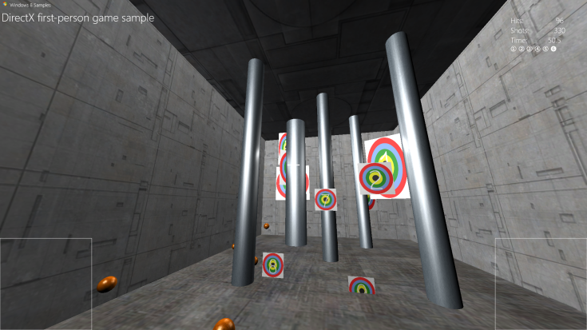

---
author: mtoepke
title: Create a simple Universal Windows Platform (UWP) game with DirectX
description: In this set of tutorials, you learn how to create a basic Universal Windows Platform (UWP) game with DirectX and C++.
ms.assetid: 9edc5868-38cf-58cc-1fb3-8fb85a7ab2c9
keywords:
- DirectX game sample
- game sample, Universal Windows Platform (UWP)
- Direct3D 11 game
ms.author: mtoepke
ms.date: 02/08/2017
ms.topic: article
ms.prod: windows
ms.technology: uwp
---

# Create a simple Universal Windows Platform (UWP) game with DirectX


\[ Updated for UWP apps on Windows 10. For Windows 8.x articles, see the [archive](http://go.microsoft.com/fwlink/p/?linkid=619132) \]

In this set of tutorials, you learn how to create a basic Universal Windows Platform (UWP) game with DirectX and C++. We cover all the major parts of a game, including the processes for loading assets such as arts and meshes, creating a main game loop, implementing a simple rendering pipeline, and adding sound and controls.

We show you the UWP game development techniques and considerations. We don't provide a complete end-to-end game. Rather, we focus on key UWP DirectX game development concepts, and call out Windows Runtime specific considerations around those concepts.

## Objective


-   To use the basic concepts and components of a UWP DirectX game, and to become more comfortable designing UWP games with DirectX.

## What you need to know before starting


Before we get started with this tutorial, you need to be familiar with these subjects.

-   Microsoft C++ with Component Extensions (C++/CX). This is an update to Microsoft C++ that incorporates automatic reference counting, and is the language for developing a UWP games with DirectX 11.1 or later versions.
-   Basic linear algebra and Newtonian physics concepts.
-   Basic graphics programming terminology.
-   Basic Windows programming concepts.
-   Basic familiarity with the [Direct2D](https://msdn.microsoft.com/library/windows/apps/dd370990.aspx) and [Direct3D 11](https://msdn.microsoft.com/library/windows/desktop/hh404569) APIs.

##  The Windows Store Direct3D shooting game sample


This sample implements a simple first-person shooting gallery, where the player fires balls at moving targets. Hitting each target awards a set number of points, and the player can progress through 6 levels of increasing challenge. At the end of the levels, the points are tallied, and the player is awarded a final score.

The sample demonstrates the game concepts:

-   Interoperation between DirectX 11.1 and the Windows Runtime
-   A first-person 3D perspective and camera
-   Stereoscopic 3D effects
-   Collision detection between objects in 3D
-   Handling player input for mouse, touch, and Xbox 360 controller controls
-   Audio mixing and playback
-   A basic game state machine




| Topic | Description |
|---------------------------------------------------------------------------------------------------|----------------------------------------------------------------------------------------------------------------------------------------------------------------------------------------------------------------------------------------------------------------------------------------------------------------------------------------------------------------------------------------------------------------------------------------------------------------|
| [Set up the game project](tutorial--setting-up-the-games-infrastructure.md) | The first step in assembling your game is to set up a project in Microsoft Visual Studio in such a way that you minimize the amount of code infrastructure work you need to do. You can save yourself a lot of time and hassle by using the right template and configuring the project specifically for game development. We step you through the setup and configuration of a simple game project. |
| [Define the game's UWP app framework](tutorial--building-the-games-metro-style-app-framework.md) | The first part of coding a UWP with DirectX game is building the framework that lets the game object interact with Windows. This includes Windows Runtime properties like suspend/resume event handling, window focus, and snapping, plus as the events, interactions and transitions for the user interface. We go over how the sample game is structured, and how it defines the high-level state machine for the player and system interaction. |
| [Define the main game object](tutorial--defining-the-main-game-loop.md) | Now, we look at the details of the game sample's main object and how the rules it implements translate into interactions with the game world. |
| [Assemble the rendering framework](tutorial--assembling-the-rendering-pipeline.md) | Now, it's time to look at how the sample game uses that structure and state to display its graphics. Here, we look at how to implement a rendering framework, starting from the initialization of the graphics device through the presentation of the graphics objects for display. |
| [Add a user interface](tutorial--adding-a-user-interface.md) | You've seen how the sample game implements the main game object as well as the basic rendering framework. Now, let's look at how the sample game provides feedback about game state to the player. Here, you learn how you can add simple menu options and heads-up display components on top of the 3-D graphics pipeline output. |
| [Add controls](tutorial--adding-controls.md) | Now, we take a look at how the game sample implements move-look controls in a 3-D game, and how to develop basic touch, mouse, and game controller controls. |
| [Add sound](tutorial--adding-sound.md) | In this step, we examine how the shooting game sample creates an object for sound playback using the [XAudio2](https://msdn.microsoft.com/library/windows/desktop/ee415813) APIs. |
| [Extend the game sample](tutorial-resources.md) | Congratulations! At this point, you understand the key components of a basic UWP DirectX 3D game. You can set up the framework for a game, including the view provider and rendering pipeline, and implement a basic game loop. You can also create a basic user interface overlay, and incorporate sounds and controls. You're on your way to creating a game of your own, and here are some resources to further your knowledge of DirectX game development. |
 

 

 




