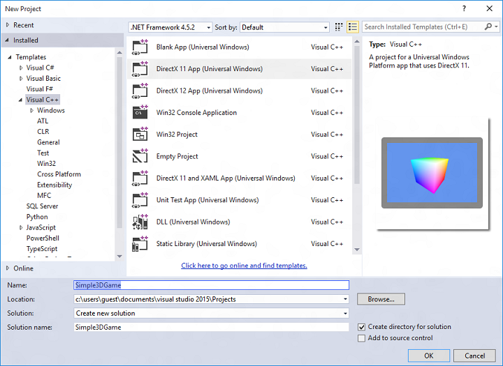
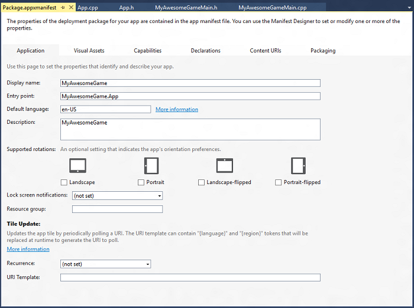
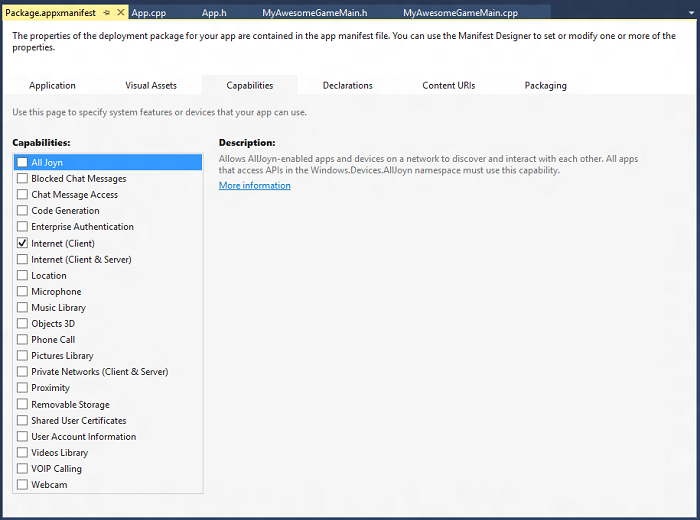

# Set up the game project


The first step in assembling your game is to set up a project in Microsoft Visual Studio in such a way that you minimize the amount of code infrastructure work you need to do. You can save yourself a lot of time and hassle by using the right template and configuring the project specifically for game development. We step you through the setup and configuration of a simple game project.

## Objective


-   To learn how to set up a Direct3D game project in Visual Studio.

## Setting up the game project


You can write a game from scratch, with just a handy text editor, a few samples, and a hat full of raw brainpower. But that probably isn't the most effective use of your time. If you're new to Universal Windows Platform (UWP) development, why not let Visual Studio shoulder some of the burden? Here's what to do to get your project off to a roaring start.

## 1. Pick the right template


A Visual Studio template is a collection of settings and code files that target a specific type of app based on the preferred language and technology. In Microsoft Visual Studio 2015, you'll find a number of templates that can dramatically ease game and graphics app development. If you don't use a template, you must develop much of the basic graphics rendering and display framework yourself, which can be a bit of a chore to a new game developer.

The right template for this tutorial, is the one titled DirectX 11 App (Universal Windows). In Visual Studio 2015, click **File...** &gt; **New Project**, and then:

1.  From **Templates**, select **Visual C++**, **Windows**, **Universal**.
2.  In the center pane, select **DirectX 11 App (Universal Windows)**.
3.  Give your game project a name, and click **OK**.



This template provides you with the basic framework for a UWP app using DirectX with C++. Go on, build and run it with F5! Check out that powder blue screen. Take a moment and review the code that the template provides. Tthe template creates multiple code files containing the basic functionality for a UWP app using DirectX with C++. We talk more about the other code files in [step 3](#3-review-the-included-libraries-and-headers). Right now, let's quickly inspect **App.h**.

```cpp
    ref class App sealed : public Windows::ApplicationModel::Core::IFrameworkView
    {
    public:
        App();

        // IFrameworkView Methods.
        virtual void Initialize(Windows::ApplicationModel::Core::CoreApplicationView^ applicationView);
        virtual void SetWindow(Windows::UI::Core::CoreWindow^ window);
        virtual void Load(Platform::String^ entryPoint);
        virtual void Run();
        virtual void Uninitialize();

    protected:
        // Application lifecycle event handlers.
        void OnActivated(Windows::ApplicationModel::Core::CoreApplicationView^ applicationView, Windows::ApplicationModel::Activation::IActivatedEventArgs^ args);
        void OnSuspending(Platform::Object^ sender, Windows::ApplicationModel::SuspendingEventArgs^ args);
        void OnResuming(Platform::Object^ sender, Platform::Object^ args);

        // Window event handlers.
        void OnWindowSizeChanged(Windows::UI::Core::CoreWindow^ sender, Windows::UI::Core::WindowSizeChangedEventArgs^ args);
        void OnVisibilityChanged(Windows::UI::Core::CoreWindow^ sender, Windows::UI::Core::VisibilityChangedEventArgs^ args);
        void OnWindowClosed(Windows::UI::Core::CoreWindow^ sender, Windows::UI::Core::CoreWindowEventArgs^ args);

        // DisplayInformation event handlers.
        void OnDpiChanged(Windows::Graphics::Display::DisplayInformation^ sender, Platform::Object^ args);
        void OnOrientationChanged(Windows::Graphics::Display::DisplayInformation^ sender, Platform::Object^ args);
        void OnDisplayContentsInvalidated(Windows::Graphics::Display::DisplayInformation^ sender, Platform::Object^ args);

    private:
        std::shared_ptr<DX::DeviceResources> m_deviceResources;
        std::unique_ptr<MyAwesomeGameMain> m_main;
        bool m_windowClosed;
        bool m_windowVisible;
    };
```

You create these 5 methods, [**Initialize**](https://msdn.microsoft.com/library/windows/apps/hh700495), [**SetWindow**](https://msdn.microsoft.com/library/windows/apps/hh700509), [**Load**](https://msdn.microsoft.com/library/windows/apps/hh700501), [**Run**](https://msdn.microsoft.com/library/windows/apps/hh700505), and [**Uninitialize**](https://msdn.microsoft.com/library/windows/apps/hh700523), when implementing the [**IFrameworkView**](https://msdn.microsoft.com/library/windows/apps/hh700469) interface that defines a view provider. These methods are run by the app singleton that is created when your game is launched, and load all your app's resources as well as connect the appropriate event handlers.

Your **main** method is in the **App.cpp** source file. It looks like this:

```cpp
[Platform::MTAThread]
int main(Platform::Array<Platform::String^>^)
{
    auto direct3DApplicationSource = ref new Direct3DApplicationSource();
    CoreApplication::Run(direct3DApplicationSource);
    return 0;
}
```

Right now, it creates an instance of the Direct3D view provider from the view provider factory (**Direct3DApplicationSource**, defined in **App.h**), and passes it to the app singleton to run ([**CoreApplication::Run**](https://msdn.microsoft.com/library/windows/apps/hh700469)). This means that the starting point for your game lives in the body of the implementation of the [**IFrameworkView::Run**](https://msdn.microsoft.com/library/windows/apps/hh700505) method, in this case, **App::Run**. Here's the code:

```cpp
void App::Run()
{
    while (!m_windowClosed)
    {
        if (m_windowVisible)
        {
            CoreWindow::GetForCurrentThread()->Dispatcher->ProcessEvents(CoreProcessEventsOption::ProcessAllIfPresent);

            m_main->Update();

            if (m_main->Render())
            {
                m_deviceResources->Present();
            }
        }
        else
        {
            CoreWindow::GetForCurrentThread()->Dispatcher->ProcessEvents(CoreProcessEventsOption::ProcessOneAndAllPending);
        }
    }
}
```

If the window for your game isn't closed, this dispatches all events, updates the timer, and renders and presents the results of your graphics pipeline. We talk about this in greater detail in [Defining the game's UWP framework](tutorial--building-the-games-metro-style-app-framework.md) and [Assembling the rendering pipeline](tutorial--assembling-the-rendering-pipeline.md). At this point, you should have a sense of the basic code structure of a UWP DirectX game.

## 2. Review and update the package.appxmanifest file


The code files aren't all there is to the template. The **package.appxmanifest** file contains metadata about your project that are used for packaging and launching your game and for submission to the Microsoft Store. It also contains important info the player's system uses to provide access to the system resources the game needs to run.

Launch the **Manifest Designer** by double-clicking the **package.appxmanifest** file in **Solution Explorer**. You see this view:



For more info about the **package.appxmanifest** file and packaging, see [Manifest Designer](https://msdn.microsoft.com/library/windows/apps/br230259.aspx). For now, take a look at the **Capabilities** tab and look at the options provided.



If you don't select the capabilities that your game uses, such as access to the **Internet** for global high score board, you won't be able to access the corresponding resources or features. When you create a new game, make sure that you select the capabilities that your game needs to run!

Now, let's look at the rest of the files that come with the **DirectX 11 App (Universal Windows)** template.

## 3. Review the included libraries and headers


There are a few files we haven't looked at yet. These files provide additional tools and support common to Direct3D game development scenarios.

| Template Source File         | Description                                                                                                                                                                                                            |
|------------------------------|------------------------------------------------------------------------------------------------------------------------------------------------------------------------------------------------------------------------|
| StepTimer.h                  | Defines a high-resolution timer useful for gaming or interactive rendering apps.                                                                                                                                       |
| Sample3DSceneRenderer.h/.cpp | Defines a basic renderer implementation that connects a Direct3D swap chain and graphics adapter to your UWP using DirectX.                                                                                            |
| DirectXHelper.h              | Implements a single method, **DX::ThrowIfFailed**, that converts the error HRESULT values returned by DirectX APIs into Windows Runtime exceptions. Use this method to put a break point for debugging DirectX errors. |
| pch.h/.cpp                   | Contains all the Windows system includes for the APIs used by a Direct3D app, including the DirectX 11 APIs.                                                                                                           |
| SamplePixelShader.hlsl       | Contains the high-level shader language (HLSL) code for a very basic pixel shader.                                                                                                                                     |
| SampleVertexShader.hlsl      | Contains the high-level shader language (HLSL) code for a very basic vertex shader.                                                                                                                                    |

 

### Next steps

At this point, you can create a UWP with DirectX game project and identify the components and files provided by the DirectX 11 App (Universal Windows) template.

In the next tutorial, [Defining the game's UWP framework](tutorial--building-the-games-metro-style-app-framework.md), we work with a completed game and examine how it uses and extends many of the concepts and components that the template provides.

 

 


