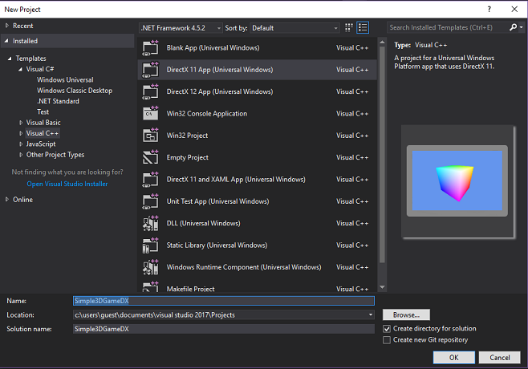

# Set up the game project

This topic goes through how to setup a simple UWP DirectX game using the templates in Visual Studio. The first step in assembling your game is to set up a project in Microsoft Visual Studio in such a way that you minimize the amount of code infrastructure work you need to do. Learn to save set up time when you use the right template and configure the project specifically for game development.

## Objectives

* Set up a Direct3D game project in Visual Studio using a template
* Understand the game's main entry point by examining the **App** source files
* Review the project's **package.appxmanifest** file
* Find out what game dev tools and support are included with the project

## How to set up the game project

If you're new to Universal Windows Platform (UWP) development, we recommend the use of templates in Visual Studio to set up the basic code structure.

>[!Note]
>This article is part of a tutorial series based on a game sample. You can get the latest code at [Direct3D game sample](https://github.com/Microsoft/Windows-universal-samples/tree/master/Samples/Simple3DGameDX). This sample is part of a large collection of UWP feature samples. For instructions on how to download the sample, see [Get the UWP samples from GitHub](https://docs.microsoft.com/windows/uwp/get-started/get-uwp-app-samples).

### Use DirectX template to create a project

A Visual Studio template is a collection of settings and code files that target a specific type of app based on the preferred language and technology. In Microsoft Visual Studio 2017, you'll find a number of templates that can dramatically ease game and graphics app development. If you don't use a template, you must develop much of the basic graphics rendering and display framework yourself, which can be a bit of a chore to a new game developer.

The template used for this tutorial is titled **DirectX 11 App (Universal Windows)**. 

Steps to create a DirectX 11 game project in Visual Studio:
1.  Select **File...** &gt; **New**  &gt; **Project...**
2.  In the left pane, select **Installed** &gt; **Templates** &gt; **Visual C++** &gt; **Windows Universal**
3.  In the center pane, select **DirectX 11 App (Universal Windows)**
4.  Give your game project a name, and click **OK**.



This template provides you with the basic framework for a UWP app using DirectX with C++. Click F5 to build and run it. Check out that powder blue screen. The template creates multiple code files containing the basic functionality for a UWP app using DirectX with C++.

## Review the app's main entry point by understanding IFrameworkView

The **App** class inherits from the **IFrameworkView** class.

### Inspect **App.h**.

Let's quickly look at the 5 methods in **App.h** &mdash; [**Initialize**](https://msdn.microsoft.com/library/windows/apps/hh700495), [**SetWindow**](https://msdn.microsoft.com/library/windows/apps/hh700509), [**Load**](https://msdn.microsoft.com/library/windows/apps/hh700501), [**Run**](https://msdn.microsoft.com/library/windows/apps/hh700505), and [**Uninitialize**](https://msdn.microsoft.com/library/windows/apps/hh700523) when implementing the [**IFrameworkView**](https://msdn.microsoft.com/library/windows/apps/hh700469) interface that defines a view provider. These methods are run by the app singleton that is created when your game is launched, and load all your app's resources as well as connect the appropriate event handlers.

```cpp
    // Main entry point for our app. Connects the app with the Windows shell and handle application lifecycle events.
    ref class App sealed : public Windows::ApplicationModel::Core::IFrameworkView
    {
    public:
        App();

        // IFrameworkView Methods.
        virtual void Initialize(Windows::ApplicationModel::Core::CoreApplicationView^ applicationView);
        virtual void SetWindow(Windows::UI::Core::CoreWindow^ window);
        virtual void Load(Platform::String^ entryPoint);
        virtual void Run();
        virtual void Uninitialize();

    protected:
        ...
    };
```

### Inspect **App.cpp**

Here's the **main** method in the **App.cpp** source file:

```cpp
//The main function is only used to initialize our IFrameworkView class.
[Platform::MTAThread]
int main(Platform::Array<Platform::String^>^)
{
    auto direct3DApplicationSource = ref new Direct3DApplicationSource();
    CoreApplication::Run(direct3DApplicationSource);
    return 0;
}
```

In this method, it creates an instance of the Direct3D view provider from the view provider factory (**Direct3DApplicationSource**, defined in **App.h**), and passes it to the app singleton by calling ([**CoreApplication::Run**](https://msdn.microsoft.com/library/windows/apps/hh700469)). This means that the starting point for your game lives in the body of the implementation of the [**IFrameworkView::Run**](https://msdn.microsoft.com/library/windows/apps/hh700505) method, and in this case, it's the **App::Run**. 

Scroll to find the **App::Run** method in **App.cpp**. Here's the code:

```cpp
//This method is called after the window becomes active.
void App::Run()
{
    while (!m_windowClosed)
    {
        if (m_windowVisible)
        {
            CoreWindow::GetForCurrentThread()->Dispatcher->ProcessEvents(CoreProcessEventsOption::ProcessAllIfPresent);

            m_main->Update();

            if (m_main->Render())
            {
                m_deviceResources->Present();
            }
        }
        else
        {
            CoreWindow::GetForCurrentThread()->Dispatcher->ProcessEvents(CoreProcessEventsOption::ProcessOneAndAllPending);
        }
    }
}
```

What this method does: If the window for your game isn't closed, it dispatches all events, updates the timer, then renders and presents the results of your graphics pipeline. We'll talk about this in greater detail in [Define the UWP app framework](tutorial--building-the-games-uwp-app-framework.md), [Rendering framework I: Intro to rendering](tutorial--assembling-the-rendering-pipeline.md), and  [Rendering framework II: Game rendering](tutorial-game-rendering.md). At this point, you should have a sense of the basic code structure of a UWP DirectX game.

## Review and update the package.appxmanifest file


The code files aren't all there is to the template. The **Package.appxmanifest** file contains metadata about your project that are used for packaging and launching your game and for submission to the Microsoft Store. It also contains important info the player's system uses to provide access to the system resources the game needs to run.

Launch the **manifest designer** by double-clicking the **Package.appxmanifest** file in **Solution Explorer**.


For more info about the **package.appxmanifest** file and packaging, see [Manifest Designer](https://msdn.microsoft.com/library/windows/apps/br230259.aspx). For now, take a look at the **Capabilities** tab and look at the options provided.


If you don't select the capabilities that your game uses, such as access to the **Internet** for global high score board, you won't be able to access the corresponding resources or features. When you create a new game, make sure that you select the capabilities that your game needs to run!

Now, let's look at the rest of the files that come with the **DirectX 11 App (Universal Windows)** template.

## Review the included libraries and headers

There are a few files we haven't looked at yet. These files provide additional tools and support common to Direct3D game development scenarios. For the full list of files that comes with the basic DirectX game project, see [DirectX game project templates](user-interface.md#template-structure).

| Template Source File         | File folder            | Description |
|------------------------------|------------------------|------------------------------------------------------------------------------------------------------------------------------------------------------------------------------------------------------------------------|
| DeviceResources.h/.cpp       | Common                 | Defines a class object that controls all DirectX [device resources](tutorial--assembling-the-rendering-pipeline.md#resource). It also includes an interface for your application that owns DeviceResources to be notified  when the device is lost or created.                                                |
| DirectXHelper.h              | Common                 | Implements methods including **DX::ThrowIfFailed**, **ReadDataAsync**, and **ConvertDipsToPixels. **DX::ThrowIfFailed** converts the error HRESULT values returned by DirectX Win32 APIs into Windows Runtime exceptions. Use this method to put a break point for debugging DirectX errors. For more information, see [ThrowIfFailed](https://github.com/Microsoft/DirectXTK/wiki/ThrowIfFailed). **ReadDataAsync** reads from a binary file asynchronously. **ConvertDipsToPixels** converts a length in device-independent pixels (DIPs) to a length in physical pixels. |
| StepTimer.h                  | Common                 | Defines a high-resolution timer useful for gaming or interactive rendering apps.   |
| Sample3DSceneRenderer.h/.cpp | Content                | Defines a class object to instantiate a basic rendering pipeline. It creates a basic renderer implementation that connects a Direct3D swap chain and graphics adapter to your UWP using DirectX.   |
| SampleFPSTextRenderer.h/.cpp | Content                | Defines a class object to render the current frames per second (FPS) value in the bottom right corner of the screen using Direct2D and DirectWrite.  |
| SamplePixelShader.hlsl       | Content                | Contains the high-level shader language (HLSL) code for a very basic pixel shader.                                            |
| SampleVertexShader.hlsl      | Content                | Contains the high-level shader language (HLSL) code for a very basic vertex shader.                                           |
| ShaderStructures.h           | Content                | Contains shader structures that can be used to send MVP matrices and per-vertex data to the vertex shader.  |
| pch.h/.cpp                   | Main                   | Contains all the Windows system includes for the APIs used by a Direct3D app, including the DirectX 11 APIs.| 

### Next steps

At this point, you've learnt how to create a UWP DirectX game project using the **DirectX 11 App (Universal Windows)** template and have been introduced to a few components and files provided by this project.

The next section is [Defining the game's UWP framework](tutorial--building-the-games-uwp-app-framework.md). We'll examine how this game uses and extends many of the concepts and components that the template provides.

 

 


