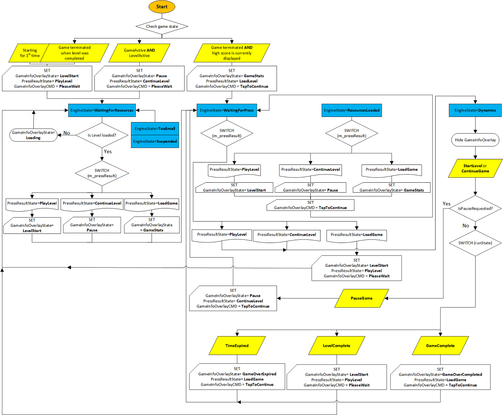

# Game flow management

The game now has a window, registered a couple event handlers, and loads assets asynchronously. This section explains about the use of game states, how to manage specific key game states, and how to create an update loop for the game engine. Then we'll learn about the user interface flow and finally, understand more about event handlers and events that are needed for a UWP game.

>[!Note]
>If you haven't downloaded the latest game code for this sample, go to [Direct3D game sample](https://github.com/Microsoft/Windows-universal-samples/tree/master/Samples/Simple3DGameDX). This sample is part of a large collection of UWP feature samples. For instructions on how to download the sample, see [Get the UWP samples from GitHub](https://docs.microsoft.com/windows/uwp/get-started/get-uwp-app-samples).

## Game states used to manage game flow

We make use of game states to manage the flow of the game. Your game can have any number of possible states because a user can resume a UWP game app from a suspended state at any time.

For this game sample, it can be in one of the three states when it starts:
* The game loop is running and is in the middle of a level.
* The game loop is not running because a game had just been completed. (The high score is set)
* No game has been started, or the game is between levels. (The high score is 0)

You can have define the number of states required depending on your game's needs. Again, be aware that your UWP game can be terminated at any time, 
and when it resumes, the player expects the game to behave as though they had never stopped playing.

## Game states initialization

In game initialization, you are not just focused on cold starting the game but also restarting after it has been paused or terminated. 
The sample game always saves the game state giving it the appearance that it has stayed running. 

In a suspended state, game play is suspended but the resources of the game are still in memory. 

Likewise, the resume event is to ensure that the sample game picks up where it was last suspended or terminated. 
When the sample game restarts after termination, it starts up normally and then determines the last known state so the player can immediately continue playing.

Depending on the state, different options are presented to the player. 

* If the game resumes mid-level, it appears as paused, and the overlay presents a continue option.
* If the game resumes in a state where the game is completed, it displays the high scores and an option to play a new game.
* Lastly, if the game resumes before a level has started, the overlay presents a start option to the user.

The game sample doesn't distinguish whether the game is cold starting, launching for the first time without a suspend event, or resuming from a suspended state. This is the proper design for any UWP app.

In this sample, initialization of the game states occurs in [__GameMain::InitializeGameState__](#gamemaininitializegamestate-method).

This is a flowchart to help you visualize the flow, it covers both initialization and the update loop.

* Initialization begins at the __Start__ node when you check for the current game state. For game code, go to [__GameMain::InitializeGameState__](#gamemaininitializegamestate-method).
* For more info about the update loop, go to [Update game engine](#update-game-engine). For game code, go to [__App::Update__](#appupdate-method).



### GameMain::InitializeGameState method

The __InitializeGameState__ method is called from the [__GameMain__](https://github.com/Microsoft/Windows-universal-samples/blob/5f0d0912214afc1c2a7c7470203933ddb46f7c89/Samples/Simple3DGameDX/cpp/GameMain.cpp#L32-L131) constructor class, which is called when the  __GameMain__ class object is created in the [__App::Load__](https://github.com/Microsoft/Windows-universal-samples/blob/5f0d0912214afc1c2a7c7470203933ddb46f7c89/Samples/Simple3DGameDX/cpp/App.cpp#L115-L123) method.

```cpp

GameMain::GameMain(...)
{
    m_deviceResources->RegisterDeviceNotify(this);
    ...

    create_task([this]()
    {
        ...

    }).then([this]()
    {
        // The finalize code needs to run in the same thread context
        // as the m_renderer object was created because the D3D device context
        // can ONLY be accessed on a single thread.
        m_renderer->FinalizeCreateGameDeviceResources();

        InitializeGameState(); //Initialization of game states occurs here.
        
        ...
    
    }, task_continuation_context::use_current()).then([this]()
    {
        ...
        
    }, task_continuation_context::use_current());
}

```

```cpp

void GameMain::InitializeGameState()
{
    // Set up the initial state machine for handling Game playing state.
    if (m_game->GameActive() && m_game->LevelActive())
    {
        // The last time the game terminated it was in the middle of a level.
        // We are waiting for the user to continue the game.
        //...
    }
    else if (!m_game->GameActive() && (m_game->HighScore().totalHits > 0))
    {
        // The last time the game terminated the game had been completed.
        // Show the high score.
        // We are waiting for the user to acknowledge the high score and start a new game.
        // The level resources for the first level will be loaded later.
        //...
    }
    else
    {
        // This is either the first time the game has run or
        // the last time the game terminated the level was completed.
        // We are waiting for the user to begin the next level.
        m_updateState = UpdateEngineState::WaitingForResources;
        m_pressResult = PressResultState::PlayLevel;
        SetGameInfoOverlay(GameInfoOverlayState::LevelStart);
        m_uiControl->SetAction(GameInfoOverlayCommand::PleaseWait);
    }
    m_uiControl->ShowGameInfoOverlay();
}

```

## Update game engine

In the [__App::Run__](https://github.com/Microsoft/Windows-universal-samples/blob/5f0d0912214afc1c2a7c7470203933ddb46f7c89/Samples/Simple3DGameDX/cpp/App.cpp#L127-L130) method, it calls [__GameMain::Run__](https://github.com/Microsoft/Windows-universal-samples/blob/5f0d0912214afc1c2a7c7470203933ddb46f7c89/Samples/Simple3DGameDX/cpp/GameMain.cpp#L143-L202). Within this method, the sample has implemented a basic state machine for handling all the major actions the player can take. 
The highest level of this state machine deals with loading a game, playing a specific level, or continuing a level after the game has been paused (by the system or the player).

In the game sample, there are 3 major states (__UpdateEngineState__) the game can be:

1. __Waiting for resources__: The game loop is cycling, unable to transition until resources (specifically graphics resources) are available. When the async tasks for loading resources completes, it updates the state to __ResourcesLoaded__. This usually happens between levels when the level is loading new resources from disk, game server, or cloud backend. In the game sample, we simulate this behavior because the sample doesn't need any additional per-level resources at that time.
2. __Waiting for press__: The game loop is cycling, waiting for specific user input. This input is a player action to load a game, start a level, or continue a level. The sample code refers to these sub-states as __PressResultState__ enumeration values.
3. In __Dynamics__: The game loop is running with the user playing. While the user is playing, the game checks for 3 conditions that it can transition on: 
    * __TimeExpired__: expiration of the set time for a level
    * __LevelComplete__: completion of a level by the player 
    * __GameComplete__: completion of all levels by the player

Your game is simply a state machine containing multiple smaller state machines. For each specific state, it must be defined by a very specific criteria. How it transitions from one state to another must be based on discrete user input or system actions (such as graphics resource loading). 
While planning for your game, consider drawing out the entire game flow, to ensure that you've addressed all possible actions the user or the system can take. Games can be very complicated so a state machine is a powerful tool to help visualize this complexity and make it more manageable.

Let's take a look at the codes for the update loop below.

### App::Update method

The structure of the state machine used to update the game engine

```cpp
void GameMain::Update()
{
    m_controller->Update(); //the controller instance has its own update loop.

    switch (m_updateState)
    {
    case UpdateEngineState::WaitingForResources:
        //...
        break;

    case UpdateEngineState::ResourcesLoaded:
        //...
        break;

    case UpdateEngineState::WaitingForPress:
        if (m_controller->IsPressComplete())
        {
            //...
        }
        break;

    case UpdateEngineState::Dynamics:
        if (m_controller->IsPauseRequested())
        {
            //...
        }
        else
        {
            GameState runState = m_game->RunGame(); //when the player is playing, the work is handled by this Simple3DGame::RunGame method.
            switch (runState)
            {
            case GameState::TimeExpired:
                //...
                break;

            case GameState::LevelComplete:
                //...
                break;

            case GameState::GameComplete:
                //...
                break;
            }
        }

        if (m_updateState == UpdateEngineState::WaitingForPress)
        {
            // Transitioning state, so enable waiting for the press event
            m_controller->WaitForPress(m_renderer->GameInfoOverlayUpperLeft(), m_renderer->GameInfoOverlayLowerRight());
        }
        if (m_updateState == UpdateEngineState::WaitingForResources)
        {
            // Transitioning state, so shut down the input controller until resources are loaded
            m_controller->Active(false);
        }
        break;
    }
}
```

## Update user interface

We need to keep the player apprised of the state of the system, and allow the game state to change depending on the player's actions and the rules that define the game. Many games, including this game sample, commonly use user interface (UI) elements to present this info to the player. The UI contains representations of game state, and other play-specific info such as score, or ammo, or the number of chances remaining. UI is also called the overlay because it is rendered separately from the main graphics pipeline and placed on top the 3D projection. 
Some UI info is also presented as a heads-up display (HUD) to allow users to get these info without taking their eyes off the main gameplay area. In the sample game, we create this overlay using the Direct2D APIs. We can also create this overlay using XAML, which we discuss in [Extending the game sample](tutorial-resources.md).

There are two components to the user interface:

-   The HUD that contains the score and info about the current state of game play.
-   The pause bitmap, which is a black rectangle with text overlaid during the paused/suspended state of the game. This is the game overlay. We discuss it further in [Adding a user interface](tutorial--adding-a-user-interface.md).

Unsurprisingly, the overlay has a state machine too. The overlay can display a level start or game over message. It is essentially a canvas to output any info about game state that we 
display to the player when the game is paused or suspended.

Overlay rendered can be one of the six screens, depending on the state of the game: 
1. Resources loading screen at the start of the game
2. Game stats play screen
3. Level start message screen
4. Game over screen when all of the levels are completed without time running out
5. Game over screen when time runs out
6. Pause menu screen

Separating your user interface from your game's graphics pipeline allows you to work on it independent of the game's graphics rendering engine and decreases the complexity of your game's code significantly.

Here's how the game sample structures the overlay's state machine.

```cpp
void GameMain::SetGameInfoOverlay(GameInfoOverlayState state)
{
    m_gameInfoOverlayState = state;
    switch (state)
    {
    case GameInfoOverlayState::Loading:
        m_uiControl->SetGameLoading(m_loadingCount);
        break;

    case GameInfoOverlayState::GameStats:
        //...
        break;

    case GameInfoOverlayState::LevelStart:
        //...
        break;

    case GameInfoOverlayState::GameOverCompleted:
        //...
        break;

    case GameInfoOverlayState::GameOverExpired:
        //...
        break;

    case GameInfoOverlayState::Pause:
        //...
        break;
    }
}
```

## Events handling

Our sample code registered a number of handlers for specific events in **Initialize**, **SetWindow**, and **Load** in the App.cpp. These are important events that needs to work before we can add game mechanics or start graphics development. These events are fundamental to a proper UWP app experience. Because a UWP app can be activated, deactivated, resized, snapped, unsnapped, suspended, or resumed at any time, the game must register for these events as soon as it can, and handle them in a way that keeps the experience smooth and predictable for the player.

These are the event handlers used in this sample and the events they handle.

<table>
<colgroup>
<col width="50%" />
<col width="50%" />
</colgroup>
<thead>
<tr class="header">
<th align="left">Event handler</th>
<th align="left">Description</th>
</tr>
</thead>
<tbody>
<tr class="odd">
<td align="left">OnActivated</td>
<td align="left">Handles <a href="https://msdn.microsoft.com/library/windows/apps/br225018"><strong>CoreApplicationView::Activated</strong></a>. The game app has been brought to the foreground, so the main window is activated.</td>
</tr>
<tr class="even">
<td align="left">OnDpiChanged</td>
<td align="left">Handles <a href="https://docs.microsoft.com/uwp/api/windows.graphics.display.displayinformation#Windows_Graphics_Display_DisplayInformation_DpiChanged"><strong>Graphics::Display::DisplayInformation::DpiChanged</strong></a>. The DPI of the display has changed and the game adjusts its resources accordingly.
<div class="alert">
<strong>Note</strong>  [<strong>CoreWindow</strong>](https://msdn.microsoft.com/library/windows/desktop/hh404559) coordinates are in DIPs (Device Independent Pixels) for [Direct2D](https://msdn.microsoft.com/library/windows/desktop/dd370987). As a result, you must notify Direct2D of the change in DPI to display any 2D assets or primitives correctly.
</div>
<div>
</div></td>
</tr>
<tr class="odd">
<td align="left">OnOrientationChanged</td>
<td align="left">Handles <a href="https://docs.microsoft.com/uwp/api/windows.graphics.display.displayinformation#Windows_Graphics_Display_DisplayInformation_OrientationChanged"><strong>Graphics::Display::DisplayInformation::OrientationChanged</strong></a>. The orientation of the display changes and rendering needs to be updated.</td>
</tr>
<tr class="even">
<td align="left">OnDisplayContentsInvalidated</td>
<td align="left">Handles <a href="https://docs.microsoft.com/uwp/api/windows.graphics.display.displayinformation#Windows_Graphics_Display_DisplayInformation_DisplayContentsInvalidated"><strong>Graphics::Display::DisplayInformation::DisplayContentsInvalidated</strong></a>. The display requires redrawing and your game needs to be rendered again.</td>
</tr>
<tr class="odd">
<td align="left">OnResuming</td>
<td align="left">Handles <a href="https://msdn.microsoft.com/library/windows/apps/br205859"><strong>CoreApplication::Resuming</strong></a>. The game app restores the game from a suspended state.</td>
</tr>
<tr class="even">
<td align="left">OnSuspending</td>
<td align="left">Handles <a href="https://msdn.microsoft.com/library/windows/apps/br205860"><strong>CoreApplication::Suspending</strong></a>. The game app saves its state to disk. It has 5 seconds to save state to storage.</td>
</tr>
<tr class="odd">
<td align="left">OnVisibilityChanged</td>
<td align="left">Handles <a href="https://msdn.microsoft.com/library/windows/apps/hh701591"><strong>CoreWindow::VisibilityChanged</strong></a>. The game app has changed visibility, and has either become visible or been made invisible by another app becoming visible.</td>
</tr>
<tr class="even">
<td align="left">OnWindowActivationChanged</td>
<td align="left">Handles <a href="https://msdn.microsoft.com/library/windows/apps/br208255"><strong>CoreWindow::Activated</strong></a>. The game app's main window has been deactivated or activated, so it must remove focus and pause the game, or regain focus. In both cases, the overlay indicates that the game is paused.</td>
</tr>
<tr class="odd">
<td align="left">OnWindowClosed</td>
<td align="left">Handles <a href="https://msdn.microsoft.com/library/windows/apps/br208261"><strong>CoreWindow::Closed</strong></a>. The game app closes the main window and suspends the game.</td>
</tr>
<tr class="even">
<td align="left">OnWindowSizeChanged</td>
<td align="left">Handles <a href="https://msdn.microsoft.com/library/windows/apps/br208283"><strong>CoreWindow::SizeChanged</strong></a>. The game app reallocates the graphics resources and overlay to accommodate the size change, and then updates the render target.</td>
</tr>
</tbody>
</table>

## Next steps

In this topic, we've covered how the overall game flow is managed using game states and that a game is made up of multiple different state machines. We've also learnt about how to update the UI and manage key app event handlers. Now we are ready to dive into the rendering loop, the game, and its mechanics.
 
You can go through the other components that make up this game in any order:
* [Define the main game object](tutorial--defining-the-main-game-loop.md)
* [Rendering framework I: Intro to rendering](tutorial--assembling-the-rendering-pipeline.md)
* [Rendering framework II: Game rendering](tutorial-game-rendering.md)
* [Add a user interface](tutorial--adding-a-user-interface.md)
* [Add controls](tutorial--adding-controls.md)
* [Add sound](tutorial--adding-sound.md)